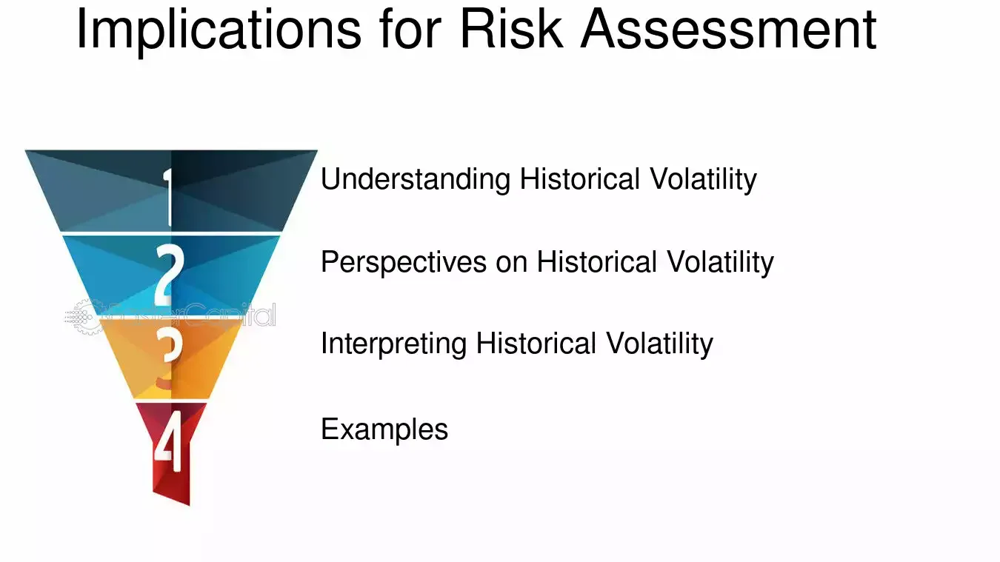

## Table of Contents

## What is historical volatility and why is it important?

Historical volatility is a measure of how much the price of a stock or other financial asset has moved up and down in the past. It looks at the changes in price over a certain period, like a month or a year, and calculates how big those changes were. If the price moved a lot, the historical volatility is high. If the price didn't move much, the historical volatility is low.

Understanding historical volatility is important because it helps investors and traders know how risky an investment might be. If a stock has high historical volatility, it means the price can change a lot in the future, which could be good or bad depending on what happens. If a stock has low historical volatility, it means the price is more stable, which might be safer but could also mean less chance for big gains. By looking at historical volatility, people can make better decisions about which investments to choose based on how much risk they are willing to take.

## How is historical volatility calculated?

Historical volatility is calculated by looking at how much the price of a stock or other asset has changed over a period of time. First, you find the daily returns of the asset, which is the percentage change in price from one day to the next. Then, you take the standard deviation of these daily returns. The standard deviation is a measure of how spread out the numbers are. If the daily returns are all over the place, the standard deviation, and thus the historical volatility, will be high. If the daily returns are more consistent, the standard deviation will be low, meaning the historical volatility is also low.

To make the historical [volatility](/wiki/volatility-trading-strategies) easier to compare across different time periods, it is often annualized. This means it is adjusted to show what the volatility would be over a whole year. To annualize it, you take the standard deviation of the daily returns and multiply it by the square root of the number of trading days in a year, which is usually around 252. This gives you a number that represents the expected volatility over a year, based on the past data. This way, investors can use historical volatility to understand and compare the risk of different investments over the same time frame.

## What data is typically used to measure historical volatility?

Historical volatility is usually measured using the prices of a stock or another asset over a period of time. The most common data used is the closing price of the asset each day. These daily closing prices are used to find the daily returns, which are the percentage changes in price from one day to the next.

To calculate historical volatility, you need a series of these daily returns over a chosen time period, like 30 days or a year. The more data points you have, the more accurate your measure of historical volatility will be. This data is easy to get from financial websites, stock market databases, or directly from stock exchanges.

## Can historical volatility predict future market movements?

Historical volatility can give us a good idea about how much a stock or an asset's price might move in the future, but it can't predict the exact future movements. It shows us how much the price has changed in the past, and if the price was very jumpy before, it might be jumpy again. This helps us understand the risk involved in investing in that asset. But, just because a stock was very volatile in the past doesn't mean it will be the same in the future. Things like new company news, economic changes, or world events can make the future different from the past.

So, while historical volatility is a useful tool for investors to gauge risk, it should not be used alone to predict what will happen next in the market. It's one piece of the puzzle. Investors often use it along with other tools and information, like company reports, economic forecasts, and market trends, to make better guesses about future price movements. By looking at all these things together, investors can make smarter choices about where to put their money.

## How does historical volatility differ from implied volatility?

Historical volatility and implied volatility are two ways to measure how much a stock's price might move, but they look at different things. Historical volatility is all about the past. It looks at how much the price of a stock went up and down in the past and uses that to guess how much it might move in the future. It's like looking in the rearview mirror to see how bumpy the road has been so far.

Implied volatility, on the other hand, is about the future. It's based on what people think might happen to the stock's price, not what has already happened. It comes from the prices of options, which are bets on where the stock price will go. If people think the stock will move a lot, the price of options will be higher, which means the implied volatility is high. So, while historical volatility tells us about the past, implied volatility is a guess about the future based on what people are willing to pay for options right now.

## What are the common time frames used for assessing historical volatility?

People usually look at historical volatility over different time periods depending on what they need. A common time frame is 30 days, which is one month. This gives a quick snapshot of how much the stock's price has been moving recently. Another popular period is 90 days, or three months, which gives a bit longer view and can show if the stock's been more or less volatile over the last quarter.

Sometimes, people also look at historical volatility over a whole year, which is 252 trading days. This gives a big picture of how the stock has been behaving over a long time. Each of these time frames can be useful for different reasons. A short time frame like 30 days might help someone who trades stocks often, while a longer time frame like a year might be more helpful for someone who's thinking about holding onto a stock for a long time.

## How can historical volatility be used in risk management?

Historical volatility is a useful tool in risk management because it helps investors understand how much a stock's price might move. By looking at how much the stock's price has changed in the past, investors can guess how risky it might be to buy or sell that stock. If a stock's historical volatility is high, it means the price has been moving a lot, which could mean more risk. On the other hand, if the historical volatility is low, it means the price has been more stable, which could mean less risk. Knowing this helps investors decide if they want to take a chance on a stock or if they should look for something safer.

Investors can use historical volatility to set up their risk management strategies. For example, if they know a stock has high historical volatility, they might decide to only invest a small amount of money in it, or they might use stop-loss orders to limit their losses if the price drops suddenly. They might also choose to spread their money across different stocks with different levels of volatility to balance out their risk. By using historical volatility, investors can make smarter choices about how to protect their money and manage the risks they are willing to take.

## What are the limitations of using historical volatility for future risk assessment?

Historical volatility is a useful tool, but it has some limits when we use it to guess future risks. The biggest problem is that the past doesn't always tell us what will happen in the future. Things like new company news, changes in the economy, or even world events can make the future different from the past. So, even if a stock was very jumpy before, it might not be the same in the future.

Another issue is that historical volatility only looks at how much the price moved, not why it moved. It doesn't tell us about things like earnings reports, new products, or changes in interest rates that might affect the stock's price. This means it's just one piece of the puzzle. To get a better idea of future risks, investors need to look at other things too, like company reports and market trends, not just historical volatility.

## How do different statistical models affect the calculation of historical volatility?

Different statistical models can change how we calculate historical volatility. One common way is using the standard deviation of daily returns, which looks at how much the price changes from day to day. But there are other models too, like the exponentially weighted moving average (EWMA) model, which gives more importance to recent price changes. This means if the price has been moving a lot lately, the EWMA model will show higher volatility than a simple standard deviation model that treats all days the same.

Another model is the GARCH (Generalized Autoregressive Conditional Heteroskedasticity) model, which is more complex. It looks at how volatility changes over time and can predict that volatility might go up or down based on past patterns. This model can be more accurate for some stocks because it takes into account that volatility can change and isn't always the same. So, the choice of model can make a big difference in how we see historical volatility, and it's important to pick the right one for the kind of stock and the time frame we're looking at.

## What advanced techniques can be used to improve the accuracy of historical volatility measurements?

To make historical volatility measurements more accurate, one advanced technique is using the exponentially weighted moving average (EWMA) model. This model gives more importance to recent price changes instead of treating all days the same. If a stock's price has been moving a lot lately, the EWMA model will show higher volatility. This can be helpful because it reflects what's happening right now, not just what happened a long time ago. By focusing on recent data, the EWMA model can give a better picture of how the stock might move in the near future.

Another technique is using the GARCH model, which stands for Generalized Autoregressive Conditional Heteroskedasticity. This model is more complex and looks at how volatility changes over time. It can predict that volatility might go up or down based on past patterns. This is useful because it takes into account that volatility isn't always the same and can change. By using GARCH, investors can get a more detailed and accurate view of a stock's risk, which helps them make better decisions about their investments.

## How can historical volatility be integrated into a comprehensive risk assessment framework?

Historical volatility is a key part of a bigger plan to figure out how risky an investment might be. It shows how much a stock's price has moved up and down in the past, which gives us a good idea of how much it might move in the future. By using historical volatility, investors can see if a stock is likely to be jumpy or more stable. This helps them decide how much risk they want to take with their money. But historical volatility is just one piece of the puzzle. To get the full picture, investors need to look at other things too, like the company's financial health, what's happening in the economy, and any big news that might affect the stock's price.

To make a complete risk assessment framework, investors can use historical volatility along with other tools. They might look at the company's earnings reports, read news about the industry, and check economic forecasts. They can also use other measures of risk, like beta, which shows how a stock moves compared to the whole market, or Value at Risk (VaR), which guesses how much money they might lose in a bad situation. By putting all these pieces together, investors can make smarter choices about which stocks to buy or sell. This way, they can better manage their risk and protect their investments.

## What case studies demonstrate the application of historical volatility in predicting future risk?

One case study that shows how historical volatility can help predict future risk is about a big tech company. Let's call it TechCo. Investors were looking at TechCo's stock and saw that its historical volatility was very high over the last year. This meant the stock's price had been moving a lot. They used this information to guess that TechCo's stock might keep moving a lot in the future. So, they decided to only invest a small amount of money in TechCo because they knew it could be risky. A few months later, TechCo released a new product that didn't do well, and the stock price dropped a lot. Because the investors knew about the high historical volatility, they were ready for big price changes and didn't lose as much money as they might have.

Another case study is about a car company, let's call it AutoCorp. AutoCorp's stock had low historical volatility over the past year, meaning its price didn't move much. Investors used this to guess that AutoCorp's stock would be pretty stable in the future. They decided to invest more money in AutoCorp because they thought it was less risky. Then, the economy got better, and people started buying more cars. AutoCorp's stock price went up, but it didn't jump around a lot. The investors who used historical volatility to understand the risk were happy because their guess about the stock's stability was right, and they made money without too much worry.

## How can Historical Volatility be used to Gauge Future Risk?

Historical volatility is a statistical measure that reflects the degree of variability or fluctuations in the price of an asset over a specified period. It serves as an integral tool for estimating future risk, even though it may not guarantee accurate predictions of market movements. By examining past price changes, investors can develop a baseline to understand the potential amplitude of future price swings.

To calculate historical volatility, the standard deviation of past price returns is typically used. This method provides insight into the [dispersion](/wiki/dispersion-trading) of past price values around their mean, indicative of the asset's past volatility. The formula for the standard deviation of historical returns is:

$$
\sigma = \sqrt{\frac{\sum_{i=1}^{N}(R_i - \overline{R})^2}{N-1}}
$$

where $\sigma$ is the historical volatility, $R_i$ is the return for a given period $i$, $\overline{R}$ is the average return, and $N$ is the number of periods.

By leveraging historical volatility, investors can infer risk levels associated with different assets. A higher historical volatility suggests that the asset's price has experienced significant swings in the past, which may imply higher risk. Conversely, lower historical volatility indicates relatively stable prices.

Investors often employ historical volatility metrics when deciding on the allocation of capital to various assets. By understanding the past fluctuations in price, they can better assess the risk-return profile of an asset. This process involves weighing potential returns against the associated risks, thus aiding in the strategic distribution of resources within a financial portfolio. As such, historical volatility remains an essential metric for traders and investors seeking to navigate financial uncertainty effectively.

## What is Monte Carlo Analysis in Risk Estimation?

Monte Carlo analysis serves as a statistical technique designed to model and simulate the probability of different outcomes within a stochastic process, offering significant utility in [algorithmic trading](/wiki/algorithmic-trading). Its primary application in trading lies in simulating potential price paths over time, allowing traders to examine the probability distribution of various outcomes. This can include expected returns, potential losses, and the resilience of an investment strategy.

A Monte Carlo simulation in trading typically begins by defining a financial model that incorporates stochastic processes to reflect market behavior. The geometric Brownian motion (GBM) is often employed as a mathematical model for simulating asset prices. The basic GBM formula is:

$$
S(t) = S(0) \cdot \exp\left((\mu - \frac{1}{2} \sigma^2)t + \sigma W(t)\right)
$$

where:
- $S(t)$ is the simulated price at time $t$,
- $S(0)$ is the initial price,
- $\mu$ is the drift coefficient, representing the expected return,
- $\sigma$ is the volatility of the asset,
- $W(t)$ is a Wiener process or standard Brownian motion.

### Python Example

Here's a Python code snippet showcasing a simple Monte Carlo simulation using Python's `numpy` library to project stock prices:

```python
import numpy as np

# Parameters
S0 = 100  # initial stock price
mu = 0.05  # expected return
sigma = 0.2  # volatility
T = 1  # time horizon in years
dt = 0.01  # time step
n_simulations = 10000  # number of simulations

# Simulate price paths
n_steps = int(T / dt)
price_paths = np.zeros((n_steps, n_simulations))
price_paths[0] = S0

for t in range(1, n_steps):
    z = np.random.standard_normal(n_simulations)
    price_paths[t] = price_paths[t-1] * np.exp((mu - 0.5 * sigma**2) * dt + sigma * np.sqrt(dt) * z)

# Analyze results
final_prices = price_paths[-1]
expected_return = np.mean(final_prices)
risk = np.std(final_prices)

print(f"Expected Return: {expected_return:.2f}")
print(f"Risk (standard deviation): {risk:.2f}")
```

### Application in Risk Management

In addition to simulating price paths, Monte Carlo analysis assesses drawdowns, which are peak-to-trough declines during a specific period. Understanding potential drawdowns and their probability distribution supports robust risk management strategies. Traders can analyze the resilience and stability of a trading strategy by examining how often extreme drawdowns occur or how they correlate with market conditions.

Furthermore, Monte Carlo methods can optimize risk management frameworks by evaluating the impact of random market inputs on portfolio performance. This is essential for developing strategies that can withstand market turbulence and unexpected events.

Monte Carlo simulations' robustness stems from their ability to incorporate randomness and variability in inputs, generating thousands of potential scenarios. These scenarios help traders estimate the distribution of potential outcomes for their strategies, offering a comprehensive view of possible risks and returns. However, successful implementation requires careful consideration of input data quality, model assumptions, and computational resources to produce reliable estimates.

## What are the tools and techniques for effective risk management?

Effective risk management in algorithmic trading relies on a suite of tools and techniques designed to identify, quantify, and mitigate potential risks. This section outlines some of the most critical methods utilized by traders to ensure robust and adaptive risk management strategies.

One of the fundamental tools in risk management is the Value at Risk (VaR) model, which quantifies the potential loss in value of a portfolio over a defined period for a given confidence interval. The VaR is employed to estimate the maximum expected loss and is a crucial metric for setting risk limits. The calculation is typically expressed as:

$$
\text{VaR} = \mu \cdot \Delta t + z \cdot \sigma \cdot \sqrt{\Delta t}
$$

where $\mu$ is the expected return, $\Delta t$ is the time period, $z$ is the z-score (reflecting the desired confidence level), and $\sigma$ is the standard deviation of portfolio returns.

Stress testing complements VaR by simulating extreme market scenarios to understand their impact on portfolio health. These tests help traders prepare for unlikely but plausible market events, assessing their potential damage and devising contingency strategies.

Scenario analysis expands on this by considering a wide array of potential future states, assessing how different conditions could influence portfolio performance. Traders employ scenario analysis to evaluate strategies against diverse market evolutions, enhancing resilience.

Advanced algorithmic risk management platforms are increasingly integral in this context. These platforms leverage real-time data processing capabilities to support quick and informed decision-making. Through continuous data aggregation and analysis, traders can adjust strategies promptly in reaction to new information.

The integration of Artificial Intelligence (AI) and Machine Learning (ML) further enhances these capabilities. By analyzing patterns and trends within large datasets, AI can facilitate dynamic strategy adjustments based on emerging market conditions. Machine-learning algorithms can improve predictive models and signal generation, making risk management processes more intelligent and responsive.

Collaborative and technological frameworks also play a crucial role in risk management, ensuring that risk strategies are robust and adaptive to change. These frameworks facilitate the sharing of insights and methodologies among stakeholders, promoting a cohesive approach to risk management.

In summary, a combination of traditional risk management tools like VaR, stress testing, and scenario analysis, along with cutting-edge technologies such as AI and real-time platforms, empower traders to better predict, monitor, and manage risks. The use of these tools in concert allows for a more comprehensive and proactive approach, essential for thriving in today's fast-paced trading environments.

## References & Further Reading

[1]: ["Advances in Financial Machine Learning"](https://www.amazon.com/Advances-Financial-Machine-Learning-Marcos/dp/1119482089) by Marcos Lopez de Prado

[2]: Litterman, R., & Winkelmann, K. (1998). ["Estimating Covariance Matrices"](https://people.duke.edu/~charvey/Teaching/IntesaBci_2001/GS_Estimating_covariance_matrices.pdf). Risk Management: Approaches and Applications. 

[3]: Hull, J. C. (2009). ["Options, Futures, and Other Derivatives"](https://www.semanticscholar.org/paper/Options%2C-Futures%2C-and-Other-Derivatives-Hull/89bdee500c8623864fc9eb7a471546aa713acc44). Pearson.

[4]: Glasserman, P. (2003). ["Monte Carlo Methods in Financial Engineering"](https://link.springer.com/book/10.1007/978-0-387-21617-1). Springer.

[5]: Jorion, P. (2007). ["Value at Risk: The New Benchmark for Managing Financial Risk"](https://link.springer.com/article/10.1007/s11408-007-0057-3). McGraw-Hill.

[6]: Taleb, N. N. (2007). ["The Black Swan: The Impact of the Highly Improbable"](https://www.stat.berkeley.edu/~aldous/157/Books/Black_Swan-sub.pdf). Random House. 

[7]: Tsay, R. S. (2010). ["Analysis of Financial Time Series (3rd Edition)"](https://onlinelibrary.wiley.com/doi/book/10.1002/9780470644560) Wiley.

[8]: Hull, J., & White, A. (1998). ["Incorporating volatility updating into the historical simulation method for value-at-risk"](https://www.researchgate.net/profile/John-Hull-6/publication/2645882_Incorporating_volatility_updating_into_the_historical_simulation_method_for_VaR/links/00b7d5335d8e2394d0000000/Incorporating-volatility-updating-into-the-historical-simulation-method-for-VaR.pdf). Journal of Risk. 

[9]: Fabozzi, F. J., Focardi, S. M., & Kolm, P. (2006). ["Financial Modeling of the Equity Market: From CAPM to Cointegration"](https://onlinelibrary.wiley.com/doi/book/10.1002/9781119201236). Wiley.