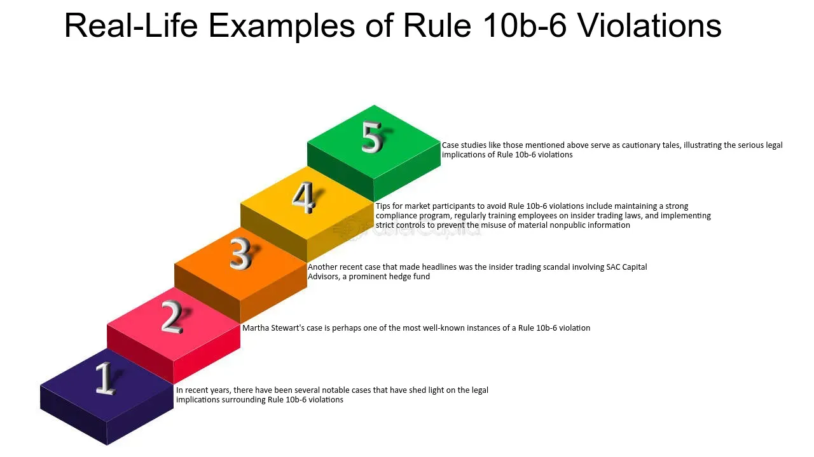

## Table of Contents

## What is Rule 10b-6?

Rule 10b-6 is a regulation from the U.S. Securities and Exchange Commission (SEC) that was designed to prevent manipulative practices during a company's stock offering. It was meant to stop people from artificially influencing the price of a company's stock right before new shares were sold to the public. The rule was in place to make sure that the stock market stayed fair and that investors could trust the prices they saw.

However, Rule 10b-6 was replaced by Regulation M in 1996. Regulation M is a more updated set of rules that still aims to prevent the same kind of manipulative practices but is more specific and detailed. So, even though Rule 10b-6 is no longer used, its goal of keeping the stock market fair continues through Regulation M.

## When was Rule 10b-6 originally implemented?

Rule 10b-6 was originally implemented in 1955. This rule was created by the U.S. Securities and Exchange Commission (SEC) to stop people from cheating during a company's stock offering. The main goal was to keep the stock market fair by preventing anyone from messing with the stock price just before new shares were sold to the public.

The rule was important because it helped investors trust the prices they saw in the market. However, as time went on, the SEC decided to update the rules. In 1996, Rule 10b-6 was replaced by a new set of rules called Regulation M. This new regulation is more detailed and specific but still aims to keep the market fair and prevent the same kind of cheating that Rule 10b-6 was designed to stop.

## What was the main purpose of Rule 10b-6?

Rule 10b-6 was a rule from the U.S. Securities and Exchange Commission (SEC) that aimed to keep the stock market fair. It was made to stop people from cheating during a company's stock offering. The rule was important because it prevented anyone from messing with the stock price just before new shares were sold to the public. This helped investors trust the prices they saw in the market.

The rule was first put in place in 1955. It worked well for many years, but as time went on, the SEC decided to update the rules. In 1996, Rule 10b-6 was replaced by a new set of rules called Regulation M. This new regulation is more detailed and specific but still aims to keep the market fair and prevent the same kind of cheating that Rule 10b-6 was designed to stop.

## How did Rule 10b-6 affect the stock market?

Rule 10b-6 helped keep the stock market fair by stopping people from cheating during a company's stock offering. It made sure that nobody could mess with the stock price just before new shares were sold to the public. This was important because it helped investors trust the prices they saw in the market. If people knew that the prices were not being manipulated, they felt more confident about buying and selling stocks.

The rule was in place from 1955 until it was replaced by Regulation M in 1996. During that time, Rule 10b-6 played a big role in making sure the stock market was a fair place for everyone. It helped prevent big swings in stock prices that could happen if people were allowed to cheat. By keeping things fair, Rule 10b-6 helped the stock market run smoothly and gave investors peace of mind.

## What were the key provisions of Rule 10b-6?

Rule 10b-6 was a rule from the U.S. Securities and Exchange Commission (SEC) that aimed to keep the stock market fair. It stopped people from doing things that could mess with the price of a company's stock right before new shares were sold to the public. This meant that people who were part of the company or involved in the stock offering couldn't buy or sell the stock in a way that would make the price go up or down on purpose. They also couldn't spread false information or do anything else that would trick people into thinking the stock was worth more or less than it really was.

The rule was important because it helped investors trust the prices they saw in the market. If people knew that the prices were not being manipulated, they felt more confident about buying and selling stocks. Rule 10b-6 was in place from 1955 until it was replaced by Regulation M in 1996. During that time, it played a big role in making sure the stock market was a fair place for everyone. By keeping things fair, Rule 10b-6 helped the stock market run smoothly and gave investors peace of mind.

## Why was Rule 10b-6 eventually replaced?

Rule 10b-6 was eventually replaced because the U.S. Securities and Exchange Commission (SEC) wanted to update the rules to make them more detailed and specific. Over time, the SEC saw that the stock market was changing and that new rules were needed to keep up with these changes. So, in 1996, they decided to replace Rule 10b-6 with a new set of rules called Regulation M.

Regulation M was designed to do the same thing as Rule 10b-6, which was to stop people from cheating during a company's stock offering. But it was more detailed and covered more situations. The main goal was still to keep the stock market fair and make sure that investors could trust the prices they saw. By replacing Rule 10b-6 with Regulation M, the SEC made sure that the rules were up-to-date and effective in preventing manipulative practices in the stock market.

## What regulatory changes led to the replacement of Rule 10b-6?

Rule 10b-6 was replaced because the U.S. Securities and Exchange Commission (SEC) saw that the stock market was changing. They wanted to make sure the rules were up-to-date and could handle new situations. So, in 1996, they decided to create a new set of rules called Regulation M. This new regulation was more detailed and specific than Rule 10b-6, which had been in place since 1955.

The main reason for the change was to keep the stock market fair and make sure investors could trust the prices they saw. Regulation M aimed to stop people from cheating during a company's stock offering, just like Rule 10b-6 did. But it covered more situations and was more effective at preventing manipulative practices. By replacing Rule 10b-6 with Regulation M, the SEC made sure the rules were better suited to the modern stock market.

## What rule replaced Rule 10b-6 and when was it implemented?

Rule 10b-6 was replaced by a new set of rules called Regulation M. This change happened in 1996. The U.S. Securities and Exchange Commission (SEC) decided to make this switch because they wanted the rules to be more detailed and specific. The stock market was changing, and they needed new rules to keep up with these changes.

Regulation M was made to do the same job as Rule 10b-6, which was to stop people from cheating during a company's stock offering. It aimed to keep the stock market fair and make sure that investors could trust the prices they saw. By replacing Rule 10b-6 with Regulation M, the SEC made sure that the rules were up-to-date and effective in preventing manipulative practices in the stock market.

## How does the new rule differ from Rule 10b-6 in terms of scope and application?

Regulation M, which replaced Rule 10b-6 in 1996, covers more situations and is more detailed. Rule 10b-6 was mainly about stopping people from messing with stock prices right before a company sold new shares. It focused on stopping people who were part of the company or involved in the stock offering from doing things that would trick others about the stock's value. Regulation M goes further by including rules for different kinds of stock offerings and even covers things like how people can trade stocks during these times.

The main goal of both rules is the same: to keep the stock market fair and make sure investors can trust the prices they see. But Regulation M is more specific about what people can and can't do. It has rules for different stages of a stock offering and covers more types of people who might try to cheat. This makes it better at stopping manipulative practices and keeping the market honest.

## What impact did the replacement of Rule 10b-6 have on market practices?

The replacement of Rule 10b-6 with Regulation M in 1996 made the rules about stock offerings clearer and more detailed. Before, Rule 10b-6 was focused on stopping people from messing with stock prices right before new shares were sold. It helped keep the market fair, but as the market changed, the rules needed to change too. Regulation M covers more situations and includes rules for different kinds of stock offerings. This means it's better at stopping people from cheating and making sure the prices investors see are fair.

Because Regulation M is more specific, it changed how people act in the stock market. Now, there are clearer rules about what people can and can't do during a stock offering. This helps everyone know what's allowed, which makes the market more honest and trustworthy. Investors can feel more confident that the prices they see are real and not being manipulated. Overall, the switch to Regulation M helped keep the stock market fair and running smoothly.

## What are some case studies or examples where the replacement of Rule 10b-6 significantly affected corporate actions?

One example where the replacement of Rule 10b-6 with Regulation M had a big impact is in how companies handle their initial public offerings (IPOs). Before Regulation M, companies had to be careful about what they did with their stocks right before an IPO under Rule 10b-6. But Regulation M made the rules clearer and more detailed. For instance, in the IPO of Google in 2004, Regulation M's rules helped make sure that the stock price was fair and not manipulated. Google used a unique auction method for its IPO, and Regulation M's detailed guidelines helped ensure that this process was transparent and fair for all investors.

Another case where Regulation M made a difference is in the handling of secondary offerings. A good example is the secondary offering by Tesla in 2020. Under Regulation M, Tesla had to follow strict rules about how they could trade their stocks during the offering period. This helped prevent any manipulation of the stock price and ensured that the market stayed fair. The rules under Regulation M gave investors confidence that the price they were paying for Tesla's shares was based on real market conditions, not on any tricks or cheating.

## What ongoing debates or discussions exist regarding the effectiveness of the rule that replaced Rule 10b-6?

People still talk about how well Regulation M works compared to the old Rule 10b-6. Some people think Regulation M does a good job at keeping the stock market fair. They say it's more detailed and covers more situations, which helps stop people from cheating during stock offerings. But others think Regulation M can be too strict. They say it might make it harder for companies to do things like buy back their own shares or do other normal business activities during an offering.

There's also a debate about whether Regulation M keeps up with new ways people might try to cheat in the stock market. Some people worry that as the market changes, Regulation M might not catch all the new tricks people could use. They think the rules need to be updated more often to stay effective. But others argue that Regulation M is flexible enough to handle new situations and that the SEC is good at making changes when they need to. Overall, people agree that keeping the stock market fair is important, but they don't always agree on the best way to do it.

## References & Further Reading

[1]: Goldstein, I., & Xu, N. (2013). ["Securities Trading and Market Manipulation"](https://www.semanticscholar.org/paper/Manipulation%2C-the-Allocational-Role-of-Prices-and-Goldstein-Guembel/fd98e308318b900d05f9f3275e050adc42ce0ff9). Journal of Economics & Management Strategy.

[2]: Biais, B., & Woolley, P. (2011). ["High Frequency Trading and Market Stability"](https://papers.ssrn.com/sol3/papers.cfm?abstract_id=1834344). Bank of England.

[3]: Lopez de Prado, M. (2018). ["Advances in Financial Machine Learning"](https://www.amazon.com/Advances-Financial-Machine-Learning-Marcos/dp/1119482089). John Wiley & Sons.

[4]: Securities and Exchange Commission. (1996). ["Adopting Release of Rule M"](https://www.govinfo.gov/content/pkg/FR-1996-06-14/pdf/96-14184.pdf). U.S. Securities and Exchange Commission.

[5]: Gomber, P., Arndt, B., Lutat, M., & Uhle, T. (2011). ["High-Frequency Trading"](https://papers.ssrn.com/sol3/papers.cfm?abstract_id=1858626). Zeitschrift für Betriebswirtschaft.

[6]: Pirrong, C. (2013). ["The Economics of High-Frequency Trading"](https://www.annualreviews.org/content/journals/10.1146/annurev-financial-121415-033010). Available at SSRN 2232929.