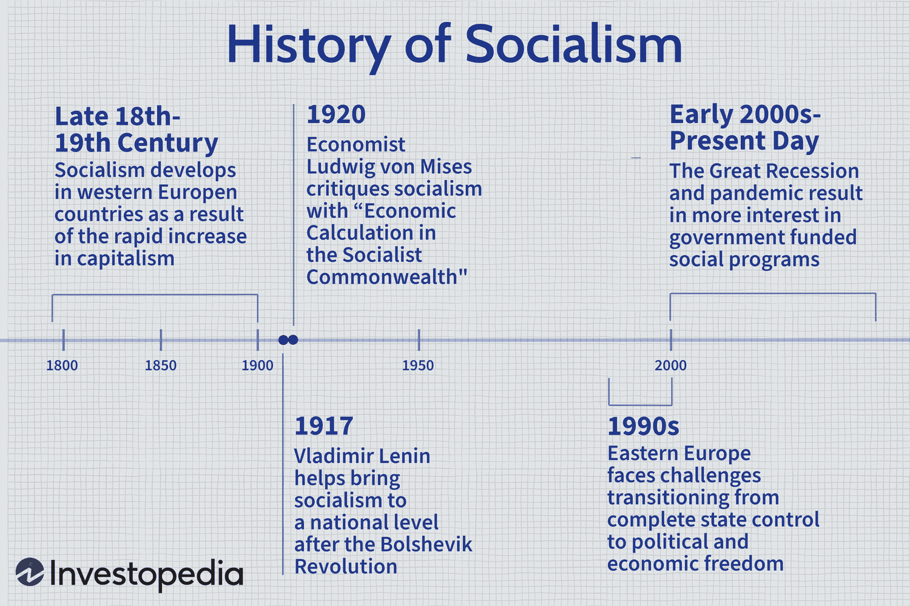

Socialism is a political and economic ideology that advocates for the ownership and regulation of the means of production by the community as a whole. The core principles of socialism include the pursuit of social equality, the distribution of wealth according to need, and the eradication of unjust social hierarchies, aiming to create a society where economic resources are distributed more equitably among the population. This ideology opposes capitalist systems, where private individuals or corporations own and control production means, often leading to significant disparities in wealth and power.

Socialist countries strive to embody these principles by implementing political and economic systems that emphasize collective ownership and democratic governance. Notable examples include Cuba, where the state controls most of the economy; China, which maintains a socialist political structure with a mix of market reforms; and the Nordic countries, which integrate socialist elements within a democratic framework. These nations demonstrate how diverse the application of socialism can be, highlighting different approaches to implementing shared ownership and wealth distribution.

Political theory is instrumental in understanding the nuances of socialism, providing the intellectual frameworks necessary to evaluate its principles and practices. It enables a critical examination of socialist ideologies against other political systems, such as liberalism and conservatism, offering insights into how different models of governance and economic management impact societies.

In contrast, algorithmic trading, or algo trading, represents a modern innovation in economic systems characterized by the use of electronic platforms to automate trading activities. By utilizing algorithms to execute complex trading strategies at high speeds, algo trading dominates contemporary financial markets. Its emergence has revolutionized trading by increasing market efficiency and liquidity while also posing ethical and regulatory challenges due to its reliance on technology and potential impact on market stability.

Exploring the intersections between socialism and algorithmic trading raises intriguing questions about how socialist principles could inform or disrupt modern financial practices. By juxtaposing a political ideology centered around community welfare with an economic system driven by technology and profitability, one can envision novel frameworks where these themes converge, potentially reshaping economic policies and governance structures in socialist contexts.

## Table of Contents

## Understanding Socialist Countries

Socialist countries are defined by their commitment to implementing socialism as both an economic and political system. Socialism, in general, emphasizes collective ownership of the means of production, distribution based on contribution, and the intention to achieve social equality. The characteristics of socialist countries often include the presence of a centralized government that directs economic planning and the redistribution of resources to ensure equal access to essential services.

Prominent examples of countries practicing socialism include China, Cuba, and Vietnam. Each of these nations embodies socialist principles but does so in unique ways due to historical, cultural, and political contexts.

China is an example of a socialist country with a market-oriented economy. Since the late 20th century, it has adopted a model referred to as "socialism with Chinese characteristics," which integrates a significant degree of capitalist market practices within its socialist framework. Despite the introduction of market mechanisms, the Chinese government retains control over key sectors and maintains a one-party political system governed by the Communist Party of China.

Cuba represents a more traditional model of socialism, where the state has a dominant role in the economy and provides health, education, and other services. Since the Cuban Revolution in 1959, the government's focus has been on redistributing resources across the population to minimize wealth disparities. While facing economic challenges due to external embargoes and internal inefficiencies, Cuba has achieved notable successes in healthcare and education.

Vietnam, like China, has also embraced market reforms known as "Đổi Mới" since the late 1980s while maintaining a socialist state structure. These reforms have allowed private enterprise to flourish within certain sectors while the state continues to control strategic industries, ensuring that socialist principles are upheld.

The economic and political landscapes in socialist countries vary widely. For instance, centralized planning in socialist economies can lead to increased efficiency in resource allocation and infrastructure development, although it may also result in bureaucratic inefficiencies and limited individual entrepreneurship. Politically, such countries often feature single-party systems or dominant political parties that emphasize socialist ideologies. 

However, these nations face unique challenges and successes in their implementation of socialism. Challenges include managing the tensions between maintaining socialist ideals and adopting market-oriented reforms to spur economic growth and innovation. For instance, balancing state control with the need for foreign investment can pose dilemmas in policy-making. Meanwhile, the ability of socialist countries to provide equitable healthcare and education is often cited as a significant achievement.

In summary, socialist countries offer a diverse array of economic models and political systems shaped by their interpretation of socialist doctrine. By examining how socialism is implemented across various contexts, one can appreciate the complexities and dynamics that define these nations' landscapes, each striving to balance ideological purity with practical governance needs.

## Socialism as a Political Theory

Socialism as a political theory traces its origins to the 19th century as a response to the social and economic inequalities that arose during the Industrial Revolution. At its core, socialism emphasizes collective ownership and the equitable distribution of resources, seeking to mitigate the disparities caused by unfettered capitalism. The term itself gained prominence through the work of key thinkers like Karl Marx, Friedrich Engels, and later, Vladimir Lenin, who provided a systematic critique of the capitalist economy and proposed socialism as a transformative alternative.

Karl Marx is perhaps the most influential figure in socialist theory. His works, particularly "The Communist Manifesto" (co-authored with Engels) and "Das Kapital," lay the groundwork for the analysis of capitalism’s inherent contradictions. Marx’s theory of historical materialism posits that societal progress is driven by material economic forces and class struggle. Marx argued that capitalism would inevitably lead to its own downfall, as the working class (proletariat) rises against the bourgeoisie to establish a classless, socialist society.

Friedrich Engels, Marx’s collaborator, complemented Marx’s ideas by providing an analysis of the family, property relations, and the state. Engels' work "The Origin of the Family, Private Property, and the State" explores the interconnectedness of economic systems and social structures, reinforcing the socialist tenet that economic change is crucial to social transformation.

Socialism compares with other political ideologies by its focus on economic equality and collective management of resources, contrasting sharply with capitalism’s emphasis on individual entrepreneurship and private property. Unlike liberalism, which values individual freedoms often at the expense of social equity, socialism seeks to balance personal freedoms with communal well-being. Compared to communism, which advocates for a stateless, classless society post-revolution, socialism allows for a role of the state in managing resources and facilitating transition.

Political theory plays a significant role in shaping policy and governance within socialist systems. By advocating for state intervention and public welfare, socialist theory has influenced policies such as universal healthcare, free education, and progressive taxation. These policies aim to reduce socio-economic inequalities and enhance social welfare, reflecting the theory’s foundational principles.

In contemporary politics, socialist theory remains relevant as many nations grapple with income inequality, healthcare access, and workers' rights. Movements and political parties, particularly in Europe and Latin America, continue to draw on socialist ideas to advocate for social justice and economic reform. The resurgence of interest in democratic socialism, exemplified by figures such as Bernie Sanders in the United States and Jeremy Corbyn in the United Kingdom, indicates a growing public discourse on the merits of socialist policies amid the challenges posed by globalization and neoliberal economic models.

Socialist political theory thus continues to evolve, adapting to modern societal challenges while retaining its core commitment to equality and collective responsibility. Its interplay with other ideologies and its application in various socio-political contexts underscore its enduring impact on shaping economic policy and governance worldwide.

## Algorithmic Trading: A Brief Overview

Algorithmic trading, often referred to as algo trading, is the use of computer algorithms to execute trades in financial markets. These algorithms can execute pre-programmed trading instructions whose variables may include timing, price, and [volume](/wiki/volume-trading-strategy). By leveraging computational power, [algorithmic trading](/wiki/algorithmic-trading) aims to enhance the speed and efficiency of trading activities, often performing trades at a frequency and accuracy far beyond what is possible for human traders.

The evolution of algorithmic trading closely parallels advancements in technology. In the early days, traders used simple algorithms to automate trades based on fundamental conditions or technical signals. However, with the rise of high-frequency trading ([HFT](/wiki/high-frequency-trading-strategies)), algorithms have become more sophisticated. These HFT strategies often seek to capitalize on minute price discrepancies that may exist for mere fractions of a second. The growth of computing power, improvements in telecommunications infrastructure, and developments in [machine learning](/wiki/machine-learning) have all contributed significantly to the development of more advanced algorithms.

Algo trading has had a profound impact on global markets. It has significantly increased the efficiency and [liquidity](/wiki/liquidity-risk-premium) of markets by allowing for rapid trading and tighter spreads. However, it has also led to increased market [volatility](/wiki/volatility-trading-strategies) during periods of stress, as the rapid succession of automatic trades can exacerbate price swings. The "Flash Crash" of May 6, 2010, is often cited as an example where algorithmic trading contributed to a sudden and severe market downturn.

The ethical and regulatory concerns surrounding algorithmic trading are diverse. One major issue is market fairness, as sophisticated technologies often provide advantages to larger firms with substantial resources at their disposal, potentially disadvantaging smaller participants. There is also the risk of unintended consequences from poorly designed algorithms that may disrupt market stability. As a result, regulatory bodies worldwide have put in place various measures to monitor and control the influence of algorithmic trading on financial markets. Regulatory frameworks such as the Markets in Financial Instruments Directive II (MiFID II) in Europe and amendments to the Securities Exchange Act in the United States have increased reporting requirements and imposed trading controls to mitigate systemic risks.

Key players in the algorithmic trading space include major financial institutions like Goldman Sachs, JPMorgan Chase, and Morgan Stanley, alongside dedicated trading firms like Renaissance Technologies and Citadel. These organizations employ complex technologies, ranging from low-latency trading systems to advanced data analytics platforms, to gain competitive edges in trading.

In conclusion, algorithmic trading represents a pivotal component of modern finance, enabling greater efficiency and liquidity while posing unique challenges for market regulation and ethics. As technology continues to advance, it is likely that algorithmic trading will become even more prevalent, necessitating ongoing consideration of its impact on global financial systems.

## Intersections: Socialism and Algorithmic Trading

Socialist principles, which prioritize collective ownership and the equitable distribution of resources, present unique opportunities to influence algorithmic trading. Traditional trading algorithms are designed to optimize financial gains within capitalist frameworks, focusing primarily on profit maximization and market efficiency. Socialist principles, however, could reshape these objectives by incorporating factors such as social welfare, equality, and sustainability into trading algorithms.

In socialist economic systems, there is potential for algorithmic trading to align with broader societal goals. For example, algorithms could be programmed to prioritize trades that support socially responsible companies or that reinforce economic equality. These algorithms could include constraints or objectives associated with environmental, social, and governance ([ESG](/wiki/esg-investing)) criteria, essentially integrating non-financial factors into the decision-making process. 

Balancing capitalist market strategies with socialist ideals involves a complex synergy between profit-driven models and those prioritizing societal welfare. While capitalist markets thrive on competition and maximizing shareholder value, socialist-influenced algorithms could emphasize cooperative market strategies, where the focus shifts toward long-term stability and social impact. Such algorithms might be designed to avoid excessive risk-taking that could jeopardize workers' jobs or destabilize communities, showcasing a departure from purely capitalistic strategies.

Historically, there have been instances where socialist policies intersect with algorithmic trading. The use of trading algorithms in publicly owned sectors, such as state enterprises, could provide valuable case studies. These algorithms operate with transparency mandates and public accountability, aligning with socialist tenets. For example, Estonia has explored using technology in governance to enhance transparency and efficiency, demonstrating how socialist principles can coexist with advanced technological solutions.

Speculating on the future of finance in increasingly socialist economies, one can envision a landscape where algorithmic trading systems are not only tools for financial management but also integral components of public policy implementation. Algorithms could be used to stabilize markets with state oversight, prioritizing employment and social equity over mere profit margins. The integration of [artificial intelligence](/wiki/ai-artificial-intelligence) and machine learning could further enhance the ability of trading systems to balance these goals, allowing for dynamic adaptation to changing economic and social conditions.

In summary, the fusion of socialist principles with algorithmic trading provides fertile ground for innovation. It challenges existing paradigms by introducing ethical considerations into algorithmic logic, potentially leading to more equitable financial systems that operate beyond the narrow confines of profit maximization.

## Challenges and Opportunities

Integrating algorithmic trading into socialist economies presents a unique set of challenges and opportunities. The adoption of algorithmic trading in such settings raises questions about economic equality and the fairness of automated markets. Socialist systems often prioritize equitable distribution of resources and wealth. However, the inherent nature of algorithmic trading, which often seeks to maximize profit and efficiency, can potentially exacerbate economic disparities.

A primary challenge is ensuring that automated trading systems do not disproportionately benefit a small segment of society at the expense of the larger populace. In capitalist markets, algorithmic trading often results in significant gains for those with access to advanced technology and market data. To align with socialist values, it is crucial to develop systems that promote inclusivity and equitable wealth distribution.

One possible solution is the implementation of transparent algorithms that can be audited and adjusted to align with social welfare goals. Implementing mechanisms such as trade limits or taxes on excessive trading could prevent market manipulation and ensure a fairer distribution of profits. Furthermore, integrating algorithmic trading within the public sector could allow governments to utilize these technologies for managing national resources and optimizing economic planning.

Despite these challenges, algorithmic trading also presents opportunities for innovation and efficiency in socialist economies. The use of advanced data analytics and machine learning can enhance decision-making processes and improve the allocation of resources. By leveraging algorithmic trading, socialist countries can potentially increase market efficiency, reduce transaction costs, and enhance the overall stability of their economies.

Developing effective policy frameworks is crucial for guiding the responsible integration of algorithmic trading in socialist settings. Such frameworks should focus on transparency, accountability, and inclusivity. Regulations could mandate periodic audits of trading algorithms to ensure they adhere to predefined social and economic objectives. Additionally, establishing bodies to oversee the ethical implementation of algorithmic trading can help maintain public trust and ensure that these technologies serve the collective good.

Governments and international bodies play a vital role in regulating algorithmic trading within socialist economies. National governments can set guidelines that ensure trading practices are aligned with public interest, while international organizations can facilitate cooperation and establish global standards to prevent issues such as cross-border market manipulation or unfair competitive advantages.

In summary, integrating algorithmic trading in socialist settings requires a careful balance between embracing technological advancements and adhering to principles of economic equality. By fostering an environment that supports both innovation and fairness, socialist economies can harness the benefits of algorithmic trading while upholding their core values.

## Conclusion

The exploration of intersections between socialism and algorithmic trading has revealed several key insights. Socialist countries, with their emphasis on equitable resource distribution and social welfare, present unique challenges and opportunities for integrating algorithmic trading. These economic systems traditionally prioritize reducing wealth disparities, suggesting a potential for algorithmic trading to be employed in ways that align with such goals, although the execution may prove complex.

As algorithmic trading continues to evolve, its adaptability to various economic ideologies is crucial. The ability of socialist governments to regulate and potentially leverage algorithmic trading for social aims could dramatically shift traditional economic policies. This integration challenges long-standing capitalist norms, potentially offering a new dimension where efficient, automated trading systems operate within a framework that values economic equity.

The implications for economic policy and governance are profound. If implemented with socialist ideals, algo trading might require rethinking market regulations to ensure fairer outcomes, such as minimizing the potential for market manipulation and ensuring that profits contribute to social welfare. Consequently, this necessitates robust policy frameworks and innovative governance models capable of balancing these competing aims.

Future research is essential to address the uncertainties surrounding the coexistence of socialist principles and algorithmic trading. Key areas include developing algorithms that incorporate social welfare objectives, understanding how such algorithms perform in practice, and exploring their impacts on both market stability and societal welfare. Additionally, comparative studies of how different socialist states integrate algorithmic trading could yield valuable insights.

As modern economies grapple with rapid technological advancements, the dialogue between socialism and algorithmic trading offers a fresh perspective on how economic systems might adapt. By blending technological efficiency with social justice, there is potential for creating economic environments where wealth generation does not come at the expense of equality and fairness. This evolving relationship not only challenges the status quo but also heralds a future where various ideologies might effectively coexist, shaping the economic landscapes of tomorrow.

## References & Further Reading

[1]: Marx, Karl & Engels, Friedrich. ["The Communist Manifesto."](https://www.marxists.org/admin/books/manifesto/Manifesto.pdf) (1848).

[2]: Lenin, Vladimir. ["The State and Revolution."](https://www.marxists.org/archive/lenin/works/1917/staterev/)

[3]: Aronson, David R. ["Evidence-Based Technical Analysis: Applying the Scientific Method and Statistical Inference to Trading Signals."](https://www.amazon.com/Evidence-Based-Technical-Analysis-Scientific-Statistical/dp/0470008741) Wiley, 2006.

[4]: Lopez de Prado, Marcos. ["Advances in Financial Machine Learning."](https://www.amazon.com/Advances-Financial-Machine-Learning-Marcos/dp/1119482089) Wiley, 2018.

[5]: Chan, Ernest P. ["Quantitative Trading: How to Build Your Own Algorithmic Trading Business."](https://github.com/ftvision/quant_trading_echan_book) Wiley, 2008.

[6]: Jansen, Stefan. ["Machine Learning for Algorithmic Trading."](https://github.com/stefan-jansen/machine-learning-for-trading) Packt Publishing, 2020.