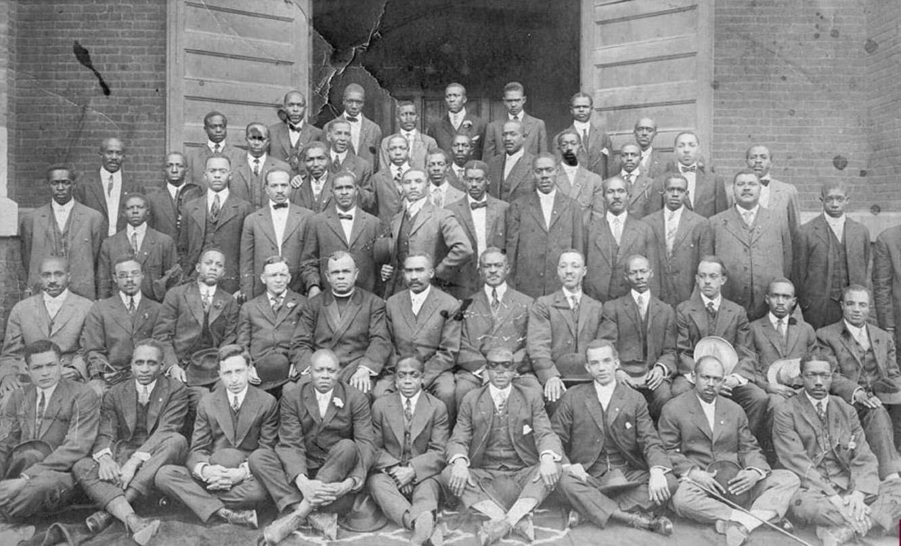

This article examines the intricate connections between pivotal historical events and modern financial innovations. It will explore the significance of Black Wall Street and the Tulsa Race Massacre—two interlinked subjects of profound historical importance. Black Wall Street, located in Tulsa, Oklahoma, was a beacon of African-American prosperity during the early 20th century. This thriving community represented the apex of African-American entrepreneurship, self-reliance, and economic empowerment. The Tulsa Race Massacre of 1921 stands as a dark chapter, reflecting systemic racism and the consequent decimation of this prosperous community. Understanding these events is crucial for recognizing the historical narratives that have shaped modern American society.

African-American history plays an essential role in molding the larger tapestry of American culture and identity. By remembering and exploring these narratives, we not only honor the resilience and contributions of African-Americans but also provide critical insights that inform contemporary social dynamics and policymaking. History serves as a bedrock for learning, adaptation, and progress. Its lessons underpin the ongoing struggle for equality and justice, as well as the societal shifts towards inclusivity and recognition.

Alongside these historical explorations, algorithmic trading, a revolutionary force in today's financial markets, will be introduced. Algorithmic trading—or algo trading—relies on computer programs to automate trading strategies and decisions in the financial markets. This technology has transformed the speed, efficiency, and accuracy of trading, leading to pervasive changes across global economies. Understanding its mechanisms and impacts is essential to comprehending contemporary economic behaviors.

The interconnection between Black Wall Street's historical entrepreneurial spirit and modern-day algo trading may appear tenuous at first glance. However, both subjects underscore themes of economic empowerment, innovation, and the quest for financial independence. By examining these seemingly disparate topics, we can identify overlapping themes of resilience, innovation, and empowerment. The legacy of Black Wall Street serves as an inspiration for contemporary innovators who are exploring and exploiting new technologies to achieve economic prosperity.

Through this exploration, the article sets the stage for a thorough investigation into each subject, revealing how the past informs present opportunities and challenges. By drawing parallels between history and modern innovation, we aim to foster a deeper appreciation of the entrepreneurial spirit that transcends time and the potential for technology to serve as a powerful tool for economic empowerment across diverse communities.

## Table of Contents

## The Rise and Prosperity of Black Wall Street

Black Wall Street, located in the Greenwood District of Tulsa, Oklahoma, stood as a remarkable example of African-American economic achievement and cultural vibrancy in the early 20th century. Established around the time of Oklahoma's statehood in 1907, Greenwood blossomed into a flourishing business hub by the 1920s, reflecting the spirit of entrepreneurship and self-reliance that was central to its community's ethos. Greenwood was often referred to as "Black Wall Street" due to its wealth, autonomy, and the economic opportunities it generated for African-Americans, who were often marginalized and discriminated against elsewhere in the United States.

The economic success of the Greenwood District was largely supported by its strategic location and the determination of its residents. At its peak, Black Wall Street boasted over 600 businesses, including grocery stores, banks, cinemas, and even a hospital. The area was home to affluent, successful professionals like Dr. A.C. Jackson, a renowned African American surgeon, and J.B. Stradford, who owned the luxurious Stradford Hotel. Such figures exemplified the economic empowerment achieved by African-Americans within the district.

Education and entrepreneurship were highly emphasized, with institutions such as the Booker T. Washington High School contributing to the community's growth and prosperity. This emphasis helped cultivate a robust sense of pride and accomplishment among the residents. The presence of a strong, educated middle class further fueled Greenwood's success, demonstrating the transformative power of education and business acumen.

Above all, Black Wall Street symbolized the importance of self-reliance and community cooperation. The residents of Greenwood understood the importance of circulating wealth within their community, resulting in a vibrant local economy that was relatively insulated from the economic fluctuations affecting the broader society. The businesses in Greenwood often collaborated and supported each other, fostering an interdependent economic ecosystem.

Despite its downfall due to the Tulsa Race Massacre in 1921, the legacy of Black Wall Street endures as a poignant symbol of what could be achieved by African Americans despite systemic racism and segregation. The story of Greenwood continues to inspire movements toward economic empowerment and community resilience, demonstrating the enduring power of entrepreneurship and collective endeavor in the face of adversity.

## The Tulsa Race Massacre: A Dark Chapter in American History

The Tulsa Race Massacre of 1921 stands as a grim episode in American history, illustrating the racial tensions and violence of the era. The events that led to this catastrophic occurrence were rooted in a racially charged environment characterized by segregation and economic envy. Tulsa's Greenwood District, known as "Black Wall Street," was a prosperous African-American community flourishing with successful businesses and cultural vibrancy. This economic success, however, bred resentment among the white population in Tulsa.

The immediate catalyst for the massacre was an incident on May 30, 1921, involving a young Black man named Dick Rowland and a white woman, Sarah Page. While the details remain unclear, the interaction was sensationalized by local newspapers, exacerbating racial tensions. On May 31, a white mob gathered outside the courthouse where Rowland was held, intent on lynching him. As a group of armed Black men arrived to defend Rowland, a confrontation ensued, leading to gunfire and sparking the massacre.

Over the next 24 hours, violence engulfed Greenwood. White rioters, some deputized by local authorities, looted and set fire to businesses and homes. Aircraft were reportedly used to drop incendiary devices, intensifying the destruction. By June 1, the prosperous district lay in ruins, with estimates of deaths ranging from 100 to 300, although the exact number remains contested.

The immediate impact on the African-American community in Tulsa was catastrophic. An entire community was left homeless, with more than 1,000 homes destroyed and businesses demolished. The social and economic fabric of Greenwood was irrevocably damaged. In the long term, survivors faced significant challenges in rebuilding their lives amid systemic racism and legal hurdles preventing them from acquiring insurance compensation for the destruction.

For decades, the Tulsa Race Massacre was omitted from historical narratives and education, effectively silencing the trauma endured by the victims and their descendants. Renewed interest in the late 20th and early 21st centuries has led to increased recognition and scholarly research, slowly integrating this dark chapter into public knowledge and school curricula. Efforts such as the 2001 Oklahoma Commission to Study the Tulsa Race Riot have also played a role in uncovering the truth and advocating for justice. The commission's report recommended reparations and highlighted the need for substantial public acknowledgment.

Today, ongoing efforts to seek justice and recognition for the massacre victims include calls for reparations, the identification of mass grave sites, and legislative measures for educational inclusion. The centennial commemoration in 2021 further spotlighted these endeavors, emphasizing the resilience of the descendants and the necessity of confronting historical injustices to pave the way for healing and reconciliation.

## African-American History: Lessons and Legacy

African-American history is a critical component of the broader narrative of the United States, shedding light on the contributions and challenges faced by African-Americans throughout the nation's history. From the early days of slavery to the ongoing struggle for civil rights and equality, African-Americans have been integral in shaping American society in numerous ways.

One pivotal movement was the Civil Rights Movement of the 1950s and 1960s, which fundamentally transformed American society by challenging segregation and discrimination. Landmark events like the March on Washington in 1963, where Dr. Martin Luther King Jr. delivered his iconic "I Have a Dream" speech, highlighted the demand for equal rights and justice. The subsequent passing of the Civil Rights Act of 1964 and the Voting Rights Act of 1965 were monumental achievements that dismantled systemic racial barriers and paved the way for significant social and economic advancement.

Education plays a crucial role in overcoming historical injustices. Landmark cases such as Brown v. Board of Education in 1954 symbolized a major victory against segregation in public schools, laying the groundwork for greater educational opportunities for African-Americans. Prominent figures like Booker T. Washington and W.E.B. Du Bois emphasized the importance of education and intellectual growth as tools for empowerment and self-improvement. Their advocacy for educational access and excellence continues to inspire current generations to pursue academic and professional achievements.

Despite these advancements, African-Americans continue to face systemic challenges. However, their resilience and innovation have consistently driven progress and inspired diverse fields. The Harlem Renaissance of the 1920s, for example, was a cultural movement that celebrated African-American artistic expression, influencing literature, music, and art. Similarly, the Black Arts Movement of the 1960s and 1970s fostered a new wave of creativity and political consciousness. These movements underscore the role of African-American innovation in enriching American culture and consciousness.

Reflecting on these historical moments reveals lessons in perseverance and the collective power of community action. The ongoing fight against racial inequality and socioeconomic disparities serves as a reminder of the work that remains. By understanding past challenges and triumphs, society can better navigate contemporary issues while striving for a more equitable future.

The legacy of African-American history is a testament to the enduring spirit of a community that has made indispensable contributions to the fabric of American life. This history not only informs the present but also inspires future generations to forge pathways to equality and justice across all sectors of society.

## Algorithmic Trading: A Modern Financial Phenomenon

Algorithmic trading, often abbreviated as algo trading, is the use of computer algorithms to automate the process of trading financial instruments. This modern approach involves executing large orders at high speeds, often utilizing complex mathematical models and statistical analysis to determine the best possible outcome. The development of algo trading has significantly evolved since its inception during the early 1970s when the New York Stock Exchange introduced designated order turnaround systems, marking the shift from manual to automated trading systems.

Technological advancements, primarily improvements in computer processing power and the proliferation of data, have been instrumental in revolutionizing financial markets through [algorithmic trading](/wiki/algorithmic-trading). These algorithms enable traders to process and analyze vast amounts of market data far more efficiently than human capabilities allow. This efficiency often translates into optimized trading strategies, reduced transaction costs, and the ability to execute trades across multiple markets and asset classes simultaneously. High-frequency trading ([HFT](/wiki/high-frequency-trading-strategies)), a subset of algorithmic trading characterized by high-speed order execution, is an exemplar of these technological advancements, altering market dynamics by capturing fleeting [arbitrage](/wiki/arbitrage) opportunities.

African-American innovators and entrepreneurs have begun to make inroads within the fintech space, contributing to the development and application of algorithmic trading. Historically, the finance and technology sectors have faced challenges regarding diversity and inclusion. Efforts to bridge this gap have resulted in increased opportunities for African-American participation in these fields. Entrepreneurs such as Michael Garvey, founder of the algorithmic trading firm Green Path, demonstrate the potential for African-Americans to harness technological innovations for financial empowerment. These pioneers are not only creating new business opportunities but also challenging traditional barriers by advocating for more inclusive financial ecosystems.

The growth of algorithmic trading presents both opportunities and challenges for diverse communities. On one hand, the accessibility of trading platforms and tools democratizes participation, allowing individuals and small firms to engage in markets that were previously dominated by large financial institutions. Educational initiatives focused on coding, data science, and financial literacy can equip underrepresented groups with the skills necessary to participate in algorithmic trading.

Conversely, challenges such as the digital divide, access to capital, and systemic biases in financial models must be addressed to ensure equitable participation. The complexities of developing effective algorithms also necessitate a level of expertise that can be a barrier to entry. However, mentorship programs and collaborations between academic institutions and fintech firms can mitigate these challenges by providing essential resources and support.

Algorithmic trading's capability to empower economically through technological advancements is substantial. The application of [artificial intelligence](/wiki/ai-artificial-intelligence) (AI) and [machine learning](/wiki/machine-learning) (ML) in trading algorithms can enhance predictive accuracy and adaptability in volatile market conditions. These technologies offer potential gains not only in terms of financial returns but also in fostering a culture of innovation and resilience among emerging African-American fintech professionals. Through active engagement and investment in new technologies, diverse communities can seek greater financial independence and contribute to a more inclusive economic landscape.

## Connecting Past and Present: Economic Empowerment Through Innovation

The entrepreneurial spirit that defined Black Wall Street in the early 20th century finds its echo today in fintech and algorithmic trading. This historical reflection illustrates a parallel between the tenacity of African-American entrepreneurs in the past and present efforts to leverage cutting-edge technology for economic empowerment.

Black Wall Street was a hub of economic activity, driven by a community that valued entrepreneurship and self-reliance. Today, similar principles guide African-American entrepreneurs as they harness digital technology to create financial independence. The fintech industry offers a myriad of opportunities, from mobile payment systems to blockchain technologies, allowing for greater access to financial services and investment platforms. African-Americans are utilizing these tools to break down traditional barriers to entry, enabling wealth accumulation and management on an unprecedented scale.

Several successful African-American-led businesses illustrate this trend within the algorithmic trading industry. For instance, companies like Ariel Investments and Vista Equity Partners, founded by John Rogers Jr. and Robert F. Smith respectively, highlight the impact of diversity in finance. These firms not only demonstrate the technical acumen necessary to compete but also represent inclusive leadership in a predominantly homogeneous sector. Their success underscores the potential for minority-led initiatives to drive innovation and performance in financial markets.

Diversity and inclusion remain crucial for fostering a more equitable landscape in the tech and finance sectors. Encouraging a broader range of voices and experiences can stimulate creativity and result in products and services that cater to a more diverse clientele. Additionally, inclusive teams can better identify and mitigate biases in algorithm design, ensuring that technological advancements benefit rather than disadvantage marginalized groups.

Investing in new technologies is essential for continued economic empowerment. Innovations such as artificial intelligence, big data analytics, and machine learning present vast possibilities for developing sophisticated trading strategies and financial tools. Individuals and communities should be encouraged to pursue education and careers in STEM fields, thereby positioning themselves to benefit from these technological advancements.

Ultimately, bridging the historical success of Black Wall Street with today's fintech innovations emphasizes the enduring importance of entrepreneurial spirit and technological progress in achieving economic empowerment. By embracing these opportunities, African-Americans can continue to forge pathways toward financial independence and equity.

## Conclusion

The exploration of Black Wall Street, the Tulsa Race Massacre, and algorithmic trading provides a multifaceted understanding of the intersections between history and modern economic strategies. This synthesis of past and present underscores the enduring significance of preserving African-American history, such as the entrepreneurial triumphs and tragic losses experienced in Tulsa's Greenwood District, as a cornerstone of cultural and economic heritage.

Black Wall Street stands as a testament to the power of community-driven economic success and self-reliance, exemplifying how African-Americans could build prosperous and vibrant neighborhoods in the face of adversity. The Tulsa Race Massacre, a cataclysmic event in American history, serves as a pivotal reminder of the destructive forces of racism and the importance of addressing historical injustices through education and acknowledgment.

In parallel, the rapid advancements in algorithmic trading represent the potential for new economic opportunities and empowerment in modern times. African-American innovators and entrepreneurs are increasingly making strides in the fintech sector, helping to democratize access to financial markets and promote economic independence.

As we reflect on these topics, it is essential to recognize the responsibility of individuals and communities to uplift diverse voices in every field. By supporting education, innovation, and inclusion, we can create a more equitable future. This journey calls for ongoing research and education, encouraging active involvement to ensure that lessons from the past inform and inspire present and future endeavors.

In conclusion, the convergence of history and innovation highlights a pathway for economic empowerment and societal progress. By embracing the opportunities of today while honoring the lessons of yesterday, we can cultivate a landscape where every community thrives, driven by resilience, creativity, and shared commitment to equality.

## References & Further Reading

[1]: Madigan, N. (2001). "[Report on the Tulsa Race Riot of 1921](https://archive.org/details/burningmassacred0000madi)." Oklahoma Commission to Study the Tulsa Race Riot of 1921.

[2]: Gates, H. L., Jr., & Higginbotham, E. B. (2008). ["The African American National Biography"](https://hutchinscenter.fas.harvard.edu/AANB). Oxford University Press.

[3]: Ellsworth, S. (2001). ["Death in a Promised Land: The Tulsa Race Riot of 1921"](https://muse.jhu.edu/book/16522). LSU Press.

[4]: [Lopez de Prado, M. (2018). "Advances in Financial Machine Learning"](https://books.google.com/books/about/Advances_in_Financial_Machine_Learning.html?id=oU9KDwAAQBAJ). Wiley.

[5]: Jansen, S. (2020). ["Machine Learning for Algorithmic Trading"](https://github.com/stefan-jansen/machine-learning-for-trading). Packt Publishing.