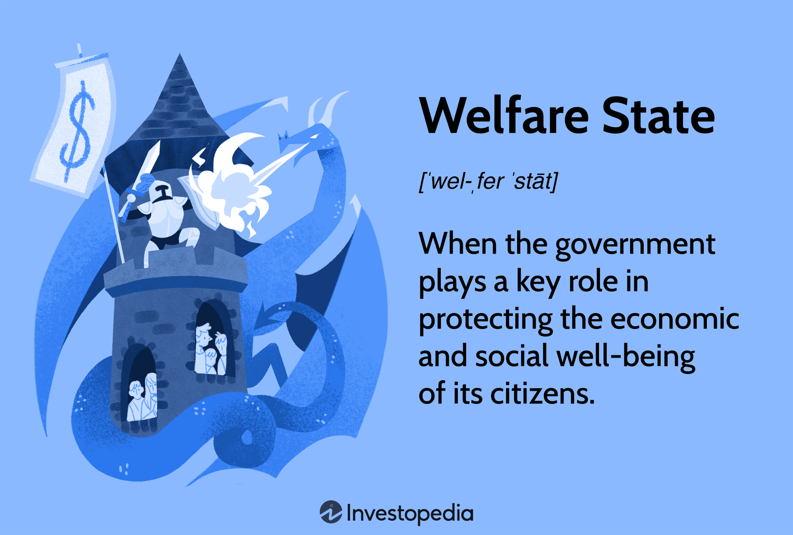

The concept of a welfare state is central to understanding modern governance and social systems. It encompasses various government programs that aim to ensure the economic and social well-being of citizens by providing essential services and financial support. Welfare states are designed to mitigate social inequalities and economic disparities through policies that often include healthcare access, education subsidies, unemployment insurance, and pensions.

Over the decades, welfare states have evolved, reflecting societal changes, economic needs, and political ideologies. Initially established as a response to the socioeconomic challenges following significant global events such as the World Wars and economic depressions, welfare states have undergone numerous reforms to adapt to shifting demographic trends, technological advancements, and fiscal constraints. These adaptations highlight a dynamic relationship between state intervention and market forces, often sparking debates about the efficiency and efficacy of welfare systems.



The development of welfare states has also been influenced by diverse political ideologies, ranging from social liberalism to social democracy, each advocating different levels and types of state involvement in individual well-being. Moreover, global economic integration and rapid technological change present new challenges and opportunities for welfare states. This article explores the history and development of welfare states, the criticisms they face, and their linkage to modern innovations such as algorithmic trading. By examining these aspects, one can gain a comprehensive understanding of how welfare policies have shaped and been shaped by broader social and economic transformations.

## Table of Contents

## The Origins of Social Welfare Systems

The roots of social welfare systems are embedded in ancient societal traditions where communities often came together to support individuals who were less fortunate. This early form of communal aid laid the groundwork for more structured systems of social welfare. However, the modern conception of the welfare state as a distinct and systematic effort to address social and economic inequalities began to take shape post-World War II. This transformation was largely driven by the necessity to combat widespread poverty and unemployment that plagued many nations during that period.

The United Kingdom and the United States were instrumental in shaping the early concepts of the welfare state. In the UK, one of the most influential contributions was the Beveridge Report, officially known as the "Social Insurance and Allied Services" report, published in 1942. Authored by William Beveridge, a British economist and social reformer, the report outlined a comprehensive plan for social insurance that aimed to eliminate poverty and provide a safety net "from cradle to grave." Beveridge identified five key social issues, which he referred to as the "Five Giants": Want, Disease, Ignorance, Squalor, and Idleness. His proposals included the introduction of universal health care, unemployment benefits, and retirement pensions, laying the foundation for the establishment of the National Health Service (NHS) and other significant welfare programs in post-war Britain.

Concurrently, in the United States, the New Deal, enacted by President Franklin D. Roosevelt in the 1930s as a response to the Great Depression, played a significant role in shaping American social welfare. The New Deal encompassed a series of programs, public work projects, and financial reforms aimed at providing relief for the unemployed and poor, recovering the economy, and reforming the financial system to prevent a repeat depression. Notable components of the New Deal included the Social Security Act of 1935, which created a social insurance program for the elderly, the unemployed, and disadvantaged families, marking the beginning of a federal commitment to social welfare.

These pioneering efforts in the UK and the US reflected a broader recognition of the state's responsibility to ensure the economic and social well-being of its citizens and influenced the development of welfare policies across the globe. The post-war period thus marked a crucial turning point in the articulation and implementation of modern welfare states, grounded in principles of social security and economic redistribution.

## The Evolution of the Welfare State

The development of welfare states in the 20th century marked a significant departure from the traditional roles governments had previously assumed. This period saw governments taking on expanded roles in economic and social matters, with welfare policies being implemented to promote a more equitable distribution of wealth and resources. Such policies were designed not only to alleviate economic hardships but also to ensure that all citizens had access to basic necessities like healthcare, education, and social security.

The aftermath of the Great Depression and World War II served as pivotal moments that accelerated the evolution of welfare states. Many countries experienced economic upheaval and widespread poverty, leading to increased demands for comprehensive government intervention. The resulting welfare policies were shaped by the need to prevent such economic disasters from recurring, as well as by a growing recognition of social justice as a vital component of societal development.

One of the key features of 20th-century welfare states was the increase in government expenditure on social programs. For instance, healthcare systems evolved from minimal basic care provisions to comprehensive services aimed at ensuring universal coverage. The establishment of national health services in countries like the United Kingdom exemplified this shift. Education also saw significant investment, with the goal of providing equal opportunities for all citizens, thereby fostering economic growth and mitigating social inequalities.

Social security systems were expanded to include a broader range of benefits and protections. These systems aimed to provide financial assistance during periods of unemployment, illness, or retirement, reinforcing the idea that all members of society have a right to a certain standard of living. Economic security became intertwined with social stability, underscoring the importance of a well-functioning welfare state.

Overall, the development of welfare states in the 20th century was both a reaction to economic challenges and an affirmation of a commitment to social justice. By investing in the well-being of their citizens, governments sought to create a more resilient society capable of withstanding economic uncertainties while promoting equitable growth and development.

## Criticisms and Challenges

Welfare states have long been subjects of debate due to their dual objectives of fostering equality and providing societal security. Despite their well-intentioned goals, these systems often face significant criticisms. A primary concern is the potential for extensive welfare programs to create dependencies among recipients. Opponents argue that when individuals rely heavily on government assistance, it can diminish their motivation to seek employment, thereby discouraging work and reducing productivity. This phenomenon potentially leads to a paradox where welfare systems intended to reduce poverty may inadvertently perpetuate it by fostering a reliance on social benefits rather than encouraging self-sufficiency.

Furthermore, economic inefficiencies can arise within welfare states due to the allocation and distribution processes involved in managing large-scale social support systems. The administrative costs require significant government budgets, which could, in turn, strain financial resources. For instance, maintaining a comprehensive safety net involves substantial public expenditure that could otherwise be directed towards investments fostering economic growth.

In recent decades, economic globalization has further intensified these challenges. As countries become more interdependent through trade and global markets, welfare states face mounting pressure to remain competitive. This interconnectedness means that nations must strike a delicate balance between maintaining social expenditure and ensuring economic vitality. High taxation policies necessary to fund welfare programs can potentially render a country less attractive for business investments, which are crucial for job creation and economic expansion.

For example, multinational corporations might seek to operate in regions with lower tax burdens or reduced regulatory constraints, which could ultimately result in a loss of potential revenue and employment opportunities for welfare states with higher fiscal demands. These dynamics underscore the complex interplay between maintaining an equitable welfare system and fostering a competitive economic environment.

Without adaptive policy frameworks that respond to these criticisms, welfare states risk compromising both social goals and economic progress. Therefore, it remains essential for policymakers to continuously evaluate and reform welfare programs to mitigate these challenges and ensure that they effectively serve their intended purpose.

## The Intersection of Welfare and Technology: Algo Trading

Algorithmic trading, commonly known as algo trading, is a prominent example of the symbiosis between advanced technology and financial markets. By employing computer programs that follow a defined set of instructions, algo trading allows transactions to be executed at speeds and frequencies that a human trader cannot achieve. These algorithms can process vast quantities of data in real-time, leveraging mathematical models and statistical analyses to identify profitable trading opportunities.

Although algo trading is not directly connected to welfare systems, its emergence highlights significant shifts in the nature of work and economic stability. The increasing reliance on technology in financial sectors has implications for job markets, income distribution, and consequently, social welfare policies. The automation of trading activities potentially reduces opportunities for traditional roles in the financial sector, reflecting broader trends in automation impacting various industries.

The integration of technology like algo trading raises essential questions about economic security in the digital age. With jobs increasingly influenced by technical skills and [artificial intelligence](/wiki/ai-artificial-intelligence), social policies may need adaptation to address new employment paradigms. For instance, investing in education and upskilling programs becomes vital to equip the workforce with necessary competencies for a technologically driven market. Here is an illustrative example of a simple algorithm that could be used for trading:

```python
import pandas as pd
import numpy as np

# Sample data
data = {'Price': [100, 102, 101, 104, 107, 105, 110, 108]}
df = pd.DataFrame(data)

# Simple Moving Average (SMA)
df['SMA'] = df['Price'].rolling(window=3).mean()

# Trading signal
df['Signal'] = np.where(df['Price'] > df['SMA'], 'Buy', 'Sell')

print(df)
```

This code calculates a simple moving average (SMA) for a series of prices and generates "Buy" or "Sell" signals based on the relationship between the current price and the SMA. While simplified, it demonstrates how algorithmic approaches can enhance decision-making in financial markets.

Furthermore, [algorithmic trading](/wiki/algorithmic-trading) embodies the broader impact of globalization and technological advancement on national economies, underlining the need for welfare states to evolve. Policymakers must consider how emerging technologies can be harnessed to maintain social safety nets amid rapidly transforming economic conditions. This includes potentially redesigning welfare systems to support displaced workers and fostering environments where technology complements rather than replaces human labor.

In examining the technological landscape, the potential of algorithmic trading and similar advancements might guide future welfare state policies. By integrating insights from economic and technological shifts, welfare states can better anticipate and respond to the challenges of the 21st-century economy, ensuring sustainability and equity for coming generations.

## The Future of Welfare States

As societies transform under the influence of rapid technological advancements and economic globalization, the welfare state must evolve to remain effective and sustainable. The integration of technology into social welfare systems presents both opportunities and challenges. Technological advancements can significantly enhance the delivery and administration of welfare services. For instance, digital platforms can streamline access to services and benefits, improve data analytics for better policy targeting, and reduce fraud through more sophisticated monitoring systems.

Economic globalization and technological disruptions have changed the nature of work, leading to the emergence of gig economies and automation, which impact job security and income distribution. This evolution necessitates a reevaluation of traditional social safety nets. Universal basic income (UBI) has been proposed by some economists and policymakers as a potential solution to address income stability in an era where traditional employment may be less secure. UBI involves providing all citizens with a fixed amount of money regularly, regardless of their employment status, aiming to ensure financial security amidst labor market [volatility](/wiki/volatility-trading-strategies).

Additionally, technology-driven economic models, such as platform economies and blockchain-based systems, require new regulatory and policy frameworks to ensure that they contribute positively to social welfare. Regulatory measures need to balance innovation with the protection of workers' rights and the equitable distribution of economic benefits. Policymakers must consider the digital divide and ensure that technological advancements do not exacerbate existing inequalities.

Collaborative international policymaking is also critical, given the interconnectedness of global economies. Policies that integrate technological innovation with social welfare goals must be coordinated at an international level to address cross-border challenges such as migration, cybersecurity, and multinational corporate taxation.

In conclusion, the future of welfare states hinges on their ability to integrate technological innovations while adapting to shifting economic landscapes. Policymakers must leverage technology to enhance social welfare systems, ensuring they are inclusive, equitable, and resilient to future disruptions. Such innovations require a forward-thinking approach, incorporating insights from multiple disciplines to craft comprehensive strategies for sustainable social welfare.

## Conclusion

The history of welfare states demonstrates a commitment to achieving social justice and economic stability across diverse populations. These systems, despite facing criticism over fostering dependency or inefficiency, play a critical role in supporting vulnerable groups by providing necessary resources and protection against economic uncertainties. The ongoing evolution of welfare states reflects their adaptability to societal needs and changing economic conditions.

In considering modern innovations, the integration of technology, such as algorithmic trading, offers a fresh perspective on developing welfare policies. Algorithmic trading, with its capacity for rapid and strategic market analysis, is an example of how technology is reshaping economic landscapes. Although primarily a financial tool, its existence highlights the broader implications of automation and digitalization on employment and social welfare.

Conclusively, the continuous development and assessment of welfare systems must incorporate these technological advancements to anticipate and address potential shifts in labor markets and economic practices. By understanding the intertwining of social welfare structures with contemporary technological trends, policymakers can devise strategies that not only uphold social justice but also enhance economic resilience and inclusivity for future generations.

## References & Further Reading

[1]: Beveridge, W. (1942). ["Social Insurance and Allied Services."](https://archive.org/details/socialinsurancea00sirw) London: His Majesty's Stationery Office.

[2]: Roosevelt, F. D. (1935). ["The Social Security Act."](https://www.archives.gov/milestone-documents/social-security-act) U.S. Social Security Administration.

[3]: Midgley, J., & Piachaud, D. (Eds.). (2011). ["Social Protection, Economic Growth and Social Change: Goals, Issues and Trajectories in China, India, Brazil and South Africa."](https://onlinelibrary.wiley.com/doi/10.1111/spol.12178) Oxford University Press.

[4]: Esping-Andersen, G. (1990). ["The Three Worlds of Welfare Capitalism."](https://www.researchgate.net/publication/243774920_The_Three_Worlds_Of_Welfare_Capitalism) Princeton University Press.

[5]: De Wilde, P. (2017). ["The Sustainability of the Welfare State: Cultural and Economic Aspects."](https://www.sciencedirect.com/science/article/pii/S0048969721025523) Journal of European Social Policy.

[6]: López de Prado, M. (2018). ["Advances in Financial Machine Learning."](https://www.amazon.com/Advances-Financial-Machine-Learning-Marcos/dp/1119482089) Wiley.

[7]: Jansen, S. (2020). ["Machine Learning for Algorithmic Trading."](https://github.com/stefan-jansen/machine-learning-for-trading) Packt Publishing.