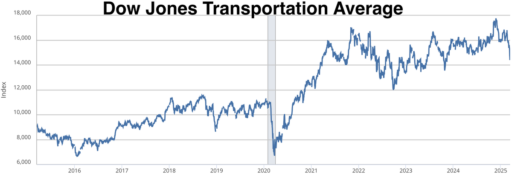

## Table of Contents

## What is the Dow Jones Transportation Average (DJTA)?

The Dow Jones Transportation Average (DJTA) is a stock market index that tracks the performance of companies in the transportation industry. It includes companies from different transportation sectors like airlines, railroads, and trucking. The DJTA is important because it gives investors an idea of how well the transportation sector is doing. It was created by Charles Dow, who also started the Dow Jones Industrial Average.

The DJTA is made up of 20 companies. Some well-known companies in the index are airlines like Delta Air Lines and Southwest Airlines, and railroad companies like Union Pacific and CSX. The performance of these companies can show how the economy is doing. If the DJTA goes up, it often means that more goods are being moved around the country, which can be a sign of a strong economy. If it goes down, it might mean that fewer goods are being transported, which could be a sign of economic slowdown.

## When was the Dow Jones Transportation Average first introduced?

The Dow Jones Transportation Average was first introduced on July 3, 1884. It was created by Charles Dow, who is also known for starting the Dow Jones Industrial Average. At that time, the index was called the Dow Jones Railroad Average because it only included railroad companies.

Over time, the index changed to include other types of transportation companies, like airlines and trucking firms. This change happened to better represent the whole transportation industry. Today, the DJTA is made up of 20 companies and is an important way to see how the transportation sector is doing.

## What was the original purpose of the DJTA?

The DJTA was first made to track how well railroad companies were doing. Back in 1884, railroads were a big part of the economy, so it was important to see how they were doing. Charles Dow, who started the DJTA, wanted to give people a way to see if the economy was strong by looking at the railroads.

Over time, the DJTA changed to include other types of transportation companies, like airlines and trucking firms. This was because the transportation industry grew and changed. Today, the DJTA helps people understand the health of the whole transportation sector, not just railroads.

## How has the composition of the DJTA changed over time?

When the DJTA was first made in 1884, it was called the Dow Jones Railroad Average. It only had railroad companies in it because railroads were a big part of the economy back then. The index started with just 12 railroad companies. It was a way for people to see how well the economy was doing by looking at how these companies were doing.

Over time, the transportation industry changed a lot. Railroads were not the only important way to move things around anymore. So, the DJTA changed too. It started to include other types of transportation companies like airlines and trucking firms. Now, the DJTA has 20 companies in it, and it shows how the whole transportation sector is doing, not just railroads. This change helps people get a better picture of the economy today.

## What are some key historical events that impacted the DJTA?

The DJTA has seen many big events that changed it a lot. One big event was World War II. During the war, the government needed a lot of transportation to move soldiers and supplies. This made the DJTA go up because the transportation companies were doing really well. After the war, the DJTA went down a bit because the demand for transportation was not as high anymore.

Another important event was the deregulation of the airline and trucking industries in the 1970s and 1980s. Before this, the government controlled a lot of what these companies could do. When the rules were relaxed, new airlines and trucking companies started, and this made the DJTA change. Some old companies did not do as well, and new companies joined the index. This made the DJTA more diverse and showed how the transportation industry was growing and changing.

The 2008 financial crisis was also a big deal for the DJTA. During the crisis, people and businesses were not buying as much stuff, so they did not need as much transportation. This made the DJTA go down a lot because the transportation companies were not doing well. After the crisis, the DJTA slowly started to go up again as the economy got better. These events show how the DJTA can go up and down based on what is happening in the world and the economy.

## How does the DJTA relate to the Dow Theory?

The DJTA is important in the Dow Theory, which was made by Charles Dow. The Dow Theory says that the stock market has two main indexes that can show how the economy is doing: the Dow Jones Industrial Average (DJIA) and the Dow Jones Transportation Average (DJTA). The DJTA looks at how well transportation companies are doing, while the DJIA looks at how well industrial companies are doing. The theory says that for the economy to be really strong, both the DJIA and the DJTA should be going up together. This is because if industries are making more stuff, they need transportation to move it around.

If the DJIA goes up but the DJTA does not, it might mean that the economy is not as strong as it looks. This is because the stuff that industries are making is not being moved around as much. So, the DJTA is like a check to see if the growth in the DJIA is real. When both indexes go up together, it gives a good sign that the economy is doing well. This is why the DJTA is a big part of the Dow Theory and helps people understand the economy better.

## What are the current components of the DJTA?

The Dow Jones Transportation Average (DJTA) includes 20 companies from different parts of the transportation industry. Some of these companies are airlines like Alaska Air Group, American Airlines, Delta Air Lines, JetBlue Airways, Southwest Airlines, and United Airlines. There are also railroad companies in the index, such as CSX, Canadian National Railway, Canadian Pacific Kansas City, Norfolk Southern, and Union Pacific. 

Other companies in the DJTA are from the trucking and logistics sector, including CH Robinson Worldwide, Expeditors International of Washington, FedEx, JB Hunt Transport Services, Landstar System, Old Dominion Freight Line, and Ryder System. There are also companies that operate in shipping and marine transportation, like Matson and Kirby Corporation. Together, these companies show how the whole transportation industry is doing.

## How is the DJTA calculated?

The DJTA is calculated by adding up the stock prices of all 20 companies in the index and then dividing that total by a special number called the divisor. The divisor is used to make sure the index stays accurate even when companies are added or removed, or when there are stock splits or dividends. This way, changes in the index reflect real changes in the market, not just changes in the companies that make up the index.

When a company's stock price goes up or down, it affects the total value of the DJTA. If more companies in the index are doing well and their stock prices go up, the DJTA will go up too. If more companies are not doing well and their stock prices go down, the DJTA will go down. The DJTA is updated every day, so people can see how the transportation industry is doing at any time.

## What role does the DJTA play in economic analysis?

The DJTA is a big help in understanding the economy. It shows how well the transportation industry is doing, which is important because transportation is needed to move goods and people around. When the DJTA goes up, it often means more stuff is being moved, and this can be a sign that the economy is doing well. If the DJTA goes down, it might mean that less stuff is being moved, which can be a sign that the economy is slowing down. People who study the economy look at the DJTA to see if the growth they see in other parts of the economy is real or not.

The DJTA is also a key part of the Dow Theory, which helps people understand how the stock market and the economy work together. According to the Dow Theory, for the economy to be strong, both the DJTA and the Dow Jones Industrial Average (DJIA) should be going up together. The DJIA shows how well industrial companies are doing, and the DJTA shows how well transportation companies are doing. If both are going up, it's a good sign that the economy is strong because industries are making more stuff and it's being moved around. So, the DJTA helps give a full picture of how the economy is doing by showing the health of the transportation sector.

## How has the performance of the DJTA compared to other major indices over time?

The DJTA has often moved in a similar way to other big stock market indexes like the Dow Jones Industrial Average (DJIA) and the S&P 500, but it can also be different at times. Over the years, the DJTA has sometimes gone up when the DJIA and S&P 500 go up, showing that the economy is strong. For example, during times of economic growth, like the 1990s tech boom or the recovery after the 2008 financial crisis, the DJTA has often followed the same upward trend as these other indexes. This happens because when industries are making more stuff, they need more transportation to move it around, so both the industrial and transportation sectors do well.

However, there have been times when the DJTA has not moved the same way as the DJIA or S&P 500. For instance, during the 1970s, when there was a lot of inflation and oil prices went up, the DJTA did not do as well as the DJIA. This is because high oil prices made it more expensive to move things around, which hurt transportation companies more than industrial companies. Also, during the 2000s, when the internet and technology sectors were booming, the DJTA did not grow as fast as the tech-heavy Nasdaq because it focuses on transportation, not technology. These differences show how the DJTA can give a unique view of the economy that other indexes might not show as clearly.

## What are some significant peaks and troughs in the history of the DJTA?

The DJTA has had some big ups and downs over the years. One of the biggest peaks was in the late 1990s, during the tech boom. The DJTA hit a high point in 1999 because the economy was doing really well, and a lot of goods were being moved around. Another peak happened in 2007, right before the financial crisis. The DJTA was doing well because the economy was strong, but it did not last long.

One of the biggest troughs for the DJTA was during the 2008 financial crisis. The index dropped a lot because businesses and people were not buying as much stuff, so they did not need as much transportation. The DJTA hit a low point in early 2009. Another big trough was in the early 1980s when there was a lot of inflation and high interest rates. The DJTA went down a lot during this time because it was hard for transportation companies to make money. These ups and downs show how the DJTA can change a lot depending on what is happening in the economy.

## How have technological advancements influenced the DJTA?

Technological advancements have had a big impact on the DJTA. New technologies like better airplanes, faster trains, and more efficient trucks have helped transportation companies work better. For example, airlines using new planes can fly more people and goods, which can make their stock prices go up. Also, technology like GPS and better logistics software helps trucking and shipping companies move things around faster and cheaper. When these companies do better because of technology, the DJTA can go up too.

But technology can also make things hard for some companies in the DJTA. For example, new technology can make some old ways of doing things less important. If a new technology comes out that makes trains or trucks less needed, the companies that use those old ways might not do as well. This can make the DJTA go down. So, while new technology can help some companies in the DJTA, it can also hurt others. It all depends on how well each company can use the new technology to stay ahead.

## References & Further Reading

[1]: Sears, J. (1988). ["The Second Oldest Market Index—the Dow Jones Transportation Average."](https://en.wikipedia.org/wiki/Historical_components_of_the_Dow_Jones_Industrial_Average) Financial Analysts Journal, 44(2), 32-37.

[2]: ["The Dow Theory"](https://www.investopedia.com/terms/d/dowtheory.asp) by Robert Rhea

[3]: Schack, J. (2008). ["Algorithmic Trading and DMA: An introduction to direct access trading strategies."](https://archive.org/details/algorithmictradi0000john) Harriman House.

[4]: Lo, A. W. (2004). ["The Adaptive Markets Hypothesis: Market Efficiency from an Evolutionary Perspective."](https://papers.ssrn.com/sol3/papers.cfm?abstract_id=602222) The Journal of Portfolio Management, 30(5), 15-29.

[5]: ["Traders at Work: How the World's Most Successful Traders Make Their Living in the Markets"](https://www.amazon.com/Traders-Work-Worlds-Successful-Markets/dp/1430244437) by Tim Bourquin and Nicholas Mango

[6]: ["Dow Theory for the 21st Century"](https://thedowtheory.com/indicators/dow-theory-for-the-21st-century/) by Jack Schannep