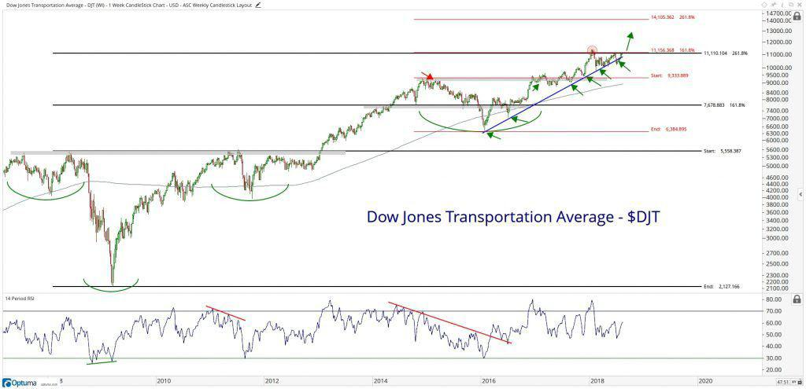

The Dow Jones Transportation Average (DJTA) stands as a testament to the historical and ongoing significance of the transportation sector within the U.S. economy. Established in 1884 by Charles Dow, one of the co-founders of Dow Jones & Company, the DJTA is the oldest U.S. stock index, tracing its origins to a period when the railroads were emblematic of industrial progress and economic expansion. Initially, the index comprised predominantly railroad companies, reflecting the essential role of rail transport in the country's economic infrastructure. Over time, the DJTA has evolved to embody the broader spectrum of the transportation sector, now encompassing industries such as airlines, trucking, and logistics. This adaptation mirrors shifts in transportation modalities and economic priorities.

This article explores the extensive history of the DJTA, emphasizing its crucial function as an indicator of economic vitality in the transportation domain and its influence within the larger financial market landscape. The index continues to serve as a key barometer for market watchers and economists, offering insights into transportation trends and, by extension, into the health of the economy.

## Table of Contents

## The Beginnings of DJTA

The Dow Jones Transportation Average (DJTA) was established in 1884 by Charles Dow, co-founder of Dow Jones & Company. Its creation reflected the critical economic influence of railroads during the late 19th century, a period when rail transport was pivotal for commerce and industry in the United States. Initially, the DJTA consisted of 11 companies, nine of which were railroads. This composition underscored the dominant role railways played in facilitating the movement of goods and shaping economic growth. Railroads were not merely a means of transportation but were also vital to the expansion and integration of markets across the country.

The two non-railroad companies included in the original index suggested an early recognition of the diverse nature of the transportation industry. This initial inclusion pointed towards the industry's potential for evolution beyond railways, acknowledging the presence of emerging modes of transport that could contribute to economic activities. The early design of the DJTA hinted at an evolving landscape where different segments of transportation would become more integrated as industries and technological developments progressed.

The composition of the DJTA has continuously adapted to reflect changes in the transportation sector, capturing the dynamic shifts from traditional rail to include sectors like airlines and logistics. This adaptability has ensured that the index remains a relevant measure of transportation-related economic health.

## Evolution of DJTA Components

The Dow Jones Transportation Average (DJTA) has undergone significant changes in its composition since its inception in 1884. Initially comprising predominantly railroad companies, the DJTA mirrored the transportation landscape of the late 19th and early 20th centuries when railroads were the backbone of industrial progress and economic expansion in the United States. The index originally included 11 companies, with nine being railroads, emphasizing the critical role rail played in facilitating commerce and commodity movement.

Over the decades, as the economy transformed and new transportation methods emerged, the DJTA adapted by diversifying its components beyond railroads. The inclusion of airlines marked a notable shift, aligning with the aviation industry's growth and its significant impact on global trade and passenger travel. Marine transportation companies were also added, reflecting the importance of shipping and freight in global commerce. Logistics firms, which have become increasingly vital in the age of internet commerce and global supply chains, were also incorporated into the DJTA, showcasing the evolution from traditional transportation systems to integrated logistics solutions.

As of 2023, the DJTA's composition illustrates the broad spectrum of modern transportation methods and logistics solutions integral to the economy. Companies like FedEx represent the express delivery and logistics industry, showcasing advanced supply chain operations essential for e-commerce and global trade. United Airlines exemplifies the airline sector's role in connecting global markets and facilitating international business and tourism. This diversification not only highlights changes in transportation infrastructure but also echoes broader economic shifts toward service-oriented industries and technological advancements.

The DJTA’s ability to transform over time underscores its relevance in capturing the dynamics of the transportation sector and, by extension, the economy. By including a varied group of companies, the DJTA not only reflects the changing priorities and technologies in transportation but also serves as a bellwether for understanding economic trends and investor sentiment in a rapidly evolving market landscape.

## DJTA and Dow Theory

Proponents of Dow Theory regard the Dow Jones Transportation Average (DJTA) as a critical instrument for confirming economic trends suggested by the Dow Jones Industrial Average (DJIA). Dow Theory, developed from the insights of Charles Dow in the late 19th century, emphasizes the importance of market indices in forecasting economic and market trends. According to this theory, a key tenet is the relationship between the DJTA and the DJIA, asserting that for a confirmed market trend, both averages must move in the same direction. Discrepancies between these indices can signal potential changes in economic conditions, providing early warnings of shifts in market sentiment.

The theory suggests that if the DJIA reaches a new high but the DJTA fails to follow suit, it may indicate underlying weaknesses in the market. Conversely, congruence between these indices—where both exhibit bullish or bearish trends—serves as a stronger confirmation of the market's direction. This relationship reflects the broader economy, where transportation is an essential component in the movement of goods and services, thus impacting industrial production.

Historically, notable divergences between the DJTA and DJIA have highlighted the importance of the DJTA in anticipating market trends. For instance, instances where the DJTA showed weakness while the DJIA continued strong advances have frequently preceded market downturns, thus underscoring the predictive value of observing both averages together. These patterns reinforce the notion that transportation activity, as reflected in the DJTA, can offer insights into future economic conditions that the DJIA alone might not fully capture.

Investors and market analysts leverage these indices not only to validate existing trends but also to identify potential inflection points in the market dynamics. This dual analysis helps in fine-tuning trading strategies and investment decisions, enhancing the robustness of market predictions based on Dow Theory principles.

## DJTA in Modern Trading and Algo Trading

The emergence of [algorithmic trading](/wiki/algorithmic-trading) has fundamentally transformed how investors interact with stock indices, including the Dow Jones Transportation Average (DJTA). Algorithmic trading refers to the use of computer algorithms to manage the buying and selling of securities, often with the aim of executing trades at optimal prices and speeds which are unattainable by human traders alone.

Algorithms are particularly effective in analyzing large datasets, a capability that is invaluable when dealing with historical market data such as that provided by the DJTA. These algorithms can identify patterns and trends within the data that may indicate future market movements. For instance, through [backtesting](/wiki/backtesting)—a process where historical data is used to test the viability of a trading strategy—algorithms can harness DJTA data to refine their predictive accuracy and trading execution strategies. The algorithm might look for correlations between the DJTA's performance and macroeconomic indicators, or it might analyze its timing against other market events or indices like the Dow Jones Industrial Average (DJIA).

In many trading platforms, Python is often employed to implement these strategies due to its versatile libraries such as Pandas for data manipulation and NumPy for numerical computations. A typical Python script could involve importing DJTA historical data, analyzing common parameters such as moving averages, or even deploying more sophisticated [machine learning](/wiki/machine-learning) models to predict future movements.

Algorithmic trading with indices like the DJTA is not merely confined to speculation based on historical trends. Real-time data feeds allow algorithms to react instantaneously to market changes, offering tactical advantages such as faster decision-making and reduced transaction costs. By incorporating DJTA data, these trading algorithms can adjust their strategies to mirror shifts within the transportation sector, thereby aligning trading strategies with real-world dynamics.

Overall, the integration of DJTA data within automated trading systems exemplifies the modern evolution of trading methodologies, underscoring the importance of combining historical insights with cutting-edge technology to achieve financial goals. As algorithmic trading continues to evolve, its relationship with indices like the DJTA may further deepen, providing traders with robust tools for navigating increasingly complex financial markets.

## Historical Milestones and Performance

The Dow Jones Transportation Average (DJTA) has served as a barometer for the transportation sector and, more broadly, the U.S. economy since its inception. Its history is marked by significant milestones and performance shifts that reflect broader economic events.

One of the most noteworthy record highs occurred in late December 2017, when the index crossed the 10,000-point mark for the first time. This achievement was largely attributed to robust economic growth and improved earnings across the transportation sector, driven by rising consumer demand and global trade expansion. Conversely, one of the notable drops happened during the financial crisis of 2008, where the DJTA, much like other indices, experienced substantial declines. On October 10, 2008, the index fell to a low of 2,933.88, reflecting the severe impact of the global financial meltdown on transportation companies, particularly those involved in freight and logistics.

The performance of the DJTA is closely linked to major economic events. For instance, following the events of September 11, 2001, the index suffered as airline stocks plummeted due to a sharp decline in air travel. On the other hand, periods of economic growth, such as the post-recession recovery starting in 2009, have often led to sustained upticks in the index's performance.

Examining the annual returns of the DJTA offers valuable insights into its volatile yet informative nature. Historically, it has exhibited both substantial annual gains and notable losses, often mirroring the economic environment. During times of economic expansion, the DJTA tends to reflect positive returns due to increased transportation needs, while economic downturns generally yield negative performance. The index's historical [volatility](/wiki/volatility-trading-strategies) also underscores its sensitivity to fuel prices, regulatory changes, and shifts in consumer demand, making it an essential tool for gauging the health of the transportation sector and predicting economic trends.

In summary, the historical milestones and performance of the DJTA provide a window into the economic trends impacting the transportation industry. Its fluctuations alongside major economic events underscore its role as both a sector-specific indicator and a broader economic measure.

## Conclusion

The Dow Jones Transportation Average (DJTA) maintains its status as a crucial barometer of both the U.S. economy and the transportation sector's health. Given its inception in 1884, its longevity underscores an ability to adapt alongside the dynamic changes in transportation and commerce. Originally centered on railroads, the DJTA's inclusion of airlines, trucking, and logistics manifests an evolving landscape, reflecting shifts within transportation modes that are vital to economic activity.

For investors and economists, the DJTA's changing composition provides valuable insights. It acts as a lens through which shifts in transportation—an indicator of broader economic trends—can be observed. The significance of transport in the supply chain and its responsiveness to economic changes make the index an essential tool for understanding nuanced market signals.

As the financial markets grow increasingly complex, the role of the DJTA becomes even more pronounced. Modern trading, particularly with the advent of algorithmic approaches, has leveraged historical and real-time data sourced from indices like the DJTA to shape predictive models and strategies. These sophisticated analyses reinforce the DJTA's relevance in market forecasting and economic evaluation.

Looking forward, the DJTA's integration of diversified transportation entities positions it as a versatile and comprehensive metric. Its historical backdrop combined with forward-looking adaptability ensures its place as a significant analytical tool for responding to economic and market complexities. The DJTA will likely continue to be indispensable in assessing the intersection of transportation logistics and economic vitality.

## References & Further Reading

[1]: Sears, J. (1988). ["The Second Oldest Market Index—the Dow Jones Transportation Average."](https://en.wikipedia.org/wiki/Historical_components_of_the_Dow_Jones_Industrial_Average) Financial Analysts Journal, 44(2), 32-37.

[2]: ["The Dow Theory"](https://www.investopedia.com/terms/d/dowtheory.asp) by Robert Rhea

[3]: Schack, J. (2008). ["Algorithmic Trading and DMA: An introduction to direct access trading strategies."](https://archive.org/details/algorithmictradi0000john) Harriman House.

[4]: Lo, A. W. (2004). ["The Adaptive Markets Hypothesis: Market Efficiency from an Evolutionary Perspective."](https://papers.ssrn.com/sol3/papers.cfm?abstract_id=602222) The Journal of Portfolio Management, 30(5), 15-29.

[5]: ["Traders at Work: How the World's Most Successful Traders Make Their Living in the Markets"](https://www.amazon.com/Traders-Work-Worlds-Successful-Markets/dp/1430244437) by Tim Bourquin and Nicholas Mango

[6]: ["Dow Theory for the 21st Century"](https://thedowtheory.com/indicators/dow-theory-for-the-21st-century/) by Jack Schannep