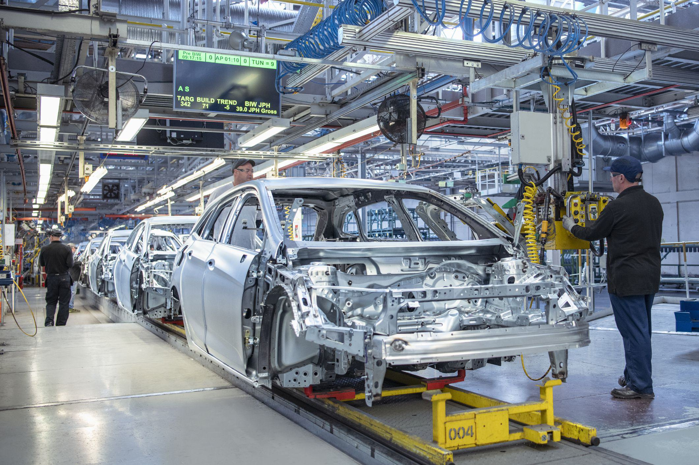

## Table of Contents

## What is the origin of the automobile industry in the United States?

The automobile industry in the United States started in the late 1800s. At that time, people were trying to make cars that ran on steam, electricity, and gas. One important person was Henry Ford. He made the Model T car in 1908. It was affordable and easy to fix, so many people bought it.

Henry Ford also started using a new way to make cars called the assembly line. This made it faster and cheaper to build cars. By the 1920s, lots of people in the United States had cars. This changed how people lived and worked. The car industry grew a lot and became very important for the country's economy.

## Who were the key figures in the early development of the U.S. automobile industry?

Henry Ford was a very important person in the early days of the U.S. automobile industry. He started the Ford Motor Company in 1903. His most famous car was the Model T, which he introduced in 1908. This car was special because it was affordable for many people. Ford also created the assembly line, a new way to build cars quickly and cheaply. This changed the whole industry and made cars more common.

Another key figure was Ransom E. Olds. He founded the Olds Motor Vehicle Company in 1897 and introduced the Oldsmobile in 1901. Olds was one of the first to use an assembly line, even before Ford. His ideas helped make car production more efficient. Olds' work laid the groundwork for the mass production of automobiles.

A third important person was William C. Durant. He founded General Motors in 1908. Durant's company grew by buying other car companies, like Buick and Cadillac. General Motors became a big competitor to Ford. Durant's leadership helped shape the industry and showed how big car companies could grow by joining together.

## How did the Model T impact the U.S. economy and society?

The Model T had a big impact on the U.S. economy. It was affordable, so more people could buy cars. This created lots of jobs in the car industry. Factories needed workers to build the cars, and other businesses grew to make parts for them. The money people made from these jobs helped the economy grow. The Model T also made it easier for people to travel and move goods. This helped businesses and farms grow because they could reach more customers.

The Model T also changed society a lot. It gave people more freedom to travel and explore. Families could go on trips and visit places they couldn't before. This helped bring people together and made the country feel smaller. The car also changed how people lived in cities. It led to the growth of suburbs because people could live farther from work and still drive there easily. The Model T made life more convenient and opened up new possibilities for how people lived and worked.

## What were the major economic effects of the automobile industry on the U.S. during the 20th century?

The automobile industry had a big impact on the U.S. economy during the 20th century. It created lots of jobs in factories and other businesses that made parts for cars. This helped the economy grow because more people had money to spend. The industry also needed steel, rubber, and glass, so those industries grew too. Cars made it easier to move goods around the country, which helped businesses sell more things. This made the economy stronger and helped the U.S. become a leader in the world.

The automobile industry also changed how people lived and worked. It led to the growth of suburbs because people could drive to work from farther away. This made cities spread out and created new jobs in construction and real estate. The car industry also helped build better roads and highways, which made it easier to travel and move goods. This helped the economy because it made trade and tourism grow. Overall, the automobile industry was a big part of making the U.S. economy strong in the 20th century.

## How did the Great Depression affect the U.S. automobile industry?

The Great Depression hit the U.S. automobile industry hard. It started in 1929 and made many people lose their jobs and money. Because people had less money, they couldn't buy new cars. This caused car sales to drop a lot. Car companies had to close factories and lay off workers. Some smaller car companies even went out of business because they couldn't survive the tough times.

But the industry didn't give up. Car companies tried to find new ways to keep going. They made cheaper cars that people could still afford. They also started making other things, like refrigerators and washing machines, to make money. The government helped by creating programs to put people back to work. Slowly, as the economy got better, people started buying cars again. By the late 1930s, the automobile industry began to recover, but it took time and a lot of effort.

## What role did the U.S. automobile industry play during World War II?

During World War II, the U.S. automobile industry played a very important role. Instead of making cars, the factories started making things the military needed. They made tanks, jeeps, trucks, and airplanes. This helped the U.S. win the war because they had the equipment they needed. The workers in the car factories were very important too. They had to learn new skills quickly to build these military vehicles.

The switch to making war materials helped the economy during the war. It gave people jobs and helped the country produce what it needed. After the war ended, the automobile industry had to switch back to making cars. This took time, but they were able to start making cars again and help the economy grow. The industry showed how important it was to the country, both during the war and after.

## How did the rise of foreign competition in the 1970s and 1980s influence the U.S. automobile industry?

In the 1970s and 1980s, the U.S. automobile industry faced tough competition from foreign car makers, especially from Japan. Japanese cars like Toyota and Honda were smaller, used less gas, and were often cheaper than American cars. At that time, there was an oil crisis, so people wanted cars that saved gas. This made more people buy foreign cars instead of American ones. As a result, U.S. car companies lost a lot of customers and had to close some factories. They also had to lay off many workers because they were selling fewer cars.

To fight back, American car companies started to change. They began making smaller cars that used less gas, just like the Japanese ones. They also worked on making their cars better quality so people would want to buy them again. This was hard and took time, but it helped the U.S. car industry start to recover. The competition made the industry stronger in the long run because it pushed them to improve and adapt to what people wanted.

## What were the major technological advancements in the U.S. automobile industry over the decades?

Over the decades, the U.S. automobile industry has seen many important technological advancements. One big change was the move from hand-built cars to using assembly lines. Henry Ford started this in the early 1900s, making cars faster and cheaper to build. This was a big step forward. Later, cars got better engines, like the V8, which made them faster and more powerful. In the 1970s and 1980s, cars started using more computers to control things like the engine and brakes. This made cars run better and safer.

Another big advancement was in safety. Over time, cars got seat belts, airbags, and better brakes. These things saved lives and made driving safer. In the 2000s, cars started using even more technology. They got GPS systems to help people find their way, and touchscreens to control the radio and other features. Electric cars also became more common, with companies like Tesla leading the way. These cars use batteries instead of gas and are better for the environment. All these changes show how the U.S. automobile industry kept improving over the years.

## How have government policies and regulations shaped the U.S. automobile industry?

Government policies and regulations have had a big impact on the U.S. automobile industry. One way is through safety rules. The government made laws that said cars had to have seat belts and airbags. This made cars safer for people to drive. The government also set rules about how much pollution cars can make. These rules made car companies work on making cars that are better for the environment. They started making cars that use less gas and electric cars.

Another way the government has shaped the industry is by helping it during tough times. During the Great Depression, the government created programs to help people get jobs, which helped the car industry. In 2008, when the economy was bad again, the government gave money to car companies like General Motors and Chrysler to keep them from going out of business. This helped them stay open and keep making cars. The government also helps by building roads and highways, which makes it easier for people to drive and buy cars.

## What is the current state of the U.S. automobile industry in terms of production and market share?

The U.S. automobile industry is still very important and makes a lot of cars. In 2022, American car companies made about 10 million cars. This is a big number, but it is less than before the COVID-19 pandemic because there were problems with getting parts and chips for the cars. The biggest car companies in the U.S. are still Ford, General Motors (GM), and Stellantis (which owns Chrysler). These companies make many different kinds of cars, from trucks and SUVs to electric vehicles.

In terms of market share, U.S. car companies have a strong position at home. In 2022, they had about 60% of the U.S. car market. This means most of the cars sold in the U.S. were made by American companies. However, foreign car makers like Toyota, Honda, and Nissan also have a big part of the market. They make cars in the U.S. too, which helps them sell more cars here. The competition is tough, but American car companies are working hard to keep their place in the market by making better and more eco-friendly cars.

## How is the U.S. automobile industry adapting to the global shift towards electric vehicles?

The U.S. automobile industry is changing a lot because more people want electric vehicles. Big car companies like Ford, General Motors, and Tesla are making more electric cars. Ford has the Mustang Mach-E and the F-150 Lightning, which are electric versions of popular cars. GM is making the electric Hummer and plans to only make electric cars by 2035. Tesla is already known for its electric cars like the Model 3 and Model Y. These companies are spending a lot of money to build factories and make batteries for electric cars. They want to be ready for a future where more people drive electric cars.

The government is helping too. They are giving money to car companies to make electric vehicles and build charging stations. This makes it easier for people to buy and use electric cars. The government also has rules that say car companies need to make cars that don't pollute as much. This pushes them to make more electric cars. The U.S. car industry is trying to keep up with other countries like China and Europe, where electric cars are becoming very popular. It's a big change, but the industry is working hard to be part of the electric future.

## What are the future economic projections for the U.S. automobile industry considering emerging technologies and market trends?

The U.S. automobile industry is expected to grow in the future because of new technologies and changes in what people want. More and more people are interested in electric vehicles, and this trend is likely to keep growing. Companies like Ford, General Motors, and Tesla are investing a lot of money in making electric cars and building the factories and batteries needed for them. This could create many new jobs and help the economy. Also, as cars get smarter with things like self-driving technology and better safety features, there will be more demand for these advanced vehicles. This could make the industry even bigger and more important to the U.S. economy.

At the same time, there are challenges that the industry needs to face. Making electric cars can be expensive, and the U.S. needs to build more charging stations to make it easier for people to use them. Competition from other countries, like China, is also growing, so U.S. car companies need to keep improving to stay ahead. The government is helping by giving money to support electric vehicle production and by setting rules to make cars less polluting. If the industry can handle these challenges, it could continue to be a big part of the U.S. economy, creating jobs and driving innovation.

## What is Key Financial Ratios Analysis?

Financial ratios are crucial indicators of the financial health and operational efficiency of companies within the U.S. auto industry. Among these, the Debt-to-Equity (D/E) ratio, Inventory Turnover ratio, and Return on Equity (ROE) are especially significant.

### Debt-to-Equity Ratio

The Debt-to-Equity ratio is a measure of the company’s financial leverage. It is calculated by dividing the company’s total liabilities by its shareholder equity:

$$
\text{Debt-to-Equity Ratio} = \frac{\text{Total Liabilities}}{\text{Shareholder's Equity}}
$$

For auto companies, a lower D/E ratio is generally preferable, indicating that a larger portion of the company’s assets are financed by equity rather than debt. This can be particularly important in a capital-intensive sector like automotive manufacturing, where high levels of debt could lead to increased vulnerability to economic downturns. However, too low a D/E ratio may suggest underutilization of financial leverage, potentially limiting growth opportunities.

### Inventory Turnover Ratio

The Inventory Turnover ratio assesses how efficiently a company manages its inventory and is calculated by dividing the cost of goods sold (COGS) by the average inventory:

$$
\text{Inventory Turnover Ratio} = \frac{\text{Cost of Goods Sold}}{\text{Average Inventory}}
$$

A higher ratio is often preferred, indicating efficient management of inventory levels and quicker turnover, critical for auto manufacturers that need to manage extensive supply chains and production schedules. However, an excessively high ratio might suggest inadequate inventory levels which could lead to missed sales opportunities if demand spikes unexpectedly.

### Return on Equity (ROE)

Return on Equity measures the profitability relative to shareholders’ equity and is calculated as:

$$
\text{Return on Equity} = \frac{\text{Net Income}}{\text{Shareholder's Equity}}
$$

In the auto industry, a higher ROE implies effective management and utilization of shareholder funds to generate profits. This is a key indicator for investors seeking to invest in companies that offer robust returns on invested capital. However, ROE must be interpreted with caution, as it can be artificially inflated by high financial leverage.

### Limitations and Considerations

While these ratios offer valuable insights, they have limitations:

- **Debt-to-Equity Ratio**: This ratio does not account for the absolute value of debt or equity, and it is influenced by industry norms and market conditions. Comparing companies across different sectors might lead to erroneous conclusions.

- **Inventory Turnover Ratio**: This metric does not consider the quality of inventory management or longer-term strategic decisions regarding stocking levels. It can also vary significantly across sub-sectors within the auto industry.

- **Return on Equity**: This ratio can be skewed by extraordinary income or one-time gains, and doesn’t consider the company’s risk profile. It should be considered alongside other profitability and risk measures.

These financial ratios, when analyzed collectively and in the context of industry benchmarks and economic conditions, provide a comprehensive understanding of an auto company’s performance and investment potential.

## References & Further Reading

1. Klier, Thomas, and Rubenstein, James M. "The U.S. Auto Industry: Trends and Outlook." Federal Reserve Bank of Chicago, 2017. Available at: https://www.chicagofed.org
2. Wormald, Megan. "Evolution of the US Automotive Industry, 1896–1930." The Henry Ford, 2003. Available at: https://www.thehenryford.org
3. Cheah, L.G. and Heywood, J.B., "The cost of vehicle emissions regulation in the automotive industry," Transportation Research Part A: Policy and Practice, Volume 49, 2013, Pages 285–302.
4. American Automobile Association (AAA), "Automobile Industry Statistics," 2022. Available at: https://www.aaa.com
5. Center for Automotive Research (CAR), "The Contribution of the Automotive Industry to the Economies of All Fifty States and the United States," 2022. Available at: https://www.cargroup.org
6. Fama, Eugene F., and French, Kenneth R., "Business Cycles and the Behavior of Stock Returns," Journal of Finance, 1998.
7. Standard & Poor's, "Global Industry Classification Standard (GICS)," 2023. Available at: https://www.spglobal.com
8. McKinsey & Company, "Monetizing car data: New service business opportunities to create new customer benefits," 2016. Available at: https://www.mckinsey.com
9. Investopedia, "Algorithmic Trading," 2023. Available at: https://www.investopedia.com
10. Hull, John C., "Options, Futures, and Other Derivatives," Ninth Edition, Pearson, 2014. This textbook provides insights into derivatives, which are often a component of algorithmic trading strategies.
11. Bloomberg, "Tesla's Algorithmic Trading Push Points the Way for Rivals," 2021. Available at: https://www.bloomberg.com
12. Morningstar, "First Trust S-Network Future Vehicles & Technology ETF (CARZ)," 2023. Available at: https://www.morningstar.com
13. Yahoo Finance, "Ford Motor Company (F) Stock Price, News, Quote & History," 2023. Available at: https://finance.yahoo.com
14. Ross, Stephen A., Westerfield, Randolph, and Jordan, Bradford D., "Fundamentals of Corporate Finance," McGraw-Hill Education, 2019. This resource provides foundational knowledge on financial ratios.
15. DataCamp, "Financial Analysis with Python," 2023. Available at: https://www.datacamp.com

