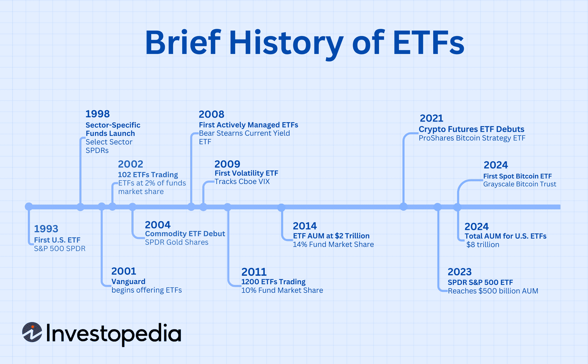

## Table of Contents

## What is an Exchange-Traded Fund (ETF)?

An Exchange-Traded Fund (ETF) is like a basket that holds a bunch of different investments, like stocks, bonds, or commodities. You can buy and sell this basket on a stock exchange, just like you would with a single stock. ETFs are popular because they let you invest in a lot of things at once, which can help spread out your risk.

Think of an ETF as a way to own a little piece of many companies or assets without having to buy each one separately. For example, if you want to invest in the biggest tech companies, you can buy an ETF that includes stocks from companies like Apple, Microsoft, and Google. This makes it easier and often cheaper than buying each stock on your own.

## When were the first ETFs introduced?

The first ETF was introduced in Canada in 1990. It was called the Toronto Index Participation Fund (TIPs), and it was designed to track the performance of the Toronto Stock Exchange (TSE) 35 Index. This was a big deal because it gave investors an easy way to invest in a bunch of Canadian companies all at once.

A few years later, in 1993, the United States got its first [ETF](/wiki/etf-trading-strategies). It was called the SPDR S&P 500 ETF Trust, often known as the "Spider." This ETF tracked the S&P 500 Index, which includes 500 of the biggest companies in the U.S. The introduction of this ETF helped make ETFs really popular in the U.S. and around the world.

## Who created the first ETF and where was it launched?

The first ETF was created by the Toronto Stock Exchange (TSE). It was launched in Canada in 1990 and was called the Toronto Index Participation Fund (TIPs). The goal was to make it easier for people to invest in the biggest companies listed on the TSE by tracking the TSE 35 Index.

A few years later, in 1993, the first ETF in the United States was created by State Street Global Advisors. It was called the SPDR S&P 500 ETF Trust, often known as the "Spider." This ETF tracked the S&P 500 Index, which includes 500 of the largest U.S. companies. The launch of this ETF helped make ETFs very popular in the U.S. and around the world.

## How have ETFs evolved since their inception?

Since the first ETF was launched in 1990, ETFs have grown a lot and changed in many ways. At first, ETFs were mostly used to track big stock indexes like the S&P 500 or the TSE 35. But over time, people started making ETFs for all sorts of things. Now, you can find ETFs that focus on specific industries, like tech or healthcare, or even ones that invest in things like gold or real estate. This means investors have a lot more choices and can use ETFs to build a very specific kind of investment plan.

Another big change is how ETFs are used. In the beginning, ETFs were mostly for people who wanted to invest in a broad market without [picking](/wiki/asset-class-picking) individual stocks. But now, they're used by all kinds of investors, from people saving for retirement to big institutions like pension funds. ETFs have also become a lot cheaper to own. The fees you pay to invest in an ETF have gone down a lot, making them a more affordable option for everyone. This has helped make ETFs super popular, with trillions of dollars invested in them around the world.

## What were the key milestones in the development of ETFs?

The journey of ETFs started in 1990 when the Toronto Stock Exchange launched the first ETF, called the Toronto Index Participation Fund (TIPs). This ETF was designed to track the TSE 35 Index, making it easier for people to invest in a bunch of big Canadian companies all at once. A few years later, in 1993, the first U.S. ETF was introduced by State Street Global Advisors. It was called the SPDR S&P 500 ETF Trust, or the "Spider," and it tracked the S&P 500 Index. This was a big deal because it helped make ETFs popular in the U.S. and around the world.

As time went on, ETFs grew and changed a lot. In the early 2000s, new types of ETFs started to appear. These included ETFs that focused on specific industries, like tech or healthcare, and even ones that invested in things like gold or real estate. This gave investors more choices and helped them build more specific investment plans. ETFs also became cheaper to own, with lower fees making them more affordable for everyone. By the 2010s, ETFs had become a huge part of the investment world, with trillions of dollars invested in them globally.

## What types of ETFs exist and how have they diversified over time?

ETFs have grown a lot since they first started. At first, ETFs were mostly about tracking big stock indexes like the S&P 500 or the TSE 35. These are called broad market ETFs, and they let people invest in a wide range of companies without having to pick each one. But as time went on, people started making more specific kinds of ETFs. Now, you can find ETFs that focus on certain industries, like tech or healthcare. There are also ETFs that invest in things like gold or real estate, which are called commodity ETFs and real estate ETFs.

Another type of ETF that has become popular is the bond ETF. These ETFs invest in bonds, which are like loans to companies or governments, and they can help people earn steady income. There are also international ETFs, which let people invest in companies from other countries, and even ETFs that focus on certain themes, like environmental sustainability or social responsibility. These are called thematic ETFs. All these different types of ETFs have made it easier for people to build very specific investment plans that match their goals and values.

Over time, ETFs have become more diverse and flexible. They've gone from just tracking big stock indexes to covering all sorts of investments and themes. This has made ETFs a go-to choice for all kinds of investors, from people saving for retirement to big institutions like pension funds. The growth and variety of ETFs show how they've become a key part of the investment world.

## How has the regulatory environment for ETFs changed historically?

When ETFs first started, there weren't many rules about them. The first ETF in Canada in 1990 and the first U.S. ETF in 1993 didn't have a lot of specific regulations. They were treated a bit like mutual funds, but over time, as more people started using ETFs, regulators realized they needed clearer rules. In the U.S., the Securities and Exchange Commission (SEC) started paying more attention to ETFs. They wanted to make sure ETFs were safe for investors and that people understood what they were buying.

By the early 2000s, the SEC had created some specific rules for ETFs. These rules made it easier for companies to start new ETFs and helped make sure they were following the law. As ETFs became more popular and diverse, regulators around the world started making more detailed rules. They wanted to make sure that all the different types of ETFs, like those investing in commodities or international stocks, were safe and transparent. Today, the regulatory environment for ETFs is much stricter and more detailed than when they first started, but it helps keep investors safe and makes sure ETFs are a reliable investment option.

## What impact have ETFs had on the financial markets and investment strategies?

ETFs have had a big impact on the financial markets and how people invest their money. They've made it easier for people to invest in a lot of different things all at once, like stocks, bonds, or even gold. This means people can spread out their risk without having to pick each investment one by one. ETFs have also made investing cheaper because the fees are often lower than other types of investments. This has helped more people get into investing, which has made the financial markets bigger and more active.

Another way ETFs have changed things is by making the markets more liquid. This means it's easier to buy and sell investments quickly because so many people are using ETFs. This can help keep the prices of investments more stable. ETFs have also led to new investment strategies, like using them to bet on specific industries or themes, like technology or green energy. This has given investors more ways to match their investments with their goals and values, making the whole investment world more flexible and interesting.

## How have technological advancements influenced the growth and management of ETFs?

Technological advancements have made a big difference in how ETFs grow and are managed. One big change is that computers and the internet have made it easier for people to buy and sell ETFs. Now, you can do it all online without having to call a broker or go to a bank. This has helped more people start investing in ETFs, which has made the market bigger. Also, technology has helped make ETFs cheaper to run. Companies can use computers to manage the investments inside an ETF more efficiently, which means they can charge lower fees to investors.

Another way technology has helped is by making it easier to create new kinds of ETFs. With better data and computer power, companies can make ETFs that focus on very specific things, like certain industries or even environmental themes. This has given investors more choices and made investing more interesting. Technology also helps keep everything running smoothly. For example, computers can quickly adjust the investments in an ETF to make sure it stays true to what it's supposed to track, like a stock index. This makes ETFs more reliable and easier to manage.

## What are some of the major challenges faced by the ETF industry historically?

One of the big challenges the ETF industry has faced is getting people to understand what ETFs are and how they work. When ETFs first started, a lot of people didn't know about them or were confused about how they were different from other investments like mutual funds. It took time for companies to explain ETFs to investors and show them how they could be a good way to invest. Another challenge was making sure ETFs were safe and reliable. As more types of ETFs came out, like those investing in commodities or international stocks, regulators had to make new rules to keep everything in check and make sure investors weren't taking on too much risk.

Another challenge has been keeping costs down. When ETFs first started, the fees were higher because it was more expensive to manage them. But as more people started using ETFs, companies had to find ways to make them cheaper to attract more investors. This meant using technology to manage ETFs more efficiently and competing with other companies to offer the lowest fees. Finally, the ETF industry has also had to deal with market changes and economic downturns. During times like the 2008 financial crisis, ETFs had to prove they could handle big swings in the market and still be a good investment option for people.

## How do ETFs compare to mutual funds in terms of historical performance and popularity?

ETFs and mutual funds have both been popular ways to invest, but they've had different paths over time. ETFs started to become really popular in the late 1990s and early 2000s, especially after the first U.S. ETF, the SPDR S&P 500 ETF Trust, was launched in 1993. People liked ETFs because they were often cheaper to own and easier to buy and sell during the day, just like stocks. Over the years, ETFs have grown a lot, and now they manage trillions of dollars. They've become a favorite for investors who want to spread their money across a lot of different investments without picking each one themselves.

Mutual funds, on the other hand, have been around for a lot longer and were the go-to choice for many investors before ETFs came along. They were popular because they let people invest in a bunch of stocks or bonds all at once, managed by professionals. But mutual funds often had higher fees and could only be bought or sold at the end of the trading day. Over time, as ETFs became more popular and cheaper, some people started moving their money from mutual funds to ETFs. Still, mutual funds remain a big part of the investment world, especially for people who want professional management and are okay with the higher costs.

In terms of performance, both ETFs and mutual funds can do well, but it depends on what they're investing in and how they're managed. ETFs that track broad market indexes, like the S&P 500, often have similar performance to mutual funds that do the same thing. But because ETFs usually have lower fees, they might give investors a bit more money in the end. On the other hand, actively managed mutual funds, where a professional picks the investments, can sometimes beat the market, but they also come with higher costs. So, the choice between ETFs and mutual funds often comes down to what an investor is looking for in terms of cost, flexibility, and management style.

## What future trends are anticipated for ETFs based on historical patterns?

Looking at how ETFs have grown and changed over the years, it seems like they will keep getting more popular and diverse. More people are learning about ETFs and how they can help spread out their investments without picking each one by themselves. This means more money will likely flow into ETFs, making them an even bigger part of the investment world. Also, as technology keeps getting better, it will be easier and cheaper to create new kinds of ETFs. We might see more ETFs that focus on very specific things, like new industries or even social causes, giving investors even more choices.

Another trend we might see is ETFs becoming even more global. As more countries start using ETFs, they could become a big way for people to invest in different parts of the world. This could help make the investment world more connected and give people more ways to spread their money around. At the same time, regulators will probably keep making new rules to make sure ETFs stay safe and fair for everyone. This will help keep investors confident in ETFs and make them a reliable choice for the future.

## References & Further Reading

[1]: ["The Future of Exchange-Traded Funds (ETFs)"](https://www.morningstar.com/funds/what-is-an-etf-morningstars-etf-guide) by Richard Loth, Journal of Accountancy, February 2019.

[2]: ["The Economics of Exchange Traded Funds"](https://www.investopedia.com/articles/01/082901.asp) by Mordecai Kurz, CFA Institute, 2016.

[3]: "High-Frequency Trading: A Practical Guide to Algorithmic Strategies and Trading Systems" by Irene Aldridge and Steve Krawciw.

[4]: "Trading and Exchanges: Market Microstructure for Practitioners" by Larry Harris.

[5]: ["The Herfindahl-Hirschman Index as a Decision Guide to Antitrust Actions"](https://www.investopedia.com/terms/h/hhi.asp) by Robert F. Lanzillotti, Springer. 

[6]: ["The Physics of Wall Street: A Brief History of Predicting the Unpredictable"](https://www.amazon.com/Physics-Wall-Street-Predicting-Unpredictable/dp/0547317271) by James Owen Weatherall. 

[7]: "Algorithmic Trading and DMA: An Introduction to Direct Access Trading Strategies" by Barry Johnson.

[8]: ["Are ETFs replacing index funds?"](https://www.fidelity.com/learning-center/smart-money/etf-vs-index-fund) by BlackRock.