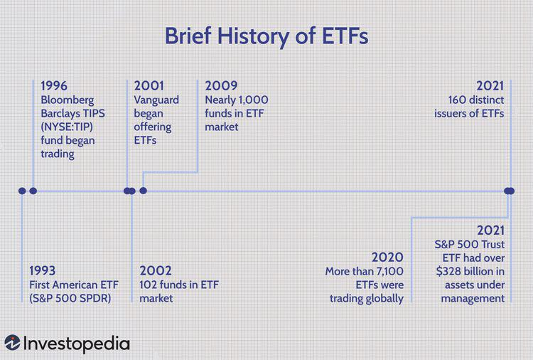

Modern investing has been profoundly transformed by the advent of Exchange-Traded Funds (ETFs) and algorithmic trading. These developments have redefined how individuals and institutions engage with financial markets across the globe. ETFs have emerged as a pivotal innovation, offering investors an efficient way to access a broad spectrum of asset classes with the ease and flexibility associated with trading stocks. Compared to traditional mutual funds, ETFs present compelling advantages, including lower management fees, intraday trading capabilities, and tax efficiencies, making them an attractive choice for contemporary investment strategies.

The rise of ETFs has facilitated a shift towards a more accessible and diverse investment landscape, allowing both retail and institutional investors to craft portfolios that could track market indices or align with thematic interests such as technology, sustainable investing, or emerging markets. The proliferation of ETFs has also expanded the toolkit available for market participants aiming to optimize their exposure to different economic sectors and geographic regions.



Parallel to the growth of ETFs, algorithmic trading has capitalized on leaps in technology to overhaul trading operations on a global scale. This method leverages complex algorithms and computational power to execute trades with remarkable speed and precision, reshaping the fabric of trading dynamics. Initially focused on achieving high-frequency trading success through minimal time arbitrage opportunities, algorithmic trading has evolved to encompass more sophisticated strategies. These include portfolio optimization, risk management, and liquidity provisioning, making it a vital component of modern financial ecosystems.

Understanding the trajectory of ETFs and algorithmic trading provides key insights into current market trends. Their development not only highlights the ongoing evolution of investment tools but also suggests potential future advances in trading and investment methodologies. As technology continues to evolve, so too will the opportunities for innovation within these spheres, offering a glimpse into the future possibilities of financial markets.

By exploring the intricate histories of ETFs and algorithmic trading, we gain a deeper comprehension of their impact and their intertwined roles within today's investment landscape. Through this narrative, we aim to uncover how these innovations have and will continue to shape the financial world, suggesting a trajectory of increased democratization and sophistication in market participation.

## Table of Contents

## The Birth and Rise of Exchange-Traded Funds (ETFs)

Exchange-Traded Funds (ETFs) emerged as a breakthrough in the financial market landscape towards the end of the 20th century. They serve as an innovative financial instrument allowing individuals to invest in index funds but with the flexibility and convenience of trading like stocks. This seamless blend of mutual fund diversification and real-time tradability has been pivotal in drawing investors to ETFs.

The origins of ETFs trace back to 1990, with the introduction of the first [ETF](/wiki/etf-trading-strategies) in Canada. Known as the Toronto Index Participation Shares (TIPS 35), this ETF offered Canadian investors a straightforward pathway to invest in the largest stocks on the Toronto Stock Exchange. Following this introduction, the United States welcomed its first ETF in 1993, the SPDR S&P 500 ETF Trust (SPY), which offered exposure to the S&P 500 index. This marked a major milestone in the investment landscape, introducing a product that rapidly gained recognition and popularity among U.S. investors.

Initially, ETFs experienced sluggish market adoption, characterized by minimal trading activity. However, as investors began to recognize their cost-effectiveness and unparalleled trading flexibility, ETFs began to gain traction in the early 21st century. They offered investors access to a diverse range of asset classes, including equities, bonds, and commodities, at lower fees compared to traditional mutual funds. The ability to buy and sell these funds throughout the trading day at market prices—as opposed to mutual funds, which are priced at the end of the day—added another layer of appeal.

Over time, ETFs evolved beyond their original purpose of merely tracking indices. Investors can now access ETFs that offer targeted exposure to niche markets such as real estate, environment-friendly sectors, and even cryptocurrencies. This expansion also includes thematic investments, which allow investors to focus on specific trends or sectors, like technology or healthcare.

The trajectory of ETFs' popularity and success is best illustrated through their exponential growth in both the number of available funds and the assets under management (AUM) globally. According to data from the Investment Company Institute, the global ETF industry has witnessed exponential growth since the early 2000s, with assets under management reaching over $7 trillion by 2020. This reflects not only the increasing number of ETFs but also the deepening trust investors have placed in these financial instruments. As ETFs continue to grow and adapt, they remain at the forefront of innovation within the investment industry, constantly reshaping how assets can be allocated and managed.

## Key Milestones in ETF Development

Exchange-Traded Funds (ETFs) have undergone significant developments since their inception, marked by key milestones that have expanded their scope and utility in the financial sector. The introduction of bond ETFs in 2002 was a notable advancement, opening pathways for more diversified investment portfolios that include fixed-income securities. This innovation allowed investors to gain exposure to [interest rate](/wiki/interest-rate-trading-strategies) movements and credit markets with the same ease and cost-effectiveness as equity ETFs.

In 2004, the launch of commodity ETFs further broadened the investment spectrum by allowing exposure to physical commodities like gold, silver, and oil. These products provided a mechanism for investors to hedge against inflation and diversify beyond traditional asset classes. Following this, ETFs expanded to include currencies and [volatility](/wiki/volatility-trading-strategies) products, offering tools for sophisticated risk management and portfolio hedging strategies.

The 2000s also witnessed the advent of leveraged and inverse ETF products, which enable investors to amplify their exposure to certain index movements or profit from market declines. These products are designed to achieve multiples of the daily performance of the underlying indices, presenting opportunities for advanced trading strategies like short selling and [arbitrage](/wiki/arbitrage).

The financial crisis of 2008-2009 underscored the robustness of ETFs. Despite market turmoil, ETFs maintained [liquidity](/wiki/liquidity-risk-premium) and transparency, providing investors with continued access to the markets. In response to the crisis, regulatory bodies imposed improvements, enhancing ETF structures and disclosures to ensure they could handle increased trading volumes and complex transactions.

Recent years have seen the emergence of [ESG](/wiki/esg-investing) (Environmental, Social, and Governance)-focused ETFs, aligning with growing demand for sustainable and ethical investing. ESG ETFs integrate environmental, social, and governance criteria into the investment process, appealing to investors seeking to make positive societal impacts alongside achieving financial returns.

The landscape of ETFs now also embraces [cryptocurrency](/wiki/cryptocurrency)-linked ETFs, introducing digital assets like Bitcoin into mainstream portfolios. These ETFs facilitate investor access to the volatile yet promising cryptocurrency markets, reflecting an evolving era in financial innovation aimed at meeting diverse investor preferences and risk appetites.

The continuous evolution of ETFs highlights their dynamic nature and their ability to adapt to new market environments and investor demands, thus playing a pivotal role in modern finance.

## The Emergence of Algorithmic Trading

Algorithmic trading, commonly referred to as algo trading, materialized in the late 20th century as a result of advancements in computer technology and the establishment of electronic trading systems. This innovative form of trading employs complex algorithms and mathematical models to conduct trades at speeds that far exceed human capabilities, making up a substantial portion of the activity on major exchanges.

The initial strategies in [algorithmic trading](/wiki/algorithmic-trading) were centered around low latency and high-frequency trading ([HFT](/wiki/high-frequency-trading-strategies)). In these strategies, speed is of paramount importance, as it allows traders to capitalize on small arbitrage opportunities that arise due to price discrepancies in the market. The ability to execute thousands of trades per second enables traders to generate profits from market inefficiencies that occur over the shortest time frames.

As algorithmic trading evolved, it expanded beyond simple high-frequency strategies. Today, it is extensively used by institutional traders, such as hedge funds and investment banks, to execute large orders that would otherwise impact market prices if placed manually. These institutions leverage algorithms to fragment large orders into smaller ones and execute them systematically to minimize market impact and optimize execution costs. Additionally, algorithmic trading is utilized in portfolio management, assisting in the automatic rebalancing of portfolios and risk management.

The continuous increase in computational power over the years has further propelled advances in algorithmic trading. Recent developments in [machine learning](/wiki/machine-learning) and [artificial intelligence](/wiki/ai-artificial-intelligence) (AI) have significantly enhanced the capabilities of trading algorithms. These technologies allow for more sophisticated pattern recognition and predictive analytics, enabling better decision-making processes. Algorithms can now analyze vast amounts of historical data to identify trends and make accurate predictions about future price movements.

Incorporating AI into trading systems also facilitates the development of adaptive algorithms that can learn from market conditions and optimize their strategies over time. Python, for example, with libraries like NumPy, pandas, and machine learning frameworks such as TensorFlow and PyTorch, provides an ideal platform for developing and implementing these advanced algorithms. A simple linear regression model in Python to predict future stock prices might look like:

```python
import numpy as np
import pandas as pd
from sklearn.linear_model import LinearRegression

# Example data containing historical prices
data = {'Date': ['2023-01-01', '2023-01-02', '2023-01-03', '2023-01-04'],
        'Price': [105, 108, 107, 110]}

df = pd.DataFrame(data)

# Feature engineering: converting dates into ordinal format
df['Date_ord'] = pd.to_datetime(df['Date']).map(pd.Timestamp.toordinal)

# Prepare features and target variable
X = df['Date_ord'].values.reshape(-1, 1)
y = df['Price'].values

# Linear regression model
model = LinearRegression()
model.fit(X, y)

# Predict future price
future_date = pd.to_datetime('2023-01-05').toordinal()
predicted_price = model.predict(np.array([[future_date]]))

print(f"Predicted price for 2023-01-05: {predicted_price[0]}")
```

In summary, the emergence of algorithmic trading has significantly changed how financial markets operate. It has led to higher market efficiency, tighter spreads, and more complex trading strategies. The ongoing integration of AI promises even greater innovations, making algorithmic trading a crucial component of modern finance.

## Impact of Algorithmic Trading on Financial Markets

Algorithmic trading has significantly altered financial markets by enhancing liquidity, narrowing bid-ask spreads, and improving the efficiency of price discovery processes. With sophisticated algorithms and real-time data analysis, trades are executed at rapid speeds, which helps in creating a more continuous and uninterrupted market flow. This has particularly been observable in the increased trading volumes and reduced transaction costs, as algorithms can perform tasks more systematically and efficiently compared to human traders.

Despite these advancements, algorithmic trading is not without its controversies. Notable events such as the 2010 Flash Crash have revealed vulnerabilities inherent in automated trading systems. The Flash Crash saw the Dow Jones Industrial Average plunge about 1,000 points within minutes, only to recover the same day. The incident was partially attributed to the installation of algorithmic trading programs that executed large volumes of trades in a short time frame, triggering a rapid cascade of selling. Such events underscore the potential of algorithms to exacerbate market volatility under certain conditions.

In response to these vulnerabilities, regulatory bodies have implemented measures to mitigate the risks associated with high-speed trading. Measures such as circuit breakers and trading curbs have been introduced to temporarily halt trading during extreme volatility, providing a cooling-off period and reducing the risk of market disruption. Further, regulatory guidance emphasizes the necessity for market participants to maintain sufficient oversight and risk management protocols when deploying algorithmic strategies.

On a positive note, algorithmic trading has democratized access to once-exclusive trading strategies. Retail investors now have the opportunity to employ complex trading tactics that were previously reserved for large financial institutions. Technological advancements have facilitated the use of automated trading platforms and robo-advisors, leveling the playing field and allowing a broader array of market participants to compete in sophisticated ways.

The interplay between regulatory developments and technological advancements continues to play a crucial role in shaping the future of algorithmic trading. As technology evolves, so too must the frameworks that govern its development and integration into the financial system. This involves ensuring robust and transparent markets that can accommodate high-frequency trading while safeguarding against systemic risks. Looking forward, the integration of artificial intelligence and machine learning with trading algorithms is poised to further revolutionize the execution speed and predictive accuracy of trades. Balancing innovation with regulation will be key to harnessing the full potential of algorithmic trading without compromising market stability or investor interests.

## The Synergy Between ETFs and Algorithmic Trading

ETFs and algorithmic trading have come to form a complementary relationship within the financial ecosystem, significantly amplifying efficiencies and opportunities. ETFs provide intraday trading capabilities and a wide range of financial instruments to investors. Their flexibility in terms of trading like stocks and diversification like mutual funds make them ideal vehicles for executing algorithmic trading strategies. Such strategies include exposure to various asset classes and thematic investments without the complexity and cost associated with traditional trading methods.

Algorithmic trading has enabled the development and execution of complex trading strategies, often involving multiple ETFs to achieve optimal portfolio construction. Through sophisticated algorithms, traders can engage in risk management and arbitrage opportunities with far greater speed and precision than manual methods. Algorithms can identify price discrepancies between ETFs quickly, capturing opportunities across markets that might otherwise be missed by human traders.

Innovations in both ETFs and algorithmic trading have led to the development of automated trading platforms and robo-advisors. These platforms are designed to leverage the benefits of both ETFs and algorithmic strategies, offering tailored investment solutions for both retail and institutional clients. By automating the decision-making process, robo-advisors can provide cost-effective and efficient access to diversified portfolios and advanced trading strategies, democratizing access to sophisticated investment tools traditionally available only to large financial institutions.

The synergy between ETFs and algorithmic trading continues to drive the growth of financial markets, creating more personalized and adaptive investment solutions. This partnership is shifting the landscape towards more dynamic market participation, allowing investors greater flexibility and innovation in line with evolving financial needs. As these sectors continue to innovate, the combination of ETFs and algorithmic trading will likely play a central role in the future of finance, enhancing market fluidity and offering more robust platforms for investment management.

## Future Outlook and Challenges

As financial markets continue to evolve in complexity and unpredictability, the future of Exchange-Traded Funds (ETFs) and algorithmic trading is set to be defined by technological advancements, robust data analytics, and adaptive regulatory frameworks. The growth trajectory of these financial tools is both promising and challenging.

ETFs are likely to expand their reach through technological innovation, which will enable enhanced tracking of broader asset classes, including emerging and frontier markets. Such expansion is contingent upon advancements in algorithmic efficiency and data processing capabilities. Similarly, algorithmic trading stands to benefit significantly from the integration of artificial intelligence (AI). AI can increase prediction accuracy and improve execution efficacy, particularly as global markets respond to rapidly shifting macroeconomic variables and geopolitical events.

Nevertheless, the proliferation of high-frequency trading (HFT) and intricate financial products presents inherent risks. These include market manipulations, flash crashes, and increased volatility, all of which can erode investor confidence. Regulatory bodies, therefore, face the task of crafting comprehensive and adaptive guidelines that balance innovation with market integrity. Developing a transparent, standardized framework is crucial to mitigate these risks. For example, regulators might look to improve the robustness of circuit breakers and scrutinize the algorithms that underpin HFT.

Python code, for example, can efficiently model some of these regulatory concerns and test different scenarios. Consider a simple model that calculates volatility spread as a function of trade frequency:

```python
import numpy as np

# Hypothetical trading data
trade_frequencies = np.arange(1, 1001, 10)  # trades per minute
market_volatility = 0.002  # base market volatility

# Function to calculate the impact of trade frequency on volatility spread
def calculate_volatility_spread(trade_freq, base_volatility):
    return base_volatility * np.sqrt(trade_freq) * 0.0001

volatility_spreads = calculate_volatility_spread(trade_frequencies, market_volatility)

# Output results
for freq, vol in zip(trade_frequencies, volatility_spreads):
    print(f"Trade Frequency: {freq} trades/minute, Volatility Spread: {vol:.6f}")
```

Empirical models like this, integrating advanced analytics with regulatory simulations, can aid in anticipating market responses, thus helping design better-guarded frameworks.

In conclusion, the dual challenge of embracing innovation while managing systemic risk is central to the future of ETFs and algorithmic trading. A nuanced understanding of these financial tools will be vital for stakeholders aiming to harness their potential while safeguarding market stability. As AI becomes more entrenched, it paves the way for unprecedented accuracy and efficiency in trading mechanisms, shaping a more resilient financial landscape. However, success will rely heavily on vigilant regulation designed to anticipate the challenges these technologies present.

## Conclusion

The intertwined histories of Exchange-Traded Funds (ETFs) and algorithmic trading highlight the transformative impact of technology on the structure and functionality of financial markets. These innovations have introduced new paradigms in investing, enabling investors to access a broader array of markets and utilize advanced trading methodologies that were previously inaccessible to the average investor. 

ETFs have allowed individuals and institutions to invest with the simplicity of stock trading while diversifying their portfolios across various asset classes and themes. Their rise reflects a shift towards cost-effective, transparent, and flexible investment solutions that appeal to a wide range of investors. Meanwhile, algorithmic trading has revolutionized market transactions through automation and data-driven strategies, facilitating faster and more efficient trade execution.

Understanding the evolution and impact of ETFs and algorithmic trading is crucial for investors and regulators as they navigate the current investing landscape. These innovations present both opportunities for gains and challenges in terms of regulation and risk management. Investors are afforded more sophisticated tools for asset management, while regulators must ensure these advancements do not compromise market stability.

The advancement of financial technology promises continued enhancements in investment mechanisms, presenting opportunities for more precise and efficient trading strategies. As artificial intelligence and machine learning increasingly integrate into trading algorithms, markets are expected to grow even more adaptive and responsive to evolving economic environments.

Ultimately, the histories and future potential of ETFs and algorithmic trading provide essential insights for participants in modern financial markets. As these tools continue to evolve, they will shape the next frontier of financial innovation, offering lessons in adaptability, strategy, and the balance between technological progress and market stability.

## References & Further Reading

[1]: ["The Future of Exchange-Traded Funds (ETFs)"](https://www.morningstar.com/funds/what-is-an-etf-morningstars-etf-guide) by Richard Loth, Journal of Accountancy, February 2019.

[2]: ["The Economics of Exchange Traded Funds"](https://www.investopedia.com/articles/01/082901.asp) by Mordecai Kurz, CFA Institute, 2016.

[3]: "High-Frequency Trading: A Practical Guide to Algorithmic Strategies and Trading Systems" by Irene Aldridge and Steve Krawciw.

[4]: "Trading and Exchanges: Market Microstructure for Practitioners" by Larry Harris.

[5]: ["The Herfindahl-Hirschman Index as a Decision Guide to Antitrust Actions"](https://www.investopedia.com/terms/h/hhi.asp) by Robert F. Lanzillotti, Springer. 

[6]: ["The Physics of Wall Street: A Brief History of Predicting the Unpredictable"](https://www.amazon.com/Physics-Wall-Street-Predicting-Unpredictable/dp/0547317271) by James Owen Weatherall. 

[7]: "Algorithmic Trading and DMA: An Introduction to Direct Access Trading Strategies" by Barry Johnson.

[8]: ["Are ETFs replacing index funds?"](https://www.fidelity.com/learning-center/smart-money/etf-vs-index-fund) by BlackRock.