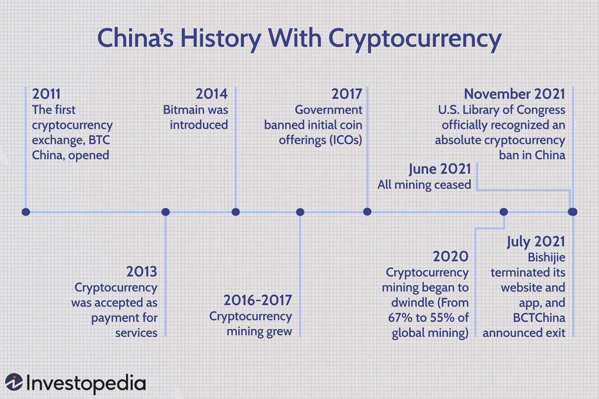

Cryptocurrency, a digital or virtual form of currency that relies on cryptographic techniques for security, has become a significant part of the modern financial landscape. Its decentralized nature, free from the control of governments or financial institutions, offers a transformative approach to how transactions are conducted and assets are stored. This innovation stems largely from the advent of Bitcoin, the first successful cryptocurrency, which emerged to address some of the long-standing issues in traditional finance, such as transaction inefficiency and the centralization of control.

Bitcoin, introduced to the world in 2008 through its whitepaper by the pseudonymous Satoshi Nakamoto, was the first cryptocurrency to effectively implement a decentralized digital ledger dubbed the blockchain. This technology not only provided transparency and security but also laid the foundation for the development of numerous other cryptocurrencies. Bitcoin's success in establishing a new form of digital cash without a centralized authority led to widespread awareness and interest in cryptocurrencies, both within the tech-savvy community and beyond.



This article focuses on Bitcoin's historical journey and its impact on cryptocurrency trading practices through the evolution of algorithmic trading. By examining Bitcoin's past, from its theoretical antecedents to its current standing as a global financial asset, we can appreciate its role in catalyzing the growth of a multi-trillion-dollar market. Key themes include a look at digital currency precursors like eCash, Hashcash, and B-Money, Bitcoin's creation and unique technological features such as the blockchain, and how algorithmic trading has evolved within this space.

Algorithmic trading, which involves using computer algorithms to execute trades based on predefined criteria, has significantly influenced the cryptocurrency market. It has improved market efficiency and liquidity, making cryptocurrencies more accessible to traditional financial institutions and investors. As a result, Bitcoin's journey is not just a narrative of technological innovation but also of economic adaptation and growth.

This introduction sets the stage for exploring Bitcoin's evolutionary path and the broader implications of algorithmic trading within cryptocurrencies. The subsequent sections will provide a detailed analysis of these themes, building a comprehensive understanding of Bitcoin’s ongoing influence in reshaping financial systems worldwide.

## Table of Contents

## The Precursors to Bitcoin

Early digital currency projects laid the groundwork for the development of Bitcoin by exploring innovative techniques for creating electronic cash systems. These pioneering attempts were crucial in shaping the technological and conceptual frameworks for cryptocurrencies. Notable among these early ventures were eCash, Hashcash, and B-Money, each contributing unique ideas and confronting significant challenges.

### eCash

Developed by cryptographer David Chaum in the 1980s, eCash was one of the first digital currency concepts that aimed to provide secure digital payments with privacy features. eCash utilized blind signatures to allow users to withdraw money from a bank and spend it anonymously. This cryptographic technique ensured unlinkability between transactions, maintaining user privacy akin to cash transactions. ECash faced several hurdles, including reliance on a central authority (a bank), which introduced issues of trust and centralization, ultimately limiting its widespread adoption.

### Hashcash

Hashcash, introduced by Adam Back in 1997, was initially designed as a proof-of-work system to combat email spam. The concept involved requiring a computationally expensive operation before accepting emails, thus reducing the ability to send unsolicited bulk messages. This approach involved solving a cryptographic puzzle which, despite being feasible for individual emails, became prohibitive for spamming. Hashcash's proof-of-work mechanism later became a foundational element of Bitcoin's mining process, demonstrating its potential beyond anti-spam measures. However, Hashcash was not intended as a currency system, and its lack of inherent economic model or network made it impractical for such applications.

### B-Money

B-Money, proposed by Wei Dai in 1998, outlined a theoretical framework for an anonymous distributed electronic cash system. B-Money emphasized privacy and the creation of money through computational work, concepts that resonated with Bitcoin's eventual design. The protocol envisioned a decentralized network where consumer trust did not rely on third parties. However, B-Money struggled with practical implementation, as it lacked detailed protocols for transaction consensus and the technology required to operate a decentralized network efficiently.

### Challenges Faced

These early digital currencies encountered several barriers, primarily revolving around scalability, trust, and adoption. ECash's dependence on centralized institutions starkly contrasted with the decentralization goals of later cryptocurrencies like Bitcoin. Hashcash, while technically influential, lacked a clear economic implementation as a currency. B-Money provided a theoretical basis for decentralization but fell short on practical algorithms and architecture to achieve consensus in a distributed environment. These challenges highlighted the need for a decentralized and resilient architecture, which Bitcoin eventually realized through its blockchain technology. 

Thus, while eCash, Hashcash, and B-Money were not successful as currencies, they collectively contributed critical ideas that informed the development of Bitcoin and the broader field of cryptocurrencies.

## The Genesis of Bitcoin

Satoshi Nakamoto, an enigmatic figure whose true identity remains unknown, laid the foundation for the Bitcoin revolution with the publication of the Bitcoin whitepaper titled "Bitcoin: A Peer-to-Peer Electronic Cash System" in 2008. This groundbreaking document proposed a decentralized digital currency system that promised to eliminate the need for traditional financial intermediaries by leveraging cryptographic principles and peer-to-peer networking.

Bitcoin's launch in January 2009 marked a pivotal moment in the financial world. Nakamoto mined the first block of Bitcoin, known as the "genesis block" or Block 0, on January 3, 2009. This block contained a unique message embedded in its coinbase parameter: "The Times 03/Jan/2009 Chancellor on brink of second bailout for banks." This inscription not only documented the date of Bitcoin's creation but also underscored Nakamoto's vision of a decentralized currency free from government control and prone to inflationary pressures.

Fundamentally, Bitcoin differed from its digital currency predecessors through the introduction of a decentralized ledger system known as the blockchain. This innovation utilized a network of nodes that collectively maintained and verified an immutable public ledger of all Bitcoin transactions. The blockchain's decentralized nature eliminated the need for a central authority, offering enhanced security and transparency.

Bitcoin employed proof-of-work (PoW) as its consensus mechanism, ensuring that network participants (miners) could validate transactions and secure the network by solving complex cryptographic puzzles. This mechanism deters malicious attacks by making it computationally expensive to alter transaction history, thereby ensuring the integrity and trustworthiness of the ledger.

Bitcoin's inception marked a transformative shift from earlier digital currency projects by addressing scalability, trust, and decentralized governance. By combining these elements, Bitcoin established itself as the first truly viable [cryptocurrency](/wiki/cryptocurrency), setting the stage for the subsequent proliferation of digital currencies and blockchain technologies.

## Bitcoin's Growth and Challenges

Bitcoin, the pioneering cryptocurrency, has experienced significant growth and encountered numerous challenges since its inception. Its early adoption was marked by key events that played a pivotal role in its journey towards becoming a global financial asset.

A notable event in Bitcoin's history is "Bitcoin Pizza Day," observed on May 22, 2010. This day commemorates the first recorded real-world transaction using Bitcoin, where a programmer named Laszlo Hanyecz paid 10,000 BTC for two pizzas. At the time, this transaction marked a breakthrough in demonstrating Bitcoin's potential as a medium of exchange. The transaction, trivial then, would be valued at an astronomical sum today, illustrating Bitcoin's tremendous appreciation over the years.

Bitcoin's nascent years were fraught with challenges, including security vulnerabilities that posed a threat to its integrity. One significant incident was the "Bitcoin network exploit" of 2010, where an anomaly in the code led to the generation of over 184 billion Bitcoins. This incident prompted urgent corrective measures by Satoshi Nakamoto and the community, highlighting vulnerabilities in the still-maturing cryptocurrency technology. The quick rectification of this issue helped restore confidence in Bitcoin's robustness.

Regulatory scrutiny emerged as another critical challenge for Bitcoin. Governments and financial institutions worldwide grappled with understanding and regulating this new digital asset. Concerns over its use in illicit activities and potential to bypass traditional financial systems led to varying regulatory approaches. Some countries embraced Bitcoin's innovation, while others imposed restrictions to mitigate risks. As a result, the regulatory landscape for Bitcoin has been dynamic and continues to evolve.

The success and growing visibility of Bitcoin inevitably led to the emergence of alternative cryptocurrencies, collectively known as altcoins. These altcoins aimed to improve upon Bitcoin's limitations or cater to different use cases. Among the most notable forks from Bitcoin is Bitcoin Cash, introduced in 2017. Bitcoin Cash was created to address concerns regarding Bitcoin's scalability by increasing the block size, thereby allowing more transactions to be processed per block. This fork highlighted ongoing debates within the cryptocurrency community about scalability and the direction of Bitcoin's development.

In conclusion, Bitcoin's growth has been marked by groundbreaking achievements and formidable challenges. Its early transactions, security issues, and regulatory hurdles have shaped its evolution. Moreover, the emergence of altcoins like Bitcoin Cash underscores the dynamic nature of the cryptocurrency ecosystem, illustrating continuous efforts to innovate and adapt in response to Bitcoin's challenges and limitations.

## The Rise of Algorithmic Trading in Cryptocurrencies

Algorithmic trading, often called algo trading, involves using computer programs to execute trades at speeds and frequencies impossible for a human trader. This form of trading was first introduced in traditional financial markets in the late 20th century. Its basic principle involves using pre-defined instructions or algorithms, which can be based on timing, price, quantity, or any mathematical model, to automate the trading process. These algorithms can identify profitable opportunities through rapid data analysis, execute orders, and manage risks with little to no human intervention.

In recent years, [algorithmic trading](/wiki/algorithmic-trading) has significantly impacted the cryptocurrency market, which is characterized by high [volatility](/wiki/volatility-trading-strategies) and 24/7 operation. The introduction of algorithmic trading in cryptocurrencies has brought several benefits, including improved market efficiency and [liquidity](/wiki/liquidity-risk-premium). Efficiency in this context refers to the market's ability to reflect information in asset prices quickly, while liquidity denotes the ease with which an asset can be bought or sold without causing significant price changes. Algorithms can quickly respond to market fluctuations, capitalize on [arbitrage](/wiki/arbitrage) opportunities, and provide continuous liquidity by ensuring that buy and sell orders are matched smoothly.

Python has become a popular language for developing trading algorithms due to its simplicity and robust libraries. Below is a basic example of a Python script to calculate a moving average crossover strategy, which is commonly used in algorithmic trading:

```python
import pandas as pd
import numpy as np
import talib

# Sample data: DataFrame assuming 'close' column contains closing prices
data = pd.DataFrame({'close': np.random.randn(100) + 100})  # Replace with real price data

# Calculate Short and Long moving averages using TA-Lib
short_window = 40
long_window = 100

data['short_ma'] = talib.SMA(data['close'], timeperiod=short_window)  # Short moving average
data['long_ma'] = talib.SMA(data['close'], timeperiod=long_window)  # Long moving average

# Signals
data['signal'] = 0
data['signal'][short_window:] = np.where(data['short_ma'][short_window:] > data['long_ma'][short_window:], 1, 0)
data['positions'] = data['signal'].diff()

# Display the data with moving averages and positions
print(data)
```

This example demonstrates a simple strategy where a buy signal is generated when the short-term moving average crosses above the long-term moving average, indicating potential bullish [momentum](/wiki/momentum).

Current trends in algorithmic trading specific to Bitcoin and other cryptocurrencies involve the use of [machine learning](/wiki/machine-learning) algorithms, which can recognize patterns and predict market trends more efficiently. Techniques like natural language processing (NLP) are being employed to gauge market sentiment from social media and news sources. High-frequency trading ([HFT](/wiki/high-frequency-trading-strategies)), initially popular in stock markets, is now making its way into cryptocurrency markets. Although the decentralized and fragmented nature of crypto trading venues presents challenges, the potential for profit is significant.

Moreover, the development of cryptocurrency derivatives and futures markets has further facilitated algorithmic trading by offering more complex financial instruments. Although algorithmic trading imposes substantial initial development costs and demands rigorous [backtesting](/wiki/backtesting) and optimization, its role in enhancing market dynamics and contributing to the maturation of cryptocurrency markets is indisputable.

## Bitcoin in the Modern Era

Bitcoin, initially perceived as a niche technology, has grown significantly to become an integral part of the modern financial landscape. Its adoption by mainstream financial entities and recognition as a store of value signify a pivotal shift in how Bitcoin is perceived globally.

One of the critical factors contributing to Bitcoin's evolution into a mainstream asset is its adoption by financial institutions and corporations. High-profile companies, such as Tesla and MicroStrategy, have invested substantial amounts into Bitcoin, thus validating its position as a valuable asset. Institutional investments have brought legitimacy to Bitcoin, signaling trust in its stability and potential for future appreciation.

Moreover, regulatory changes have played a crucial role in shaping Bitcoin's modern-day status. While some countries are still grappling with how to regulate cryptocurrencies, others have embraced them with supportive regulations. For example, the United States has seen considerable movement towards regulatory clarity, with the Securities and Exchange Commission (SEC) exploring the introduction of Bitcoin exchange-traded funds (ETFs). In 2021, the approval of a Bitcoin futures [ETF](/wiki/etf-trading-strategies) marked a significant milestone, allowing investors to gain exposure to Bitcoin without directly holding the cryptocurrency. This development is likely to increase institutional interest and investment in Bitcoin, further cementing its role in the financial ecosystem.

Bitcoin's position as a store of value comparable to gold is reinforced by its technological attributes, such as scarcity and security. With a capped supply of 21 million coins, Bitcoin offers protection against inflation, which is particularly appealing amidst concerns over fiat currency devaluation due to monetary policy actions by central banks around the world.

In today's dynamic economic landscape, Bitcoin also serves various roles. It functions as a medium of exchange in certain markets, though its use is limited compared to traditional currencies due to transaction speed and fee constraints. Nevertheless, ongoing technological advancements, including the Lightning Network, aim to address these issues by enabling faster and cheaper transactions, enhancing Bitcoin's usability for everyday transactions.

Bitcoin's growing popularity is further bolstered by advancements in blockchain technology, which underpins its operation. Blockchain's transparency, security, and decentralization have spurred innovation across sectors beyond finance, demonstrating Bitcoin's influence on wider technological advancements.

Despite the progress, Bitcoin faces continuous scrutiny and challenges, particularly around environmental concerns related to energy-intensive mining processes and regulatory ambiguity in various jurisdictions. These issues highlight the ongoing need for innovation and dialogue among stakeholders to ensure that Bitcoin's growth aligns with global sustainability goals.

In summary, Bitcoin in the modern era is characterized by its increased adoption by financial institutions, recognition as a store of value, and a pivotal role in the economy amidst technological advancements and evolving market dynamics. Its progression is a testament to its significant impact on the global financial landscape.

## Conclusion

Bitcoin has traversed a remarkable journey from its inception as a groundbreaking idea to becoming a global financial asset. Initially introduced by the pseudonymous Satoshi Nakamoto in 2008, Bitcoin presented a novel concept—a decentralized digital currency operating on a peer-to-peer network without the need for intermediaries. This innovative approach to money challenged traditional financial systems and proposed a new way of transacting securely and anonymously over the internet.

The evolution of cryptocurrency trading, specifically the rise of algorithmic trading, has played a pivotal role in Bitcoin's journey. Algorithmic trading uses computer programs to execute trades at speeds and frequencies that would be impossible for a human trader. This shift towards automation and the incorporation of [artificial intelligence](/wiki/ai-artificial-intelligence) (AI) have enhanced market efficiency, provided liquidity, and opened new trading opportunities in the cryptocurrency market. AI's ability to analyze vast datasets quickly and identify trading patterns and market conditions has further revolutionized Bitcoin trading, allowing for more sophisticated and dynamic strategies.

Looking forward, the future of Bitcoin and cryptocurrencies in the financial ecosystem seems increasingly promising yet complex. As mainstream financial institutions begin to recognize Bitcoin as a store of value, it continues to gain legitimacy. The introduction of Bitcoin Exchange-Traded Funds (ETFs) and growing institutional investments reflect its integration into the broader financial market. However, regulatory challenges remain a critical aspect of its ongoing evolution. The global regulatory landscape is continually evolving, often struggling to keep pace with technological advancements and market dynamics. Striking a balance between fostering innovation and ensuring investor protection will be essential for Bitcoin's sustained growth and acceptance.

Furthermore, as technological advancements continue, Bitcoin and other cryptocurrencies may play a more integral role in the digital economy. The rise of decentralized finance (DeFi) and blockchain-based applications suggests a future where cryptocurrencies are not only seen as assets but also as essential components of financial systems. Bitcoin's ability to adapt and its decentralized nature will likely keep it at the forefront of this revolution.

In conclusion, Bitcoin's journey from an innovative idea to a global financial asset underscores the transformative power of cryptocurrency. As algorithmic trading and AI continue to drive the evolution of cryptocurrency trading, and as regulatory frameworks adapt, Bitcoin's role in the financial ecosystem will evolve. Its future, while uncertain, holds the potential to reshape financial systems and introduce new paradigms of money and commerce.

## FAQs

### What were the key attempts at digital currency before Bitcoin?

Before Bitcoin, several digital currency projects laid the groundwork for the development of cryptocurrencies. Notable among these were:

1. **eCash**: Proposed by David Chaum in the 1980s, eCash was one of the earliest electronic money systems that aimed to enable secure and anonymous transactions. It used cryptographic protocols to ensure privacy but struggled with scalability and adoption due to the technological limitations of the time.

2. **Hashcash**: Introduced by Adam Back in 1997, Hashcash initially targeted the reduction of email spam through a proof-of-work system. Although it wasn't a digital currency per se, the proof-of-work concept formed a crucial component of Bitcoin’s algorithm for verifying transactions.

3. **B-Money**: Wei Dai's B-Money, proposed in the late 1990s, was a concept for a distributed digital currency. It proposed the use of a ledger system maintained by anonymous nodes, a precursor to the blockchain system used in Bitcoin.

### Who is Satoshi Nakamoto?

Satoshi Nakamoto is the pseudonymous individual or group credited with the creation of Bitcoin. Nakamoto introduced Bitcoin to the world in 2008 by publishing the Bitcoin whitepaper titled "Bitcoin: A Peer-to-Peer Electronic Cash System." In 2009, they released the first Bitcoin software that launched the network and mined the first block, known as the "genesis block." Despite extensive speculation and investigations, the true identity of Satoshi Nakamoto remains unknown, and they have not communicated publicly since 2010.

### How has algorithmic trading affected the cryptocurrency market?

Algorithmic trading involves using computer algorithms to automate trading decisions, typically based on predefined criteria. In the cryptocurrency market, algorithmic trading has significantly impacted:

- **Efficiency**: Algorithms can execute trades at high speeds and volumes, enhancing market efficiency by narrowing bid-ask spreads and increasing liquidity.

- **Liquidity**: With algorithms handling large transaction volumes, liquidity in cryptocurrency markets has improved, facilitating easier and faster exchanges of assets.

- **Market Dynamics**: Algorithmic trading contributes to the complexity and dynamism of the market, with strategies such as high-frequency trading and arbitrage playing crucial roles. This has brought about a more sophisticated trading ecosystem in cryptocurrencies.

### What are the most significant challenges that Bitcoin has faced in its history?

Bitcoin has faced several challenges throughout its development:

- **Security Issues**: Bitcoin has been the target of numerous cyber-attacks, including exchange hacks and frauds. The Mt. Gox collapse in 2014 was a notable event where nearly 850,000 Bitcoins were stolen, leading to widespread concerns about security.

- **Regulatory Scrutiny**: Bitcoin’s decentralized and anonymous nature has often brought it under regulatory scrutiny. Governments have grappled with issues ranging from money laundering risks to investor protection and taxation.

- **Technical Scalability**: As Bitcoin’s user base has grown, so too have the challenges related to scalability. The network's capacity limitations have led to increased transaction times and fees, sparking debates and forks aimed at improving efficiency.

### How is Bitcoin regulated globally today?

Bitcoin's regulatory status varies significantly across the globe, largely reflecting differing governmental approaches to cryptocurrencies:

- **United States**: Bitcoin is considered a commodity by the Commodity Futures Trading Commission (CFTC) and is subject to anti-money laundering regulations under the Bank Secrecy Act. State-level licenses also apply, like the BitLicense in New York.

- **European Union**: The EU has taken strides toward regulatory clarity with measures like the Markets in Crypto-Assets (MiCA) legislative framework, aiming for a consistent approach across member states.

- **China**: Regulations are strict, with blanket bans on crypto exchanges and initial coin offerings (ICOs). However, China permits Bitcoin ownership and private trading.

- **Japan**: Bitcoin is recognized as legal tender and is subject to regulations that ensure proper business conduct and security for customer assets.

Despite regulatory challenges, Bitcoin continues to be adopted in various jurisdictions, reflecting its growing significance and the evolving global regulatory landscape.

## References & Further Reading

[1]: Nakamoto, S. (2008). ["Bitcoin: A Peer-to-Peer Electronic Cash System."](https://nakamotoinstitute.org/library/bitcoin/)

[2]: Chaum, D. (1983). ["Blind Signatures for Untraceable Payments."](https://link.springer.com/chapter/10.1007/978-1-4757-0602-4_18) Advances in Cryptology: Proceedings of CRYPTO '82.

[3]: Back, A. (2002). ["Hashcash - A Denial of Service Counter-Measure."](http://www.hashcash.org/papers/hashcash.pdf)

[4]: Dai, W. (1998). ["B-Money."](https://nakamotoinstitute.org/library/b-money/)

[5]: Narayanan, A., Bonneau, J., Felten, E., Miller, A., & Goldfeder, S. (2016). ["Bitcoin and Cryptocurrency Technologies."](https://press.princeton.edu/books/hardcover/9780691171692/bitcoin-and-cryptocurrency-technologies) Princeton University Press.

[6]: Antonopoulos, A. M. (2017). ["Mastering Bitcoin: Unlocking Digital Cryptocurrencies."](https://books.google.com/books/about/Mastering_Bitcoin.html?id=IXmrBQAAQBAJ) O'Reilly Media.

[7]: Lopez de Prado, M. (2018). ["Advances in Financial Machine Learning."](https://www.amazon.com/Advances-Financial-Machine-Learning-Marcos/dp/1119482089) Wiley.

[8]: Chan, E. P. (2009). ["Quantitative Trading: How to Build Your Own Algorithmic Trading Business."](https://github.com/ftvision/quant_trading_echan_book) Wiley.

[9]: Jansen, S. (2020). ["Machine Learning for Algorithmic Trading."](https://github.com/stefan-jansen/machine-learning-for-trading) Packt Publishing.

[10]: Lewis, A. (2018). ["The Basics of Bitcoins and Blockchains: An Introduction to Cryptocurrencies and the Technology that Powers Them."](https://dl.acm.org/doi/10.5555/3299472) Mango Publishing.