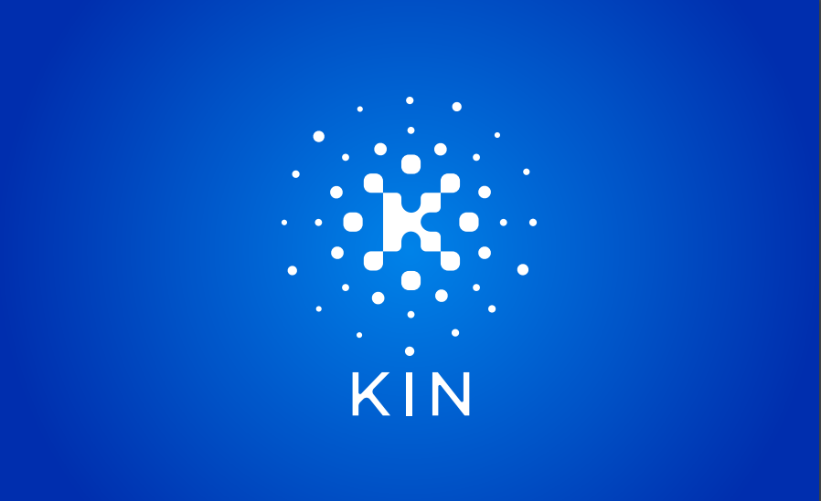

Digital currencies have significantly evolved since their inception, fundamentally altering traditional financial systems and introducing new paradigms for transactions and value storage. The genesis of cryptocurrencies began with Bitcoin, introduced in 2009 by the pseudonymous entity Satoshi Nakamoto. Bitcoin's decentralized ledger technology and proof-of-work algorithm laid the groundwork for a vast array of digital currencies that followed. Over the years, these currencies have developed varied functionalities and applications, heralding a new era in the global financial landscape.

Kin, one of the numerous cryptocurrencies that emerged, represents a pivotal development in the growing digital economy. Created by Kik Interactive, Kin aims to facilitate transactions within digital ecosystems, specifically catering to social media platforms and other online communities. Unlike traditional currencies, Kin is designed to be the native currency of a vibrant digital user economy, enabling seamless micropayments, rewards, and decentralized application services. Its rise underscores the increasing importance of digital currencies to foster and sustain economic interactions online.



Understanding the history and future trajectories of cryptocurrencies is crucial for comprehending their potential impact on global finance. The transition from Bitcoin’s first block to the diverse ecosystem of digital currencies today showcases significant technological and ideological advancements. While the volatility and evolving nature of these currencies pose challenges, they also provide unique opportunities for financial inclusion, innovation, and redefining digital economies.

Algorithmic trading has emerged as a transformative force in the cryptocurrency market, leveraging complex algorithms to automate trading decisions. This method of trading has enhanced liquidity, reduced transaction costs, and improved market efficiency, although it also brings potential risks such as increased volatility and systemic risks during periods of market stress. As digital currencies continue to gain traction, algorithmic trading strategies will play an increasingly important role in shaping market dynamics and investor experiences.

The exploration of Kin's journey and its future prospects must consider these trends and innovations within the broader cryptocurrency landscape. As stakeholders look forward to a more interconnected and technologically advanced financial future, Kin's development offers insights into how digital currencies can revolutionize economic interactions and growth.

## Table of Contents

## Understanding Kin Cryptocurrency

Kin cryptocurrency was developed by Kik Interactive, a company originally established to create a messaging application. It was introduced in 2017 through an Initial Coin Offering (ICO) that aimed to integrate cryptocurrency within the social app environment, enabling users to earn and spend digital assets directly within the Kik platform. This initiative laid a foundation for Kin as a digital currency designed for the social media ecosystem, fostering new methods of digital interaction, monetization, and user engagement.

At its core, Kin is built on the Solana blockchain, recognized for its scalability and low transaction costs. Previously, Kin operated on Ethereum but migrated to Solana to optimize performance and reduce the high fees associated with Ethereum’s network. This migration allowed Kin to leverage Solana's throughput of thousands of transactions per second, enabling microtransactions crucial for extensive social media ecosystems. Kin’s blockchain design supports a decentralized digital economy where developers can create applications that integrate the currency, facilitating peer-to-peer transactions and content monetization within digital communities.

Kin's primary intended use case is fostering decentralized digital economies among online communities. It provides a method for app developers and users to reward meaningful engagement, content creation, and participation within social networks. This fosters a symbiotic environment that enhances digital experiences, offering value for both content creators and consumers. For instance, users can earn Kin tokens for activities like watching advertisements, contributing high-quality content, or attracting new participants, thereby cementing its role as a currency within digital platforms.

Adoption of Kin has seen varied success across different platforms. Initially, Kin was integrated within the Kik messaging app, providing an experimental platform for its implementation. Over time, the Kin ecosystem has expanded, with numerous independent applications adopting the currency for diverse purposes, including gaming, social media, and charitable contributions. This wider adoption across digital platforms indicates potential for growth, as the [cryptocurrency](/wiki/cryptocurrency) provides a versatile financial tool for embedding within numerous types of online interactions.

Despite its innovations, the Kin cryptocurrency has faced significant challenges in the market. Regulatory scrutiny emerged after the U.S. Securities and Exchange Commission (SEC) argued that Kin's ICO constituted an unregistered securities offering. The ensuing legal battle resulted in increased compliance demands and market skepticism regarding its broader viability. Additionally, as a digital asset, Kin must contend with the inherent [volatility](/wiki/volatility-trading-strategies) and speculative nature of cryptocurrency markets, posing challenges for mainstream adoption and stable economic integration.

Overall, Kin presents a unique case study within the digital currency landscape, showcasing the potential for cryptocurrencies to redefine economic interactions within online communities, even as they contend with regulatory, technical, and market-based challenges.

## The History of Cryptocurrencies

Bitcoin, launched in 2009 by the pseudonymous Satoshi Nakamoto, marked a revolutionary point in global finance. As the first decentralized digital currency, Bitcoin introduced the concept of blockchain technology—a decentralized ledger system that records transactions across a network of computers, ensuring transparency, security, and immutability \[1\]. This innovation sparked the birth of a new financial paradigm, challenging traditional banking systems and enabling peer-to-peer transactions without the need for a central authority.

Since Bitcoin's inception, several key milestones have shaped the evolution of digital currencies. In 2011, Litecoin was introduced as a "lighter" alternative to Bitcoin, featuring faster transaction times and a different hashing algorithm (Scrypt). This period also saw the emergence of Namecoin and Ripple, expanding the use cases and technologies within the cryptocurrency space \[2\]. Ethereum, launched in 2015, further advanced the industry by introducing smart contracts, self-executing contracts with the terms directly written into code, opening new possibilities for decentralized applications (dApps) \[3\].

The rise of alternative cryptocurrencies, commonly known as altcoins, highlighted the diverse roles digital currencies could play across various sectors. These cryptocurrencies often sought to address perceived limitations within Bitcoin or cater to specific niches. For example, Monero and Zcash focused on enhanced privacy features, while Stellar and Cardano aimed at improving transactional efficiency and scalability. These developments underscored the dynamic nature of the digital currency ecosystem, where innovation could quickly lead to new solutions \[4\].

Regulatory changes have significantly influenced the cryptocurrency market. Initially, the sector operated in a largely unregulated environment. However, as the market matured and the [volume](/wiki/volume-trading-strategy) of activities increased, governments and financial bodies worldwide began implementing regulations to protect investors, prevent fraud, and curb illicit activities. Notable instances include China's outright bans on cryptocurrency exchanges and Initial Coin Offerings (ICOs), and the United States' Securities and Exchange Commission (SEC) increasing oversight on crypto assets deemed securities \[5\]. These regulatory landscapes have shaped how cryptocurrencies are traded and utilized, necessitating adaptability and transparency from market participants.

Past challenges have offered numerous lessons for the cryptocurrency market. The 2014 Mt. Gox scandal, where a major Bitcoin exchange filed for bankruptcy after losing $450 million worth of bitcoins, highlighted the importance of security and the need for robust exchange infrastructure. Similarly, the 2017 ICO boom demonstrated the risk of speculative bubbles and the need for regulatory oversight to protect investors from fraudulent schemes \[6\]. Successes, on the other hand, illustrate the potential of cryptocurrencies to drive financial inclusion and innovation, especially in regions with limited access to traditional banking systems.

In conclusion, the history of cryptocurrencies is marked by technological advancements, regulatory evolution, and lessons from both triumphs and setbacks. These factors collectively shape the current and future landscape of digital currencies, where continued innovation and adaptation are pivotal for growth and stability.

\[1\] Nakamoto, S. (2008). Bitcoin: A Peer-to-Peer Electronic Cash System.  
\[2\] Baur, D. G., Hong, K., & Lee, A. D. (2018). Bitcoin: Medium of exchange or speculative assets? Journal of International Financial Markets, Institutions and Money, 56, 1-12.  
\[3\] Buterin, V. (2014). A Next-Generation Smart Contract and Decentralized Application Platform.  
\[4\] Bonneau, J., Miller, A., Clark, J., Narayanan, A., Kroll, J. A., & Felten, E. W. (2015). Sok: Research perspectives and challenges for Bitcoin and cryptocurrencies. 2015 IEEE Symposium on Security and Privacy.  
\[5\] Zohar, A. (2015). Bitcoin: under the hood. Communications of the ACM, 58(9), 104-113.  
\[6\] Decker, C., & Wattenhofer, R. (2014). Bitcoin Transaction Malleability and MtGox. In Computer Security - ESORICS 2014 (pp. 313-326). Springer, Cham.  

## The Future of Cryptocurrencies

The landscape of cryptocurrencies stands on the brink of substantial transformation in the next decade, propelled by continuous innovation, technological adoption, and dynamic global trends. As cryptocurrencies evolve, they will undeniably reshape financial systems, influence global markets, and impact individual users and investors.

Predictions for the future of cryptocurrencies suggest a trajectory deeply intertwined with advancements in technology. The adoption of blockchain technology, enhanced cryptographic techniques, and the integration of [artificial intelligence](/wiki/ai-artificial-intelligence) (AI) are expected to revolutionize the way cryptocurrencies operate. These technologies promise to improve scalability, increase transaction speeds, and bolster security measures. Smart contracts, decentralized finance (DeFi), and non-fungible tokens (NFTs) are anticipated to become more sophisticated and widespread, fostering innovative applications across various sectors.

Opportunities abound in the cryptocurrency space, but so do risks. On the opportunities front, cryptocurrencies offer a decentralized alternative to traditional banking systems, potentially providing financial inclusivity to unbanked populations. Moreover, as more industries explore blockchain solutions, cryptocurrencies could see greater adoption, translating into increased market capitalization.

Conversely, volatility remains a significant risk, with cryptocurrencies experiencing drastic price fluctuations that could threaten investor confidence. Regulatory scrutiny is expected to intensify, as governments and financial institutions seek to mitigate illicit activities and ensure market stability. The environmental impact of cryptocurrency mining also poses a challenge, prompting research into sustainable alternatives, such as proof-of-stake mechanisms to replace the energy-intensive proof-of-work systems.

Emerging markets are poised to play a crucial role in shaping the future of cryptocurrencies. Countries in Africa, Asia, and Latin America, with large unbanked populations and volatile national currencies, may increasingly turn to cryptocurrencies for economic empowerment and as a hedge against inflation. These markets present significant growth potential for cryptocurrencies as they seek alternatives to traditional financial systems.

Global trends, such as the rise of digital economies and shifting economic power, will influence how cryptocurrencies are perceived and utilized. The development of central bank digital currencies (CBDCs) may coexist with cryptocurrencies, offering a new paradigm for digital transactions. Furthermore, geopolitical developments could either inhibit or propel the adoption of cryptocurrencies, adding layers of complexity to their future trajectory.

For users and investors, the implications are profound. Users may benefit from enhanced financial services, greater autonomy over personal finances, and the potential for investment growth. However, they must navigate an environment fraught with uncertainties, requiring vigilance in risk management and staying informed about technological and regulatory developments. Investing in cryptocurrencies could offer lucrative returns, but it necessitates a comprehensive understanding of the market dynamics and potential pitfalls.

In conclusion, the future of cryptocurrencies is characterized by a dynamic interplay between innovation, regulatory landscapes, and global trends. Success will hinge on the technology's ability to adapt to challenges and seize opportunities, positioning cryptocurrencies as a defining force in the digital economy.

## Algorithmic Trading in Cryptocurrency Markets

Algorithmic trading, often referred to as algo trading, involves using computer algorithms to execute trades at speeds and frequencies that are impossible for human traders. This method is especially pertinent to the cryptocurrency market, where the high volatility and 24/7 operational environment present unique opportunities and challenges.

In cryptocurrency, algo trading involves leveraging predefined sets of rules based on timing, price, quantity, or any mathematical model. These algorithms execute trades automatically once specified conditions are met. This type of trading is advantageous in the crypto market due to several benefits:

1. **Speed and Efficiency**: Algorithms can assess multiple market conditions simultaneously and finalize trades at lightning speed, providing an edge over manual trading. This instantaneous decision-making can capitalize on short-lived market opportunities.

2. **Reduced Emotional Bias**: Trading decisions are made based on mathematical models and predefined criteria, eliminating emotional interference. This mechanical approach helps avoid impulsive decisions that often plague human traders.

3. **Market Access**: Algorithms can operate in different markets simultaneously, allowing more comprehensive market coverage. This is especially useful in the fragmented cryptocurrency space with numerous exchanges across the globe.

Despite these benefits, [algorithmic trading](/wiki/algorithmic-trading) is not devoid of risks. Market conditions can change unexpectedly, rendering models obsolete quickly. The [high frequency](/wiki/high-frequency-trading) of trades can also amplify losses if the algorithm is flawed. Moreover, there's a risk of technological failures or system glitches that can lead to significant financial repercussions.

Technological advancements have been pivotal in enhancing algorithmic strategies. The development of sophisticated [machine learning](/wiki/machine-learning) models enables more nuanced and predictive trading strategies. Algorithms can now adapt to historical data, learning from market trends to improve their efficiency over time. Below is an example of how a simple moving average crossover algorithm may look in Python:

```python
import pandas as pd

def moving_average_crossover_strategy(prices, short_window, long_window):
    signals = pd.DataFrame(index=prices.index)
    signals['price'] = prices
    signals['short_mavg'] = prices.rolling(window=short_window, min_periods=1, center=False).mean()
    signals['long_mavg'] = prices.rolling(window=long_window, min_periods=1, center=False).mean()
    signals['signal'] = 0.0
    signals['signal'][short_window:] = np.where(signals['short_mavg'][short_window:] 
                                                 > signals['long_mavg'][short_window:], 1.0, 0.0)
    signals['positions'] = signals['signal'].diff()
    return signals
```

This code demonstrates how simple algorithmic trading strategies can be coded to execute trades automatically based on moving average crossovers.

Traders and institutions harness algorithms for enhanced outcomes by employing more sophisticated tools such as high-frequency trading ([HFT](/wiki/high-frequency-trading-strategies)) and statistical [arbitrage](/wiki/arbitrage). These methods rely on leveraging computational power and complex data analysis to capitalize on minute price discrepancies across markets. 

As the cryptocurrency markets continue to evolve, the future of algorithmic trading appears robust. Innovations in artificial intelligence and blockchain analytics may drive further integration of predictive analytics into trading algorithms, offering more granular insights and minimizing risks. Additionally, the increasing acceptance of digital currencies and the proliferation of trading platforms will likely fuel growth in algorithmic trading practices.

In sum, while algorithmic trading presents transformative potential in the cryptocurrency market, it necessitates a robust understanding of both the technical and market dynamics to mitigate risks and maximize returns effectively.

## Kin's Strategic Outlook and Future Plans

Kin cryptocurrency, developed by Kik Interactive, has a strategic outlook centered on potential advancements within its ecosystem, fostering partnerships, and community growth. These efforts are aimed at enhancing Kin's competitive positioning and harnessing its potential role in the evolution of the crypto market.

### Potential Advancements and Updates for the Kin Ecosystem

The Kin ecosystem intends to evolve through technological advancements and scaling solutions that aim to improve transaction speed and reduce costs. These improvements could position Kin as a more viable option for microtransactions, essential for its use in various digital interactions. The development and implementation of these advancements might include exploring layer-2 solutions and refining its blockchain infrastructure.

### Partnerships and Community Growth Strategies

Establishing strategic partnerships is crucial for the expansion and integration of Kin within digital communities. Kin's approach to fostering partnerships involves collaboration with platforms that encourage user engagement and content creation. By partnering with social media, gaming, and content platforms, Kin aims to incentivize user activity through token rewards, creating a robust ecosystem of active participants. Community involvement is further bolstered by initiatives such as developer grants and ambassador programs designed to increase engagement and adoption.

### Predictions on Kin's Competitive Positioning

Kin's competitive positioning is largely dependent on its ability to successfully integrate with platforms that have high user engagement, thereby increasing its utility and market penetration. As a cryptocurrency tailored for the digital economy, Kin has the potential to differentiate itself from other cryptocurrencies by focusing on user-centric platforms and microtransactions. Its success in these areas could position Kin as a leader in facilitating value exchange in digital content and social interactions.

### Kin’s Potential Role in the Broader Evolution of the Crypto Market

Kin's role in the broader crypto market is underscored by its unique focus on user engagement within digital ecosystems. As the market evolves, Kin is poised to contribute to the adoption of cryptocurrencies as integral components of digital platforms. By promoting seamless user rewards and interaction, Kin can enhance user experience and drive adoption, influencing the future design and integration of cryptocurrencies in similar applications.

### Final Thoughts on Kin as a Part of the Digital Currency Future

Kin is positioned to play a significant role in the future of digital currencies by addressing existing gaps in online reward systems. Its development strategy focuses on scalability, integration, and community engagement, all critical for long-term viability in the competitive and rapidly evolving crypto space. As Kin continues to grow and evolve, it stands to influence the future landscape of digital transactions and interactions, contributing to the ongoing transformation within the digital economy.

## Conclusion

The journey of Kin cryptocurrency presents a microcosm of the broader evolution of digital currencies, characterized by innovation, adoption challenges, and strategic pivots. Since its inception by Kik Interactive, Kin has navigated the complexities of the cryptocurrency market, striving to carve out a niche within digital ecosystems. Despite facing regulatory scrutiny and market volatility, Kin's commitment to fostering community engagement and expanding its ecosystem highlights its resilience and adaptability.

The landscape of digital currencies continues to evolve, driven by technological advancements, regulatory changes, and shifting market dynamics. Algorithmic trading has emerged as a pivotal component of this evolution, offering enhanced efficiency and precision in cryptocurrency trading. This approach leverages complex algorithms and data analysis to execute trades at optimal conditions, thus potentially reducing human error and increasing profitability. For Kin, the integration of algorithmic trading could enhance [liquidity](/wiki/liquidity-risk-premium) and market presence, further cementing its role in the digital economy.

Stakeholders in the cryptocurrency space, including developers, investors, and users, are encouraged to stay informed and proactive. The rapid pace of innovation requires continual learning and adaptation. Engaging with emerging technologies and regulatory developments ensures stakeholders can capitalize on opportunities and mitigate risks.

Ultimately, the future of cryptocurrencies, and Kin's place within it, is shaped by interconnected trends in technology, market behavior, and regulatory environments. As digital currencies become increasingly embedded in everyday transactions, they could redefine traditional economic models and create new paradigms for value exchange. Kin's strategic outlook, focused on community growth and technological integration, positions it as a potential driving force in this transformative landscape. Continued collaboration and innovation will be crucial as Kin and other digital currencies chart the next phase of their journey.

## References & Further Reading

[1]: Nakamoto, S. (2008). ["Bitcoin: A Peer-to-Peer Electronic Cash System."](https://nakamotoinstitute.org/library/bitcoin/)

[2]: Baur, D. G., Hong, K., & Lee, A. D. (2018). ["Bitcoin: Medium of exchange or speculative assets?"](https://www.sciencedirect.com/science/article/abs/pii/S1042443117300720) Journal of International Financial Markets, Institutions and Money, 56, 1-12.

[3]: Buterin, V. (2014). ["A Next-Generation Smart Contract and Decentralized Application Platform."](https://ethereum.org/content/whitepaper/whitepaper-pdf/Ethereum_Whitepaper_-_Buterin_2014.pdf)

[4]: Bonneau, J., Miller, A., Clark, J., Narayanan, A., Kroll, J. A., & Felten, E. W. (2015). ["SoK: Research perspectives and challenges for Bitcoin and cryptocurrencies."](https://ieeexplore.ieee.org/document/7163021) 2015 IEEE Symposium on Security and Privacy.

[5]: Zohar, A. (2015). ["Bitcoin: under the hood."](https://dl.acm.org/doi/10.1145/2701411) Communications of the ACM, 58(9), 104-113.

[6]: Decker, C., & Wattenhofer, R. (2014). ["Bitcoin Transaction Malleability and MtGox."](https://arxiv.org/abs/1403.6676) In Computer Security - ESORICS 2014 (pp. 313-326). Springer, Cham.

[7]: ["SEC Charges Kik With Conducting $100 Million Unregistered ICO."](https://www.sec.gov/newsroom/press-releases/2019-87) U.S. Securities and Exchange Commission, June 4, 2019.

[8]: ["Advances in Financial Machine Learning"](https://www.amazon.com/Advances-Financial-Machine-Learning-Marcos/dp/1119482089) by Marcos Lopez de Prado

[9]: ["Quantitative Trading: How to Build Your Own Algorithmic Trading Business"](https://github.com/LucindaYa/quant-resources/blob/master/Quantitative%20Trading%20How%20to%20Build%20Your%20Own%20Algorithmic%20Trading%20Business.pdf) by Ernest P. Chan