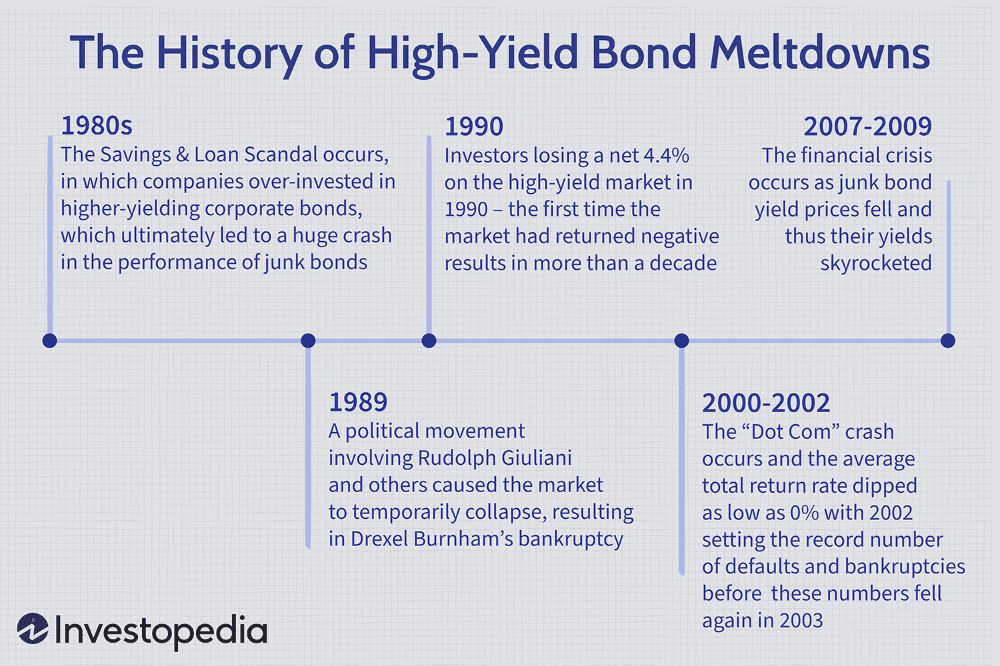

## Table of Contents

## What are high-yield bonds?

High-yield bonds are a type of bond that offers higher interest rates than regular bonds. They are also called junk bonds. These bonds are issued by companies that might have more risk of not paying back the money they borrow. Because of this higher risk, investors get paid more interest as a reward for taking the chance.

When you buy a high-yield bond, you are lending money to a company. In return, the company promises to pay you back the money you lent them, plus interest, over a certain period of time. If the company does well, you can earn a lot of interest. But if the company struggles, there's a bigger chance they might not be able to pay you back. This makes high-yield bonds riskier than other types of bonds, but they can also be more rewarding if everything goes well.

## What is considered a high-yield bond crisis?

A high-yield bond crisis happens when many companies that issued high-yield bonds start to have big problems paying back their debts. This can cause a lot of worry and panic among investors because high-yield bonds are riskier than regular bonds. When investors get scared, they might start selling their high-yield bonds quickly, which can make the prices of these bonds drop a lot. This situation can spread fear throughout the financial markets and make it harder for other companies to borrow money.

During a high-yield bond crisis, the economy might also be struggling. Companies might be making less money, and more of them might be going bankrupt. This makes it even harder for them to pay back their bonds. When this happens, investors can lose a lot of money, and it can affect the whole economy. Banks and other financial institutions that have invested in these bonds can also face big losses, which can lead to even more problems in the financial system.

## When was the first notable high-yield bond crisis?

The first big high-yield bond crisis happened in the late 1980s. It started because a lot of companies had borrowed money by issuing high-yield bonds. These companies were often bought by other companies using a lot of borrowed money, a practice called leveraged buyouts. When the economy slowed down, these companies found it hard to pay back their debts. As more companies started to struggle, investors got worried and started selling their high-yield bonds. This caused the prices of the bonds to fall a lot.

The crisis got worse in 1989 when some big companies, like Campeau Corporation, went bankrupt. This made investors even more scared, and the selling of high-yield bonds turned into a panic. The crisis showed how risky high-yield bonds could be and how problems with them could spread to the whole financial system. It took several years for the market to recover, and it changed how people thought about high-yield bonds and the risks they carried.

## How did the 1980s savings and loan crisis impact high-yield bonds?

The 1980s savings and loan crisis had a big impact on high-yield bonds. During this time, many savings and loan associations, which are like banks, got into trouble. They had made risky loans and investments, including buying a lot of high-yield bonds. When these bonds started to fail because the companies that issued them couldn't pay back their debts, the savings and loan associations lost a lot of money. This made their financial problems even worse.

As more savings and loan associations failed, it caused a big crisis in the financial system. The government had to step in and help clean up the mess, which cost a lot of money. The crisis made people more worried about high-yield bonds because they saw how risky they could be. It also made it harder for companies to sell new high-yield bonds because investors were scared and didn't want to take on more risk.

## What role did Michael Milken play in the history of high-yield bonds?

Michael Milken was a big name in the world of high-yield bonds. He worked for a company called Drexel Burnham Lambert in the 1970s and 1980s. Milken saw that high-yield bonds could help companies that couldn't get loans from banks. He helped these companies by selling their high-yield bonds to investors. This made the high-yield bond market grow a lot. Because of Milken, more people started to see high-yield bonds as a good way to invest money.

But Milken's work also led to problems. In the late 1980s, the high-yield bond market crashed. Some people said Milken did things that were not allowed, like insider trading. In 1990, he was found guilty of these charges and went to prison. Even though he faced legal trouble, Milken's work changed the way people thought about high-yield bonds. Today, high-yield bonds are still used by many companies to borrow money, but they are watched more closely to make sure they are used safely.

## How did the collapse of Drexel Burnham Lambert affect the high-yield bond market?

The collapse of Drexel Burnham Lambert in 1990 had a big impact on the high-yield bond market. Drexel was a major player in the high-yield bond world, and when it went bankrupt, it caused a lot of worry and panic. Many investors who had bought high-yield bonds through Drexel lost a lot of money. This made people more scared about investing in high-yield bonds because they saw how risky they could be.

After Drexel's collapse, the high-yield bond market changed a lot. Other banks and financial companies started to be more careful about the high-yield bonds they bought and sold. They made stricter rules to make sure they were not taking too much risk. Even though the market got smaller for a while, it slowly came back. Today, high-yield bonds are still used by companies to borrow money, but the market is watched more closely to keep it safe.

## What were the key events leading to the 2001 high-yield bond crisis?

The 2001 high-yield bond crisis was caused by a few big events. One big event was the bursting of the dot-com bubble in 2000. Many internet companies had borrowed a lot of money by selling high-yield bonds. When the dot-com bubble burst, these companies started to fail, and they couldn't pay back their debts. This made investors worried about high-yield bonds, and they started selling them, which made the prices of the bonds drop.

Another important event was the economic slowdown that happened after the dot-com bubble burst. Companies were making less money, and more of them were going bankrupt. This made it even harder for them to pay back their high-yield bonds. The fear and panic spread throughout the financial markets, and it became harder for other companies to borrow money. All these events together led to the high-yield bond crisis in 2001.

## How did the 2008 financial crisis influence the high-yield bond market?

The 2008 financial crisis had a big impact on the high-yield bond market. It started when the housing market crashed, and many people couldn't pay back their home loans. Banks had made a lot of risky loans and investments, including buying high-yield bonds. When the economy got worse, companies that had sold these bonds struggled to pay back their debts. This made investors very worried, and they started selling their high-yield bonds quickly. The prices of these bonds dropped a lot, and it was hard for companies to borrow money.

The crisis also made the whole financial system very shaky. Banks and other financial companies that had invested in high-yield bonds lost a lot of money. This made it even harder for them to lend money to other companies. The government had to step in to help, but it took a long time for the economy and the high-yield bond market to recover. After 2008, people were more careful about the risks of high-yield bonds, and the market was watched more closely to keep it safe.

## What were the effects of the European sovereign debt crisis on high-yield bonds?

The European sovereign debt crisis, which started around 2009, had a big impact on high-yield bonds. Many countries in Europe, like Greece and Spain, were having trouble paying back their debts. This made investors very worried, not just about government bonds but also about high-yield bonds. Companies in these countries found it harder to borrow money because investors were scared and didn't want to take on more risk. As a result, the prices of high-yield bonds dropped, and it became more expensive for companies to issue new bonds.

The crisis also spread to other parts of the world. Investors were worried that the problems in Europe could affect the global economy. This made them more cautious about investing in high-yield bonds everywhere. The fear and uncertainty led to a lot of selling of high-yield bonds, which made the market very unstable. It took a long time for things to calm down, and during this time, the high-yield bond market faced a lot of challenges.

## How have regulatory changes since the 2008 crisis impacted high-yield bond markets?

Since the 2008 financial crisis, there have been many new rules to make the high-yield bond market safer. One big change was the Dodd-Frank Act in the United States. This law made banks and other financial companies follow stricter rules about the risks they could take. They had to keep more money on hand to cover losses, which made them more careful about buying high-yield bonds. Another change was that companies had to give more information about their high-yield bonds, so investors could make better decisions about the risks they were taking.

These new rules have made the high-yield bond market more stable. But they have also made it harder for some companies to borrow money. Because banks have to be more careful, they might not want to buy as many high-yield bonds. This can make it more expensive for companies to issue new bonds. But overall, the changes have helped to make the market safer and reduce the chance of another big crisis like the one in 2008.

## What are the current trends and potential future crises in the high-yield bond market?

Right now, the high-yield bond market is doing okay, but there are some things to watch out for. Interest rates have been going up, which can make it harder for companies to pay back their debts. When interest rates go up, the cost of borrowing money goes up too. This can be a problem for companies that have a lot of high-yield bonds because they might have to pay more interest. Also, the economy is doing well now, but if it slows down, more companies might struggle to pay back their debts. This could make investors worried and cause them to sell their high-yield bonds, which could make the prices drop.

In the future, there could be a crisis if a lot of companies start to have trouble paying back their high-yield bonds at the same time. This could happen if there's a big economic downturn or if interest rates keep going up. Another thing to watch is how much money investors are putting into high-yield bonds. If too many people are buying them without thinking about the risks, it could lead to a bubble. When the bubble bursts, it could cause a lot of problems in the high-yield bond market and even affect the whole economy. So, it's important for investors to be careful and for regulators to keep an eye on the market to try to prevent a crisis.

## How do high-yield bond crises affect the broader economy and other financial markets?

High-yield bond crises can really shake up the broader economy and other financial markets. When a lot of companies start having trouble paying back their high-yield bonds, it can make investors very scared. They might start selling their bonds quickly, which makes the prices drop a lot. This fear can spread to other parts of the financial system. Banks and other financial companies that have invested in these bonds can lose a lot of money, which can make them less willing to lend money to other businesses. This can slow down the economy because companies need loans to grow and create jobs.

The effects can also spread to other financial markets. When high-yield bonds are in trouble, it can make investors worried about other risky investments too. They might start selling stocks and other types of bonds, which can make the whole stock market go down. This can make people feel less confident about the economy, and they might spend less money. When people spend less, it can make the economy weaker. So, a high-yield bond crisis can have a big impact on the whole economy and make it harder for businesses and people to do well.

## What are High-Yield Bonds and How Can They Be Understood?

High-yield bonds, commonly known as junk bonds, are a class of debt securities issued by corporations that possess lower credit ratings compared to their investment-grade counterparts. These bonds offer higher interest rates, serving as an incentive to attract investors wary of the elevated risk associated with the issuer's increased probability of default. The credit ratings assigned to these companies, often below Baa3 by Moody's or BBB- by Standard & Poor's and Fitch, indicate a higher credit risk. Consequently, investors demand greater returns as compensation for the potential risks involved.

The allure of high-yield bonds becomes particularly pronounced in low-interest-rate environments, where traditional fixed-income investments such as government bonds offer relatively minimal returns. Investors, in seeking yield enhancement, turn to high-yield bonds to bolster their portfolios. This push for higher returns, however, comes with its own set of challenges, as the risk of default is inherently higher with these securities.

The risk-return trade-off in high-yield bonds can be expressed through a simple risk premium model: 

$$
\text{Yield}_\text{High-Yield} = \text{Yield}_\text{Risk-Free} + \text{Credit Risk Premium}
$$

Where:
- $\text{Yield}_\text{High-Yield}$ is the yield offered by the high-yield bond,
- $\text{Yield}_\text{Risk-Free}$ is the yield of a risk-free asset, typically government bonds,
- $\text{Credit Risk Premium}$ reflects the additional yield investors require for taking on the credit risk of the issuer.

An investor’s decision to allocate funds into high-yield bonds typically hinges on their risk tolerance, market outlook, and the economic environment. While these bonds have the potential to generate significant returns, especially when markets are stable or improving, they can be adversely impacted during economic downturns when the probability of default increases. Hence, high-yield bonds demand vigilant monitoring and management.

## References & Further Reading

[1]: ["Junk Bonds: A Guide to High-Yield Debt Securities"](https://www.investopedia.com/terms/h/high_yield_bond.asp), by Glenn Yago

[2]: Minsky, H. P. (1982). ["Can ‘It’ Happen Again: Essays on Instability and Finance"](https://www.taylorfrancis.com/books/mono/10.4324/9781315705972/happen-hyman-minsky). M.E. Sharpe.

[3]: ["When Genius Failed: The Rise and Fall of Long-Term Capital Management"](https://en.wikipedia.org/wiki/When_Genius_Failed), by Roger Lowenstein

[4]: ["The Z Report on Junk Bonds"](https://www.forbes.com/advisor/investing/junk-bonds/), Standard & Poor's Rating Services

[5]: Hull, J. C. (2015). ["Options, Futures, and Other Derivatives"](https://archive.org/download/economia-usp/Hull%20J.C.-Options%2C%20Futures%20and%20Other%20Derivatives_9th%20edition.pdf). Pearson.

[6]: ["Innovations in Fixed-Income Econometrics"](https://www.sec.gov/spotlight/fixed-income-advisory-committee/vanguard-innovation-and-evolution-in-fixed-income-market-fimsa-011118.pdf), Journal of Financial Economics

[7]: ["Algorithmic Trading and DMA: An Introduction to Direct Access Trading Strategies"](https://archive.org/details/algorithmictradi0000john) by Barry Johnson