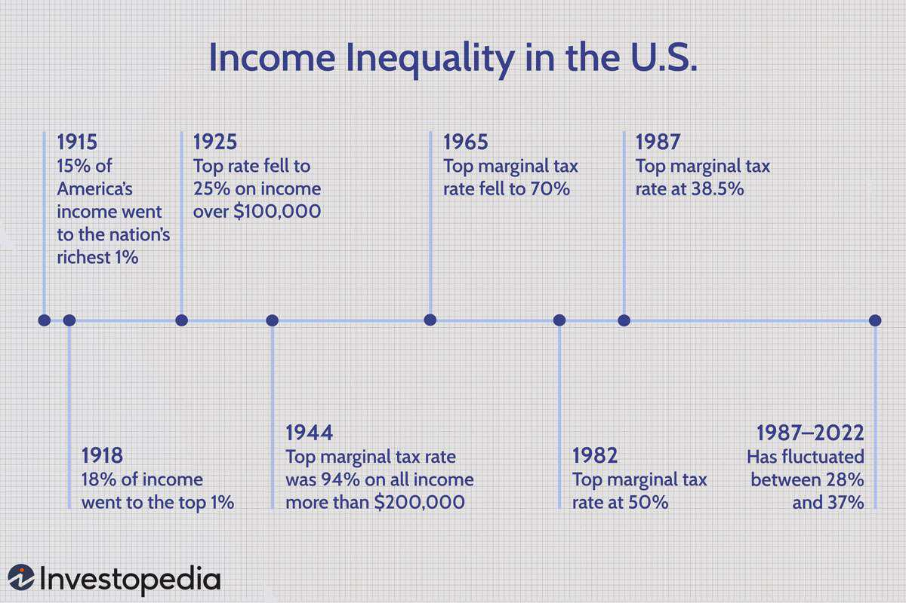

Income inequality in the United States has become an increasingly pressing issue, with economic disparity growing significantly over the past few decades. This widening gap in wealth and income distribution is not a new phenomenon; rather, it has deep historical roots that are intricately tied to socio-economic policies and technological advancements. The history of income inequality in the U.S. can be traced back to pivotal moments and decisions, including those involving early industrial practices and significant socio-economic policies.

Analyzing the evolution of income inequality in the U.S. requires an examination of key historical periods and their impacts. From the economic shifts in the late 19th and early 20th centuries to the transformations triggered by the Great Depression, post-World War II developments, and the technological advancements of the late 20th and early 21st centuries, each era brought about significant changes in income distribution. Government interventions, in the form of taxation, labor regulations, and welfare programs, have also played crucial roles in either exacerbating or alleviating income disparities.



In recent times, the advent of advanced technologies, particularly algorithmic trading, has further influenced economic disparity. Algorithmic trading, with its reliance on complex mathematical models and fast-paced transactions, has principally benefited those at the higher echelons of the economic ladder, thereby contributing to the concentration of wealth. Understanding the implications of these technological advancements is essential for comprehending modern income inequality.

This article aims to provide insights into how income inequality in the U.S. has been shaped and has evolved over time, influenced by both historical and contemporary economic policies and technological trends. By examining these interrelated factors, it becomes evident that addressing economic disparity necessitates a comprehensive approach, combining informed policy reforms with an understanding of technological impacts such as those posed by algorithmic trading.

## Table of Contents

## Historical Overview of Income Inequality in the U.S.

Income inequality in the United States is a deeply entrenched issue with origins rooted in historical socio-economic structures and policy decisions. The evolution of this inequality can be traced through several key periods, each marked by its own set of economic practices and governmental interventions, which have either exacerbated or mitigated income disparities. 

The economic foundations of income inequality date back to the era of slavery, where the enslavement of African Americans created a stark economic division, laying the groundwork for inequality that continued beyond the abolition of slavery. As the U.S. transitioned into the late 19th and early 20th centuries, the Industrial Revolution further intensified income disparities. The rapid industrialization era saw the rise of major industrialists who accumulated significant wealth, a period characterized by minimal government intervention and laissez-faire capitalism.

Government policies played a pivotal role during this time. Tax regulations were relatively regressive, benefiting the affluent and providing limited economic mobility for lower-income individuals. Labor regulations were also insufficient in protecting workers' rights, contributing to wage suppression amidst rising corporate profits. The absence of robust labor laws allowed for widespread exploitation, which widened the economic gap between the wealthy and the working class.

The Great Depression of the 1930s marked a significant turning point, as it underscored the vulnerabilities of an unregulated economic system. The economic collapse led to widespread unemployment and poverty, prompting a reevaluation of government intervention in the economy. In response, the New Deal policies introduced significant reforms aimed at reducing inequality and providing economic relief. These policies laid the groundwork for more equitable wealth distribution, though they primarily served as a temporary fix to the systemic issues of income inequality.

During the post-World War II era, often referred to as the "Great Compression," income inequality narrowed significantly. This period saw the implementation of progressive tax policies and stronger labor regulations that enhanced union power and improved wage conditions for workers. However, despite these advances, systemic disparities persisted, particularly affecting racial minorities and women, who continued to face barriers in achieving economic equality.

As the latter half of the 20th century unfolded, the U.S. witnessed the beginning of the "Great Divergence," a term describing the re-emergence of widening income inequality. This shift was driven by reductions in top marginal tax rates, deregulation of industries, and a decline in union influence. Government policies during this time increasingly favored capital over labor, contributing to a growing divide between the wealthiest Americans and the rest of the population.

Throughout these historical periods, government interventions in taxation and labor policies have had significant impacts on the trajectory of income inequality. While policies have, at times, aided in narrowing economic gaps, periods of deregulation and reduced taxation on the wealthy have often led to increasing disparities. Understanding these historical contexts is crucial for analyzing contemporary income inequality and formulating effective policy responses to address ongoing economic challenges.

## The Great Depression and the New Deal

The Great Depression, a severe worldwide economic downturn beginning in 1929 and lasting through the late 1930s, significantly affected income distribution in the United States. While it led to widespread economic hardship, with unemployment rates reaching approximately 25% at its peak, the income disparity between the wealthy and the poor saw a temporary reduction. This was primarily due to the precipitous decline in asset values, which disproportionately affected the wealthiest individuals whose income sources were heavily reliant on investments and capital gains.

The introduction of the New Deal by President Franklin D. Roosevelt in response to the Great Depression marked a pivotal shift in economic policy, aimed at promoting recovery and reform. These reforms were instrumental in reshaping the landscape of income inequality during the 1930s. Key initiatives under the New Deal included the establishment of programs intended to provide economic relief, recovery, and financial reform.

One of the significant outcomes of the New Deal was the increase in union membership and the strengthening of workers' rights. The National Industrial Recovery Act (NIRA) of 1933 and the Wagner Act of 1935 bolstered labor unions, granting workers the legal right to organize and bargain collectively. This led to substantial wage improvements for unionized workers and played a crucial role in compressing income distribution, as it provided broader access to higher wages and employment benefits.

Furthermore, the New Deal era saw substantial increases in marginal tax rates, particularly targeting the wealthy. By 1936, the highest marginal income tax rate had increased to 79%, a significant rise from pre-Depression levels. This progressive taxation policy played a vital role in wealth redistribution, as it sought to mitigate income inequality by imposing higher taxes on top earners and using the revenue to fund social welfare programs and economic relief efforts.

The policy measures of the New Deal, thus, directly contributed to a temporary narrowing of income gaps. They not only provided immediate economic relief to those most affected by the Depression but also laid the groundwork for greater long-term economic equality by advocating for labor rights and implementing progressive taxation. However, the broader impact of these reforms was contingent on subsequent economic and policy developments, as the nation navigated the post-Depression era.

## The Post-War Era and the Great Divergence

The post-war era, particularly the period from the late 1940s to the early 1970s, is often viewed as a time of economic prosperity and growth in the United States. However, this era also saw the beginnings of what economists term the "Great Divergence," a phase where income inequality began to rise significantly. Several factors contributed to this trend, notably the diminishing influence of labor unions, changes in tax policies, and increased governmental deregulation.

During this period, labor unions, which had been central to protecting workers' interests and promoting equitable wage distribution, started to lose their bargaining power. Union membership reached its peak in the mid-1950s, covering about 35% of the workforce, but began to decline gradually due to various factors. These included shifts in industry from manufacturing to services, aggressive anti-union campaigns by employers, and evolving labor laws that made union organization more challenging. The weakening of unions resulted in stagnant wages and decreased workers' ability to negotiate better terms, leading to a wider income gap between executives and ordinary workers.

Simultaneously, tax policies shifted in favor of wealth accumulation for higher-income individuals. Post-war tax reforms, particularly during the Reagan administration in the 1980s, reduced the top marginal tax rates significantly. From a top marginal tax rate of 94% during World War II, the rate declined to 70% by 1965 and further to 28% by the end of the 1980s. This reduction in tax rates disproportionately benefited the affluent, resulting in greater wealth concentration among the top earners.

Additionally, governmental deregulation played a critical role in exacerbating income inequality. The deregulation of industries, including transportation, telecommunications, and finance, was intended to spur competition and growth. While it succeeded in fostering economic expansion, it also led to job displacements, wage reductions, and a rise in part-time or temporary positions that offered fewer benefits. Moreover, deregulation allowed corporate executives and shareholders to capitalize on profits without necessarily redistributing this wealth to lower-level employees or reinvesting it into workforce development.

The culmination of these factors marked the beginning of income polarization. As the gap between high-income earners and the rest of the population widened, social mobility declined, and economic disparity became more pronounced. The earnings of the top 1% rose dramatically, while the wages for the middle and lower classes remained stagnant or grew at a much slower pace. This dynamic laid the groundwork for the persistent economic inequality observed today, highlighting the need for policies that address both the symptoms and causes of income disparity in order to foster a more balanced economic landscape.

## The Role of Algorithmic Trading in Economic Disparity

Algorithmic trading has dramatically reshaped financial markets, yielding significant implications for income inequality. Over recent decades, particularly with the rise of high-frequency trading ([HFT](/wiki/high-frequency-trading-strategies)), a form of [algorithmic trading](/wiki/algorithmic-trading), there has been an observable trend towards increased wealth concentration among the top economic echelon.

High-frequency trading leverages powerful algorithms to execute orders at speeds far beyond human capabilities, often within microseconds. This high-speed access allows traders to exploit market inefficiencies, obtaining profits unavailable to traditional traders who lack similar technological infrastructure. The advantage conferred by this speed and the ability to execute thousands of trades in a fraction of a second effectively concentrates wealth among those firms and individuals who can afford the substantial investment in such technology and infrastructure. As a result, the barriers to entry in algorithmic trading remain high, favoring established financial institutions and wealthy individuals who have the resources to invest in the necessary technology and expertise.

The benefits realized through HFT and similar strategies compound economic disparities. Large financial entities capable of deploying these technologies can capitalize on price fluctuations that occur in minuscule timeframes. These mini gains accumulate over millions of trades, generating immense profits that can dwarf those achieved by slower market participants. Additionally, strategies such as [arbitrage](/wiki/arbitrage), made more efficient through algorithmic trading, further enable wealth generation for these entities, often at the expense of retail investors who do not have access to sophisticated trading technologies.

Algorithmic trading also enhances market dynamics that can exacerbate inequality. For example, "order anticipation" can occur when algorithms detect large orders before they are fully executed in the marketplace, allowing for strategic positioning that can lead to increased market prices before trades are completed by unaware investors. This practice can diminish the returns of mutual or pension funds that underpin the asset growth of broader, less wealthy constituencies.

Considering the Black-Scholes model, a foundation for many algorithmic trading strategies, traders can model various financial instruments and devise strategies to maximize returns efficiently. Code snippets used in such processes can look something like this simple Python demonstration for options pricing:

```python
import numpy as np
from scipy.stats import norm

def black_scholes(S, K, T, r, sigma, option_type='call'):
    d1 = (np.log(S / K) + (r + 0.5 * sigma**2) * T) / (sigma * np.sqrt(T))
    d2 = d1 - sigma * np.sqrt(T)
    if option_type == 'call':
        price = S * norm.cdf(d1) - K * np.exp(-r * T) * norm.cdf(d2)
    elif option_type == 'put':
        price = K * np.exp(-r * T) * norm.cdf(-d2) - S * norm.cdf(-d1)
    return price

S = 100  # Current stock price
K = 100  # Option strike price
T = 1    # Time to expiration in years
r = 0.05  # Risk-free interest rate
sigma = 0.2  # Volatility of the underlying stock

call_price = black_scholes(S, K, T, r, sigma, option_type='call')
put_price = black_scholes(S, K, T, r, sigma, option_type='put')
```

While the implementation of such models enhances profit potential, it requires substantial expertise and resources, which not everyone possesses. The necessity of complex mathematical models, infrastructure costs, and specialized knowledge reinforces the wealth gap by disproportionately benefiting seasoned investors and large financial institutions.

Regulatory measures have been proposed to mitigate the wealth-concentrating effects of algorithmic trading. These include the imposition of transaction taxes, transparency obligations for trading algorithms, and limits on the speed of order execution. However, balancing innovation and market efficiency while curbing excessive inequality remains a considerable policy challenge.

In summary, algorithmic trading contributes to economic disparity by concentrating financial gains among those with access to advanced technologies and market expertise. Addressing this challenge involves understanding the technological underpinnings and strategic deployment in financial markets, coupled with regulatory efforts aimed at creating a more equitable economic landscape.

## Measuring and Understanding Income Inequality

Income inequality refers to the uneven distribution of income across a population, which can have significant implications for social and economic stability. To measure and analyze income inequality, economists and policymakers employ several quantitative tools, among which the Gini index and the Lorenz curve are widely used.

### Gini Index

The Gini index is a statistical measure that represents the income distribution of a nation's residents. It ranges from 0 to 1, where 0 implies perfect equality (everyone has the same income) and 1 indicates perfect inequality (one person has all the income, and others have none). The formula for the Gini index can be expressed as:

$$
G = \frac{\sum_{i=1}^{n} \sum_{j=1}^{n} |x_i - x_j|}{2n^2 \mu}
$$

where $n$ is the number of individuals, $x_i$ and $x_j$ are income levels of individuals, and $\mu$ is the mean income of the population. 

The Gini index's strength lies in its ability to provide a single, comprehensive measure of inequality, allowing for straightforward comparisons across different populations or time periods. However, it does not reflect where in the income distribution inequality occurs, whether at the top, middle, or bottom.

### Lorenz Curve

The Lorenz curve is a graphical representation of income or wealth distribution, illustrating the proportion of the total income of the population that is cumulatively earned by the bottom x% of the population. To construct the Lorenz curve, incomes are arrayed from smallest to largest, and cumulative income shares are plotted against cumulative population shares.

Mathematically, if $L(p)$ represents the Lorenz curve, then at any percentile $p$ of the population, the curve shows the fraction of total income earned by the bottom $p\%$ of that population. The further the Lorenz curve is from the line of perfect equality (a 45-degree line), the greater the inequality.

### Effectiveness and Limitations

The Gini index and Lorenz curve are powerful tools for summarizing inequality. Yet, they have limitations. The Gini index, for instance, is more sensitive to changes in the middle of the distribution than at the extremes. It also does not decompose easily by sub-populations (e.g., urban vs. rural), which can hide important differences.

Moreover, these measures offer snapshots of inequality but do not account for income mobility—how people's income changes over time. They also do not inherently indicate causality or the socio-economic consequences of inequality, which necessitates complementary analyses considering various economic, policy, and technological factors.

Understanding these measures is crucial for forming effective policies. Accurate measurement assists in diagnosing issues and tailoring interventions to reduce disparities, promoting equitable economic growth across societies.

## Government and Policy Responses to Inequality

Throughout history, government and policy responses to address income inequality in the United States have involved a variety of measures, including taxation, social welfare initiatives, and economic reforms. These interventions aim to reduce the income gap by redistributing resources and providing support to lower-income groups, while also fostering economic stability.

A critical tool in reducing income inequality has been progressive taxation. The concept of progressive taxation is based on the idea that higher earners should contribute a larger proportion of their income in taxes compared to lower-income individuals. This system was notably employed during the Great Depression and the post-World War II era to mitigate income disparities. During the mid-20th century, marginal tax rates on the highest income brackets reached over 90% at times, effectively redistributing wealth more equitably across the population. Moreover, the implementation of estate taxes aimed to prevent the passing of immense wealth across generations, thus reducing wealth concentration over time.

Social welfare programs have also played a significant role in addressing economic inequality. These programs include initiatives such as Social Security, Medicaid, and food assistance programs, which provide crucial support to those in need. The expansion of social safety nets not only aids in immediate poverty alleviation but also contributes to a more level economic playing field over the long term. Policies such as the Earned Income Tax Credit (EITC) directly boost the incomes of working families, promoting greater equity within the workforce.

In recent decades, however, the effectiveness of these policies has varied, partly due to shifts in governmental priorities and economic conditions. The reduction of top marginal tax rates since the 1980s and the deregulation of certain industries have contributed to widening income inequality. Critics argue that these changes favored the wealthy and exacerbated economic disparities, leading to renewed discussions on policy designs that balance equity and growth.

Addressing current and future economic inequalities may require new policy frameworks that integrate both traditional and innovative approaches. Possible strategies include increasing the progressivity of the tax code, expanding social safety nets, and investing in education and job training to enhance social mobility. Additionally, policies that regulate financial markets and curb exploitative practices, such as those arising from algorithmic trading, could safeguard against wealth concentration.

Ultimately, crafting effective policy responses to income inequality necessitates a comprehensive understanding of economic indicators and the socio-political climate. By combining targeted taxation, robust social welfare programs, and regulations promoting fair market practices, policymakers can work towards a more equitable and sustainable economic landscape.

## Conclusion

The history of income inequality in the United States is a reflection of the interplay between various economic policies, technological advancements, and socio-political factors. This complexity is evident in how income distribution has shifted through different historical periods, shaping the social and economic fabric of the nation.

Economic policies have played a crucial role in influencing income inequality. Past reforms, such as the New Deal, aimed at reducing economic disparity through measures like increased taxation of the wealthy and enhanced worker rights. More recently, policies that favor lower tax rates for high-income individuals and deregulation have contributed to widening income gaps. These policy shifts underscore the significant impact government interventions can have on economic disparity.

Technological advancements, particularly algorithmic trading, have also contributed to economic inequality. These technologies have transformed financial markets, creating opportunities for wealth accumulation that are predominantly accessible to those with significant capital and resources. This has further concentrated wealth among the already affluent, increasing the socio-economic divide.

Addressing economic disparity requires comprehensive policy reforms that consider these technological impacts. Policies should aim to not only support equitable income distribution but also mitigate the wealth concentrations facilitated by technological advancements. For example, implementing regulations on high-frequency trading and ensuring wider access to financial technologies can be pivotal strategies.

Future policy frameworks must focus on reducing income inequality to promote a more equitable and stable economy. This involves balancing growth with equity, ensuring that economic gains are inclusively distributed across the population. By integrating technological insights with economic reforms, policymakers can devise strategies that address the root causes of income inequality and lay the groundwork for sustainable economic development.

## References & Further Reading

[1]: Piketty, T. (2014). [*Capital in the Twenty-First Century*](https://www.jstor.org/stable/j.ctt6wpqbc). Harvard University Press.

[2]: Atkinson, A. B., & Bourguignon, F. (Eds.). (2014). [*Handbook of Income Distribution*](https://www.sciencedirect.com/handbook/handbook-of-income-distribution). Elsevier.

[3]: Saez, E., & Zucman, G. (2019). [*The Triumph of Injustice: How the Rich Dodge Taxes and How to Make Them Pay*](https://www.cambridge.org/core/journals/economics-and-philosophy/article/abs/triumph-of-injustice-how-the-rich-dodge-taxes-and-how-to-make-them-pay-emmanuel-saez-and-gabriel-zucman-ww-norton-2019-xvi-232-pp-2795-hbk-isbn-9781324002727/992120AE3EA6354D5C4131BAB2EDA298). W.W. Norton & Company.

[4]: Autor, D., Dorn, D., & Hanson, G. (2013). "The China Syndrome: Local Labor Market Effects of Import Competition in the United States." [*The American Economic Review*](https://www.aeaweb.org/articles?id=10.1257/aer.103.6.2121), 103(6), 2121-2168.

[5]: Boushey, H. (2019). [*Unbound: How Inequality Constricts Our Economy and What We Can Do About It*](https://www.amazon.com/Unbound-Inequality-Constricts-Economy-about/dp/0674919319). Harvard University Press.

[6]: Hacker, J. S., & Pierson, P. (2010). [*Winner-Take-All Politics: How Washington Made the Rich Richer–and Turned Its Back on the Middle Class*](https://politicalscience.yale.edu/publications/winner-take-all-politics-how-washington-made-rich-richer-and-turned-its-back-middle). Simon & Schuster.

[7]: Veblen, T. (1899). [*The Theory of the Leisure Class: An Economic Study of Institutions*](https://archive.org/details/theoryleisurecl00veblgoog). Macmillan.

[8]: Lopez de Prado, M. (2018). [*Advances in Financial Machine Learning*](https://www.amazon.com/Advances-Financial-Machine-Learning-Marcos/dp/1119482089). Wiley.

[9]: Chan, E. (2009). [*Quantitative Trading: How to Build Your Own Algorithmic Trading Business*](https://github.com/ftvision/quant_trading_echan_book). Wiley.