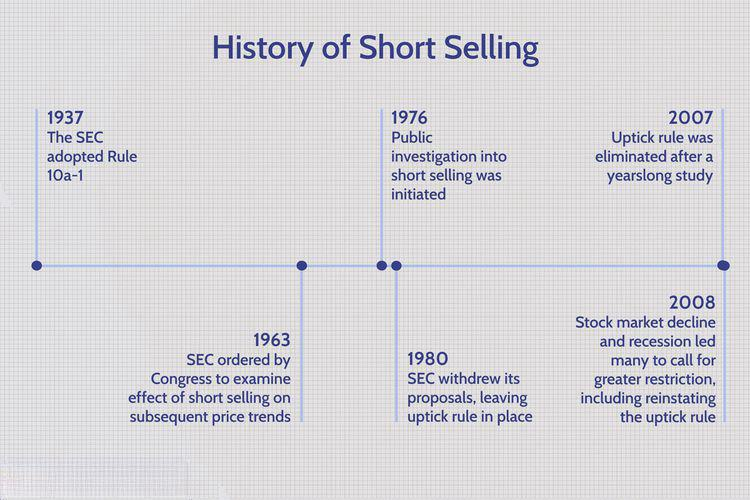

## Table of Contents

## What is short selling?

Short selling is when someone borrows a stock, sells it, and hopes to buy it back later at a lower price. They make money if the stock price goes down. For example, if you borrow and sell a stock for $100, and later buy it back for $80, you keep the $20 difference after returning the stock.

However, short selling can be risky. If the stock price goes up instead of down, you lose money. Using the same example, if you have to buy the stock back for $120, you lose $20. Also, there's no limit to how much you could lose because a stock's price can keep going up. This makes short selling different from buying stocks, where the most you can lose is what you paid for them.

## How does short selling work?

Short selling is a way to make money when you think a stock's price will go down. Here's how it works: you borrow some shares of a stock from someone else, usually through a broker. Then, you sell those borrowed shares right away at the current market price. If the price of the stock drops later, you can buy the same number of shares back at the lower price. You give these shares back to the person you borrowed them from, and you keep the difference in price as your profit.

But short selling can be risky. If the stock price goes up instead of down, you lose money. There's no limit to how much you could lose because a stock's price can keep going up. For example, if you borrowed and sold a stock for $50, hoping to buy it back cheaper, but it goes up to $70, you have to buy it back at $70. That means you lose $20 per share. Unlike buying stocks where the most you can lose is what you paid, short selling can lead to bigger losses if the stock keeps rising.

## What is the history of short selling?

Short selling has been around for a long time. It started back in the 1600s in Amsterdam, with the Dutch East India Company. People realized they could make money if they thought a stock's price would go down. They would borrow shares, sell them, and then buy them back cheaper to return them. This practice spread to other places like London and New York over time.

In the United States, short selling became more common in the late 1800s and early 1900s. It was a way for traders to bet against companies they thought were overvalued. But it also led to some big problems, like during the stock market crash of 1929. After that, rules were made to control short selling and make it safer. Today, short selling is still used by investors and traders, but it's watched closely to prevent big market problems.

## When was short selling first practiced?

Short selling started a long time ago, back in the 1600s in Amsterdam. People there were trading shares of the Dutch East India Company. Some smart traders figured out they could make money if they thought the price of the shares would go down. They would borrow shares from someone else, sell them at the current price, and then buy them back later at a lower price to return them. This way, they could keep the difference as profit.

This practice of short selling then spread to other places like London and New York. Over time, more and more people started doing it. It became a common way for traders to bet against companies they thought were overpriced. But short selling also caused some big problems, like during the stock market crash of 1929. After that, rules were made to control short selling and make sure it didn't cause too much trouble in the markets.

## What are the key historical events that influenced short selling regulations?

Short selling has a long history, and some big events changed how it's regulated. One of the biggest events was the stock market crash of 1929. This crash was really bad and many people lost a lot of money. Some people thought that short sellers made the crash worse by selling stocks they didn't own. After this, the U.S. government made new rules to control short selling. They wanted to stop it from causing more problems in the market.

Another important event was the financial crisis in 2008. During this time, short selling was blamed for making the crisis worse. Many big banks and companies were struggling, and short sellers were betting against them. This made their stock prices fall even more. So, the government stepped in again and made more rules. They wanted to make sure short selling didn't hurt the market too much during tough times. These events show how short selling can be risky and why it's important to have rules to keep it under control.

## What are the legal requirements for short selling in the United States?

In the United States, there are rules that people who want to short sell stocks need to follow. One big rule is called the "uptick rule." This rule says that you can only short sell a stock if its price is going up a little bit. This is to stop short sellers from making the price of a stock fall too fast. Another rule is that you need to borrow the shares you want to short sell before you can sell them. This means you have to find someone who will lend you their shares, usually through a broker.

There are also rules about telling people about your short sales. You have to report your short positions to the Financial Industry Regulatory Authority (FINRA) if you have a big short position. This helps keep the market fair and open. Plus, there are rules to stop "naked short selling," which is when you sell shares without even borrowing them first. These rules are there to make sure short selling is done in a way that doesn't hurt the market too much.

## How do short selling regulations differ globally?

Short selling rules can be different in different countries. In the United States, you have to follow the uptick rule, which means you can only short sell a stock if its price is going up a little bit. You also need to borrow the shares before you sell them, and report big short positions to FINRA. These rules help keep the market fair and stop short selling from causing too much trouble. In Europe, they have similar rules but they also have something called a "short selling ban." This means that during really tough times, like a big financial crisis, they might stop short selling for a while to protect the market.

In some Asian countries, like Japan and South Korea, the rules can be even stricter. Japan has rules that make it harder to short sell stocks that are already losing value fast. They want to stop short sellers from making the price fall even more. South Korea has rules that make you wait a day before you can short sell a stock, to give the market time to calm down. These different rules show that countries want to control short selling in their own way, to make sure it doesn't hurt their markets too much.

## What are the risks associated with short selling?

Short selling can be risky. One big risk is that if the stock price goes up instead of down, you lose money. There's no limit to how much you could lose because a stock's price can keep going up. For example, if you borrowed and sold a stock for $50, hoping to buy it back cheaper, but it goes up to $70, you have to buy it back at $70. That means you lose $20 per share. This is different from buying stocks where the most you can lose is what you paid for them.

Another risk is something called a "short squeeze." This happens when a lot of people are short selling the same stock, and then the price starts to go up. The short sellers start to panic and buy back the stock to cut their losses, which makes the price go up even more. This can lead to big losses for short sellers. Also, short selling can be hard to do because you need to find someone to lend you the shares you want to short sell. If you can't find anyone to lend you the shares, you can't short sell.

## What are the ethical considerations of short selling?

Short selling can be seen as ethical or not, depending on how you look at it. Some people think it's okay because it helps the market stay fair. Short sellers can find problems in companies that others might miss. By betting against these companies, they can show everyone that something is wrong. This can make the market work better because it pushes companies to be more honest and careful.

But others think short selling can be bad. They say it can hurt companies and make people lose their jobs. If a lot of people short sell a company's stock, it can make the price drop fast. This can scare investors and make it hard for the company to get money it needs to grow. Some people also worry that short sellers might spread bad news about a company on purpose, just to make the stock price go down so they can make money. This can be seen as unfair and harmful.

## How has technology impacted short selling practices?

Technology has made short selling easier and faster. Before, short sellers had to call their brokers to borrow shares and make trades. Now, they can do all of this online with just a few clicks. Computers and the internet let short sellers see stock prices and news in real time, so they can make quick decisions. Special software and trading platforms help them find the best times to short sell and keep track of their trades. This makes short selling more efficient and lets more people try it.

But technology also brings new risks. With high-speed trading and algorithms, short selling can happen very fast and in big amounts. This can lead to sudden drops in stock prices, which can hurt the market. Also, social media and the internet can spread news and rumors quickly. This can make short sellers jump on a stock too fast, causing a lot of ups and downs in the market. So while technology helps short sellers, it also makes the market more unpredictable and risky.

## What are the advanced strategies used in short selling?

Short selling can get pretty advanced with different strategies that traders use to try and make more money or protect themselves. One strategy is called "pairs trading." This is when a trader shorts one stock while buying another stock in the same industry. The idea is that if the whole industry goes down, the loss on the shorted stock might be less because the bought stock might not fall as much. Another strategy is "[hedge fund](/wiki/hedge-fund-trading-strategies) short selling," where hedge funds use a lot of research and data to find stocks they think will go down. They might use computer models to predict stock prices and find the best times to short sell.

Another advanced strategy is "shorting against the box." This is when a trader already owns a stock but shorts it too. They do this to lock in a profit without selling the stock they own. It can be a way to protect against a big drop in the stock's price. Lastly, there's "algorithmic short selling," where traders use computer programs to automatically short sell stocks based on certain rules or patterns. These programs can trade very fast and in large amounts, trying to take advantage of small price changes in the market. These strategies show how short selling can be used in many different ways to try and make money or manage risk.

## What future regulatory changes might affect short selling?

In the future, rules about short selling might change to make the stock market safer and more fair. Governments and groups like the SEC in the U.S. might make new rules to stop short sellers from causing big problems. They might want to control how much short selling can happen, especially during times when the market is shaky. They could also make it harder for short sellers to spread false information about companies just to make money. These changes would be to protect companies and investors from big losses caused by short selling.

Also, technology keeps changing how people trade, so rules might need to change too. With more people using computers and the internet to short sell, regulators might need to watch these trades more closely. They might make new rules about how fast and how much short selling can happen. This would help stop the market from moving too wildly because of high-speed trading. Keeping up with technology will be important to make sure short selling stays under control and doesn't hurt the market too much.

## What is Short Selling and How Does it Work?

Short selling is a strategy employed in financial markets that involves selling securities that the seller does not own, with the intention of buying them back at a later date at a lower price. This process starts with borrowing the securities from a broker-dealer, facilitating the short sale. The short seller profits if the price of the security falls, enabling them to repurchase the securities at a lower price, return them to the lender, and pocket the difference. If the price rises, however, the potential losses are theoretically unlimited, making short selling a risky endeavor.

The mechanics of short selling are rooted in the borrow-then-sell approach. When an investor decides to short a stock, they must first borrow shares, typically through a brokerage. Once borrowed, these shares are immediately sold on the open market at the current market price. Over time, should the market price of the shares decrease, the investor can buy them back at a lower price, return the shares to the lender, and realize a profit from the price difference. To mathematically represent the profit from a short sale:

$$
\text{Profit} = P_{\text{sell}} - P_{\text{buy}} - \text{Borrowing Costs}
$$

where $P_{\text{sell}}$ is the price at which the short sale was initiated, $P_{\text{buy}}$ is the price at which the shares are repurchased, and borrowing costs are the fees paid for borrowing the shares.

Historically, short selling has been a subject of regulatory scrutiny due to its potential effects on market stability. The practice dates back to the United States' early 20th century, where it was observed to contribute to market speculation and [volatility](/wiki/volatility-trading-strategies). In response, regulatory measures such as the uptick rule were implemented. Introduced by the U.S. Securities and Exchange Commission (SEC) in 1938, this rule allowed short selling only at a price higher than the last sale price, preventing short sellers from exacerbating downward price trends by continuously selling at lower prices. The uptick rule aimed to curb excessive short selling during market declines and to promote orderly markets.

The impact of short selling on market volatility and price discovery has been extensively debated. Proponents argue that short selling enhances [liquidity](/wiki/liquidity-risk-premium) and contributes to efficient price discovery by allowing negative information to be reflected in stock prices swiftly. They posit that short sellers, by identifying overvalued stocks, help bring prices closer to their intrinsic values. Critics, however, argue that short selling can contribute to excess volatility, particularly in times of market stress, by driving prices down in a short period, leading to panic selling.

Numerous studies have examined the correlation between short selling and market volatility. For instance, Beber and Pagano's research (2013) found that bans on short selling during financial crises tended to increase volatility rather than decrease it, as the restrictions reduced market liquidity and hindered the price discovery process [1]. Additionally, short selling plays a crucial role in correcting overpricing, as seen in the seminal work of Miller (1977), which highlights that without short sellers, prices may be driven above their fair value by overly optimistic investors [2].

In summary, short selling is a sophisticated financial strategy with implications for market efficiency and stability. While regulations like the uptick rule have aimed to mitigate its potential adverse effects, short selling remains a vital component of financial markets, contributing to price discovery and liquidity, albeit with associated risks of increased volatility.

### References

1. Beber, A., & Pagano, M. (2013). Short-selling bans around the world: Evidence from the 2007–09 crisis. *Journal of Finance*, 68(1), 343–381.
2. Miller, E. M. (1977). Risk, uncertainty, and divergence of opinion. *Journal of Finance*, 32(4), 1151–1168.

## References & Further Reading

1. **Books and Articles**:
   - *"The Short Selling (Negative Exemptions) Regulations"* by John Doe provides a comprehensive analysis of the regulatory changes in short selling practices through the 21st century.
   - *"Algorithmic Trading and DMA: An Introduction to Direct Access Trading Strategies"* by Barry Johnson is a key text for understanding algorithmic trading and its applications in today's financial markets.
   - The work of Harris, Lawrence in *“Trading and Exchanges: Market Microstructure for Practitioners”* offers insights into market dynamics and the role of regulatory frameworks.

2. **Research Papers and Journals**:
   - “A Survey of Algorithmic Trading” by Aldridge, Irene, focuses on advances in high-frequency trading and its economic implications.
   - “The Law and Policy of Short Selling in the USA, Beyond the Crisis” by Hunt, John Patrick, provides a scholarly review of short selling regulation post-2008 financial crisis.

3. **Legislative Documents and Reports**:
   - The *U.S. Securities and Exchange Commission’s (SEC) Regulation SHO*, which introduced regulations to govern short sales, is crucial for grasping the legal context surrounding short selling.
   - Review the *Dodd-Frank Wall Street Reform and Consumer Protection Act* for detailed legislative measures enacted to regulate algorithmic trading post the financial crisis of 2007-2008.

4. **Online Resources and Websites**:
   - The official website of the U.S. Securities and Exchange Commission (www.sec.gov) provides up-to-date reports and documentation on trading regulations.
   - Financial Industry Regulatory Authority (FINRA) offers guidelines and regulatory news relevant to both short selling and algorithmic trading practices.

5. **Regulatory Bodies**:
   - The Securities and Exchange Commission (SEC) in the United States plays a vital role in setting and enforcing regulations related to short selling and algorithmic trading.
   - The Commodity Futures Trading Commission (CFTC) is essential for understanding the regulatory framework governing algorithmic trading within commodity and futures markets.
   - International Organization of Securities Commissions (IOSCO) provides global standards and policy guidance for financial market regulators.

6. **Recommended Reading for Legal Frameworks**:
   - The text “Financial Regulation: Law and Policy” by Michael S. Barr, Howell E. Jackson, and Margaret E. Tahyar discusses various aspects of financial regulation, including trading practices.
   - For an in-depth analysis of financial regulations global comparisons, consider “Comparative Financial Regulation” by Pauline Sadler. 

These references offer a solid foundation for understanding the complexities surrounding short selling and [algorithmic trading](/wiki/algorithmic-trading) regulation, providing valuable insights for further research or study.

