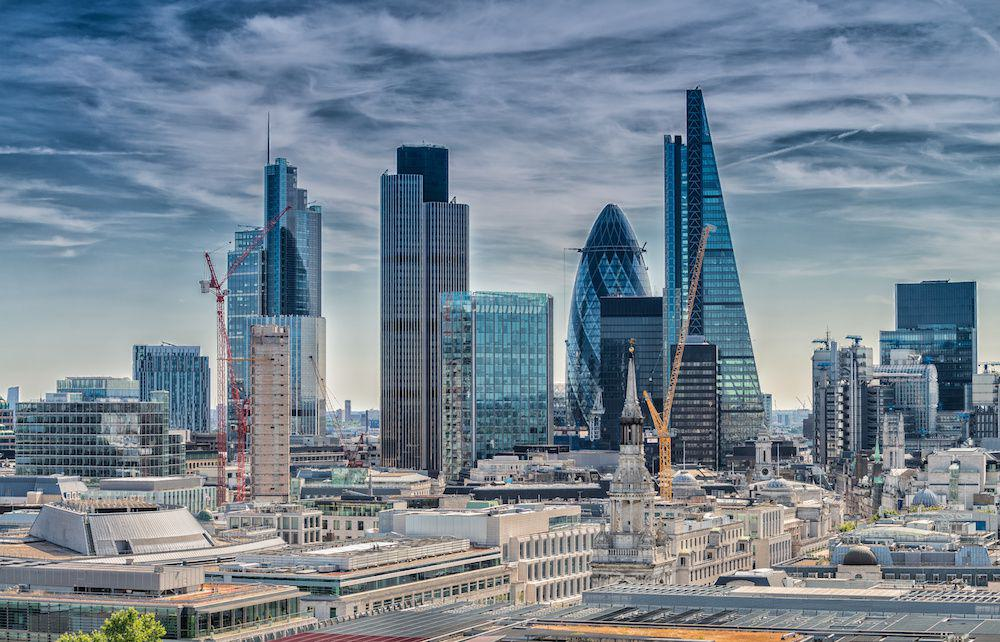

## Table of Contents

## What is a global financial centre?

A global financial centre is a city or area where a lot of money-related activities happen. These activities include banking, trading stocks, and managing investments. People from all over the world come to these places to do business because they have good rules, technology, and services that help money grow and move safely.

Some well-known global financial centres are New York, London, and Hong Kong. These cities have big buildings where banks and other financial companies work. They also have stock exchanges where people buy and sell parts of companies. Being a global financial centre helps a city's economy grow because it brings in a lot of money and jobs.

## When did London start to emerge as a financial centre?

London started to become a big financial centre a long time ago, back in the 17th century. It all began with the founding of the Bank of England in 1694. This bank helped the government manage money and made it easier for people to save and borrow. Over time, more banks and businesses opened in London, making it a busy place for money matters.

By the 19th century, London was already a leading financial centre. It became even more important because of the British Empire, which had colonies all over the world. This meant that money from different countries flowed through London. The city had a stock exchange where people could buy and sell parts of companies, and it grew to be one of the biggest in the world. Today, London is still a top financial centre, known for its banks, trading, and financial services.

## What historical events contributed to London's growth as a financial hub?

London's growth as a financial hub started in the 17th century with the founding of the Bank of England in 1694. This bank was important because it helped the government manage money and made it easier for people to save and borrow. As more banks and businesses opened in London, the city became a busy place for money matters. The establishment of the London Stock Exchange in 1801 also played a big role. It gave people a place to buy and sell parts of companies, which helped grow London's financial power.

In the 19th century, London's role as a financial hub grew even more because of the British Empire. The empire had colonies all over the world, and money from these places flowed through London. This made the city a central point for global finance. The Industrial Revolution also helped because it brought new businesses and industries that needed financial services. By the 20th century, London was firmly established as a leading global financial centre, and it has kept this position thanks to its strong financial institutions and its ability to adapt to changes in the world economy.

## How did the establishment of the Bank of England in 1694 impact London's financial status?

The establishment of the Bank of England in 1694 was a big step for London becoming a financial hub. Before this, England didn't have a central bank to help manage money. The Bank of England changed that by giving the government a place to borrow money easily. This made it easier for the government to do things like fight wars or build roads. It also made people feel safer about saving their money in banks, which helped more banks open in London.

As more banks opened, London became a busy place for money matters. People from all over the country and even the world came to London to do business. The Bank of England helped make London a trusted place for finance. This trust brought in more money and businesses, which helped London grow into a major financial centre. Over time, this growth made London one of the most important cities in the world for banking and finance.

## What role did the London Stock Exchange play in London's financial development?

The London Stock Exchange, founded in 1801, played a big part in making London a top financial centre. Before the stock exchange, it was hard for people to buy and sell parts of companies. The London Stock Exchange made this easier by giving people a place to trade stocks. This helped businesses get the money they needed to grow. More companies started listing their stocks in London, which brought more business and money to the city.

As the London Stock Exchange grew, it helped London become a hub for finance. More investors from around the world came to London to trade stocks. This brought in more money and helped the city's economy grow. The stock exchange also made London a place where new financial ideas could be tried out. This helped keep London at the front of the world's financial markets.

## How did the Industrial Revolution influence London's position as a global financial centre?

The Industrial Revolution helped London become a big financial centre. It started in the late 1700s and brought new machines and factories to Britain. These factories needed money to build and grow. London's banks were there to help by lending money to these new businesses. This made London's banks very important and busy.

As more factories opened, more people came to London to work. This brought more money into the city. London's stock exchange also grew because people could buy and sell parts of these new companies. All this activity made London a central place for money and business. By the time the Industrial Revolution was over, London was a leading financial hub because it had helped so many new businesses get started and grow.

## What was the impact of the British Empire on London's financial markets?

The British Empire had a big impact on London's financial markets. During the time of the empire, Britain had colonies all over the world. Money from these colonies came to London, making it a central place for global finance. This flow of money helped London's banks and businesses grow bigger and stronger. The empire also made London a safe place for people to invest their money because it was seen as powerful and stable.

Because of the empire, London became a place where people from all over the world came to do business. They could trade goods and money easily in London. This made London's financial markets very busy and important. Over time, this helped London become one of the top financial centres in the world. Even after the empire ended, London kept its strong position in global finance.

## How did the two World Wars affect London's status as a financial centre?

The two World Wars had a big impact on London's status as a financial centre. During World War I, London faced many challenges. The war disrupted trade and caused economic problems. Many banks and businesses in London had to deal with these issues. Despite this, London managed to keep its position as a major financial hub. After the war, London's financial markets bounced back quickly because the city was still seen as a safe and reliable place for money.

World War II brought even more challenges to London. The city was bombed, which damaged buildings and disrupted business. Many financial activities had to be moved out of London for safety. However, London's financial markets showed strength and resilience. After the war, London worked hard to rebuild and improve its financial services. This helped London keep its place as a leading global financial centre. Even though the wars caused problems, London's financial status remained strong because of its ability to recover and adapt.

## What regulatory changes have been significant in maintaining London's financial prominence?

Over the years, London has made important changes to its rules to keep its place as a top financial centre. One big change was the "Big Bang" in 1986. This was when the government made it easier for banks and other financial companies to do business. They changed the rules to allow more competition and new technology. This helped London's financial markets grow and stay strong.

Another important change was the creation of the Financial Services Authority (FSA) in 2000. The FSA was set up to watch over banks and make sure they followed the rules. This made people feel safer about putting their money in London's banks. After the 2008 financial crisis, the FSA was replaced by two new groups: the Financial Conduct Authority (FCA) and the Prudential Regulation Authority (PRA). These groups work together to keep London's financial markets safe and fair. These changes have helped London stay a trusted and leading financial centre.

## How has Brexit influenced London's role as a global financial centre?

Brexit has brought some changes to London's role as a global financial centre. When the UK left the European Union, it meant that London's banks and financial companies had to follow new rules. Some businesses moved parts of their operations to other cities in the EU, like Frankfurt and Paris, to keep doing business easily with Europe. This made some people worry that London might lose its top spot in global finance. But London still has many things going for it, like a strong history of finance, lots of skilled workers, and good technology.

Even with these changes, London has worked hard to keep its place as a leading financial centre. The city has made new deals with other countries to keep trading and doing business smoothly. London's financial markets have also been quick to adapt to the new situation after Brexit. While some businesses moved away, many have stayed, and new ones have come to London. Overall, Brexit has made things a bit harder, but London is still a big and important place for global finance.

## What are the current challenges facing London as a financial centre?

London faces some challenges as a financial centre today. One big challenge is competition from other cities. Places like New York, Hong Kong, and Singapore are also trying to be the best in finance. They have good rules and technology, and they want to attract businesses away from London. Another challenge is the uncertainty after Brexit. Some businesses moved parts of their work to other cities in Europe because of new rules. This makes it harder for London to keep its top spot.

Another challenge is keeping up with new technology. The world of finance is changing fast with things like online banking and trading. London needs to stay ahead in using these new tools to stay competitive. Also, there are worries about the economy. If the economy slows down, it can affect how much business London's financial markets get. Despite these challenges, London is still working hard to stay a leading financial centre by adapting and finding new ways to grow.

## How does London's financial sector compare to other global financial centres like New York and Hong Kong?

London's financial sector is one of the biggest in the world, but it faces strong competition from places like New York and Hong Kong. New York is home to Wall Street, which is famous for its stock exchange and big banks. It has a lot of money moving in and out every day, and it's a leader in finance because of its strong economy and many big companies. Hong Kong, on the other hand, is a gateway to Asia's growing markets. It has good rules and technology that help businesses from all over the world come and do business there. Both New York and Hong Kong have their own strengths that make them tough competitors for London.

Despite this competition, London has some unique advantages. It has a long history of being a financial hub, which makes people trust it. London also has a lot of skilled workers and good technology. After Brexit, London has been working hard to make new deals with other countries to keep its business going strong. While some businesses moved parts of their operations to other cities in Europe, many have stayed in London, and new ones have come. This shows that London is still a very important place for global finance, even though it faces challenges from New York and Hong Kong.

## References & Further Reading

[1]: Bergstra, J., Bardenet, R., Bengio, Y., & Kégl, B. (2011). ["Algorithms for Hyper-Parameter Optimization."](https://papers.nips.cc/paper/4443-algorithms-for-hyper-parameter-optimization) Advances in Neural Information Processing Systems 24.

[2]: ["Advances in Financial Machine Learning"](https://www.amazon.com/Advances-Financial-Machine-Learning-Marcos/dp/1119482089) by Marcos Lopez de Prado

[3]: ["Evidence-Based Technical Analysis: Applying the Scientific Method and Statistical Inference to Trading Signals"](https://www.amazon.com/Evidence-Based-Technical-Analysis-Scientific-Statistical/dp/0470008741) by David Aronson

[4]: ["Machine Learning for Algorithmic Trading"](https://github.com/stefan-jansen/machine-learning-for-trading) by Stefan Jansen

[5]: ["Quantitative Trading: How to Build Your Own Algorithmic Trading Business"](https://github.com/LucindaYa/quant-resources/blob/master/Quantitative%20Trading%20How%20to%20Build%20Your%20Own%20Algorithmic%20Trading%20Business.pdf) by Ernest P. Chan