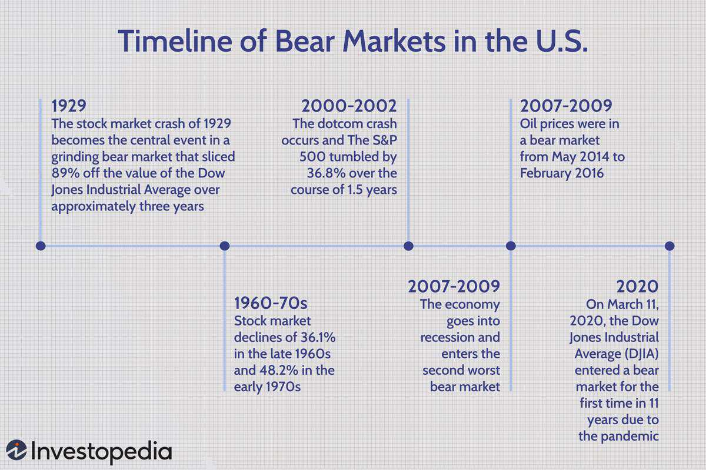

Understanding the dynamics of stock market downturns and bear markets is crucial for investors and economists alike. These phenomena directly influence personal investments and carry wider implications for economic stability. Bear markets, characterized by a persistent decline in stock prices, often foreshadow economic recessions, affecting employment rates and consumer confidence. Identifying the triggers and consequences of these downturns can illuminate the intricate interplay between market forces and economic health.

Algorithmic trading, an increasingly dominant force in financial markets, offers a layer of both opportunity and complexity when dealing with stock market behavior. These advanced systems facilitate rapid trade executions and foster market liquidity but can also amplify market volatility, particularly during financial downturns. For example, the 2010 Flash Crash demonstrated the potential for algorithmic trading to cause rapid, severe market disruptions. Understanding these dynamics is essential for grasping the modern financial landscape.



This article investigates into the historical context of stock market downturns, examining phenomena such as the Great Depression and the 2008 financial crisis. By looking at the root causes of these events—like high speculation and excessive leverage—we can learn valuable lessons about current and future market conditions. Additionally, the rise of algorithmic trading represents a significant shift in market operations, influencing both downturns and recoveries. An exploration of these elements is vital for investors and policymakers to navigate the financial markets effectively, balancing innovation with the need for stability.

## Table of Contents

## Understanding Bear Markets and Their Impact

Bear markets are significant financial events characterized by a consistent decline in stock prices, typically defined by a fall of at least 20% from recent highs. These periods are often accompanied by economic recessions, marked by factors such as rising unemployment and reduced consumer confidence. Understanding the dynamics of bear markets provides valuable insights into their causes, effects, and the opportunities they present to informed investors.

Bear markets have a profound impact on both individual investors and the broader economy. During these periods, the loss of wealth can lead to decreased consumer spending, contributing further to economic slowdown. This cyclical effect means bear markets often coincide with recessions, adding to economic distress by reducing business investment and hindering growth.

Historically, bear markets have posed challenges but also opportunities for investors. The Great Depression of the 1930s and the 2007-2009 financial crisis serve as prominent examples. During the Great Depression, stock prices plummeted by almost 90% from their peak, contributing to a prolonged economic downturn. This market collapse was largely precipitated by excessive speculation, high leverage, and a lack of adequate financial regulations.

Similarly, the 2007-2009 financial crisis was characterized by a significant bear market. Triggered by the collapse of the housing bubble and the resulting credit crisis, major global market indices saw declines exceeding 50%. This period underscored the systemic risks posed by complex financial products and insufficient regulatory oversight, leading to major reforms in financial policy.

Despite these challenges, bear markets can provide opportunities for strategic investment. Historically, investors who adopt long-term perspectives and utilize strategies such as value investing and diversification can capitalize on lower stock prices. This approach requires identifying undervalued stocks and maintaining a disciplined investment strategy amid market [volatility](/wiki/volatility-trading-strategies).

Studying past bear markets reveals crucial insights into their triggers and effects, informing both current and future financial strategies. Investors able to navigate these turbulent periods often find opportunities for wealth creation even in adversity. As financial markets continue to evolve, understanding the intricacies of bear markets remains essential for informed investment decision-making.

## Historical Stock Market Downturns

The history of stock market downturns is marked by significant events that have shaped modern financial markets. Two of the most notable episodes in this chronology are the 1929 stock market crash and the 2008 financial crisis. Each of these downturns was triggered by distinctive factors, yet they share common elements such as excessive speculation and high leverage.

### The 1929 Stock Market Crash

The 1929 crash, often referred to as "Black Tuesday," marked the beginning of the Great Depression. Speculative investments had ballooned since the early 1920s, with investors often borrowing heavily to purchase stocks—a practice known as buying on margin. As prices soared, so did the [volume](/wiki/volume-trading-strategy) of trading, creating a bubble that was unsustainable. When the bubble burst, it led to a dramatic fall in stock prices. Within two months, the New York Stock Exchange lost over $40 billion in value, leading to widespread panic [1].

The aftermath saw profound regulatory changes. The Securities Act of 1933 and the Securities Exchange Act of 1934 were introduced to restore investor confidence, mandating stricter reporting and transparency requirements for publicly traded companies. These acts established the Securities and Exchange Commission (SEC), fundamentally altering the landscape of financial markets by enforcing rules designed to avoid such excessive speculation in the future [2].

### The 2008 Financial Crisis

The 2008 financial crisis emerged from a combination of factors, including relaxed lending standards and complex financial instruments like mortgage-backed securities and credit default swaps. These were propelled by the housing bubble, where subprime mortgages were offered to individuals with poor credit histories. When housing prices declined, defaults increased, leading to significant losses in financial institutions heavily exposed to mortgage-related securities.

High leverage and risk-taking were again central themes. The collapse of Lehman Brothers in September 2008 highlighted the severity of the situation, triggering a global credit crunch and a severe stock market downturn. The crisis resulted in massive losses, with the S&P 500 falling nearly 57% from its 2007 peak to its bottom in March 2009 [3].

In response, governments and central banks worldwide implemented measures to stabilize the financial system, including the Troubled Asset Relief Program (TARP) in the United States, which aimed to unfreeze credit markets and inject [liquidity](/wiki/liquidity-risk-premium) into financial institutions. These interventions underscored the need for tighter regulations, leading to reforms such as the Dodd-Frank Wall Street Reform and Consumer Protection Act in 2010, designed to prevent future crises by addressing systemic risks and promoting transparency [4].

### Lessons from Recovery Phases

The recovery phases following these crises reveal crucial lessons for managing modern financial systems. The post-1929 recovery was slow, partly due to deflationary pressures and inadequate policy responses. It wasn't until World War II that the economy fully recovered, driven by massive government spending.

Conversely, the response to the 2008 crisis was swift and proactive, with coordinated efforts by central banks and governments to lower interest rates and implement fiscal stimulus packages. These actions helped stabilize financial systems more quickly, highlighting the importance of timely and decisive interventions.

Both downturns have emphasized the need for vigilance in monitoring speculative activities and the dangers of excessive leverage. They have also shown how regulatory frameworks can evolve to meet contemporary challenges, underscoring the importance of effective oversight in maintaining financial stability.

References:
1. Galbraith, J. K. (1955). *The Great Crash 1929*. Houghton Mifflin Company.
2. Securities Act of 1933, 15 U.S.C. § 77a et seq. (1933).
3. Standard & Poor's S&P 500 Historical Prices. 
4. Dodd-Frank Wall Street Reform and Consumer Protection Act, Pub.L. 111–203, H.R. 4173 (2010).

## Algorithmic Trading and Market Volatility

Algorithmic trading has significantly altered the landscape of stock markets, primarily through its ability to execute trades at extraordinary speeds and with remarkable efficiency. This technological advancement has brought about improvements in liquidity and enhanced the process of price discovery, as algorithms can process vast amounts of market data almost instantaneously. By evaluating numerous market conditions, these algorithms facilitate a more dynamic adjustment of stock prices to reflect real-time changes in supply and demand.

However, the increased efficiency offered by [algorithmic trading](/wiki/algorithmic-trading) comes with a notable trade-off: heightened market volatility, particularly during market downturns. The rapid execution capabilities of algorithms can exacerbate selling pressures, leading to sharper declines during financial turmoil. This phenomenon was notably observed during the 2010 Flash Crash, where the Dow Jones Industrial Average fell by about 1,000 points within minutes, only to recover shortly thereafter. The incident highlighted the potential for high-frequency trading ([HFT](/wiki/high-frequency-trading-strategies)) strategies to contribute to market instability, as algorithms reacted to market signals faster than human traders could intervene.

High-frequency trading, a subset of algorithmic trading, uses complex algorithms to rapidly trade large volumes of stocks, often within fractions of a second. These trades are executed based on predefined criteria, allowing for the continuous adjustment of positions based on market fluctuations. While HFT can provide liquidity during normal trading conditions, its impact during periods of stress can lead to significant price swings. This occurs because simultaneous algorithmic responses can inadvertently create feedback loops, where the actions of one algorithm trigger reactions in others, amplifying market movements.

The mathematical foundation of algorithmic trading is built on techniques from quantitative finance, such as stochastic calculus and statistical [arbitrage](/wiki/arbitrage). Algorithms analyze market trends, historical data, and economic indicators to make informed decisions. In Python, traders often use libraries like NumPy and pandas for data analysis, as well as scikit-learn for implementing [machine learning](/wiki/machine-learning) models to enhance trading strategies.

```python
import numpy as np
import pandas as pd
from sklearn.linear_model import LinearRegression

# Simulated stock prices
np.random.seed(0)
dates = pd.date_range('2023-01-01', periods=100)
prices = np.random.rand(100) * 100

# Simple moving average strategy
df = pd.DataFrame({'Price': prices}, index=dates)
df['SMA_10'] = df['Price'].rolling(window=10).mean()

# Simple linear regression for trend analysis
X = np.arange(len(prices)).reshape(-1, 1)
y = prices
model = LinearRegression().fit(X, y)
trend = model.predict(X)

df['Trend'] = trend

print(df.head(15))
```

Regulatory bodies face the challenge of ensuring that algorithmic trading, particularly HFT, does not contribute to excessive volatility. Measures such as circuit breakers and enhanced order audit trails have been introduced to mitigate some of these risks. Circuit breakers temporarily halt trading if prices fall too rapidly, providing a pause for investors to absorb information and react apolitically. Meanwhile, order audit trails offer regulators the ability to trace trading activities, improving oversight and market transparency.

Despite its challenges, the continual refinement of algorithmic trading holds great promise for improving market efficiency and robustness. Advanced algorithms incorporating [artificial intelligence](/wiki/ai-artificial-intelligence) and machine learning are being developed to not only enhance trade execution but also predict market trends more accurately, thus contributing to a more stable financial environment. However, it remains crucial for market participants and regulators to monitor these developments closely to balance the benefits with potential systemic risks.

## Financial Strategies During Bear Markets

Investors aiming to successfully navigate bear markets often rely on a combination of time-tested strategies such as value investing, diversification, and adopting defensive positions. Value investing involves identifying and purchasing undervalued stocks that have strong fundamentals, with the expectation that they will perform well over the long term. This strategy is rooted in the belief that market prices will eventually reflect the inherent value of these securities, presenting an opportunity for substantial gains when the market recovers.

Diversification, another cornerstone strategy, involves spreading investments across a wide range of asset classes to mitigate risks associated with market downturns. By allocating capital across different sectors, geographies, or asset types such as stocks, bonds, and commodities, investors can reduce the impact of volatile price movements within a single investment category. The principle of diversification is grounded in the notion that different asset classes often respond differently to economic downturns, providing a buffer against substantial losses.

Furthermore, adopting defensive positions entails investing in stocks or sectors known for their resilience during economic slowdowns. These typically include consumer staples, utilities, and healthcare sectors, which provide essential goods and services that remain in demand regardless of economic conditions. These sectors often exhibit less volatility and offer dividends, which can provide investors with regular income even when stock prices are declining.

Historical data reveals that bear markets can present significant buying opportunities for well-positioned investors. During these periods, stocks may become undervalued as panic selling occurs, allowing astute investors to acquire high-quality assets at reduced prices. The key is conducting thorough analysis to distinguish between fundamentally strong companies that are likely to recover and those genuinely in decline.

In recent years, algorithmic trading strategies have gained prominence as a means to optimize gains and manage risks during market downturns. Sophisticated algorithms can analyze large data sets swiftly, identify trends, and execute trades at high speed, often taking advantage of short-term price inefficiencies. By employing techniques such as [statistical arbitrage](/wiki/statistical-arbitrage) or trend-following, algorithmic traders can potentially achieve favorable outcomes even amidst market turbulence.

Moreover, algorithms can be programmed to implement strategies like portfolio rebalance and systematic hedging. Portfolio rebalancing involves adjusting the weighting of assets in a portfolio to maintain the desired level of asset allocation, especially useful for maintaining diversification during volatile periods. Systematic hedging is also employed to protect against downside risks by using derivatives like options and futures.

As an illustration of algorithmic trading, consider the following Python script that simulates a simple moving average crossover strategy, a popular trend-following technique:

```python
import pandas as pd
import numpy as np

# Example stock price data
data = pd.DataFrame({
    'price': [100, 102, 98, 101, 105, 107, 106, 104, 109, 111]
})

# Calculate moving averages
data['short_ma'] = data['price'].rolling(window=2).mean()
data['long_ma'] = data['price'].rolling(window=3).mean()

# Generate trading signals
data['signal'] = np.where(data['short_ma'] > data['long_ma'], 1, 0)

# Calculate strategy returns
data['returns'] = data['price'].pct_change()
data['strategy_returns'] = data['signal'].shift(1) * data['returns']

# Output strategy performance
cumulative_return = (1 + data['strategy_returns'].fillna(0)).prod() - 1
print(f"Cumulative Strategy Return: {cumulative_return:.2%}")
```

This example demonstrates the basic implementation of an algorithm that initiates buy (1) or sell (0) signals based on the crossover of short-term and long-term moving averages, showcasing one way algorithmic trading can be utilized during market downturns. Embracing such strategies requires a sound understanding of both financial markets and algorithmic mechanisms, yet they offer potential for disciplined, risk-adjusted returns in volatile conditions.

## The Future of Stock Market Stability

Advancements in technology and the growing sophistication of algorithmic trading are poised to render stock market operations increasingly complex. As a result, maintaining stock market stability presents a formidable challenge for regulators and market participants alike. Algorithmic trading systems, with their ability to execute trades at unprecedented speed and volume, can significantly influence market dynamics. While these systems enhance market efficiency by improving liquidity and facilitating price discovery, they also introduce risks of heightened volatility, especially during market downturns.

Regulators play a crucial role in balancing the benefits of technological innovation with the imperative of market stability. The challenge lies in crafting regulations that foster technological advancements without allowing them to destabilize financial markets. Regulatory bodies must remain agile, updating rules and surveillance techniques to keep pace with rapidly evolving trading technologies. This may involve establishing limits on high-frequency trading activities or implementing circuit breakers to mitigate flash crashes—sudden, severe market sell-offs that can be amplified by algorithmic trading.

Market analysts and investors must also adapt to the ever-evolving landscape shaped by technology. The ability to forecast market trends now depends more than ever on understanding complex algorithms and data-driven strategies that drive modern trading practices. Analysts must harness big data and machine learning technologies to gain insights, ensuring their predictions and strategies remain relevant. This requires not only technical expertise but also a keen understanding of the human and environmental factors that can affect market sentiment and behavior.

Algorithmic trading's future impact on stock market stability is closely tied to the regulation and oversight of technological innovations in trading systems. Leveraging technology effectively necessitates a harmonious relationship between innovative trading practices and financial oversight, ensuring that markets remain resilient against potential disruptions that can arise from fast-paced, automated trading environments.

In conclusion, as technology continues to evolve, so too must our approaches to managing the complexities it introduces into financial markets. The imperative for both regulators and market participants is to maintain a vigilant stance, staying informed and prepared to navigate the challenges and opportunities that lie ahead in ensuring the future stability of stock markets.

## Conclusion

Understanding the interplay between stock market downturns, bear markets, and algorithmic trading is pivotal for investors and policymakers. This relationship influences investment strategies and economic policies and requires keen awareness of financial history and technological advancements.

Stock market downturns and bear markets are not new phenomena; they have repeatedly tested the resilience of financial systems. Historical events, such as the Great Depression and the financial crisis of 2007-2009, offer valuable lessons on the systemic risks and recovery paths associated with such markets. These events underscore the importance of historical knowledge in shaping regulatory frameworks and investor strategies.

With the advent of algorithmic trading, the complexity of market dynamics has increased significantly. This technology has introduced both opportunities and challenges. On one hand, algorithmic systems enhance trade efficiency and liquidity. On the other, they can amplify market volatility, as seen during events like the 2010 Flash Crash. Policymakers and investors must, therefore, consider the dual-edged nature of algorithmic trading.

In navigating these complexities, leveraging modern technology while learning from past financial events will be crucial. Future financial planning must address the need for stronger, more adaptive regulatory measures to harness the benefits of algorithmic trading while mitigating its risks. Balancing innovation with market stability requires a concerted effort from all stakeholders involved.

By fostering robust market environments that are informed by the lessons of the past and enhanced by contemporary technology, stakeholders can contribute to the development of more resilient and stable financial markets. This careful navigation will ensure that markets remain equitable and efficient, capable of weathering future downturns with greater efficacy.

## References & Further Reading

[1]: Galbraith, J. K. (1955). *The Great Crash 1929*. Houghton Mifflin Company.

[2]: Securities Act of 1933, 15 U.S.C. § 77a et seq. (1933).

[3]: Standard & Poor's S&P 500 Historical Prices.

[4]: Dodd-Frank Wall Street Reform and Consumer Protection Act, Pub.L. 111–203, H.R. 4173 (2010).

[5]: ["Flash Crash: Lessons for High Frequency Trading"](https://www.cftc.gov/sites/default/files/idc/groups/public/@economicanalysis/documents/file/oce_flashcrash0314.pdf) by Bob Ivry, Bloomberg

[6]: Lewis, M. (2014). *Flash Boys: A Wall Street Revolt*. W. W. Norton & Company.

[7]: Goolsbee, A. (2010). ["The Housing Bubble and Financial Crisis in the Light of Lessons Learned."](https://www.federalreserve.gov/newsevents/speech/bernanke20100103a.htm) National Bureau of Economic Research.

[8]: Keynes, J. M. (1936). *The General Theory of Employment, Interest, and Money*. Palgrave Macmillan.

[9]: Taleb, N. N. (2007). *The Black Swan: The Impact of the Highly Improbable*. Random House.