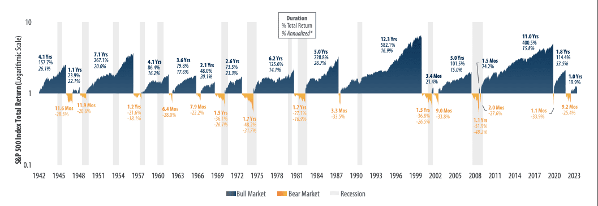

## Table of Contents

## What is a bear market?

A bear market is when the prices of stocks and other investments go down a lot, usually by 20% or more, for a long time. This happens when many people feel worried about the economy and start selling their investments. When lots of people sell, the prices drop even more. It's called a "bear" market because bears swipe downward with their paws, which is like how prices fall in this situation.

Bear markets can last for months or even years. They can be tough for investors because their money is worth less than before. But bear markets are a normal part of the economy. They often happen after times when the economy was doing really well, and prices were very high. After a bear market, the economy usually starts to get better, and a new period of growth begins.

## How is a bear market different from a bull market?

A bear market and a bull market are opposite situations in the world of investing. A bear market happens when the prices of stocks and other investments go down a lot, usually by 20% or more, and stay low for a long time. This often happens because people are worried about the economy and start selling their investments, which makes the prices drop even more. It's called a "bear" market because bears swipe downward with their paws, which is like how prices fall in this situation.

On the other hand, a bull market is when the prices of stocks and other investments go up a lot and keep going up for a long time. This happens when people feel good about the economy and start buying more investments, which makes the prices rise even more. It's called a "bull" market because bulls thrust upward with their horns, which is like how prices rise in this situation.

Both bear and bull markets are normal parts of the economy. They can last for months or even years. After a bear market, the economy usually starts to get better, and a bull market begins. And after a bull market, when prices get very high, a bear market can start. Understanding these cycles can help investors make better choices about when to buy and sell their investments.

## What are the common causes of bear markets?

Bear markets often start because people feel worried about the economy. When many people think that bad things are going to happen, like a recession or high unemployment, they start selling their stocks and other investments. This selling makes the prices of these investments go down a lot. Sometimes, big events like a financial crisis or a war can make people feel even more worried, which can make a bear market happen faster.

Another common cause of bear markets is when the economy has been doing really well for a long time. When prices get very high, some investors might think that the prices are too high and will start to fall soon. So, they sell their investments to avoid losing money. This selling can start a bear market. Also, if the government raises interest rates to control inflation, it can make borrowing money more expensive, which can slow down the economy and lead to a bear market.

## Can you list some major bear markets in history?

One big bear market happened in the late 1920s and early 1930s. It's called the Great Depression. The stock market crashed in 1929, and prices kept going down for years. People lost a lot of money, and many businesses closed. It was a very hard time for the economy.

Another famous bear market was in the early 2000s. It's called the Dot-com Bubble. Many internet companies had very high stock prices, but then people realized that these companies were not making as much money as they thought. So, they started selling their stocks, and the prices went down a lot. This bear market lasted from about 2000 to 2002.

A more recent bear market happened in 2007-2009. It's called the Global Financial Crisis. It started because of problems with housing loans in the United States. When people couldn't pay back their loans, banks lost a lot of money, and the economy got very bad. Stock prices fell a lot, and it took a long time for the economy to get better.

## How do bear markets affect the economy?

Bear markets can hurt the economy a lot. When stock prices go down, people who own stocks lose money. This makes them feel less rich, so they might spend less money on things like cars, houses, and vacations. When people spend less, businesses sell fewer things, which can lead to layoffs and higher unemployment. This can make the economy slow down even more, creating a cycle where things keep getting worse.

But bear markets are not all bad. They can help the economy in the long run by making prices more realistic. When stock prices are too high, a bear market can bring them back down to a level that makes more sense. This can make the economy healthier in the future. Also, when prices are low, it can be a good time for people to buy investments at a lower price, which can help the economy start growing again once the bear market is over.

## What are the psychological impacts of bear markets on investors?

Bear markets can make investors feel really worried and scared. When they see the prices of their investments going down a lot, they might start to think that they will lose all their money. This can make them feel stressed and anxious. Some investors might even panic and sell all their investments quickly, hoping to avoid losing more money. But selling in a panic can make things worse, because they might sell at a low price and miss out on the chance to make money when the market gets better.

On the other hand, some investors might feel sad and disappointed when their investments lose value. They might feel like they made bad choices and regret their decisions. This can make them lose confidence in their ability to invest. But it's important for investors to remember that bear markets are a normal part of the economy. By staying calm and not making quick decisions based on fear, they can better handle the ups and downs of the market and be ready for when things start to improve.

## How can investors prepare for a bear market?

Investors can prepare for a bear market by having a plan and sticking to it. They should think about how much risk they are okay with and choose investments that match that risk level. It's also a good idea to have some money saved up that they can use if they need it, so they don't have to sell their investments when the prices are low. By having a plan, investors can feel more calm and make better choices even when the market is going down.

Another way to get ready for a bear market is to spread out investments. This means not putting all their money in one type of investment, like just stocks. Instead, they can put some money in different things, like bonds or real estate. This can help protect their money because if one type of investment goes down, the others might not go down as much. It's also important for investors to keep learning about the market and the economy. By understanding what's happening, they can make smarter decisions and be ready for when the market starts to get better.

## What strategies can be used to invest during a bear market?

One good strategy for investing during a bear market is to keep a long-term view. Instead of getting scared and selling everything when prices are low, investors should remember that bear markets don't last forever. The market will eventually start to go up again. By staying calm and not making quick decisions based on fear, investors can hold onto their investments and wait for the market to recover. This way, they can benefit when prices go back up.

Another strategy is to look for good deals. When prices are low during a bear market, it can be a good time to buy investments that are now cheaper than before. Investors can look for strong companies that are still doing well, even if their stock prices are down. By buying these investments at a lower price, investors can make more money when the market turns around. It's like shopping during a big sale – you can get more for your money if you choose wisely.

Finally, it's helpful to keep a balanced portfolio. This means not putting all your money in one type of investment. Instead, spread it out among different kinds of investments, like stocks, bonds, and maybe even some cash. This way, if one type of investment goes down a lot, the others might not go down as much. It can help protect your money and make it easier to handle the ups and downs of a bear market.

## How have government policies historically responded to bear markets?

Governments often try to help during bear markets by making policies that can make the economy better. One common thing they do is lower interest rates. When interest rates are lower, it's cheaper for people and businesses to borrow money. This can help them spend more and invest more, which can help the economy start growing again. Governments might also spend more money themselves on things like building roads or helping people who are out of work. This is called fiscal policy, and it can help create jobs and make people feel more confident about the economy.

Another way governments respond to bear markets is by making rules to help the financial system. For example, after the Global Financial Crisis in 2007-2009, governments made new rules to make sure banks were safer and less likely to cause another big problem. These rules can help prevent future bear markets from happening or make them less bad when they do happen. By working together, governments and central banks try to make the economy stronger and more stable during tough times.

## What are the long-term effects of bear markets on stock market performance?

Bear markets can have big effects on the stock market in the long run. When a bear market happens, stock prices go down a lot. This can make people feel scared and worried about investing. But after a bear market, the economy usually starts to get better. The stock market often goes back up and can even reach new highs. So, even though bear markets can be tough, they are a normal part of the ups and downs of the market. Over time, the stock market has usually gone up, even after bear markets.

One good thing about bear markets is that they can help the stock market in the long run. When prices are low, it can be a good time for investors to buy stocks at a cheaper price. If they hold onto these investments, they can make more money when the market goes back up. Also, bear markets can help get rid of weak companies that were not doing well. This can make the overall market stronger and healthier. So, even though bear markets can be hard, they can set the stage for future growth and better performance in the stock market.

## How do bear markets influence different sectors of the economy?

Bear markets can affect different parts of the economy in different ways. Some sectors, like technology and finance, often feel the impact more because they are closely tied to the stock market. When stock prices go down, people might stop buying new gadgets or investing in new tech companies. Banks and financial companies might also see less business because people are more worried about their money and less likely to take out loans or invest.

Other sectors, like healthcare and consumer staples, might not be hurt as much by bear markets. People still need medicine and basic things like food and toilet paper, no matter what the stock market is doing. These sectors can be more stable during tough economic times. But even these sectors can feel some effects, like lower profits if people are spending less money overall.

In the end, bear markets can make the whole economy slow down. When people feel less rich because their investments are worth less, they might spend less money on things they want but don't need. This can lead to fewer sales for businesses, which might have to lay off workers or close down. But bear markets are a normal part of the economy, and after a while, things usually start to get better again.

## What role do global economic factors play in the onset and duration of bear markets?

Global economic factors can play a big part in starting and keeping bear markets going. When big economies like the United States, China, or Europe are doing badly, it can affect the whole world. For example, if there's a slowdown in one country, it might make people in other countries worried about their own economy. This worry can make them sell their investments, which can start a bear market. Also, things like trade wars or big changes in oil prices can make the world economy unstable, which can lead to bear markets.

Once a bear market starts, global economic factors can also affect how long it lasts. If many countries are trying to fix their economies at the same time, it can take longer for things to get better. For example, if a lot of countries are raising interest rates or cutting back on spending, it can slow down the whole world's economy. But if countries work together and make good policies, they can help shorten a bear market and get the world economy back on track faster.

## References & Further Reading

[1]: Galbraith, J. K. (1955). *The Great Crash 1929*. Houghton Mifflin Company.

[2]: Securities Act of 1933, 15 U.S.C. § 77a et seq. (1933).

[3]: Standard & Poor's S&P 500 Historical Prices.

[4]: Dodd-Frank Wall Street Reform and Consumer Protection Act, Pub.L. 111–203, H.R. 4173 (2010).

[5]: ["Flash Crash: Lessons for High Frequency Trading"](https://www.cftc.gov/sites/default/files/idc/groups/public/@economicanalysis/documents/file/oce_flashcrash0314.pdf) by Bob Ivry, Bloomberg

[6]: Lewis, M. (2014). *Flash Boys: A Wall Street Revolt*. W. W. Norton & Company.

[7]: Goolsbee, A. (2010). ["The Housing Bubble and Financial Crisis in the Light of Lessons Learned."](https://www.federalreserve.gov/newsevents/speech/bernanke20100103a.htm) National Bureau of Economic Research.

[8]: Keynes, J. M. (1936). *The General Theory of Employment, Interest, and Money*. Palgrave Macmillan.

[9]: Taleb, N. N. (2007). *The Black Swan: The Impact of the Highly Improbable*. Random House.