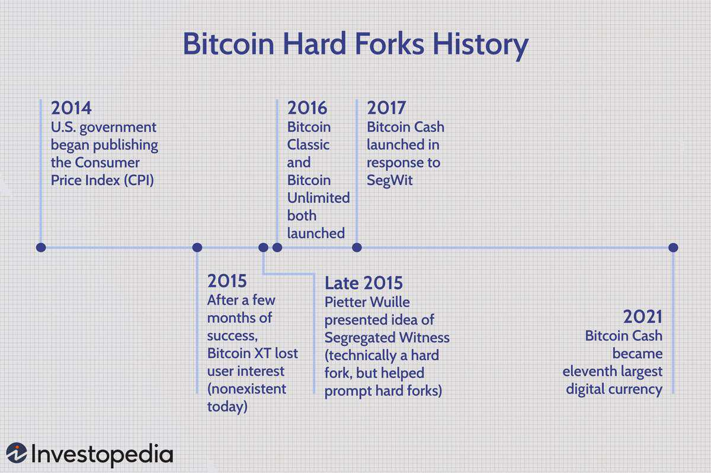

The world of cryptocurrency is a complex and dynamic field, with Bitcoin standing as a pioneering force. As this digital currency continues to gain mainstream acceptance, understanding its foundational mechanisms becomes increasingly important. Among these mechanisms, Bitcoin hard forks play a crucial role, as they are significant protocol alterations that can dramatically transform the cryptocurrency landscape. These forks can result in new blockchains and cryptocurrencies, leading to shifts in market dynamics and trading strategies. Given the rapid pace at which the cryptocurrency market evolves, recognizing the implications of hard forks is vital for both seasoned investors and newcomers to the sector.

This article will explore the nature and impact of Bitcoin hard forks, elucidating their significance within the broader context of cryptocurrency trading. Furthermore, we will examine how these forks influence the field of cryptocurrency algorithmic trading. In this sophisticated trading approach, computer programs execute trades based on pre-defined criteria, offering speed and precision unmatched by human traders. The interaction between hard forks and algorithmic trading illustrates the complexities and opportunities within the modern financial ecosystem.



Understanding these concepts is not merely academic; it provides actionable insights that can enhance trading strategies and financial decision-making. Whether you are a professional trader seeking to optimize your strategy or a beginner exploring the potential of cryptocurrencies, grasping the dynamics of Bitcoin hard forks and algorithmic trading offers valuable knowledge for navigating the intricacies of the crypto world. Join us as we take a thorough exploration of Bitcoin hard forks and the strategic use of algorithmic trading in cryptocurrency markets.

## Table of Contents

## Understanding Bitcoin Hard Forks

A Bitcoin hard fork represents a profound modification to the underlying protocol of the Bitcoin network, effectively dividing it into two distinct chains. This bifurcation can result in the emergence of a new blockchain and, consequently, a new cryptocurrency. Such forks are often instigated when a portion of the community expresses dissatisfaction with the current development path of the blockchain, prompting a formal split within the network.

Typically, hard forks are employed to implement new features or refine existing protocols to bolster the functionality or efficiency of the blockchain. For instance, modifications may be introduced to enhance transaction processing speeds, optimize security measures, or improve scalability. These developments are crucial as they influence the network's capability to handle increasing demand and adopt emerging technological advancements.

Prominent examples in Bitcoin's history include Bitcoin Cash and Bitcoin Gold, each born out of specific disagreements and objectives. Bitcoin Cash, for instance, emerged in 2017 due to debates over Bitcoin's scalability, leading it to adopt larger block sizes to increase transaction throughput. On the other hand, Bitcoin Gold was formed with the intent to decentralize mining by altering the mining algorithm, thus reducing the dominance of specialized mining equipment known as ASICs (Application-Specific Integrated Circuits).

For those engaged in Bitcoin trading and investment, comprehending the nuances of these forks is essential. These events not only influence market sentiments but also affect the valuation and performance of the resultant cryptocurrencies. As such, staying informed about the occurrence and implications of hard forks can provide valuable insights for making strategic trading and investment decisions in the [cryptocurrency](/wiki/cryptocurrency) domain.

## Timeline of Notable Bitcoin Hard Forks

Bitcoin XT was one of the earliest significant attempts to address Bitcoin's limitations, proposed in 2014 by Mike Hearn. The primary goal was to increase Bitcoin's transaction speed and scalability by increasing the block size from 1MB to 8MB. Despite an initial wave of interest, Bitcoin XT failed to achieve consensus among the community and was ultimately abandoned as network support dwindled[1].

Bitcoin Classic emerged in 2016 as another effort to increase block size, this time proposing a more moderate jump to 2MB. It aimed to address transaction bottleneck concerns while attempting to maintain alignment with Bitcoin's core principles. The proposal did not garner sufficient community backing, and as [momentum](/wiki/momentum) waned, Bitcoin Classic eventually faded out of the spotlight[2].

Bitcoin Unlimited, introduced in 2016, presented a more flexible approach by allowing miners to set their own block size limits. This approach sought to decentralize block size decision-making but faced challenges such as potential network instability and lack of broad miner consensus. Despite its innovative approach, Bitcoin Unlimited did not secure enough support to achieve widespread adoption[3].

In 2017, Bitcoin Cash was launched as a significant hard fork, aiming to improve transaction throughput by increasing the block size limit to 8MB and later to 32MB. This hard fork gained substantial traction and established itself as a prominent alternative to Bitcoin. Bitcoin Cash aimed to provide a solution to Bitcoin's scaling issues, appealing to users prioritizing faster and cheaper transactions.

Bitcoin Gold, launched in late 2017, attempted to democratize mining by adopting the Equihash proof-of-work algorithm, which is ASIC-resistant. This change was designed to decentralize mining and make it more accessible to individuals using standard GPUs, rather than specialized ASIC hardware. This fork highlighted the ongoing debate about mining centralization and network security[4].

Bitcoin SV, or Bitcoin Satoshi Vision, originated from a split in the Bitcoin Cash community in 2018. This hard fork emphasized a commitment to on-chain scalability with larger block sizes, aiming to stabilize the network for enterprise-level applications. Bitcoin SV promoted the idea that larger blocks would make the blockchain more cost-effective and usable for various large-scale applications[5].

### References:
1. Antonopoulos, Andreas M. _Mastering Bitcoin: Unlocking Digital Cryptocurrencies_. O'Reilly Media, 2014.
2. Popov, Serguei. _An Introduction to Distributed Systems and Blockchain_. Cambridge University Press, 2020.
3. Nakamoto, S. "Bitcoin: A Peer-to-Peer Electronic Cash System." 2008.
4. Wu, Jingming. "The Currency of Light: Investigating Cryptocurrencies and Blockchain Technology." Journal of Economic Perspectives, 2019.
5. Wright, Craig S. _The Bitcoin SV Authentication Challenge_. nChain, 2019.

## What Is Cryptocurrency Algorithmic Trading?

Cryptocurrency [algorithmic trading](/wiki/algorithmic-trading) utilizes sophisticated computer programs to execute trades at speeds surpassing human capabilities. These systems are especially valuable within the volatile environment of cryptocurrency markets where split-second decisions can lead to significant advantages or losses. By leveraging advanced algorithms, these programs can process vast amounts of market data, observing patterns and making trading decisions with precision and efficiency.

Algorithmic trading in the cryptocurrency sphere is characterized by its reliance on trading bots and high-frequency trading ([HFT](/wiki/high-frequency-trading-strategies)) systems. These tools operate based on predefined rules, which can include a diverse range of parameters such as price movements, market trends, and [volume](/wiki/volume-trading-strategy) shifts. Trading bots, for instance, can automatically buy or sell cryptocurrencies once certain conditions are met. 

A fundamental benefit of employing algorithmic trading systems is the elimination of emotional biases that frequently impair decision-making. Human traders are susceptible to emotions such as fear and greed, which can lead to suboptimal trading strategies. In contrast, an algorithm operates solely on logic and data, leading to more consistent and reliable performance over time.

Furthermore, algorithmic trading provides an effective mechanism for risk management and portfolio diversification. By systematically applying trading rules, these programs can limit potential losses and take advantage of market opportunities across a wide range of cryptocurrency pairs. For example, a simple trading strategy using the moving average crossover can be implemented as follows in Python:

```python
def moving_average_crossover(prices, short_window, long_window):
    short_moving_avg = prices.rolling(window=short_window, min_periods=1).mean()
    long_moving_avg = prices.rolling(window=long_window, min_periods=1).mean()

    signals = pd.DataFrame(index=prices.index)
    signals['signal'] = 0.0
    signals['signal'][short_window:] = np.where(short_moving_avg[short_window:] > long_moving_avg[short_window:], 1.0, 0.0)
    signals['positions'] = signals['signal'].diff()

    return signals
```

In this example, a trading signal is generated when the short-term moving average surpasses the long-term moving average, indicating a potential buying opportunity. Conversely, a sell signal is generated when the opposite occurs.

Despite the clear advantages, algorithmic trading also comes with challenges. These systems require significant investment in both software and hardware, alongside a deep understanding of financial markets and programming skills. There is also potential for technical glitches that could lead to unanticipated losses. Nonetheless, for many traders, the benefits of increased speed, efficiency, and the ability to backtest strategies with historical data make algorithmic trading an indispensable part of their cryptocurrency trading arsenal.

## Benefits and Challenges of Algo Trading in Crypto

Algorithmic trading in cryptocurrency offers a range of benefits and challenges, influencing how traders approach the fast-paced digital finance sector.

The benefits of crypto algorithmic trading are diverse. One notable advantage is lightning-fast execution. Unlike human traders who require time to analyze and execute transactions, algorithmic systems can react to market movements in milliseconds. This speed can be crucial in capitalizing on short-lived opportunities. Furthermore, the cryptocurrency market operates 24/7, which is another benefit for algorithmic traders. Automated systems can continuously monitor and trade without pause, ensuring traders do not miss out on opportunities during non-traditional trading hours.

Another significant advantage of algo trading is its ability to remove emotional biases from the trading process. Human traders are often influenced by emotions like fear and greed, which can lead to irrational decisions. Algorithmic trading, governed by predefined rules and logic, helps mitigate these emotional influences, fostering more consistent and rational trading. In addition, algorithmic trading facilitates portfolio diversification. By automating trading strategies and managing multiple assets, traders can easily maintain diversified portfolios, spreading risk across various investments.

Backtesting strategies is an integral part of algorithmic trading. Traders can use historical market data to test their strategies before deploying them in live markets, allowing for optimization and adjustment in trading strategies. This process ensures that the algorithm operates as expected under actual market conditions, thus reducing potential risks.

However, algorithmic trading in cryptocurrency comes with its own set of challenges. A significant hurdle is the substantial initial investment in software and hardware. Developing a robust trading algorithm often requires high-performance computing resources, which can be costly. Additionally, there is a complex learning curve associated with creating effective trading algorithms. It necessitates a deep understanding of mathematics and programming, demanding a strong technical foundation from traders and developers.

Moreover, technical glitches can pose significant risks in algorithmic trading. Faulty code or server failures can lead to erroneous trades or missed opportunities. Traders must ensure that their systems are thoroughly tested and monitored to avoid such issues.

Despite these challenges, many traders consider algorithmic trading an indispensable element of their strategy. When executed effectively, algorithmic trading plans can markedly increase trading efficiency and profitability. For example, a well-designed algorithm can optimize the timing of trades, improve the execution price, and reduce transaction costs.

By leveraging technology, traders can compete more effectively in volatile markets, reinforcing the importance of mastering both the benefits and challenges of algorithmic trading in cryptocurrency. Emphasizing risk management and ongoing system evaluation will be crucial for success.

## The Intersection of Bitcoin Hard Forks and Algo Trading

Hard forks can significantly affect algorithmic trading strategies, primarily when they lead to considerable network changes or the creation of new cryptocurrencies. These events introduce new variables into the trading environment that algorithmic traders must account for to maintain or enhance their strategies' effectiveness.

When a Bitcoin hard fork occurs, it often results in a split in the blockchain, forming a new chain alongside the original. This creates a new set of trading pairs, as the forked coin typically starts to trade independently of Bitcoin. Traders employing algorithmic strategies must therefore re-evaluate the market dynamics to identify how these new pairs impact [liquidity](/wiki/liquidity-risk-premium) and [volatility](/wiki/volatility-trading-strategies). This might involve adjusting algorithms to incorporate additional data streams and predictive models to account for the behavior of the newly introduced cryptocurrency.

The introduction of new coins from hard forks can also present novel trading opportunities. These opportunities arise because the forked coins often exhibit distinct price movements and volatility patterns separate from the original Bitcoin chain. However, these same factors can also introduce enhanced risk, as the lack of historical data on the new coin can make it challenging to model its behavior accurately. Consequently, traders need to conduct thorough analyses and periodically recalibrate their strategies to align with the evolving market conditions.

Furthermore, algorithmic traders must remain vigilant about upcoming hard forks and their potential implications. Many strategies rely on [backtesting](/wiki/backtesting) against historical market conditions, and significant network changes can render past data less predictive of future outcomes. By actively monitoring announcements for potential forks and analyzing pre-fork and post-fork market behavior, traders can better anticipate the changes that might affect their trading strategies.

In summary, while Bitcoin hard forks pose challenges to algorithmic trading due to changes in network conditions and market structures, they also offer unique opportunities. The key to leveraging these opportunities lies in the ability to rapidly adapt and refine trading algorithms in response to new and evolving market information.

## Conclusion

Bitcoin hard forks and cryptocurrency algorithmic trading are pivotal elements in the rapidly evolving world of digital finance. For investors and traders, understanding the nuances of hard forks is essential for maintaining a competitive edge within the crypto environment. Hard forks not only create potential opportunities by introducing new cryptocurrencies or adjusting functionalities but also pose challenges, as they can impact network dynamics and trading strategies. An adept comprehension of these splits in the blockchain can aid market participants in making informed decisions, ultimately enhancing their trading acumen.

On the other hand, algorithmic trading offers a sophisticated and technology-driven approach to trading. By utilizing computer programs that execute trades at speeds far surpassing human capability, traders can leverage precision and efficiency to their advantage. The ability to process vast amounts of market data and respond almost instantaneously allows traders to capitalize on market opportunities while mitigating risks associated with human emotions and biases. This technological edge is critical in the volatile and round-the-clock trading environment of cryptocurrencies.

As the cryptocurrency ecosystem continues to evolve, the interplay between hard forks and algorithmic trading will undoubtedly shape trading strategies and influence market dynamics. New forks can lead to the emergence of novel cryptocurrencies, each with distinct market characteristics, thereby requiring algorithmic systems to adapt to new trading pairs and liquidity conditions. The continuous innovation and transformation in this space mean that staying informed and adaptable is paramount.

Ultimately, to navigate the complexities of cryptocurrency markets effectively, there is an imperative need for both awareness and flexibility. Remaining vigilant about the latest developments in hard forks and advancements in algorithmic trading techniques will be key to thriving in the ever-changing landscape of digital currencies.

## References & Further Reading

1. Antonopoulos, Andreas M. _Mastering Bitcoin: Unlocking Digital Cryptocurrencies_. O'Reilly Media, 2014.

2. Popov, Serguei. _An Introduction to Distributed Systems and Blockchain_. Cambridge University Press, 2020.

3. Nakamoto, Satoshi. "Bitcoin: A Peer-to-Peer Electronic Cash System." 2008. [Link](https://nakamotoinstitute.org/library/bitcoin/)

4. Wu, Jingming. "The Currency of Light: Investigating Cryptocurrencies and Blockchain Technology." Journal of Economic Perspectives, 2019.

5. Wright, Craig S. _The Bitcoin SV Authentication Challenge_. nChain, 2019.

6. ["Advances in Financial Machine Learning"](https://www.amazon.com/Advances-Financial-Machine-Learning-Marcos/dp/1119482089) by Marcos Lopez de Prado

7. ["Machine Learning for Algorithmic Trading"](https://github.com/stefan-jansen/machine-learning-for-trading) by Stefan Jansen

8. ["Quantitative Trading: How to Build Your Own Algorithmic Trading Business"](https://www.amazon.com/Quantitative-Trading-Build-Algorithmic-Business/dp/0470284889) by Ernest P. Chan

9. ["Evidence-Based Technical Analysis: Applying the Scientific Method and Statistical Inference to Trading Signals"](https://www.amazon.com/Evidence-Based-Technical-Analysis-Scientific-Statistical/dp/0470008741) by David Aronson