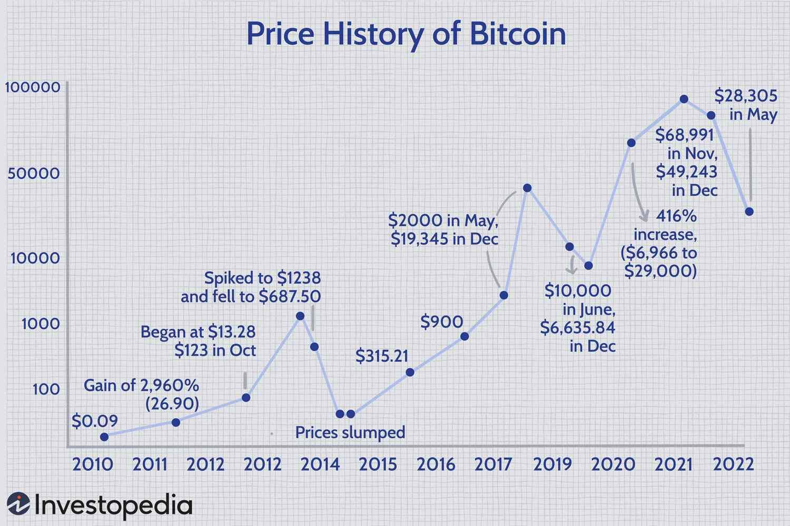

Bitcoin, often termed as the first decentralized digital currency, emerged as a groundbreaking financial asset upon its inception by the pseudonymous Satoshi Nakamoto in 2009. Utilizing a peer-to-peer network and a distributed ledger technology known as blockchain, Bitcoin ensures transparency, security, and the elimination of intermediaries in financial transactions. Its significance in the cryptocurrency market is profound, acting as a pioneer that has paved the way for thousands of subsequent cryptocurrencies. As the most widely recognized and adopted digital currency, Bitcoin serves as a benchmark or reference point for gauging the cryptocurrency market's health and trends.

Algorithmic trading, meanwhile, is a method of executing orders using automated pre-programmed trading instructions accounting for variables such as time, price, and volume. Leveraging computational power, algorithmic trading can enhance trading efficiency and accuracy, while minimizing human intervention and the potential for emotional decision-making. In finance, algorithms are pivotal for executing large orders, managing complex portfolios, and facilitating market-making activities.

Analyzing Bitcoin's price history is crucial for several reasons. Firstly, it provides insights into the cryptocurrency's volatility, which surpasses that of most traditional financial assets. Understanding these price movements and their underlying causes is vital for traders and investors aiming to make informed decisions. Secondly, historical price examination equips market participants with the data necessary to develop predictive models, crucial for risk management and strategic planning.

The interplay between Bitcoin price history and algorithmic trading is a significant aspect of modern financial markets. Using historical price patterns, algorithms can be designed to identify trading opportunities in Bitcoin markets by predicting future price movements or by recognizing repetitive market behaviors. This application is especially important given Bitcoin's volatility, where rapid price changes can lead to substantial gains or losses. The synthesis of Bitcoin's price data and algorithmic trading principles presents a frontier in trading strategies, where historical data analysis directly informs the development of automated trading schemes.

In this article, we will explore Bitcoin's price history, emphasizing critical milestones and factors influencing its market dynamics. We will also cover the principles and applications of algorithmic trading, particularly within the cryptocurrency landscape, and investigate how analyzing past price data can inform algorithmic strategies. Finally, we will look toward future trends, including technological advancements and regulatory developments, and their potential implications for Bitcoin trading and investment strategies.

## Table of Contents

## Understanding Bitcoin's Price History

Bitcoin, introduced in 2009 by an anonymous entity known as Satoshi Nakamoto, emerged as the pioneering cryptocurrency, setting the stage for the blockchain technology revolution. Initially valued at a fraction of a cent, Bitcoin's price remained relatively stable and obscure, chiefly used within select digital communities. This initial phase was marked by limited market presence and negligible recognition from traditional financial sectors.

### Major Price Milestones

Bitcoin's journey from obscurity to mainstream attention is marked by significant price milestones. In 2010, Bitcoin experienced its first notable valuation when it reached parity with the US dollar, highlighting its growing use and acceptance. By 2013, Bitcoin's price ascended to over $1,000, propelled by increased media coverage and adoption. The year 2017 marked another pivotal milestone, where Bitcoin's price skyrocketed to nearly $20,000 amid heightened investor interest and market speculation.

### Key Factors Influencing Bitcoin's Price

Bitcoin's price has been historically influenced by several key factors:

1. **Market Demand and Supply**: Bitcoin’s fixed supply of 21 million coins makes its price highly susceptible to changes in demand. For instance, halving events, occurring approximately every four years, reduce the reward for mining new blocks, often leading to increased scarcity and price appreciation.

2. **Regulatory Developments**: Announcements from governments regarding cryptocurrency regulations significantly impact Bitcoin's price. Positive regulatory news typically enhances investor confidence, leading to price surges, while negative news can prompt sell-offs.

3. **Macroeconomic Factors**: Global economic conditions such as inflation fears, currency devaluation, and geopolitical tensions can drive investors towards Bitcoin as a hedge, influencing its price.

4. **Technological Advancements and Security**: Enhancements in Bitcoin’s underlying technology, including the implementation of SegWit or the Lightning Network, can positively affect its price by improving scalability and transaction efficiency. Conversely, security breaches and hacks can negatively impact market perception and price.

### Notable Periods of Volatility and Stability

Bitcoin's price history is characterized by periods of both extreme [volatility](/wiki/volatility-trading-strategies) and relative stability. The 2013-2014 period saw extreme volatility, as Bitcoin's price surged to $1,100 in late 2013 before crashing to around $200 in early 2015, primarily due to the collapse of the Mt. Gox exchange.

Conversely, 2018 to early 2019 was a relatively stable period for Bitcoin’s price, maintaining a range between $3,000 and $4,000. Such stability often followed after sharp price corrections, indicating a period of market consolidation.

### Lessons from Bitcoin's Past Price Trends

The history of Bitcoin's price offers several valuable lessons:

- **Volatility as an Intrinsic Feature**: Bitcoin’s extreme price swings underscore its high-risk, high-reward nature. Investors need to be prepared for sudden changes driven by market sentiment and external factors.

- **Long-term Potential**: Despite frequent short-term fluctuations, Bitcoin has shown a substantial long-term growth trajectory, suggesting potential resilience and a growing market acceptance.

- **Influence of Behavioral Economics**: Investor psychology plays a critical role, where fear of missing out (FOMO) and panic selling contribute significantly to price volatility. Understanding these psychological factors can be crucial for effective market participation.

In summary, Bitcoin’s price history, from its inception to its position as a significant financial asset, provides crucial insights into the dynamics of [cryptocurrency](/wiki/cryptocurrency) markets and serves as a foundation for developing informed trading strategies.

## The Role of Algorithmic Trading in Cryptocurrency

Algorithmic trading, often referred to as algo trading, involves the use of computer programs to execute trades based on a set of predefined rules and algorithms. These algorithms analyze various market variables, such as price, [volume](/wiki/volume-trading-strategy), and time, to make decisions about buying or selling assets. The fundamental principles of algo trading include speed, precision, and the ability to process complex mathematical models and data sets in real time. These principles allow traders to exploit fleeting opportunities in financial markets by executing orders faster than human traders.

In traditional financial markets, [algorithmic trading](/wiki/algorithmic-trading) has become increasingly prevalent. It is often used for functions such as [market making](/wiki/market-making), [arbitrage](/wiki/arbitrage), and [trend following](/wiki/trend-following). The rapid execution of trades, reduced transaction costs, and minimization of human emotions in trading decisions are some of the significant advantages of algorithmic trading. By deploying robots to handle trades, institutions can capitalize on minute price discrepancies and consistently apply sophisticated trading strategies that would be challenging for humans to maintain.

The application of algo trading extends into the cryptocurrency market, where it has gained considerable significance. The cryptocurrency market is known for its high volatility and 24/7 operation, making it an ideal candidate for algorithmic strategies. In cryptocurrency trading, algorithms can monitor multiple exchanges simultaneously to exploit price differences, a practice known as arbitrage. They also take advantage of the frequent price fluctuations inherent in digital currencies to implement strategies focused on [momentum](/wiki/momentum) and market-making.

Using algorithmic trading for Bitcoin specifically offers several benefits. One primary advantage is the ability to conduct trades at any time, without the limitations of human traders needing rest. The automated nature of algo trading can also lead to more disciplined trading, as strategies are executed based on objective criteria rather than emotional responses to market movements. Furthermore, algorithmic trading can help manage risk by [backtesting](/wiki/backtesting) strategies on historical data to gauge their effectiveness before actual trading.

Despite these benefits, algorithmic trading with Bitcoin is not without risks. The high volatility of Bitcoin can lead to significant losses if algorithms are not designed to handle sudden market swings. Additionally, technical failures, such as bugs in the algorithm or network connectivity issues, can disrupt trading operations. The competitive landscape also means that once a profitable strategy is widely known or exploited, its effectiveness typically diminishes.

Popular strategies in cryptocurrency algo trading include [statistical arbitrage](/wiki/statistical-arbitrage), trend-following, and market-making. Statistical arbitrage involves complex statistical models to predict short-term movements in asset prices, allowing traders to profit from small price differentials. Trend-following strategies attempt to capture gains through the analysis of an asset's momentum in one direction, betting that prices will continue on their current path. Market-making involves providing [liquidity](/wiki/liquidity-risk-premium) by simultaneously placing buy and sell orders to capture the spread between them.

Overall, algorithmic trading plays a vital role in modern cryptocurrency markets, offering both opportunities and challenges. Its effectiveness hinges on the sophistication of the algorithms and the robustness of the technology supporting them. As cryptocurrencies evolve, algorithmic trading is likely to become even more integral to the landscape, requiring continuous innovation and adaptation from traders and technologists alike.

## Analyzing Bitcoin's Price Patterns with Algorithmic Trading

Historical price data plays a crucial role in algorithmic trading, serving as the foundation upon which strategies are developed, tested, and executed. By analyzing this data, traders can identify patterns, trends, and anomalies that may signal profitable trading opportunities.

To effectively analyze Bitcoin's price patterns, traders employ various tools and techniques. These include statistical methods, technical indicators, and [machine learning](/wiki/machine-learning) models. Common statistical methods involve examining metrics like moving averages, Bollinger Bands, and relative strength index (RSI), which assist in identifying trends and market momentum. More sophisticated techniques involve time-series analysis, such as ARIMA (Autoregressive Integrated Moving Average) models, which can forecast future prices based on past values.

Machine learning, particularly [deep learning](/wiki/deep-learning), offers advanced capabilities for analyzing Bitcoin's price patterns. Algorithms like recurrent neural networks (RNNs) and [long short](/wiki/equity-long-short)-term memory (LSTM) models excel at capturing temporal dependencies in sequential data, making them effective for predicting Bitcoin prices.

Case studies exemplify the successful application of algorithmic trading in Bitcoin markets. For example, a trading firm might deploy a moving average crossover strategy, where algorithms automatically buy Bitcoin when the short-term moving average crosses above the long-term moving average, indicating an upward trend, and sell when the opposite occurs. Another case could involve the use of sentiment analysis, where algorithms mine social media and news articles to gauge market sentiment and make data-driven trading decisions.

Despite these successes, algorithmic trading in Bitcoin faces significant challenges and limitations. The highly volatile nature of the cryptocurrency market can lead to unpredictable price movements, rendering some algorithms less effective. Additionally, the risk of overfitting—designing a model too closely tuned to historical data—can lead to poor performance in unseen market conditions. Moreover, external factors like regulatory changes and macroeconomic events can drastically influence Bitcoin prices, adding layers of complexity that algorithms may struggle to account for.

For beginners interested in Bitcoin algorithmic trading, it is advisable to start with simpler strategies and gradually develop more complex models. Simulated trading on historical data, known as backtesting, provides a safe environment to evaluate strategies without financial risk. Open-source libraries such as NumPy, pandas, and scikit-learn in Python offer powerful tools for data manipulation and analysis. Platforms like QuantConnect and [Interactive Brokers](/wiki/interactive-brokers-api) support algorithmic trading strategies, offering both data and backtesting capabilities. As knowledge and experience grow, traders can begin to incorporate more advanced techniques, such as neural networks and natural language processing, to further refine their approaches. Continuous learning and adaptation to market changes are essential for maintaining competitive edge in the volatile landscape of Bitcoin trading.

## Future Trends and Developments

Bitcoin's price trends have been driven by numerous factors throughout its history, including market demand, geopolitical events, and regulatory developments. While historical price data cannot precisely predict future trends due to the volatile nature of cryptocurrencies, it provides insight into potential future movements.

Historically, Bitcoin has experienced several bull and bear cycles, often influenced by its halving events, market sentiment, and macroeconomic factors. Given this, future price movements may reflect similar patterns. Analysts often assess moving averages, trading volumes, and historical price resistance and support levels to infer possible future trends.

Advancements in algorithmic trading technology have significantly impacted cryptocurrency markets. Early algorithmic trading strategies merely relied on fixed statistical models. Contemporary methods, however, incorporate real-time analysis and dynamic strategy adjustments. The integration of AI and machine learning has further enhanced these capabilities, allowing for the development of predictive models that learn from vast datasets and improve over time. Techniques such as neural networks and [reinforcement learning](/wiki/reinforcement-learning) are becoming increasingly prevalent in developing sophisticated trading algorithms capable of identifying patterns and executing trades with minimized human intervention.

Potential regulatory changes could significantly impact Bitcoin's market dynamics and algorithmic trading. Throughout its history, Bitcoin has faced varied regulatory responses, from outright bans to the introduction of supportive frameworks. Regulatory clarity can attract institutional investors, leading to increased market liquidity and stability. Conversely, stringent regulations may limit market participation or induce volatility. Algorithmic trading platforms may need to adapt by incorporating compliance checks and risk management practices to navigate the diverse regulatory landscape.

Given these trends, investors and traders must remain agile, continually adapting to new technological tools and regulatory environments. The use of AI-enhanced algorithmic trading strategies could provide a competitive edge by improving accuracy in price prediction and trade execution. However, the inherent unpredictability of the cryptocurrency market suggests that reliance solely on algorithms without human oversight may lead to significant risks. Therefore, a balanced approach that combines advanced algorithmic tools with human expertise will likely be essential for successful trading in the evolving crypto market landscape.

## Conclusion

Bitcoin's price history offers invaluable insights essential for successful trading endeavors. A thorough analysis of past price trends helps traders identify patterns, anticipate future movements, and develop effective trading strategies. This historical perspective forms a foundation upon which investors and traders can build their decision-making frameworks, enhancing their ability to navigate the often volatile cryptocurrency market.

Algorithmic trading plays a critical role in today’s cryptocurrency markets, providing tools that allow traders to execute transactions based on predetermined criteria with precision and speed. These technologies facilitate more efficient market operations by minimizing human errors and optimizing strategies in rapidly changing market conditions. By employing algorithms, traders can harness historical data and market signals to make informed, timely, and objective trading decisions.

The volatile and rapidly evolving nature of the crypto market demands continuous learning and adaptation. Traders and investors must keep abreast of technological advancements, regulatory changes, and evolving market dynamics to maintain a competitive edge. This continuous learning ethos ensures that traders remain agile, adapting to new developments effectively in their trading strategies.

For those inspired to explore Bitcoin algorithmic trading further, numerous educational resources, tools, and platforms can facilitate this journey. Whether you are a novice or experienced trader, engaging actively with the community, continuously learning cutting-edge techniques, and experimenting with algorithmic trading can open new possibilities within the cryptocurrency landscape. Initiatives like developing simple trading algorithms, backtesting strategies, or contributing to open-source projects could be initial steps toward mastering Bitcoin algorithmic trading, offering potential rewards as well as essential learning experiences.

## References & Further Reading

[1]: Nakamoto, S. (2008). ["Bitcoin: A Peer-to-Peer Electronic Cash System."](https://nakamotoinstitute.org/library/bitcoin/)

[2]: Narang, R. K. (2009). ["Inside the Black Box: A Simple Guide to Quantitative and High Frequency Trading."](https://www.amazon.com/Inside-Black-Box-Quantitative-High-Frequency/dp/1119931894) John Wiley & Sons.

[3]: Chan, E. (2013). ["Algorithmic Trading: Winning Strategies and Their Rationale."](https://github.com/ftvision/quant_trading_echan_book) Wiley Trading.

[4]: Antonopoulos, A. M. (2017). ["Mastering Bitcoin: Unlocking Digital Cryptocurrencies."](https://books.google.com/books/about/Mastering_Bitcoin.html?id=IXmrBQAAQBAJ) O'Reilly Media.

[5]: Momtaz, P. P. (2020). ["Initial Coin Offerings."](https://journals.plos.org/plosone/article?id=10.1371/journal.pone.0233018) Management Science, 66(11), 5193-5214.  

[6]: Lopez de Prado, M. (2018). ["Advances in Financial Machine Learning."](https://www.amazon.com/Advances-Financial-Machine-Learning-Marcos/dp/1119482089) John Wiley & Sons.

[7]: Hougan, M., & Lawant, D. (2019). ["Cryptoassets: The Guide to Bitcoin, Blockchain, and Cryptocurrency for Investment Professionals."](https://www.cfainstitute.org/-/media/documents/article/rf-brief/rfbr-cryptoassets.ashx) CFA Institute Research Foundation.

[8]: Gandal, N., & Halaburda, H. (2016). ["Competition in the Cryptocurrency Market."](https://papers.ssrn.com/sol3/papers.cfm?abstract_id=2506463) Journal of Financial Market Infrastructures, 3(3), 1-20.