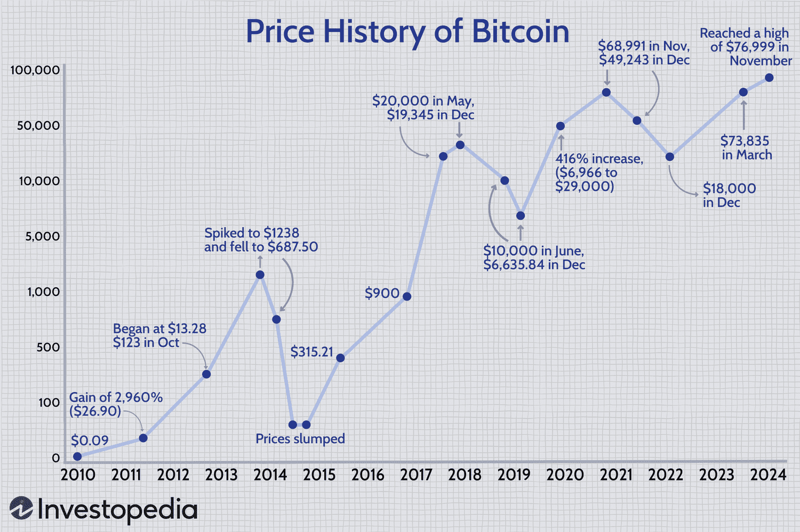

## Table of Contents

## What is Bitcoin and why was it created?

Bitcoin is a type of digital money that you can use to buy things online. It was created in 2009 by someone using the name Satoshi Nakamoto. Unlike regular money, Bitcoin is not controlled by a government or a bank. Instead, it uses a special technology called blockchain to keep track of all the transactions. This makes it very secure and hard to fake.

The main reason Bitcoin was created was to have a way to send money directly from one person to another without needing a bank or other middleman. Satoshi Nakamoto wanted to make a system where people could trust each other without needing a central authority. This was especially important during the 2008 financial crisis when many people lost trust in banks. Bitcoin aims to give people more control over their money and make financial transactions more open and fair.

## When was Bitcoin first introduced to the market?

Bitcoin was first introduced to the market in January 2009. This was when the first version of the Bitcoin software was released by Satoshi Nakamoto. People could start using Bitcoin to send and receive money without any banks or governments controlling it.

The idea of Bitcoin was shared with the world in a paper called the Bitcoin whitepaper, which was released in October 2008. This paper explained how Bitcoin would work and why it was needed. It took a few months after the whitepaper for the actual software to be ready and for people to start using Bitcoin.

## What was the initial price of Bitcoin?

When Bitcoin first started, it did not have a fixed price because not many people were using it. The first time Bitcoin was traded for real money was in October 2009. Someone bought 5,050 Bitcoins for $5.02, which means each Bitcoin was worth about $0.0009. This was the first time Bitcoin had a price in regular money.

As more people started to use Bitcoin, its price began to change more often. By July 2010, the price of one Bitcoin had gone up to $0.08. This was a big jump from the first trade, showing that people were starting to see Bitcoin as more valuable. The price kept changing as more people learned about and started using Bitcoin.

## How did Bitcoin's price change in its early years?

In the early years, Bitcoin's price was very low and did not change much because not many people knew about it or used it. The first time someone traded Bitcoin for regular money was in October 2009, when 5,050 Bitcoins were sold for $5.02, making each Bitcoin worth about $0.0009. By July 2010, the price had gone up to $0.08, which was a big increase but still very low compared to today's prices. During this time, Bitcoin was mostly used by a small group of people who were interested in new technology and digital money.

As more people learned about Bitcoin and started using it, the price began to change more often and usually went up. In February 2011, the price reached $1 for the first time. By June 2011, it had jumped to $31, but then it fell back down to $2 soon after. This showed that Bitcoin's price could be very unstable. Over the next few years, the price kept going up and down, but overall, it was going up. By the end of 2013, the price had reached over $1,000, showing that Bitcoin was becoming more popular and valuable.

## What were the major events that influenced Bitcoin's price in the 2010s?

In the 2010s, several big events influenced Bitcoin's price. One important event was the creation of the first Bitcoin exchange, called Mt. Gox, in 2010. This made it easier for people to buy and sell Bitcoins, which helped the price go up. Another event was the Bitcoin pizza day in May 2010, when someone used 10,000 Bitcoins to buy two pizzas. This was one of the first times Bitcoin was used to buy something in real life, and it showed that Bitcoin could be used like regular money. In 2013, the price of Bitcoin jumped a lot after Cyprus had a financial crisis. People in Cyprus started using Bitcoin to move their money safely, which made more people around the world interested in Bitcoin.

Another big event was the closure of the Silk Road in 2013. The Silk Road was a website where people could buy illegal things using Bitcoin. When the government shut it down, it made people think about whether Bitcoin was safe to use. This caused the price to go down for a while. But later in 2013, China's biggest Bitcoin exchange started allowing people to trade Bitcoin for the Chinese yuan, which made the price go up a lot. By the end of 2013, Bitcoin's price had reached over $1,000 for the first time. In 2017, Bitcoin's price went up even more when big companies like CME Group and CBOE started offering Bitcoin futures. This made Bitcoin seem more like a real investment, and the price went up to almost $20,000 by the end of 2017.

## How did the introduction of Bitcoin exchanges affect its price?

The introduction of Bitcoin exchanges had a big effect on its price. When the first Bitcoin exchange, Mt. Gox, opened in 2010, it made it easier for people to buy and sell Bitcoins. Before this, it was hard to trade Bitcoin because there was no easy way to do it. With an exchange, people could see the price of Bitcoin and trade it with others. This made more people interested in Bitcoin and helped its price go up. As more exchanges opened, like Coinbase in 2012, it became even easier to buy and sell Bitcoin, which made the price keep going up.

Exchanges also made Bitcoin more popular because they helped create a market for it. When people could see the price of Bitcoin going up and down on exchanges, it made them want to buy and sell it more. This increased the demand for Bitcoin, which made its price go up. For example, when China's biggest Bitcoin exchange started allowing trades with the Chinese yuan in 2013, it made the price of Bitcoin go up a lot because more people in China started using it. Overall, Bitcoin exchanges played a big role in making Bitcoin's price go up by making it easier for people to trade and by making it more popular.

## What role did media coverage play in Bitcoin's price fluctuations?

Media coverage had a big impact on Bitcoin's price fluctuations. When the news talked about Bitcoin, it made more people interested in it. If the news was good, like stories about how Bitcoin could change the world or how rich people were making money with it, more people wanted to buy Bitcoin. This made the price go up because more people were trying to buy it than sell it. For example, when big news outlets started covering Bitcoin in 2013 and 2017, the price went up a lot because more people learned about it and wanted to buy it.

On the other hand, bad news could make the price go down. If the news talked about problems with Bitcoin, like hacks or fraud, people got scared and wanted to sell their Bitcoin. This made the price go down because more people were trying to sell than buy. For instance, when the Silk Road was shut down in 2013, the media talked a lot about how Bitcoin was being used for illegal things, which made the price drop for a while. So, media coverage played a big role in making Bitcoin's price go up and down by changing what people thought about it.

## How have regulatory changes impacted Bitcoin's price over time?

Regulatory changes have had a big impact on Bitcoin's price over time. When governments make new rules about Bitcoin, it can make the price go up or down. For example, in 2013, China said that Bitcoin was not real money, but people could still use it. This made the price go down at first because people were worried. But then, China's biggest Bitcoin exchange started allowing trades with the Chinese yuan, which made the price go up a lot because more people in China started using Bitcoin.

Later on, in 2017, when big countries like Japan said that Bitcoin was legal to use, it made the price go up even more. People felt safer using Bitcoin because they knew it was okay with the government. But when countries like South Korea and India talked about banning or limiting Bitcoin in 2018, it made the price go down because people were scared that they might not be able to use it anymore. So, what governments say and do about Bitcoin can really change its price a lot.

## What are some of the highest and lowest points in Bitcoin's price history?

Bitcoin's price has had some very high and very low points over the years. The lowest price of Bitcoin was at the very beginning, in October 2009, when someone bought 5,050 Bitcoins for $5.02, making each Bitcoin worth about $0.0009. This was when not many people knew about Bitcoin, and it was hard to buy or sell it. Another low point was in 2015 when the price dropped to around $200 after reaching highs of over $1,000 in 2013. These lows happened because fewer people were interested in Bitcoin, and there were worries about its future.

The highest points in Bitcoin's price history have been very exciting. In December 2017, Bitcoin reached its highest price ever at that time, going up to almost $20,000. This happened because a lot of people were talking about Bitcoin, and many wanted to buy it. Another big high was in November 2021, when Bitcoin hit a new record high of over $68,000. This was because more big companies and investors started to see Bitcoin as a good investment, and more people were using it. These highs and lows show how much Bitcoin's price can change and how it depends on what people think about it.

## How does Bitcoin's price volatility compare to traditional financial assets?

Bitcoin's price can change a lot more than traditional financial assets like stocks or bonds. This is called [volatility](/wiki/volatility-trading-strategies). For example, stocks of big companies might go up or down by a few percent in a day, but Bitcoin can go up or down by 10% or even more in just one day. This happens because Bitcoin is still new and not as many people use it as they do traditional money. Also, there are no big banks or governments controlling Bitcoin's price, so it can change a lot based on what people think about it.

Traditional financial assets are usually less volatile because they are backed by big companies or governments. For example, if you buy a stock, you are buying a part of a company that makes things or provides services. If the company does well, the stock price might go up slowly over time. Bonds are even less volatile because they are like loans to a government or company, and they pay you back with interest. Bitcoin, on the other hand, doesn't have a company or government behind it, so its price can be more unpredictable. This makes it riskier but also means it can go up a lot faster if more people start using it.

## What are the key technical indicators used to analyze Bitcoin's price movements?

Key technical indicators used to analyze Bitcoin's price movements include the moving average, which helps show the average price of Bitcoin over a certain period. There are two types: the simple moving average (SMA) and the exponential moving average (EMA). The SMA gives equal weight to all prices in the period, while the EMA gives more weight to recent prices. Traders use these to see if Bitcoin's price is trending up or down. If the price is above the moving average, it might be a good time to buy because the price is going up. If it's below, it might be a good time to sell because the price is going down.

Another important indicator is the Relative Strength Index (RSI), which measures how fast and how much the price of Bitcoin is changing. The RSI goes from 0 to 100. If the RSI is over 70, it means Bitcoin might be overbought, and the price could go down soon. If it's under 30, it means Bitcoin might be oversold, and the price could go up. Traders use the RSI to decide when to buy or sell Bitcoin. The Bollinger Bands are also used, which show the high and low points of Bitcoin's price over time. When the price moves outside the bands, it might mean the price is going to change direction soon. These indicators help traders understand Bitcoin's price movements and make better decisions about when to buy or sell.

## What are the current trends and future predictions for Bitcoin's price?

Right now, Bitcoin's price is still going up and down a lot. More and more people are using Bitcoin, and big companies are starting to accept it as payment. This is making more people interested in Bitcoin, which can make the price go up. Also, countries like El Salvador have made Bitcoin legal money, which shows that some governments are starting to see Bitcoin as real money. But, there are still worries about rules and safety. If a big country makes strict rules about Bitcoin, it could make the price go down. Right now, many people think Bitcoin's price could keep going up if more people start using it and if it becomes easier to buy and sell.

Looking into the future, it's hard to say exactly what will happen with Bitcoin's price because it depends on a lot of things. Some experts think Bitcoin could keep getting more popular and its price could go up a lot. They say that if more big companies and banks start using Bitcoin, it could become a normal part of money. But other experts think that if there are big problems with Bitcoin, like hacks or if governments make it hard to use, the price could go down. Overall, most people agree that Bitcoin will keep being a big deal in the world of money, but whether the price goes up or down will depend on what happens with rules, safety, and how many people use it.

## References & Further Reading

[1]: Nakamoto, S. (2008). ["Bitcoin: A Peer-to-Peer Electronic Cash System."](https://nakamotoinstitute.org/library/bitcoin/)

[2]: Narang, R. K. (2009). ["Inside the Black Box: A Simple Guide to Quantitative and High Frequency Trading."](https://www.amazon.com/Inside-Black-Box-Quantitative-High-Frequency/dp/1119931894) John Wiley & Sons.

[3]: Chan, E. (2013). ["Algorithmic Trading: Winning Strategies and Their Rationale."](https://github.com/ftvision/quant_trading_echan_book) Wiley Trading.

[4]: Antonopoulos, A. M. (2017). ["Mastering Bitcoin: Unlocking Digital Cryptocurrencies."](https://books.google.com/books/about/Mastering_Bitcoin.html?id=IXmrBQAAQBAJ) O'Reilly Media.

[5]: Momtaz, P. P. (2020). ["Initial Coin Offerings."](https://journals.plos.org/plosone/article?id=10.1371/journal.pone.0233018) Management Science, 66(11), 5193-5214.  

[6]: Lopez de Prado, M. (2018). ["Advances in Financial Machine Learning."](https://www.amazon.com/Advances-Financial-Machine-Learning-Marcos/dp/1119482089) John Wiley & Sons.

[7]: Hougan, M., & Lawant, D. (2019). ["Cryptoassets: The Guide to Bitcoin, Blockchain, and Cryptocurrency for Investment Professionals."](https://www.cfainstitute.org/-/media/documents/article/rf-brief/rfbr-cryptoassets.ashx) CFA Institute Research Foundation.

[8]: Gandal, N., & Halaburda, H. (2016). ["Competition in the Cryptocurrency Market."](https://papers.ssrn.com/sol3/papers.cfm?abstract_id=2506463) Journal of Financial Market Infrastructures, 3(3), 1-20.