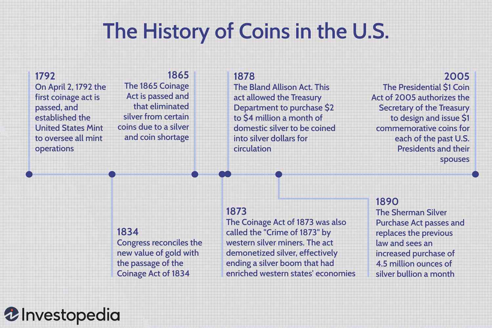

## Table of Contents

## What was the first official currency of the United States?

The first official currency of the United States was the Continental Currency. It was introduced in 1775 during the American Revolutionary War. The Continental Congress, which was the government at that time, needed money to pay for the war against Britain. So, they decided to print their own money. They called it "Continentals."

However, the Continental Currency did not last long. People started to lose trust in it because the government printed too much of it. This caused inflation, which means the value of the money went down. Soon, people did not want to use Continentals anymore. By 1781, the Continental Currency had become almost worthless. After the war, the United States started using different state currencies until they created the U.S. dollar in 1792.

## When was the Coinage Act of 1792 passed, and what did it establish?

The Coinage Act of 1792 was passed on April 2, 1792. This was an important law because it set up the United States Mint and created the country's first official currency, the U.S. dollar.

The act decided what coins would be made, how much they would be worth, and what they would be made of. It said that coins like the dollar, half dollar, quarter dollar, dime, and cent would be made from gold, silver, or copper. This law helped make the money system in the United States more organized and stable after the problems with the Continental Currency.

## What are the key features of the early U.S. coins like the Flowing Hair dollar?

The Flowing Hair dollar was one of the first coins made by the United States. It was made from 1794 to 1795. On the front of the coin, there is a picture of a woman with long, flowing hair. This woman is supposed to represent Liberty. Around her, there are 15 stars, which stand for the 15 states in the country at that time. On the back of the coin, there is an eagle with wings spread out. The eagle is holding a wreath and a palm branch. The words "UNITED STATES OF AMERICA" are written around the eagle.

These early U.S. coins were made of silver. The Flowing Hair dollar was worth one dollar, which was a lot of money back then. Making these coins was not easy because the country was still figuring out how to make good coins. Sometimes, the coins were not made very well, and they could be different sizes or weights. Even though they had some problems, these coins were important because they were some of the first official money used in the United States.

## How did the design of U.S. coins evolve during the 19th century?

During the 19th century, the design of U.S. coins changed a lot. At the start of the century, the coins still had the Flowing Hair design, but soon, new designs came along. In 1796, the Draped Bust design replaced the Flowing Hair on the silver dollar. This new design showed Liberty with a more covered look, wearing a flowing gown. The coins kept changing, and in 1804, the Draped Bust design was updated with a different look for the eagle on the back. By 1807, the Capped Bust design was introduced for the half dollar and quarter, showing Liberty with a cap on her head, symbolizing freedom.

As the century went on, more new designs appeared. In 1836, the Seated Liberty design started to be used on many coins, showing Liberty sitting on a rock. This design lasted for a long time, with small changes here and there. In the 1850s, the Flying Eagle cent was introduced, featuring an eagle in flight on the front. By the late 1800s, the Indian Head cent came out in 1859, showing a Native American on the front. The Morgan dollar, introduced in 1878, showed Liberty with a cap surrounded by wheat and cotton, symbolizing agriculture. Each new design reflected the country's changing ideas and needs, and helped make U.S. coins more interesting and meaningful.

## What role did the California Gold Rush play in U.S. coinage?

The California Gold Rush, which started in 1848, had a big impact on U.S. coinage. When gold was found in California, lots of people rushed there to find it. This meant there was suddenly a lot more gold in the United States. The government decided to use this gold to make new coins. They made gold coins like the $1, $10, and $20 gold pieces. These coins were called "dollars," "eagles," and "double eagles." The gold rush helped the country make more money and use the gold to help the economy grow.

Because of the gold rush, the U.S. Mint had to work harder to make all these new gold coins. They had to build new mints in places like San Francisco to be closer to the gold. This made it easier to turn the gold into coins quickly. The gold rush also helped make the dollar stronger because there was more gold backing it up. Overall, the California Gold Rush changed U.S. coinage by bringing in more gold and making more gold coins, which helped the country's money system.

## What were the major changes introduced by the Coinage Act of 1873?

The Coinage Act of 1873 made some big changes to U.S. money. Before this law, people could bring their silver to the mint and get it turned into coins. But this act stopped that. It also got rid of the silver dollar and some smaller silver coins. This was a big deal because it meant the U.S. was moving away from using silver as much and was focusing more on gold. People called this act the "Crime of '73" because they thought it hurt people who had silver.

The act also set up new gold coins. It said the U.S. would make $4 gold pieces and $3 gold pieces, along with the $1, $10, and $20 gold coins that were already being made. This helped the country use more gold in its money system. The Coinage Act of 1873 was important because it helped the U.S. move to a gold standard, where the value of money was based on gold. This change affected how money worked in the country for a long time.

## How did the introduction of the U.S. Mint impact the economy?

The U.S. Mint, set up by the Coinage Act of 1792, had a big impact on the economy. Before the Mint, the United States used different kinds of money from different states and even foreign coins. This made things confusing and hard for people to do business. When the Mint started making U.S. coins, it helped make the money system more organized. People could trust the new U.S. coins because they were made by the government. This made it easier for people to buy and sell things, which helped the economy grow.

Having a Mint also helped the country use its own resources better. For example, when gold and silver were found, the Mint could turn them into coins quickly. This was important during times like the California Gold Rush, when a lot of gold came into the country. By turning this gold into coins, the Mint helped the economy by making more money available. This made it easier for businesses to grow and for people to spend money, which helped the economy keep getting stronger.

## What is the significance of the 20th-century coin redesigns, such as the Jefferson nickel?

In the 20th century, the U.S. redesigned some of its coins to honor important people and events. One big change was the Jefferson nickel, which came out in 1938. Before that, the nickel had a picture of a buffalo on it. The new Jefferson nickel showed Thomas Jefferson, one of the country's founding fathers, on the front. On the back, there was a picture of his home, Monticello. This redesign was important because it helped people remember Jefferson and what he did for the country.

These redesigns also helped make coins more interesting and meaningful. They told stories about American history and culture. For example, the Jefferson nickel reminded people about the importance of freedom and democracy, which Jefferson helped build. By putting these images on coins, the government could share these ideas with everyone who used the money. This helped connect people to their country's past and values, making the coins more than just money.

## How has the material composition of U.S. coins changed over time, and why?

The material composition of U.S. coins has changed a lot over time. At first, coins were made from gold, silver, and copper. The early silver dollars, like the Flowing Hair dollar, were made of almost pure silver. But as time went on, the government started to use less precious metal in coins. For example, in the 1960s, the silver content in dimes and quarters was reduced because silver was getting more expensive. By 1965, the U.S. stopped using silver in dimes and quarters altogether, and started using a mix of copper and nickel instead.

These changes happened for a few reasons. One big reason was to save money. When the price of silver and gold went up, it cost more to make coins out of them. Using cheaper metals like copper and nickel helped keep the cost down. Another reason was to stop people from melting down coins to sell the metal. If the metal in a coin was worth more than the coin itself, people would melt the coins to sell the metal. By using less valuable metals, the government made sure that coins stayed useful as money.

## What are some notable commemorative coins issued by the U.S. Mint?

The U.S. Mint has made many special coins to celebrate important people and events. One famous one is the 1921 Peace Dollar. It was made to celebrate the end of World War I and to show that people wanted peace. The coin has a picture of Liberty on the front and an eagle on the back holding an olive branch, which is a symbol of peace. Another special coin is the 1986 Statue of Liberty Centennial Coin. It was made to celebrate 100 years since the Statue of Liberty was given to the United States. The coin shows the statue on the front and has different designs on the back, like an immigrant family and Ellis Island.

Another notable commemorative coin is the 2000 Sacagawea Dollar. It honors Sacagawea, a Native American woman who helped explorers Lewis and Clark on their journey across the country. The coin shows her with her baby on her back on the front. The back has an eagle flying over a field of stars. The U.S. Mint also made the 2014 National Baseball Hall of Fame Coin. This coin celebrates baseball and the people who played it. It has different designs, like a baseball glove and bat on one side, and a baseball player on the other. These special coins help people remember important parts of American history and culture.

## How have technological advancements influenced the production of U.S. coins?

Technological advancements have changed how U.S. coins are made a lot. In the old days, making coins was hard work. People had to do a lot by hand, like cutting the metal and stamping the designs. But now, machines do most of the work. These machines can make coins faster and more accurately. For example, modern presses can stamp thousands of coins every hour, and they make sure each coin is the same size and weight. Computers also help by controlling the machines and checking the coins to make sure they are perfect.

These new technologies have also made it possible to make coins with more detailed designs. With old methods, the pictures on coins were not very clear. But now, with better tools and techniques, the U.S. Mint can put very fine details on coins. This makes the coins look better and helps them last longer. The use of technology has made the whole process of making coins easier, faster, and better, which helps keep the money system running smoothly.

## What are the current trends and future predictions for U.S. coinage?

Right now, one big trend in U.S. coinage is making special coins for different themes and events. The U.S. Mint keeps making new commemorative coins to celebrate things like national parks, important people, and big anniversaries. These coins are popular because they help people remember important parts of American history and culture. Another trend is using new technology to make coins. The Mint is using better machines and computers to make coins faster and with more detailed designs. This helps the coins look nicer and last longer.

In the future, we might see even more changes in U.S. coinage. One prediction is that the Mint might use even newer technology to make coins. This could mean using 3D printing or other high-tech methods to create very detailed and unique designs. Another prediction is that the use of coins might go down as more people use digital payments. But even if people use less cash, special commemorative coins will probably still be popular because they are like pieces of history you can hold in your hand.

## References & Further Reading

[1]: ["Coinage Act of 1792"](https://en.wikipedia.org/wiki/Coinage_Act_of_1792) - U.S. Mint

[2]: ["The History of Coinage in the United States"](https://en.wikipedia.org/wiki/Numismatic_history_of_the_United_States) - American Numismatic Association

[3]: ["Algorithmic Trading: Winning Strategies and Their Rationale"](https://books.google.com/books/about/Algorithmic_Trading.html?id=WAlFDwAAQBAJ) by Ernie Chan

[4]: ["The Coinage Act of 1965"](https://en.wikipedia.org/wiki/Coinage_Act_of_1965) - United States Congress

[5]: Aldridge, I. (2013). ["High-Frequency Trading: A Practical Guide to Algorithmic Strategies and Trading Systems"](https://www.amazon.com/High-Frequency-Trading-Practical-Algorithmic-Strategies/dp/1118343506)

[6]: ["Manias, Panics, and Crashes: A History of Financial Crises"](https://archive.org/details/maniaspanicscras0000alib) by Charles P. Kindleberger and Robert Z. Aliber