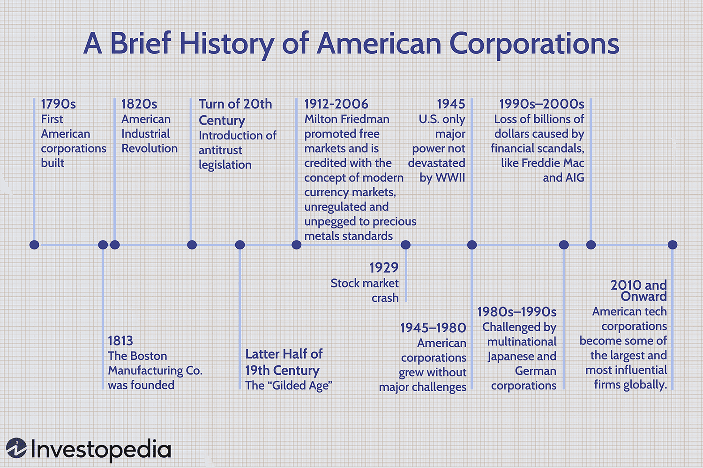

## Table of Contents

## What is a corporation and how does it differ from other business structures?

A corporation is a type of business structure that is legally separate from its owners. This means that the corporation can own property, enter contracts, and be sued, just like a person. The owners of a corporation are called shareholders, and they own shares of the company. One big advantage of a corporation is that shareholders are usually not personally responsible for the company's debts or legal issues. This is called limited liability.

Corporations are different from other business structures like sole proprietorships and partnerships. In a sole proprietorship, one person owns and runs the business, and they are personally responsible for all debts and legal issues. Partnerships are similar, but they involve two or more people sharing ownership and responsibility. Unlike corporations, sole proprietorships and partnerships do not have to follow the same strict rules and paperwork, but they also do not offer limited liability protection.

Another key difference is how corporations are taxed. Corporations can be taxed at a corporate level, and shareholders may also have to pay taxes on dividends they receive. This is called double taxation. In contrast, sole proprietorships and partnerships pass their income directly to the owners, who report it on their personal tax returns. This can make the tax situation simpler for these other business structures.

## When and why did the first corporations emerge in the United States?

The first corporations in the United States started to appear in the early 1800s. Before that, businesses were usually run as sole proprietorships or partnerships. The first big corporation in the U.S. was the Bank of North America, which was created in 1781. This was during a time when the country was growing and needed big projects like banks and transportation systems. Corporations were a good way to bring together a lot of money from many people to fund these big projects.

Corporations became popular because they offered something called limited liability. This means that if the corporation got into debt or had legal problems, the people who owned the corporation (the shareholders) would not lose their personal money or belongings. This made people more willing to invest in big projects because their risk was lower. Also, corporations could last longer than the people who started them, which was good for long-term projects like building roads and canals. This is why corporations became an important part of the growing American economy.

## What were the key characteristics of early American corporations?

Early American corporations were set up to help with big projects that needed a lot of money, like banks, roads, and canals. They were different from other businesses because they were separate from their owners. This meant that the corporation could own things, make deals, and even be sued, just like a person. The people who owned the corporation were called shareholders, and they owned pieces of the company called shares.

One of the main reasons people liked these early corporations was because of something called limited liability. This meant that if the corporation got into trouble, like owing a lot of money or getting sued, the shareholders wouldn't lose their own money or things they owned. This made people more willing to invest in these big projects because they knew their risk was lower. Also, corporations could keep going even if the people who started them were gone, which was good for long-term projects.

These early corporations had to follow special rules set by the government. They needed to get a charter from the state to start, which was like a special permission. This charter would say what the corporation could do and how it should be run. Over time, as more people saw the benefits of corporations, they became a big part of the growing American economy.

## How did the role of corporations evolve during the Industrial Revolution?

During the Industrial Revolution, which started around the late 1700s and early 1800s, the role of corporations changed a lot. Before this time, corporations were mostly set up for big projects like building roads or banks. But as new machines and factories came along, corporations became important for making things like clothes, steel, and other goods. They could bring together a lot of money from many people to build big factories and buy the machines needed for mass production. This helped them make things faster and cheaper than ever before.

As corporations grew, they started to play a bigger role in the economy. They could hire a lot of workers and produce goods on a huge scale. This led to more jobs and helped the economy grow, but it also meant that some corporations became very powerful. They could influence laws and even how people lived and worked. The Industrial Revolution showed that corporations were not just for big projects anymore; they were key players in making and selling things that people used every day.

## What significant legal changes affected corporations in the 19th century?

In the 19th century, some big changes in the law made it easier for people to start corporations. Before these changes, you needed a special permission from the government, called a charter, to start a corporation. This was hard to get and limited what the corporation could do. But in the early 1800s, states started to pass general incorporation laws. These laws let people start a corporation without needing a special charter. This made it much easier and faster to set up a business as a corporation.

Another big change came later in the 19th century with the idea of "corporate personhood." This meant that the law started to treat corporations more like people. In 1886, the U.S. Supreme Court decided in the case of Santa Clara County v. Southern Pacific Railroad that corporations had some of the same rights as people under the 14th Amendment. This gave corporations more power and protection under the law. These legal changes helped corporations grow and become a bigger part of the economy.

## How did the rise of big business in the late 19th and early 20th centuries impact corporations?

The rise of big business in the late 19th and early 20th centuries changed corporations a lot. Before, corporations were smaller and did big projects like building roads. But now, they got bigger and started to make things like steel, oil, and cars. These big businesses could bring together a lot of money from many people to build huge factories and buy machines. This helped them make things faster and cheaper than ever before. They could hire many workers and produce goods on a huge scale, which helped the economy grow. But because they were so big, some corporations became very powerful and could influence laws and how people lived and worked.

This time also saw big changes in how corporations were run and how they were seen by the public. Some people started to worry about how much power these big businesses had. They thought the big corporations, often called trusts, were too powerful and could hurt smaller businesses and workers. This led to new laws like the Sherman Antitrust Act in 1890, which tried to stop big businesses from becoming too powerful and breaking the law. These laws were meant to keep the economy fair and make sure that big corporations didn't hurt smaller ones or the people who worked for them.

## What were the major regulatory responses to corporate power in the early 20th century?

In the early 20th century, people started to worry about how much power big corporations had. They thought these big businesses, often called trusts, were too powerful and could hurt smaller businesses and workers. This led to new laws to control them. The first big law was the Sherman Antitrust Act in 1890. It tried to stop big businesses from becoming too powerful and breaking the law. This law said that it was illegal for businesses to work together to control prices or stop other businesses from competing.

Later, in 1914, the government passed two more important laws. The Clayton Antitrust Act made it clearer what businesses could and couldn't do. It said that things like price discrimination and having people on the boards of competing companies were not allowed. The same year, the Federal Trade Commission (FTC) was created. The FTC's job was to watch businesses and make sure they followed the rules. These laws and the FTC helped to keep the economy fair and make sure big corporations didn't hurt smaller ones or the people who worked for them.

## How did the Great Depression and subsequent New Deal policies influence corporate governance?

The Great Depression, which started in 1929, was a very hard time for everyone. Many people lost their jobs and businesses went bankrupt. This made people think that corporations were not being run well. They were upset because they thought the people in charge of these big businesses were not doing a good job and were only looking out for themselves. This led to a big change in how corporations were run. The government wanted to make sure that corporations were more honest and fair to everyone.

So, during the New Deal in the 1930s, the government passed new laws to help fix these problems. One of the most important laws was the Securities Act of 1933 and the Securities Exchange Act of 1934. These laws made sure that companies had to tell the truth about their finances and how they were doing. They also created the Securities and Exchange Commission (SEC) to watch over the stock market and make sure companies followed the rules. These changes made corporate governance better by making companies more open and responsible to the people who owned them and the public.

## What changes occurred in corporate structure and management during the post-World War II era?

After World War II, corporations grew bigger and more complex. They started to do business all over the world, not just in one country. This meant they needed new ways to manage their business. They set up different parts of the company to handle different areas like making products, selling them, and keeping track of money. This is called a divisional structure. It helped big companies run smoothly even though they were doing so many different things.

Also, how corporations were run changed a lot. They started to use a new way of managing called professional management. This meant that people who were really good at managing businesses were hired to run the company, even if they didn't own it. These managers made decisions based on what was best for the company, not just for themselves. This helped make corporations more successful and efficient. It also made sure that the people in charge were doing a good job and looking out for everyone who had a stake in the company.

## How have globalization and technological advances affected corporations since the late 20th century?

Since the late 20th century, globalization has changed corporations a lot. It means that businesses can now work all over the world, not just in one country. This has helped corporations grow bigger and make more money. They can sell their products to more people and find cheaper ways to make things. For example, a company might make its products in one country where it's cheaper and then sell them in another country where people will pay more. This has made corporations more powerful and important in the world economy. But it also means they have to follow the rules of different countries, which can be hard.

Technology has also had a big impact on corporations. Computers and the internet have made it easier for businesses to work faster and reach more people. Now, corporations can use technology to keep track of what they're doing and make better decisions. They can also sell things online and reach customers all over the world without needing a store in every country. But technology also brings new problems. Corporations have to be careful about keeping their information safe and making sure they're not hurting people with the technology they use. Overall, globalization and technology have made corporations more connected and efficient, but they also have to deal with new challenges.

## What are the current trends and challenges facing corporations in the United States?

Right now, corporations in the United States are dealing with a lot of big changes and challenges. One big trend is that more people care about how companies treat the environment and their workers. This is called corporate social responsibility. Companies are trying to be more green and fair to their employees because people want to buy from businesses that do good things. Another trend is that technology keeps changing how businesses work. Many companies are using [artificial intelligence](/wiki/ai-artificial-intelligence) and data to make better decisions and improve their products. But this also means they have to be careful about privacy and keeping their information safe from hackers.

There are also some big challenges for corporations. One challenge is that the world is always changing, and companies have to keep up. For example, they have to deal with new laws and rules from different countries because they do business all over the world. Another challenge is that competition is getting tougher. With the internet, new companies can start up quickly and take away business from big corporations. Also, there are worries about big companies getting too powerful and not treating their workers fairly. This can lead to problems like strikes and bad publicity. So, corporations need to find ways to stay successful while also being responsible and fair.

## What future developments might shape the evolution of corporations in the U.S.?

In the future, corporations in the U.S. might change a lot because of new technology. Things like artificial intelligence and robots could make businesses work better and faster. This might mean fewer jobs for people, so companies will have to find ways to help their workers. Also, technology will help companies know more about their customers and make better products. But they will have to be careful about privacy and keeping their information safe. If they don't, people might not trust them anymore.

Another big change could come from people wanting companies to be more responsible. More and more, people care about how businesses treat the environment and their workers. So, corporations might have to focus more on being green and fair. This could mean changing how they make things and where they get their materials. Also, the world keeps getting more connected, so companies will have to deal with rules from different countries. This can be hard, but it can also help them grow and reach more people. Overall, corporations will need to keep up with these changes to stay successful and respected.

## References & Further Reading

[1]: Bergstra, J., Bardenet, R., Bengio, Y., & Kégl, B. (2011). ["Algorithms for Hyper-Parameter Optimization."](https://papers.nips.cc/paper/4443-algorithms-for-hyper-parameter-optimization) Advances in Neural Information Processing Systems 24.

[2]: ["Advances in Financial Machine Learning"](https://www.amazon.com/Advances-Financial-Machine-Learning-Marcos/dp/1119482089) by Marcos Lopez de Prado

[3]: ["Evidence-Based Technical Analysis: Applying the Scientific Method and Statistical Inference to Trading Signals"](https://www.amazon.com/Evidence-Based-Technical-Analysis-Scientific-Statistical/dp/0470008741) by David Aronson

[4]: ["Machine Learning for Algorithmic Trading"](https://github.com/stefan-jansen/machine-learning-for-trading) by Stefan Jansen

[5]: ["Quantitative Trading: How to Build Your Own Algorithmic Trading Business"](https://www.amazon.com/Quantitative-Trading-Build-Algorithmic-Business/dp/1119800064) by Ernest P. Chan

[6]: Josephson, M. (2017). *The Robber Barons: The Great American Capitalists, 1861-1901*. Harcourt, Brace & World.

[7]: Kolko, G. (1965). *Railroads and Regulation, 1877-1916*. Princeton University Press.

[8]: Posner, R. A. (2001). *Antitrust Law, Second Edition*. University of Chicago Press.

[9]: White, R. (2016). *The Republic for Which It Stands: The United States During Reconstruction and the Gilded Age, 1865-1896*. Oxford University Press.