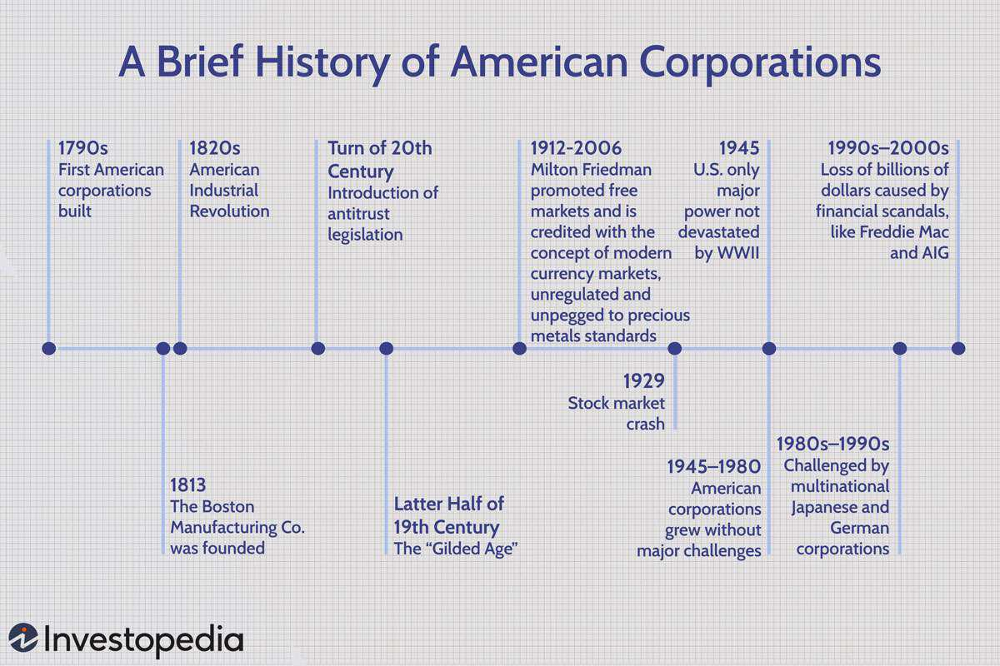

The story of American business is one of innovation, transformation, and influence. U.S. corporations have played a significant role in the global economy, driving technological advancements and setting trends on the world stage. Corporate history in the United States dates back to the late 18th century when economic growth and technological accomplishments began shaping the structure and operations of these enterprises. Over the years, U.S. corporations have been pivotal in promoting industrialization, enhancing productivity, and fostering technological progress. Their evolution has been significantly intertwined with major economic and technological developments.

As early as the late 1700s, American businesses began forming corporations to facilitate economic organization and growth. These entities offered a coherent structure for fundraising, facilitating capital investment that led to widespread industrialization and economic progression. The dynamics of corporations underwent transformations with epochs like the Industrial Revolution, which fueled a rapid expansion characterized by innovation and socio-economic changes.



Moreover, U.S. corporations have not only adapted to but have also driven technological advancements. In recent decades, the advent of technology has witnessed the rise of algorithmic trading. This development has transformed trading processes, making them more efficient by leveraging computational power and sophisticated algorithms for decision-making. The trend underlines the way corporations adopt and integrate emerging technologies to maintain competitive advantages in intricate global markets.

This article explores the history of American corporations through varied eras of economic milestones, the significant impact of algorithmic trading as a modern technological advancement, and the implications of these trends for the future of U.S. business enterprises. Understanding the past and current positioning of these giants can offer insights into the potential trajectories and challenges for corporations amid rapidly changing global dynamics.

## Table of Contents

## Early Beginnings: The First Corporations

The emergence of American corporations in the 1790s marked a pivotal moment in U.S. economic history as the country sought to establish itself post-Revolution. Among the earliest corporations was the Boston Manufacturing Company, founded in 1813, which played a critical role in catalyzing the Industrial Revolution in the United States. This era saw the transformation of business practices through the adoption of corporate structures that facilitated fundraising and capital investment, laying the groundwork for innovation and industrial growth.

The Boston Manufacturing Company, established by Francis Cabot Lowell and his partners, was notable for introducing the Waltham-Lowell system. This system revolutionized textile manufacturing by integrating all steps of production under one roof, achieving unprecedented efficiencies. The company's success demonstrated the potential of corporations to mobilize capital and resources effectively, attracting investments that would further drive industrial expansion.

Corporations, by providing a structured mechanism for raising capital, enabled entrepreneurs to pool resources and mitigate individual risks. This collective approach was essential for funding large-scale industrial projects that characterized the early stages of U.S. economic development. The legal framework for corporations, initially inspired by British models, gradually evolved to suit the American context, offering limited liability to investors and facilitating the establishment of joint-stock companies. These features were pivotal in attracting a broader range of investors willing to support nascent industrial enterprises.

The ability of corporations to amass significant capital allowed for investment in technology and infrastructure, propelling the United States towards industrialization. For instance, the Erie Canal, completed in 1825, was financed by a combination of state funds and private investment, highlighting the synergy between public and corporate interests in driving economic growth. The success of such ventures underscored the importance of corporate entities in fostering a conducive environment for technological and industrial advancements.

In conclusion, the first American corporations were instrumental in laying the foundational elements of industrial growth and economic transformation. By facilitating capital investment and innovation, these early corporations set the stage for the United States to emerge as a dominant industrial power in the subsequent centuries. This period of corporate inception established principles that continue to influence American business practices today.

## Industrial Revolution and the Rise of the Corporate Giant

The Industrial Revolution, which began in the late 18th century and continued into the 19th century, was a transformative period characterized by the transition from agrarian economies to industrialized and urban ones. In the United States, this era heralded the rise of corporations as pivotal entities in driving economic growth and industrial expansion.

Corporate structures provided a systematic approach to capital accumulation and resource management, which were crucial for the establishment and operation of large-scale factories and businesses. The legal and organizational frameworks enabled businesses to raise substantial financial capital by selling shares to investors, thereby facilitating major industrial undertakings. This not only spurred innovation but also created large-scale employment opportunities, fundamentally altering the socio-economic landscape.

The Industrial Revolution led to significant advancements in technology and manufacturing processes. The introduction of mechanized production techniques, such as the use of steam power and later electricity, increased production capabilities exponentially. For instance, in the textile industry, innovations like the power loom and spinning jenny revolutionized fabric production, leading to a boom in textile manufacturing and export.

The era also saw the rise of influential industrialists who capitalized on these technological advancements to build vast business empires. Figures like Andrew Carnegie in steel, John D. Rockefeller in oil, and Cornelius Vanderbilt in railroads became synonymous with American industrial might. Their corporations not only dominated domestic markets but also positioned the United States as a burgeoning economic powerhouse on the global stage.

These industrial magnates utilized vertical and horizontal integration strategies to consolidate resources and dominate industries, often leading to the formation of monopolies. This consolidation facilitated not just cost efficiencies but also allowed these corporations to leverage substantial market power, fueling further economic expansion.

The socio-economic changes induced by the Industrial Revolution were multifaceted. As corporations proliferated, the demand for labor transformed rural agricultural workers into an urban industrial workforce. This migration contributed significantly to urbanization and changed social dynamics, as cities expanded rapidly to accommodate factory workers and their families.

In summary, the Industrial Revolution was a critical period in American history that established corporations as engines of economic development, innovation, and socio-economic transformation. The legacies of these corporations and industrialists laid the foundation for the United States to emerge as a leading global economic power.

## The Gilded Age and Regulatory Challenges

The Gilded Age, a term coined by Mark Twain, encapsulates the period of significant economic growth and societal transformation in the United States during the late 19th century. Characterized by rapid industrialization, this era witnessed the explosive growth of influential industries such as railroads, oil, and steel. The expansion of these industries catalyzed the rise of large corporations, marking a critical juncture in American economic history (White, 2016).

During the Gilded Age, corporations amassed considerable economic and political power, often leading to monopolistic practices. Notable industrial magnates, such as John D. Rockefeller of Standard Oil and Andrew Carnegie of Carnegie Steel, leveraged their influence to dominate respective markets. These corporations utilized vertical and horizontal integration strategies, achieving unprecedented control over production and distribution channels (Josephson, 2017). The unchecked expansion and consolidation of corporate power raised public concern over monopoly formation and market fairness.

In response to growing apprehensions about monopolistic practices, the United States government initiated regulatory measures aimed at preserving competitive markets. The Sherman Antitrust Act of 1890 marked a pivotal step in federal regulatory intervention. This legislation was designed to prohibit conglomerates that restrained trade and sought to dismantle monopolistic entities. The Act's enforcement, however, required extensive legal interpretation and was initially met with varying degrees of success (Posner, 2001).

As corporations continued to consolidate power, further regulatory measures were needed. The establishment of the Interstate Commerce Commission (ICC) in 1887 reflected an early attempt to regulate railroads, the era's dominant industry. The ICC aimed at ensuring reasonable and just rates, preventing discriminatory practices, and curbing the excessive influence of powerful railroad corporations (Kolko, 1965).

The Gilded Age regulatory landscape illustrates the complex interplay between burgeoning corporate power and the evolving policy frameworks introduced to maintain fair competition. These early regulatory efforts laid the groundwork for subsequent antitrust policies and signaled the federal government's commitment to curbing monopoly power and fostering a competitive business environment. The legacies of the Gilded Age continue to influence contemporary regulatory environments, highlighting the enduring challenge of balancing corporate growth with equitable market practices.

**References**

- Josephson, M. (2017). *The Robber Barons: The Great American Capitalists, 1861-1901*. Harcourt, Brace & World.
- Kolko, G. (1965). *Railroads and Regulation, 1877-1916*. Princeton University Press.
- Posner, R. A. (2001). *Antitrust Law, Second Edition*. University of Chicago Press.
- White, R. (2016). *The Republic for Which It Stands: The United States During Reconstruction and the Gilded Age, 1865-1896*. Oxford University Press.

## Post-World War II Corporate Growth and Global Influence

Following World War II, American corporations emerged as vital players in the global economy, significantly contributing to both domestic economic recovery and international market expansion. During this era, the corporate landscape underwent substantial transformations, primarily driven by increased industrial output, military production, and technological advancements. The economic boom that characterized the postwar years facilitated a rapid expansion of U.S. businesses, leading to the rise of multinational corporations with extensive global operations.

One of the key developments was the proliferation of multinational corporations. These entities leveraged newfound technological advancements and improved communication and transportation infrastructures to establish a formidable presence in global markets. The establishment of international offices allowed American companies to cater to a broader consumer base, tapping into diverse markets and resources beyond domestic boundaries.

The influence of American corporations on global economic affairs during this period cannot be overstated. The widespread adoption of American managerial practices and business models set new standards worldwide. U.S. corporations pioneered significant innovations, particularly in manufacturing, marketing, and product development, which were emulated by businesses globally.

However, the competitive landscape evolved in the 1980s and 1990s as Japanese multinationals entered the global market. The Japanese firms were characterized by their efficient production processes, particularly in sectors such as technology and automotive, posing formidable competition to American enterprises. To maintain their competitive edge, U.S. corporations were compelled to innovate and adapt, embracing new technologies and methodologies such as Just-In-Time (JIT) manufacturing and Total Quality Management (TQM).

Moreover, American companies utilized advancements in information technology to optimize operations and enhance productivity. The integration of computer systems into business processes facilitated more efficient supply chain management and decision-making, helping U.S. corporations respond swiftly to market changes and consumer demands.

Despite the stiff competition, American corporations maintained their prominence by continuously evolving and leveraging their inherent strengths in innovation and adaptability. This resilience not only ensured their sustained growth but also underscored the enduring influence of U.S. business practices and corporate strategies in shaping the global economic order. As such, post-World War II American corporate growth marked an era of dynamic economic influence, laying the groundwork for contemporary global business practices.

## Embracing Technology: The Era of Algorithmic Trading

With technological advancements, particularly in computing, corporations have increasingly leveraged [algorithmic trading](/wiki/algorithmic-trading) to enhance efficiency and decision-making in financial markets. Algorithmic trading, or 'algo trading,' refers to the use of computer algorithms to automate trading decisions and execute orders based on pre-defined criteria. This automation allows for trades to be executed at speeds and frequencies that would be impossible for a human trader.

The evolution of algorithmic trading can be traced back to the 1970s, when the New York Stock Exchange (NYSE) introduced electronic systems for order processing. However, it wasn't until the late 20th century, with the advent of high-speed computing and internet connectivity, that algorithmic trading gained significant traction. The automation of trading processes enabled institutions to reduce transaction costs and mitigate the impact of human emotions on trading decisions, leading to more rational and efficient markets.

By the early 2000s, algorithmic trading had become a dominant force in financial markets. The implementation of algorithms allowed traders to exploit market inefficiencies and execute complex strategies such as statistical [arbitrage](/wiki/arbitrage), [market making](/wiki/market-making), and [trend following](/wiki/trend-following). One of the most notable transformations driven by algo trading is its impact on [liquidity](/wiki/liquidity-risk-premium) and market microstructure. Large volumes of trades can be broken down into smaller orders to minimize market impact, thereby enhancing liquidity and reducing price [volatility](/wiki/volatility-trading-strategies).

For instance, a simple Python script for an algorithmic trading strategy might look like this:

```python
import numpy as np

def momentum_strategy(prices, window=10):
    momentum = prices - np.roll(prices, window)
    positions = np.where(momentum > 0, 1, -1)  # 1: buy, -1: sell
    return positions

# Example usage with a price series
prices = np.array([100, 102, 101, 104, 107, 106, 108])
positions = momentum_strategy(prices)
```

In this example, the script calculates a basic [momentum](/wiki/momentum) strategy by analyzing past price movements over a specified window, determining buy or sell positions based on positive momentum.

The rapid growth of algorithmic trading also introduced new challenges and risks, such as the potential for market manipulation and the occurrence of flash crashes due to erroneous algorithms. As a result, regulatory bodies have implemented frameworks to ensure the stability and integrity of financial markets. These include measures such as circuit breakers and limits on trading strategies that may disrupt market equilibrium.

Today, algorithmic trading accounts for a significant proportion of trading volumes in major markets worldwide, influencing market dynamics and dictating the pace at which trades are executed. Its role has extended beyond equities into other asset classes, including fixed income, foreign exchange, and commodities, marking it as a pillar of modern financial markets.

Algorithmic trading's evolution is indicative of broader technological trends affecting American corporations. As these entities continue to adopt advanced technologies, they must balance the advantages with the potential risks and ethical considerations inherent in automated decision-making systems. Understanding these dynamics will be crucial for navigating the future landscape of global financial markets.

## Conclusion: Navigating the Future of American Corporations

As we progress further into the 21st century, American corporations maintain their pivotal role in spearheading innovation and exercising market leadership across the globe. Key to their continued success is the ability to balance their substantial economic power with an increasing responsibility towards social issues. The unprecedented pace of technological changes presents ongoing challenges and opportunities, necessitating a proactive approach to adapt and thrive.

American corporations are at a crossroads between maintaining profitability and addressing the growing demand for corporate accountability in areas such as environmental sustainability, ethical supply chains, and workforce diversity. The integration of corporate social responsibility (CSR) into business models can enhance reputations and drive long-term success. This shift can be evidenced by increased consumer preference for brands that demonstrate genuine commitment to societal and environmental issues, pushing corporations towards more transparent and socially responsible practices.

As these enterprises navigate the complexities of digital transformation, the application of emerging technologies such as [artificial intelligence](/wiki/ai-artificial-intelligence), [machine learning](/wiki/machine-learning), and blockchain is pivotal. These technologies are not only transforming business operations but also redefining competitive landscapes. Algorithmic trading, for example, illustrates how technological adoption can lead to enhanced decision-making and efficiency within financial markets, setting a precedent for innovation in other industries.

Moreover, understanding the historical trajectory of U.S. corporations offers valuable insights into future trends. Historically, these corporations evolved from the simple organizational structures of the late 18th century through to the complex multinational entities they are today, often driving substantial economic and technological advancements. This evolution suggests a trajectory where adaptability and innovation are fundamental to future success. 

Looking ahead, the ability of American corporations to lead depends on their agility in addressing both technological and societal shifts. By learning from the past, these businesses can devise strategies that not only safeguard their economic interests but also contribute positively to society and the global economy. This dual focus will be crucial in navigating the future landscape of global business, ensuring that American corporations remain influential and respected entities worldwide.

## References & Further Reading

[1]: Bergstra, J., Bardenet, R., Bengio, Y., & Kégl, B. (2011). ["Algorithms for Hyper-Parameter Optimization."](https://papers.nips.cc/paper/4443-algorithms-for-hyper-parameter-optimization) Advances in Neural Information Processing Systems 24.

[2]: ["Advances in Financial Machine Learning"](https://www.amazon.com/Advances-Financial-Machine-Learning-Marcos/dp/1119482089) by Marcos Lopez de Prado

[3]: ["Evidence-Based Technical Analysis: Applying the Scientific Method and Statistical Inference to Trading Signals"](https://www.amazon.com/Evidence-Based-Technical-Analysis-Scientific-Statistical/dp/0470008741) by David Aronson

[4]: ["Machine Learning for Algorithmic Trading"](https://github.com/stefan-jansen/machine-learning-for-trading) by Stefan Jansen

[5]: ["Quantitative Trading: How to Build Your Own Algorithmic Trading Business"](https://www.amazon.com/Quantitative-Trading-Build-Algorithmic-Business/dp/1119800064) by Ernest P. Chan

[6]: Josephson, M. (2017). *The Robber Barons: The Great American Capitalists, 1861-1901*. Harcourt, Brace & World.

[7]: Kolko, G. (1965). *Railroads and Regulation, 1877-1916*. Princeton University Press.

[8]: Posner, R. A. (2001). *Antitrust Law, Second Edition*. University of Chicago Press.

[9]: White, R. (2016). *The Republic for Which It Stands: The United States During Reconstruction and the Gilded Age, 1865-1896*. Oxford University Press.