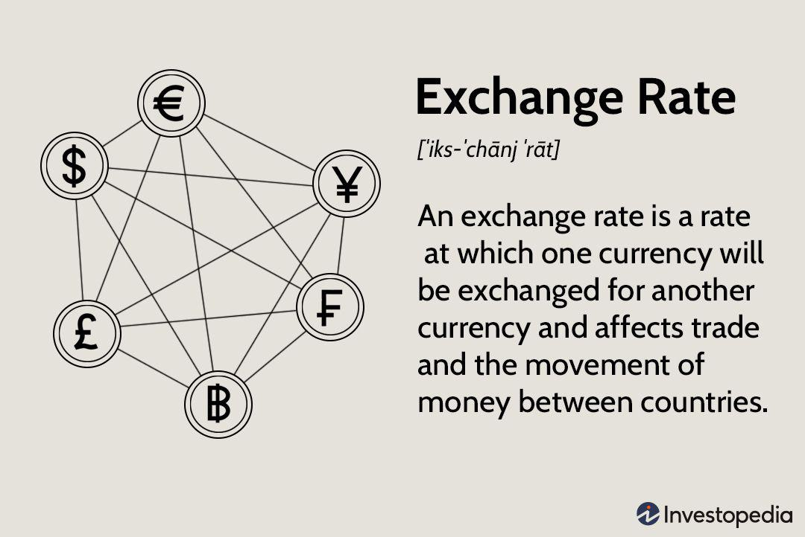

The global economy is intricately linked through the complex web of currency exchange, with historical exchange rates acting as fundamental components. These rates not only represent the value of one currency against another but also reflect underlying economic conditions, geopolitical events, and market perceptions. As a result, understanding the history of exchange rates is essential for businesses, policy-makers, and economists striving to make informed decisions in today's rapidly changing financial landscape.

One of the key reasons for comprehending historical exchange rates is their profound impact on various sectors of the economy. Businesses, in particular, face direct implications from currency fluctuations, which can affect everything from the cost of imports and exports to international investment strategies. For economists, historical exchange rates can reveal patterns in economic stability, growth trajectories, and potential policy outcomes, providing a clearer picture of future trends.



In recent decades, the advent of technology has revolutionized the way currency exchanges are conducted. Algorithmic trading, which leverages computer algorithms to execute trades at optimal conditions, has surged in popularity. This technological advancement has introduced new dynamics to currency exchanges by enhancing the speed, accuracy, and volume of transactions. Algorithms can analyze vast amounts of historical and real-time data to identify trading opportunities that human traders might overlook, thereby increasing efficiency in the foreign exchange markets.

This article will explore the importance of historical exchange rates and their impact on the economy, alongside examining the role of algorithmic trading in modern finance. As we navigate these topics, we will present insights and tools designed to guide businesses, investors, and economists in the intricate realm of foreign currency exchange. These discussions aim to equip readers with the knowledge necessary to understand current trends, foresee potential shifts, and make strategic decisions in the evolving global market.

## Table of Contents

## Understanding Historical Exchange Rates

Exchange rates represent the value of one currency in terms of another and are pivotal in global financial systems. Historically, these rates have been not only a reflection of economic fundamentals but also a gauge of geopolitical stability and policy effectiveness.

Exchange rates are primarily determined by the forces of supply and demand in the foreign exchange markets. Several economic factors, including interest rates, inflation, and economic growth, play a crucial role in influencing these rates. For instance, currencies from countries with higher interest rates often attract more foreign capital, eliciting stronger exchange rates due to increased demand. Similarly, inflation rates inversely affect exchange rates, as higher inflation typically devalues a currency.

Upon examining historical trends, it's apparent that major currencies such as the US dollar, Euro, and Japanese yen have seen significant fluctuations. The historical context includes periods of fixed exchange rates, such as those seen under the gold standard and later the Bretton Woods system, which provided a semblance of stability. However, the transition to floating rates in the 1970s introduced greater [volatility](/wiki/volatility-trading-strategies), influenced by economic policies and market speculations.

Geopolitical events have left indelible marks on historical exchange rates. Wars, political instability, and international treaties can alter currency valuations dramatically. For example, events like the emergence of the European Union and the subsequent introduction of the Euro brought significant realignment in regional currencies. Moreover, economic policies such as quantitative easing or austerity measures also result in significant exchange rate movements, reflecting market perceptions of a nation's economic health.

Analyzing historical exchange rates is instrumental in recognizing future patterns. By examining past data, traders and economists can identify trends and cycles, potentially forecasting future movements. Techniques such as moving averages and regression analysis, often implemented in Python, are common for identifying trends and making predictions. For example:

```python
import pandas as pd
import numpy as np

# Assume historical data is loaded into a DataFrame
df = pd.read_csv('historical_exchange_rates.csv')

# Calculating 50-day moving average
df['50_MA'] = df['exchange_rate'].rolling(window=50).mean()

# Calculating regression trendline
x = np.arange(len(df))
y = df['exchange_rate'].values
coeffs = np.polyfit(x, y, 1)
trendline = coeffs[0] * x + coeffs[1]

df['Trendline'] = trendline
```

Through these analyses, historical exchange rates provide valuable insights, helping policymakers and market participants to form strategies and make informed decisions in the dynamic world of foreign currency exchange.

## Currency Exchange and Its Economic Impact

Currency exchange plays a critical role in facilitating international trade and investment by enabling transactions between countries with different national currencies. It allows businesses to buy and sell goods and services across borders, invest in foreign markets, and manage financial risks associated with currency fluctuations.

Fluctuating exchange rates can significantly impact businesses, consumers, and entire economies. For businesses engaging in international trade, an unfavorable exchange rate can increase the cost of importing goods, reducing profit margins. Conversely, favorable rates can enhance competitiveness by lowering costs or increasing the value of exported goods. Consumers can also be affected, as currency depreciation can lead to higher prices for imported goods, impacting purchasing power. At the macroeconomic level, volatile exchange rates can influence inflation rates, economic growth, and employment levels.

Several countries offer illustrative case studies on the effects of major exchange rate shifts. For example, the 1997 Asian Financial Crisis saw several Southeast Asian currencies plummet, leading to economic turmoil characterized by rapid capital outflows, reduced foreign investment, and significant economic contraction. Similarly, during the 2008 financial crisis, the sharp depreciation of currencies like the British pound and the euro against the U.S. dollar highlighted vulnerabilities in economies heavily reliant on foreign-denominated debt.

To mitigate exchange rate risks, businesses commonly employ strategies such as hedging through financial instruments like futures, forwards, and options contracts. These strategies allow firms to lock in exchange rates for future transactions, thus providing a measure of financial predictability. Companies may also diversify their operational locations to naturally offset currency risks or negotiate terms of trade that can mitigate potential foreign exchange losses.

Stable exchange rates are crucial for economic stability and growth. They provide an environment conducive to long-term planning and investment by reducing uncertainty about future revenue and cost flows. Stable rates foster investor confidence, support higher levels of international trade, and contribute to a predictable economic environment in which both domestic and international economic [agents](/wiki/agents) can operate efficiently.

## Exchange Rate History: Key Milestones

The history of exchange rates is punctuated by several key milestones that have shaped the global economic landscape. A foundational understanding of these milestones provides crucial insight into the current currency exchange systems.

The gold standard era, spanning the late 19th and early 20th centuries, established a monetary system where currencies were directly tied to gold reserves. Under this framework, international exchange rates were fixed based on gold parities. The stability offered by this system facilitated international trade and investment but also rendered national economies vulnerable to global gold supply fluctuations. The gold standard era ceased during the Great Depression, as countries relinquished the system to pursue more flexible monetary policies [1].

In the aftermath of World War II, the Bretton Woods system emerged as a new international monetary framework. Established in 1944, it pegged currencies to the US dollar, which was convertible to gold at a fixed rate of $35 per ounce. This system sought to combine the advantages of a fixed exchange rate with the flexibility needed for economic growth. However, by 1971, the United States suspended dollar-to-gold convertibility, leading to the system's collapse. This marked the transition to floating exchange rates, where currency values are determined by market forces of supply and demand.

The introduction of the Euro in 1999 represented another significant milestone in currency history. As a single currency for the European Union, it replaced multiple national currencies among member states and simplified cross-border transactions. The Euro's creation involved fixing exchange rates among participating nations, which set the stage for deeper economic integration within Europe. This event highlighted the impact of regional monetary policy coordination on global currency markets [2].

In recent times, events such as the 2008 financial crisis and Brexit have had profound effects on exchange rates. The 2008 crisis led to unprecedented market volatility and shifts in currency valuations as investors sought safe havens in stable currencies like the US dollar and Swiss franc. Brexit, the United Kingdom's decision to leave the European Union, led to a significant devaluation of the British pound, reflecting market uncertainties and altered economic expectations.

Understanding these historical milestones is essential for comprehending the current complexities of the currency exchange market. These events underscore the dynamic nature of exchange rate mechanisms and their broad implications for global economic stability and integration.

[1] Eichengreen, B. (1992). Golden Fetters: The Gold Standard and the Great Depression, 1919-1939. Oxford University Press.
[2] European Central Bank. (n.d.). The euro. Retrieved from https://www.ecb.europa.eu/euro/intro/html/index.en.html

## The Rise of Algorithmic Trading in Currency Exchange

Algorithmic trading, commonly referred to as algo trading, is the process of executing trades using pre-programmed trading instructions that account for variables such as timing, price, and [volume](/wiki/volume-trading-strategy) to determine the optimal strategy for buying or selling currencies. In the context of foreign exchange ([forex](/wiki/forex-system)) markets, [algorithmic trading](/wiki/algorithmic-trading) harnesses the power of computing technology to automate and refine trading processes, offering a level of precision and efficiency unattainable through traditional manual methods.

The increasing reliance on algorithms for efficient currency trading is driven by several factors. Primarily, algorithms can process vast amounts of market data at speeds beyond human capability, allowing traders to respond to market changes in real-time. This speed proves critical in the forex market, where microsecond price changes can influence significant financial outcomes. Algorithmic trading also mitigates human emotional biases that can impair trading decisions, promoting a more consistent and objective trading process.

### Advantages and Challenges

One of the primary advantages of algorithmic trading in currency exchange is its ability to execute trades with precision and at high speeds, minimizing the likelihood of slippage — the difference between the expected price of a trade and the actual price at which the trade is executed. Algorithms can identify [arbitrage](/wiki/arbitrage) opportunities, perform statistical analyses, and employ complex mathematical models to make informed trading decisions.

However, algorithmic trading is not without challenges. Developing a robust trading algorithm requires substantial technical expertise and understanding of both markets and programming. Mistakes in algorithmic code can lead to significant financial losses, as evidenced by historical "flash crashes" where algorithms executed large volumes of trades based on faulty data or logic. Regulatory considerations also play a role, as the rapid and large volume trading operation conducted by algorithms can influence market stability.

### Traditional vs Algorithmic Trading

Traditional trading methods rely heavily on the trader's expertise, intuition, and manual analysis of market trends. While experienced traders may have honed skills to read market cues, their methods lack the consistency and speed offered by algorithmic techniques. Algorithmic trading, on the other hand, leverages quantitative analysis and computational power to execute trades based on predefined criteria, reducing human error and emotional influence.

### Popular Algorithms and Trading Strategies

Several popular algorithms and trading strategies are employed in the forex market:

1. **Trend Following**: This algorithm identifies currencies trending upward or downward and executes trades in the direction of the trend. Simple moving averages (SMA) and exponential moving averages (EMA) are often utilized to identify trends.

   ```python
   def calculate_sma(prices, window):
       return sum(prices[-window:]) / window

   def calculate_ema(prices, window):
       ema = prices[0]
       alpha = 2 / (window + 1)
       for price in prices[1:]:
           ema = alpha * (price - ema) + ema
       return ema
   ```

2. **Arbitrage**: Algorithmic trading solutions identify price discrepancies between different markets or securities, executing buy and sell orders to exploit these differences for profit.

3. **Mean Reversion**: This strategy is based on the concept that currency prices will return to their mean or average value over time. When a currency deviates significantly from its average price, the algorithm executes trades on the assumption that it will revert to the mean.

4. **Market Making**: Algorithms facilitate market liquidity by simultaneously quoting buy and sell prices, generating profit from the spread between these prices.

In conclusion, algorithmic trading has transformed the forex market through the adoption of technology-driven strategies that enhance efficiency, speed, and accuracy. Despite its advantages, the complexities involved demand thorough understanding and caution. As forex markets continue to integrate advanced computational techniques, traders equipped with algorithmic tools remain at the forefront of this evolving financial landscape.

## Tools and Techniques for Analyzing Historical Exchange Rates

Analyzing historical exchange rates is crucial for understanding currency trends and making informed decisions in both trading and economic policy. Various tools and platforms facilitate this analysis, leveraging technology and data science to extract insights from historical data. 

One essential tool for analyzing historical exchange rates is the foreign exchange market database, which provides comprehensive historical data across different currencies. These databases often offer detailed records of exchange rates, allowing analysts to track changes over time and identify patterns or trends. Some popular platforms offering such data include Bloomberg Terminal, Reuters Eikon, and TradingView. These platforms not only provide historical exchange rates but also offer charting tools and technical indicators essential for in-depth analysis.

Technology and data science play a significant role in exploring currency trends. Machine learning algorithms and statistical methods are commonly employed to analyze large datasets, identify trends, and predict future movements. Techniques such as time series analysis, regression models, and neural networks can be applied to historical exchange rate data to discover underlying patterns and correlations. For instance, time series analysis can be used to model exchange rate movements using historical data, while [machine learning](/wiki/machine-learning) models can enhance prediction accuracy by considering multiple influencing factors.

Historical analysis supports decision-making in trading and policy-making by providing a context for current market conditions. Traders can backtest trading strategies using historical data to assess their effectiveness before implementation in the live market. Similarly, policymakers can analyze past exchange rates to understand the impact of economic events and policy decisions, aiding in the formulation of future strategies.

To leverage historical data effectively, it is essential to apply statistical methods and forecasting techniques. For example, moving averages can smooth out short-term fluctuations, helping detect longer-term trends. More advanced methods, such as the ARIMA model, can be used for time series forecasting. Here is an example of using Python's `statsmodels` library to implement an ARIMA model for predicting future exchange rates:

```python
from statsmodels.tsa.arima.model import ARIMA
import pandas as pd

# Load historical exchange rate data
data = pd.read_csv('exchange_rates.csv', parse_dates=['date'], index_col='date')
exchange_rate = data['usd_to_eur']

# Fit ARIMA model
model = ARIMA(exchange_rate, order=(5, 1, 0))
model_fit = model.fit()

# Forecast future exchange rates
forecast = model_fit.forecast(steps=10)
print(forecast)
```

Real-time data integration with historical analysis is vital for developing precise trading strategies. While historical data provides a foundation, real-time data enables traders and analysts to adapt to current market dynamics. Real-time data feeds, offered by platforms such as MetaTrader and [Interactive Brokers](/wiki/interactive-brokers-api), ensure that trading strategies incorporate the latest market information, enhancing their responsiveness and accuracy.

In conclusion, tools and techniques for analyzing historical exchange rates are essential components for understanding currency market dynamics. By utilizing technology, data science, and real-time integration, traders and policymakers can navigate the complex world of currencies with greater precision and confidence.

## Conclusion

Understanding historical exchange rates is pivotal for both businesses and the broader economy. These rates provide crucial insights into the systematic shifts and trends that have shaped the financial landscape over time. By examining past exchange rate movements, businesses can better strategize their financial planning, and economists gain a deeper comprehension of historical economic phenomena.

Algorithmic trading has revolutionized the modern foreign exchange market, introducing efficiency and speed that were historically unattainable. Algorithms leverage historical data to predict future movements, thus offering a strategic advantage in making informed trading decisions. The integration of technology in trading not only optimizes existing methods but also challenges the limitations of traditional trading approaches by offering precision and reduced transaction costs.

Continuous learning and research into currency exchange dynamics are encouraged to further demystify the complexities of the forex market. As the market evolves, so too must the tools and methodologies we use to analyze it. Aligning historical insights with technological advancements positions stakeholders to better anticipate market conditions and potential disruptions.

The synergy between past trends and modern technology underscores the importance of a comprehensive approach to trading and economic strategy. A nuanced understanding of historical exchange rates, coupled with the advancements in algorithmic trading, equips businesses and traders to navigate the future landscape of the global currency market with confidence and precision.

## References & Further Reading

[1]: Eichengreen, B. (1992). ["Golden Fetters: The Gold Standard and the Great Depression, 1919-1939."](https://academic.oup.com/book/36016) Oxford University Press.

[2]: European Central Bank. (n.d.). ["The euro."](https://www.ecb.europa.eu/press/pr/date/2024/html/ecb.pr241202~d0b19e5e1b.en.html) Retrieved from https://www.ecb.europa.eu

[3]: Bergstra, J., Bardenet, R., Bengio, Y., & Kégl, B. (2011). ["Algorithms for Hyper-Parameter Optimization."](https://dl.acm.org/doi/10.5555/2986459.2986743) Advances in Neural Information Processing Systems 24.

[4]: Lopez de Prado, M. (2018). ["Advances in Financial Machine Learning."](https://www.amazon.com/Advances-Financial-Machine-Learning-Marcos/dp/1119482089) Wiley.

[5]: Aronson, D. R. (2007). ["Evidence-Based Technical Analysis: Applying the Scientific Method and Statistical Inference to Trading Signals."](https://www.amazon.com/Evidence-Based-Technical-Analysis-Scientific-Statistical/dp/0470008741) Wiley.

[6]: Jansen, S. (2020). ["Machine Learning for Algorithmic Trading."](https://github.com/stefan-jansen/machine-learning-for-trading) Packt Publishing.

[7]: Chan, E. P. (2008). ["Quantitative Trading: How to Build Your Own Algorithmic Trading Business."](https://github.com/ftvision/quant_trading_echan_book) Wiley.