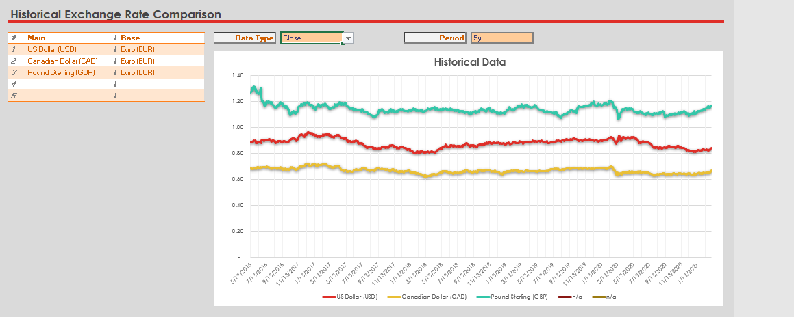

## Table of Contents

## What is a currency exchange rate?

A currency exchange rate is the price of one country's money compared to another country's money. For example, if you want to change US dollars to Euros, the exchange rate tells you how many Euros you get for each dollar. This rate changes every day because of things like how much people want to buy or sell the currency, the country's economy, and what's happening in the world.

Exchange rates are important for people who travel to other countries or buy things from other countries. If the exchange rate is good, you can get more foreign money for your own money, which means you can buy more things or travel cheaper. But if the rate is bad, you get less foreign money, and everything costs more. Banks and special places called currency exchange offices help people change their money using these rates.

## Why do currency exchange rates change?

Currency exchange rates change because of many reasons. One big reason is how much people want to buy or sell a currency. If lots of people want to buy a currency, its value goes up. But if many people want to sell it, the value goes down. This can happen because of news, like if a country's economy is doing well or if there are problems. Another reason is interest rates. If a country's interest rates go up, people might want to invest there, so they buy that country's currency, making it stronger.

Another [factor](/wiki/factor-investing) is how much a country trades with others. If a country exports a lot, it can make its currency stronger because other countries need to buy that currency to pay for the goods. But if a country imports a lot, its currency might get weaker. Political events can also change exchange rates. For example, if people think a country might have problems, they might sell its currency, making it weaker. All these things together make exchange rates go up and down every day.

## How have currency exchange rates been historically tracked?

In the past, people used to track currency exchange rates by looking at newspapers and financial reports. These sources would list the rates for different currencies every day. Banks and big businesses would use this information to know how much their money was worth in other countries. It was a slow process because the rates could change, but people wouldn't know until the next day's paper came out.

Over time, technology made it easier to track exchange rates. Computers and the internet allowed people to see the rates in real-time. Websites and special apps now show the rates as they change throughout the day. This helps people and businesses make quick decisions about buying or selling currencies. Today, tracking exchange rates is much faster and more accurate than it used to be.

## What was the gold standard and how did it affect exchange rates?

The gold standard was a system where countries agreed that their money was worth a certain amount of gold. This meant that you could take your money to the bank and get gold in exchange. It was like having a promise that your money was as good as gold. Many countries used this system from the late 1800s until the 1930s. The idea was to make trade between countries easier and to keep money stable.

Under the gold standard, exchange rates were very steady because they were based on the value of gold. If one country's money was worth a certain amount of gold, and another country's money was worth a different amount of gold, you could figure out the exchange rate easily. But this system also had problems. If a country didn't have enough gold, it could cause big economic troubles. Also, if countries found new gold, it could change how much money was worth. This is why countries eventually moved away from the gold standard, and exchange rates started to change more freely.

## Can you explain the Bretton Woods system and its impact on currency exchange?

The Bretton Woods system was a way for countries to work together on money after World War II. It started in 1944 when leaders from many countries met in Bretton Woods, New Hampshire. They agreed that the US dollar would be the main currency, and other countries would tie their money to the dollar. The US promised to change dollars into gold at a set price. This made exchange rates more stable because countries could trust that their money had a solid value linked to the dollar and gold.

This system helped the world economy grow because it made trade easier and more predictable. Countries knew what their money was worth compared to the dollar, so they could plan better. But by the late 1960s, the system started to have problems. The US had too many dollars out in the world, and it didn't have enough gold to back them all up. In 1971, the US stopped changing dollars into gold, and the Bretton Woods system ended. After that, exchange rates started to float freely, which means they could change more often and by bigger amounts.

## What major events have caused significant fluctuations in exchange rates?

Some big events have made exchange rates change a lot. One example is the 2008 financial crisis. It started in the United States but affected the whole world. Banks were in trouble, and people lost trust in the economy. The value of the US dollar went down a lot compared to other currencies because people were worried. Another event was when Britain voted to leave the European Union in 2016, called Brexit. Right after the vote, the British pound dropped a lot because people were unsure about what would happen to the UK's economy.

Another important event was in 1997 when there was a big financial crisis in Asia. It started in Thailand but spread to other countries like Indonesia and South Korea. Their currencies lost a lot of value very quickly. This was because investors were pulling their money out of these countries, making their currencies weaker. These events show how big news or crises can make people change their minds about a country's money, causing big swings in exchange rates.

## How did the transition to floating exchange rates in the 1970s affect global trade?

When countries switched to floating exchange rates in the 1970s, it changed how they did business with each other. Before, with the Bretton Woods system, exchange rates were fixed, which made it easier for countries to plan their trade because they knew how much their money was worth compared to other countries' money. But when they moved to floating rates, the value of money could go up and down every day. This made trade more unpredictable because companies had to guess what the exchange rate would be when they got paid or had to pay for things. It made some businesses more careful about trading with other countries.

Even though floating exchange rates made trade more uncertain, they also had some good effects. They allowed countries to set their own interest rates and economic policies without worrying too much about what other countries were doing. This flexibility helped countries adjust to their own economic needs. Over time, businesses got better at dealing with changing exchange rates by using tools like forward contracts, which let them lock in a rate for future trades. So, while the switch to floating rates made global trade more complicated at first, it also helped countries and companies become more adaptable.

## What role have international organizations like the IMF played in currency exchange?

The International Monetary Fund (IMF) has been very important in helping countries with their money, including currency exchange. The IMF was created after World War II to make the world's economy more stable. It helps countries that are having money problems by giving them loans and advice. This can affect exchange rates because if a country gets help from the IMF, it might make people trust that country's money more, making its currency stronger.

The IMF also keeps an eye on exchange rates and can tell countries if they think their money is too strong or too weak. This can help countries make better decisions about their money. Sometimes, the IMF works with countries to change their money policies to make their economy better. By doing these things, the IMF helps make the world's money system more stable and fair, which can help keep exchange rates from changing too much.

## How do political and economic policies influence currency exchange rates?

Political and economic policies can really change how much a country's money is worth compared to other countries' money. When a government makes new rules about taxes or spending, it can make people think differently about that country's money. For example, if a government decides to spend a lot of money on new projects, it might make the country's money weaker because people might worry about too much spending. On the other hand, if a government cuts taxes, it might make the money stronger because people think the economy will grow faster.

Also, when a country's leaders make big decisions, like changing interest rates or trade rules, it can affect how much people want to buy or sell that country's money. If a country raises its interest rates, it might make its money stronger because people want to invest there to get higher returns. But if a country starts a trade war with another country, it might make its money weaker because trade can slow down, and people might not trust the country's economy as much. These kinds of policies can make exchange rates go up and down a lot.

## What are some key historical examples of currency devaluation and revaluation?

One big example of currency devaluation happened in Germany after World War I. The German mark lost a lot of its value because the government printed too much money to pay for the war and to help the economy. This led to hyperinflation, where prices went up very fast, and people's savings became almost worthless. By 1923, you needed billions of marks to buy just a loaf of bread. This made life very hard for people in Germany and caused a lot of problems.

Another example is the devaluation of the British pound in 1967. The UK was having money troubles, and the government decided to make the pound worth less compared to the US dollar. They did this to make British goods cheaper for other countries to buy, which they hoped would help the economy. But it caused a lot of worry and made people trust the pound less. On the other hand, an example of revaluation happened in 1971 when West Germany made the Deutsche Mark stronger. They did this because their economy was doing well, and they wanted to control inflation. Making the mark worth more helped keep prices stable but made German goods more expensive for other countries to buy.

## How has the rise of digital currencies affected traditional currency exchange rates?

The rise of digital currencies like Bitcoin has started to change how people think about money and how they use it. These digital currencies are not controlled by any country or bank, so they can be different from traditional money. When more people start using digital currencies, it can make them more valuable. This can affect traditional currency exchange rates because some people might want to change their regular money into digital money. If a lot of people do this, it can make the value of traditional money go down a little bit.

But digital currencies can also make traditional money more interesting. When people see that digital money can change a lot in value, they might want to keep their money in traditional currencies that are more stable. This can make traditional money stronger. Also, some countries are starting to make their own digital versions of their money, like digital dollars or digital euros. These new digital versions can help make traditional money more useful and easier to use, which can affect how much people want to use them compared to other countries' money.

## What advanced economic theories are used to predict and analyze currency exchange rate movements?

One important theory used to understand and predict exchange rates is called the Purchasing Power Parity (PPP) theory. This theory says that over time, the exchange rate between two countries should change to make the cost of goods the same in both places. For example, if a burger costs $5 in the US and 4 euros in Europe, the exchange rate should be around 1.25 dollars per euro to keep the burger's price the same. This theory helps economists guess where exchange rates might go in the long run, but it doesn't work perfectly every day because other things can affect exchange rates too.

Another theory is the Interest Rate Parity (IRP) theory. This one looks at the difference in interest rates between two countries. If the [interest rate](/wiki/interest-rate-trading-strategies) in one country is higher, people might want to invest their money there to get a better return. But to do that, they need to change their money into that country's currency, which can make it stronger. IRP theory says that the difference in interest rates should be balanced out by changes in the exchange rate. So, if you know the interest rates, you can guess how the exchange rate might change. Both these theories help economists make better guesses about exchange rates, but real life is always more complicated because many things can affect money at the same time.

## References & Further Reading

[1]: Eichengreen, B. (1992). ["Golden Fetters: The Gold Standard and the Great Depression, 1919-1939."](https://academic.oup.com/book/36016) Oxford University Press.

[2]: European Central Bank. (n.d.). ["The euro."](https://www.ecb.europa.eu/press/pr/date/2024/html/ecb.pr241202~d0b19e5e1b.en.html) Retrieved from https://www.ecb.europa.eu

[3]: Bergstra, J., Bardenet, R., Bengio, Y., & Kégl, B. (2011). ["Algorithms for Hyper-Parameter Optimization."](https://dl.acm.org/doi/10.5555/2986459.2986743) Advances in Neural Information Processing Systems 24.

[4]: Lopez de Prado, M. (2018). ["Advances in Financial Machine Learning."](https://www.amazon.com/Advances-Financial-Machine-Learning-Marcos/dp/1119482089) Wiley.

[5]: Aronson, D. R. (2007). ["Evidence-Based Technical Analysis: Applying the Scientific Method and Statistical Inference to Trading Signals."](https://www.amazon.com/Evidence-Based-Technical-Analysis-Scientific-Statistical/dp/0470008741) Wiley.

[6]: Jansen, S. (2020). ["Machine Learning for Algorithmic Trading."](https://github.com/stefan-jansen/machine-learning-for-trading) Packt Publishing.

[7]: Chan, E. P. (2008). ["Quantitative Trading: How to Build Your Own Algorithmic Trading Business."](https://github.com/ftvision/quant_trading_echan_book) Wiley.