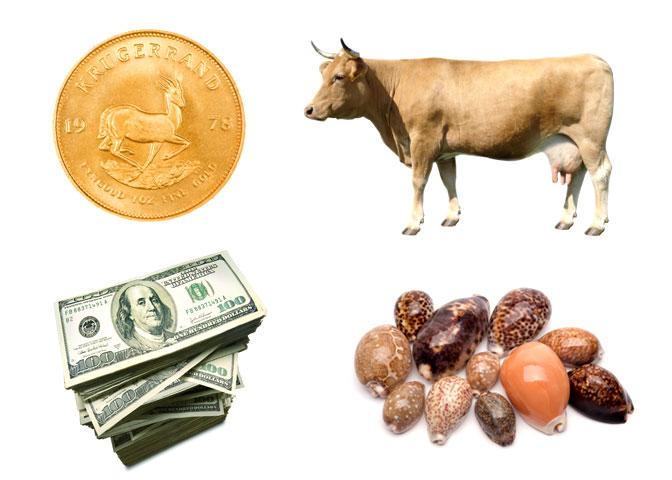

This article explores the evolution of currency and the history of monetary systems, highlighting key advancements in finance from ancient barter systems to modern algorithmic trading. The transformation of money is a story of adaptation and innovation, reflecting human progress and the quest for more efficient economic interactions. Initially, trade occurred through bartering, a direct exchange of goods and services that often faced practical limitations due to the lack of a common measure of value. To mitigate the inefficiencies associated with barter, early societies transitioned to using commodity money, items that held intrinsic value, such as cattle and grains.

As civilizations progressed, the use of metallic money became prevalent. Coins made of precious metals like gold and silver were introduced, and their durability and acceptance further facilitated trade and economic growth. The advent of standardized coinage marked a significant advancement, enabling wider and more reliable commercial interactions.



The introduction of paper money further revolutionized financial transactions, especially in China, where it became an innovative medium of exchange. This period also witnessed the expansion of banking systems, which began offering new forms of credit and financial services. Notably, in India, the use of hundis—a traditional financial instrument—played a crucial role in trade well before colonial systems formalized paper money.

The modern era saw the emergence of electronic money, transforming convenience through methods such as credit/debit cards and electronic funds transfers (EFTs). This digitization, particularly in India following the economic reforms of the 1990s, paved the way for widespread electronic payments. Digital payment platforms and wallets have significantly enhanced financial inclusion, bringing banking services to underserved populations.

Cryptocurrencies, with Bitcoin at the forefront, present a new frontier in monetary systems by introducing decentralized value networks. Enabled by blockchain technology, this digital revolution emphasizes transparency and security. However, cryptocurrency adoption varies globally, with diverse regulatory environments shaping its integration, as seen in countries like India.

Algorithmic trading exemplifies the integration of technology into finance, optimizing speed, efficiency, and accuracy in financial transactions. This advancement poses new challenges and opportunities in global financial systems, highlighting the importance of innovation in the constantly evolving landscape of finance.

Understanding the transformation of money from primitive exchanges to sophisticated financial instruments is crucial in grasping modern financial mechanics. This narrative of monetary evolution not only reflects technological advancements but also underscores the adaptability of human societies in response to economic needs, setting the stage for an exploration of emerging trends that could redefine financial systems globally.

## Table of Contents

## The Dawn of Money: From Barter to Commodity

Bartering, the earliest form of trade, was a system wherein individuals directly exchanged goods and services without the use of money. This practice dates back to ancient civilizations, where people traded items based on mutual needs. However, bartering was often inefficient due to the necessity of a double coincidence of wants, meaning both parties needed to want what the other offered. This limitation spurred the development of more standardized forms of trade.

Commodity money emerged as a solution, with items such as cattle and grains being used as early currencies. These commodities were chosen for their intrinsic value and widespread desirability. For instance, cattle were valuable not only for their use in agriculture and food but also as a symbol of wealth and status. Similarly, grains were essential for sustenance and were easily quantifiable, making them a practical medium for trade.

The use of commodity money paved the way for more structured financial systems, as it facilitated trade over greater distances and among larger groups of people. It also established a form of value storage, allowing individuals to accumulate and transfer wealth more systematically than was possible through barter alone. By standardizing certain goods as currency, early societies could engage in more complex economic activities, setting the foundation for future advancements in monetary systems. This evolution from barter to commodity money marked a significant milestone in the history of finance, laying the groundwork for the sophisticated economic structures we see today.

## Metallic Money: The Age of Coins

Coins made of precious metals such as gold and silver played a pivotal role in the evolution of monetary systems. Their intrinsic value, coupled with durability and ease of transport, made them an attractive medium of exchange for ancient civilizations. The earliest recorded use of metal coins dates back to around 600 BCE in Lydia, a region in modern-day Turkey. These early coins standardized trade and brought about economic cohesion across different societies.

The standardization of coinage provided a tangible measure of value, which was vital for trade. Coins typically bore specific weights and imprints, indicating their origin and guaranteeing their value. This simplified trade and economic interactions by eliminating the uncertainties associated with barter systems, where the value of goods and services was highly subjective.

India, with its rich numismatic tradition, offers a unique insight into the artistry and evolution of coins. The Indian subcontinent has an extensive history of coinage, with the earliest examples, often referred to as "punch-marked" coins, dating back to the 6th century BCE. These coins were simple in design, usually made of silver, and bore symbols that represented various guilds or issuers. As empires expanded, so did the intricacy and distribution of coinage. 

The Mauryan Empire, under the rule of Chandragupta Maurya, saw significant advancements in coinage with the introduction of punch-marked silver coins that showcased standardized symbols and weights, enhancing trade across vast distances. Later, during the Gupta period, gold coins became prevalent, skillfully illustrating the artistic and cultural achievements of that era.

India’s numismatic heritage showcases a wide array of designs and inscriptions, reflecting the diverse rulers and cultures that have influenced the region. This rich tapestry of coinage is a testament to the economic and artistic developments through India's history. Coins not only facilitated trade but also served as a means of propaganda and a display of sovereignty, often bearing valuable historical insights into the period of their circulation. 

The age of metallic money thus laid the foundation for more sophisticated financial systems and established a legacy of economic interaction and cultural exchange that continues to influence modern monetary practices.

## Paper Money and the Evolution of Banking

The emergence of paper money marked a pivotal shift in financial transactions, with its origins traceable to 7th century China during the Tang Dynasty. The use of paper as a medium of exchange offered a more practical alternative to cumbersome metal coins, facilitating easier trade and commerce. By the time of the Song Dynasty in the 11th century, paper money had evolved into a standardized and regulated form of currency, significantly improving transaction efficiency and economic scalability.

Simultaneously, banking systems underwent substantial evolution. Institutions began to emerge that not only safeguarded wealth but also provided new forms of credit and financial services. These banks laid the groundwork for more sophisticated economic activities—ranging from the safekeeping and lending of money to more complex transactions like bills of exchange and letters of credit. Such innovations bolstered economic growth by encouraging trade and helping merchants manage risk.

In India, the use of hundis represents a notable historical example of pre-modern financial instruments that facilitated trade. Hundis were essentially financial instruments similar to promissory notes, used extensively by traders to safely and efficiently conduct transactions over long distances. These instruments compensated for the lack of formalized paper currency systems before colonial times by offering a method of transferring money through written orders, which were considered binding and trustworthy within the trading networks. Hundis and their usage underscore the ingenuity of early financial systems that addressed the needs of commerce and trade efficiently and effectively.

The transition from commodity and metallic money to paper currencies and expanding banking systems marked an era of economic transformation, enabling wider financial inclusion and laying the foundation for the modern financial world.

## The Digital Era: Electronic Money and Payments

Electronic money has fundamentally transformed financial transactions by introducing convenience and speed through methods such as credit and debit cards, as well as electronic funds transfers (EFTs). The shift to electronic transactions began in earnest with the advent of the internet, providing a platform for more efficient financial interactions by eliminating the need for physical currency. This transition allowed consumers to conduct transactions remotely, increasing accessibility and reducing processing times. Credit and debit cards enabled instant payments, while EFTs facilitated direct transfers between bank accounts, all of which have streamlined the financial exchange process.

In India, the digitization trend gained substantial [momentum](/wiki/momentum) post-1990s economic reforms. The liberalization of India's economy facilitated the modernization of financial services and the banking sector. The gradual advent of electronic payment systems, supported by increased internet penetration and mobile connectivity, has paved the way for widespread adoption of electronic payments in the country. Government initiatives, like the Digital India program, have bolstered digital infrastructure, contributing to the expansion of electronic transaction platforms.

Digital wallets and online platforms have played a significant role in enhancing financial inclusion, particularly in rural and underbanked regions. These technologies have provided millions of people with access to financial services that were previously unavailable to them. Digital wallets store users' payment information securely, allowing them to make transactions quickly and easily without needing a traditional bank account. This development has been particularly impactful in countries like India, where financial inclusion is a major policy objective.

The proliferation of mobile payment solutions, including Paytm, Google Pay, and PhonePe, has further accelerated the uptake of digital transactions in India. These platforms leverage mobile networks to facilitate peer-to-peer and peer-to-merchant payments, integrating seamlessly into users' daily lives. This shift towards digital wallets and mobile payment solutions has been instrumental in driving the adoption of electronic money across various demographic segments, significantly enhancing the financial ecosystem's inclusivity and accessibility. 

The rise of electronic money, coupled with supportive government policies and technological advancements, portends a future where cashless transactions become the norm, ultimately contributing to a more interconnected and efficient global financial network.

## Cryptocurrencies: A New Frontier

Cryptocurrencies have emerged as a transformative force in the financial world, fundamentally altering the way value is perceived and exchanged. At the forefront of this movement is Bitcoin, notoriously known as the first decentralized digital currency. Launched in 2009 by an anonymous figure under the pseudonym Satoshi Nakamoto, Bitcoin introduced the concept of decentralization to currency. Unlike traditional currencies issued by central banks, Bitcoin operates on a peer-to-peer network, free from centralized control. The essence of cryptocurrencies lies in their reliance on blockchain technology, a decentralized ledger system that enhances transparency and security within financial transactions.

Blockchain technology serves as the backbone for Bitcoin and other cryptocurrencies, ensuring that every transaction is transparently recorded and immutable. The blockchain acts as a distributed database that is maintained by a network of nodes, each holding a copy of the entire ledger. This decentralization reduces the risk of fraud and manipulation, which are often associated with centralized financial systems. Each block in the blockchain contains a cryptographic hash of the previous block, transaction data, and a timestamp, making it practically tamper-proof. The introduction of smart contracts, self-executing contracts with the terms written into code, further expanded the potential of blockchain technology by automating complex transaction processes without the need for intermediaries.

In India, the adoption and regulation of cryptocurrencies have been met with varying degrees of caution and enthusiasm. The Reserve Bank of India (RBI) initially imposed a ban on financial institutions dealing with cryptocurrencies in 2018, citing risks to consumer protection, market integrity, and anti-money laundering. However, in March 2020, the Supreme Court of India lifted the ban, marking a significant turning point for [cryptocurrency](/wiki/cryptocurrency) enthusiasts in the country. Despite this regulatory shift, the Indian government has expressed interest in formulating a comprehensive framework to regulate the burgeoning crypto market, aiming to balance innovation with necessary safeguards against misuse.

The Indian cryptocurrency ecosystem is diverse, with numerous exchanges facilitating the trade of digital currencies and a growing base of users exploring blockchain technology's potential. Nevertheless, the regulatory environment remains complex. The absence of a clear regulatory framework creates uncertainty and poses challenges for both investors and developers. As policymakers continue to navigate this uncharted territory, they are tasked with fostering an environment that encourages innovation while ensuring financial stability and consumer protection.

Cryptocurrencies, anchored by Bitcoin and blockchain technology, present a new frontier in the financial landscape by promoting a decentralized approach to transactions and value storage. In countries like India, where cryptocurrency adoption is contingent upon regulatory clarity, the future may hold the potential for significant economic transformation. As digital currencies continue to evolve, they challenge traditional financial systems, heralding a new era of possibilities in the global economy.

## Algorithmic Trading and Financial Systems

Algorithmic trading, often referred to as algo-trading, involves the use of computer algorithms to automate trading decisions. These algorithms are designed to execute orders at optimal speeds, reducing the time between decision and execution to mere milliseconds. This integration of technology into finance has revolutionized the way transactions are conducted in global markets. 

The primary advantage of [algorithmic trading](/wiki/algorithmic-trading) lies in its ability to handle large volumes of data and perform complex calculations at unprecedented speeds. This capability enhances the efficiency and accuracy of financial transactions, allowing traders to capitalize on fleeting market opportunities. By using sophisticated algorithms, traders can analyze vast datasets to predict market trends and execute trades based on predefined criteria, minimizing human error and emotional bias.

Algorithmic trading is predominantly used for strategies such as [arbitrage](/wiki/arbitrage), [market making](/wiki/market-making), and [trend following](/wiki/trend-following). For instance, in market making, an algorithm can simultaneously quote a buy and a sell price to profit from the bid-ask spread. In arbitrage trading, the algorithm identifies price discrepancies across different markets or exchanges, allowing traders to buy low in one market and sell high in another, effectively securing a risk-free profit.

Here is a simple example in Python illustrating a basic moving average crossover strategy, often used in algorithmic trading:

```python
def moving_average(prices, window):
    return [sum(prices[i:i+window])/window for i in range(len(prices)-window+1)]

def moving_average_crossover(prices):
    short_window = 10
    long_window = 50
    short_ma = moving_average(prices, short_window)
    long_ma = moving_average(prices, long_window)

    signals = []
    for i in range(1, min(len(short_ma), len(long_ma))):
        if short_ma[i] > long_ma[i] and short_ma[i-1] <= long_ma[i-1]:
            signals.append('Buy')
        elif short_ma[i] < long_ma[i] and short_ma[i-1] >= long_ma[i-1]:
            signals.append('Sell')
        else:
            signals.append('Hold')
    return signals
```

Despite its benefits, algorithmic trading introduces challenges and potential risks. The speed at which these transactions occur can exacerbate market [volatility](/wiki/volatility-trading-strategies) and lead to scenarios like the "Flash Crash" of 2010, where the Dow Jones Industrial Average plunged about 1,000 points within minutes due to algorithms reacting unpredictably to market conditions. 

Furthermore, the increasing prevalence of algorithmic trading has led to concerns about fairness and transparency in financial markets. High-frequency trading ([HFT](/wiki/high-frequency-trading-strategies)), a subset of algorithmic trading, gives an advantage to those with access to cutting-edge technology, potentially disadvantaging retail investors.

As algorithmic trading continues to evolve, regulatory bodies worldwide are challenged to create and enforce rules that safeguard market integrity while encouraging innovation. Future developments may focus on improving the ethical standards of algorithmic strategies and enhancing the robustness of trading systems to withstand extreme market conditions.

## Conclusion: The Future of Money

The ongoing evolution of money is emblematic of the larger technological and economic shifts shaping the modern world. Historically, the transition from physical commodities to digital currencies has been driven by the quest for efficiency, security, and inclusivity in financial transactions. As we look towards the future, understanding these shifts is critical for anticipating the next stage in monetary development. 

One significant trend that could redefine global financial systems is the emergence of Central Bank Digital Currencies (CBDCs). CBDCs represent a digital form of a country's fiat currency and hold the potential to transform the way monetary authorities interact with the economy. They promise enhanced transactional efficiency, reduced costs, and increased accessibility, particularly in regions where traditional banking services are lacking. CBDCs may address concerns related to the shadow economy and money laundering because of their traceable nature, which stands in stark contrast to the anonymity associated with some cryptocurrencies.

The introduction of CBDCs also raises questions about monetary policy and financial stability. With the ability to implement programmable money, central banks could potentially exert more precise control over monetary policy, influencing interest rates and managing economic cycles more effectively. However, the shift towards CBDCs must be approached with caution, considering the technological infrastructure required and the cybersecurity risks involved.

The future landscape of money will also be shaped by continuous innovation in financial technologies. Advances in blockchain, smart contracts, and [machine learning](/wiki/machine-learning) have the potential to enhance security, transparency, and efficiency across financial systems. These technologies can facilitate more secure and faster cross-border transactions, reduce fraud, and enable the development of decentralized finance (DeFi) platforms that provide financial services without traditional intermediaries.

Moreover, the rise of algorithmic trading and [artificial intelligence](/wiki/ai-artificial-intelligence) in financial markets may further redefine market dynamics by improving trade execution, optimizing portfolios, and managing risks in real-time. These technologies have the potential to democratize access to financial markets, though they also pose regulatory and ethical challenges that need addressing.

In conclusion, the future of money is intertwined with technological evolution and economic adaptation. While emerging trends such as CBDCs promise transformative changes, continuous innovation in financial technologies will be critical for shaping future financial landscapes. As these advancements unfold, careful consideration of their implications will ensure that the benefits of these new systems can be realized while mitigating potential risks.

## References & Further Reading

[1]: Ferguson, N. (2008). [The Ascent of Money: A Financial History of the World](https://en.wikipedia.org/wiki/The_Ascent_of_Money). Penguin Books.

[2]: Kynge, J. (2007). [China Shakes the World: A Titan's Rise and Troubled Future -- and the Challenge for America](https://archive.org/details/chinashakesworld0000kyng_v7g1). Houghton Mifflin Harcourt.

[3]: Nakamoto, S. (2008). [Bitcoin: A Peer-to-Peer Electronic Cash System](https://nakamotoinstitute.org/library/bitcoin/).

[4]: Davidson, P., & Steffens, M. (2020). [Central Banks Digital Currencies and Privacy](https://www.journals.uchicago.edu/doi/10.1086/720457). SSRN.

[5]: MacKenzie, D. (2006). [An Engine, Not a Camera: How Financial Models Shape Markets](https://academic.oup.com/mit-press-scholarship-online/book/20588). MIT Press.

[6]: Lopez de Prado, M. (2018). [Advances in Financial Machine Learning](https://www.amazon.com/Advances-Financial-Machine-Learning-Marcos/dp/1119482089). Wiley.

[7]: Tapscott, D., & Tapscott, A. (2016). [Blockchain Revolution: How the Technology Behind Bitcoin is Changing Money, Business, and the World](https://dl.acm.org/doi/10.5555/3051781). Portfolio.

[8]: Aronson, D. (2006). [Evidence-Based Technical Analysis: Applying the Scientific Method and Statistical Inference to Trading Signals](https://www.amazon.com/Evidence-Based-Technical-Analysis-Scientific-Statistical/dp/0470008741). Wiley. 

[9]: Hull, J. C. (2017). [Options, Futures, and Other Derivatives](https://www.semanticscholar.org/paper/Options%2C-Futures%2C-and-Other-Derivatives-Hull/89bdee500c8623864fc9eb7a471546aa713acc44). Pearson.