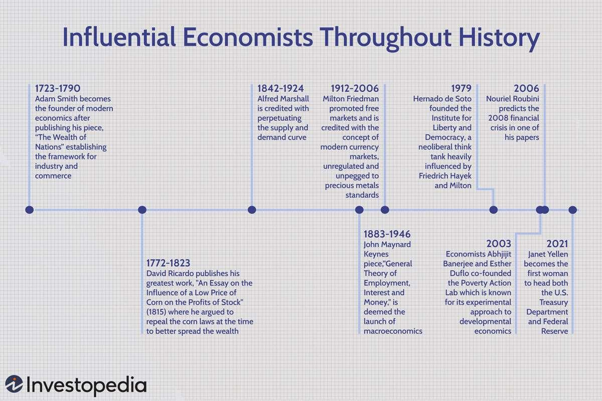

## Table of Contents

## What is economics and why is its history important?

Economics is the study of how people use resources to produce goods and services and how they distribute these among themselves. It looks at how individuals, businesses, governments, and other organizations make choices about using limited resources to meet their needs and wants. Economists try to understand why people make certain decisions and how these decisions affect the economy as a whole. They use theories and models to explain economic behavior and to predict what might happen in the future.

The history of economics is important because it helps us understand how economic ideas and practices have developed over time. By studying the past, we can see how different economic systems, like capitalism and socialism, have worked in different places and times. We can learn from the successes and failures of these systems. For example, knowing about the Great Depression can help us understand why governments today take certain actions to prevent economic crises. The history of economics also shows us how economic theories have changed and how they have influenced policies and laws. This knowledge can help us make better decisions today and in the future.

## When did the study of economics begin and who were the earliest economists?

The study of economics began a long time ago, even before it was called economics. People have always had to make choices about how to use their resources, like food, land, and time. The earliest writings about these choices come from ancient civilizations, like the Greeks and the Romans. For example, the Greek philosopher Aristotle talked about the importance of managing resources well. However, the formal study of economics as we know it today started to take shape in the 17th and 18th centuries.

Some of the earliest economists were people like Adam Smith, who is often called the "Father of Economics." In 1776, he wrote a famous book called "The Wealth of Nations," where he explained how countries could become wealthy by letting people trade freely. Another important early economist was David Ricardo, who lived in the early 1800s. He came up with the idea of comparative advantage, which explains why countries should focus on making things they are good at and trade with others. These early economists laid the groundwork for the field of economics and their ideas are still important today.

## How did ancient civilizations like Greece and Rome contribute to economic thought?

Ancient civilizations like Greece and Rome made big contributions to how we think about economics today. In Greece, people like Aristotle wrote about how to manage resources well. He talked about things like the value of money and how to make fair trades. These ideas were some of the first steps in understanding how economies work. Aristotle also thought about what makes a good economy and how it should help everyone in society, not just a few people.

In Rome, they had a big empire and needed ways to handle their money and resources. Roman thinkers like Cicero wrote about how to run an economy and the importance of laws to keep things fair. They had a big system for collecting taxes and building things like roads and aqueducts, which helped their economy grow. The Romans also used coins, which made trading easier and helped them keep track of their wealth. These early ideas from Greece and Rome helped later economists build their theories and understand how economies work.

## What were the main economic ideas during the Middle Ages?

During the Middle Ages, the main economic ideas were shaped by the feudal system and the Church. The feudal system was a way of organizing society where lords owned the land and peasants worked it. The lords gave protection and a place to live to the peasants in return for their work. This system meant that most people did not use money much. Instead, they traded things they made or grew, like food and clothes. The Church also had a big say in economic ideas. They taught that it was wrong to charge too much for things or to make money from lending money, which they called usury. The Church wanted people to be fair and help each other, not just try to get rich.

Another important idea during the Middle Ages was the idea of a "just price." This meant that the price of something should be fair for both the buyer and the seller. The Church and thinkers of the time believed that prices should not be too high or too low, but just right. They also thought about how to help the poor and make sure everyone had enough to live on. These ideas about fairness and helping others were very important in the Middle Ages and influenced how people thought about economics for a long time.

## How did the Mercantilism theory shape economic policies in the 16th to 18th centuries?

Mercantilism was a big idea about how countries should run their economies from the 16th to the 18th centuries. It said that a country should try to have more money coming in than going out. Countries did this by selling more stuff to other countries than they bought from them. They also tried to have a lot of gold and silver, which they thought made them richer. Governments put up rules to help their own businesses and make it hard for other countries to sell things there. They also started colonies to get more resources and sell more things.

Because of mercantilism, countries did things like building big navies to control trade routes and making laws to stop people from buying things from other countries. For example, England passed laws that said people had to buy things like sugar and tobacco from their colonies, not from other places. This helped England's businesses grow but made it hard for other countries. Mercantilism made countries compete a lot and sometimes even fight over trade. It was a big part of how countries ran their economies until new ideas like those from Adam Smith started to change things.

## What were Adam Smith's contributions to economics and how did they influence the field?

Adam Smith made big changes to how people think about economics. He wrote a book called "The Wealth of Nations" in 1776. In this book, he said that countries should let people trade freely without too many rules from the government. He believed that if people could make their own choices, it would make everyone better off. This idea is called the "invisible hand," which means that people working for their own good can help the whole economy grow. Smith also talked about how dividing work into smaller tasks, which he called the division of labor, could make things cheaper and better.

Smith's ideas changed the way countries ran their economies. Before him, many countries followed mercantilism, which was all about keeping money in the country and stopping other countries from selling things there. But after Smith, more countries started to let people trade freely. This led to more businesses starting up and more things being made and sold. His ideas helped start a new way of thinking called capitalism, where people can own businesses and make money from them. Even today, people still use Smith's ideas to understand how economies work and how to make them better.

## How did the Industrial Revolution impact economic theories and practices?

The Industrial Revolution, which started in the late 1700s and early 1800s, changed a lot of things about how people worked and lived. It brought new machines and factories that made it easier to make things like clothes and tools. This made economies grow fast, but it also made people think differently about economics. Before the Industrial Revolution, many people worked on farms and made things by hand. But with factories, people started to work in cities and make things in big groups. This made economists like Adam Smith's ideas about the division of labor even more important. They saw how breaking jobs into smaller parts could make factories work better and make more things.

The Industrial Revolution also led to new economic theories. One big idea was from Karl Marx, who saw that the new way of working made some people very rich and others very poor. He thought this was not fair and said that workers should own the factories and share the money they made. This led to ideas like socialism and communism. At the same time, other economists like David Ricardo looked at how countries could trade with each other to make more things. They came up with ideas like comparative advantage, which said that countries should make what they are good at and trade with others. These new theories helped people understand how the big changes from the Industrial Revolution were changing the world.

## What are the key differences between classical and neoclassical economics?

Classical economics started in the late 1700s and early 1800s with thinkers like Adam Smith and David Ricardo. They focused on how economies grow and how countries can get richer. They thought that if people were free to trade and make their own choices, the economy would do well on its own. They believed in things like the "invisible hand," which means that people trying to do well for themselves can help everyone. They also talked about how dividing work into smaller tasks could make things cheaper and better. Classical economists were more worried about the big picture, like how much a country makes and how it can trade with others.

Neoclassical economics came later, in the late 1800s and early 1900s. It built on classical ideas but looked at things in a different way. Neoclassical economists focused more on how people make choices and how those choices affect the economy. They used math and models to understand these choices better. They talked about things like supply and demand, which means how much people want something and how much of it there is. They also looked at how people decide what to buy and how much to work. Neoclassical economics is more about understanding the small choices people make and how those choices add up to make the whole economy work.

## How did Keynesian economics emerge and what impact did it have on economic policy?

Keynesian economics started in the 1930s because of a man named John Maynard Keynes. He wrote a book called "The General Theory of Employment, Interest, and Money" during the Great Depression, a time when many people were out of work and the economy was doing very badly. Keynes thought that the economy could get stuck and not get better on its own, like classical economists believed. He said that the government should step in to help. For example, the government could spend more money to create jobs and help people buy things. This would make the economy grow again.

Keynesian economics had a big impact on how governments ran their economies. After Keynes's ideas came out, many countries started using them to fight problems like the Great Depression. Governments started spending more money on things like roads and schools to create jobs. They also changed taxes and interest rates to help the economy. These ideas helped make economies more stable and helped people when times were tough. Even today, governments use Keynesian ideas to make plans and help their economies grow.

## What role did the Great Depression play in the evolution of economic theories?

The Great Depression, which started in 1929, was a very bad time for the economy. Many people lost their jobs and couldn't buy things. This made economists think hard about why it happened and how to fix it. Before the Great Depression, many economists followed classical ideas. They thought that if people were free to trade and make their own choices, the economy would fix itself. But the Great Depression showed that sometimes the economy needs help to get better. This made economists start looking for new ideas.

One of the biggest changes came from John Maynard Keynes. He wrote a book during the Great Depression and said that the government should spend more money to help the economy. His ideas became known as Keynesian economics. Governments started using his ideas to create jobs and help people buy things. This helped make the economy more stable. The Great Depression made people see that sometimes the government needs to step in to help the economy, and this changed how economists thought about how to make things better.

## How have globalization and technological advancements influenced modern economic thought?

Globalization and technological advancements have changed how economists think about the world. Globalization means that countries are more connected now. They trade more with each other and businesses can work all over the world. This has made economists think about how countries can work together to make more things and help each other's economies grow. They also think about how to make sure everyone gets a fair share of the benefits from this global trade. Economists now look at things like how easy it is to move money and goods across borders and how this affects jobs and prices.

Technological advancements have also changed a lot of things. New technology like the internet and computers has made it easier for people to buy and sell things without leaving their homes. This has made economists think about how technology can make economies grow faster and how it changes the way people work. They look at things like how automation, which means machines doing jobs that people used to do, affects the economy. They also think about how to make sure that everyone can use new technology and that it doesn't just help a few people. These changes have made economists think in new ways about how to make economies work better for everyone.

## What are the current debates and future directions in the field of economics?

In economics today, there are big debates about how to make the economy fair for everyone. One big debate is about inequality, which means the difference between rich and poor people. Some economists say that too much inequality can hurt the economy and make it hard for everyone to do well. They think the government should do more to help people who don't have much money. Other economists think that if people are free to make their own choices, it will make the economy grow and help everyone in the long run. They worry that too much help from the government can make people not want to work hard.

Another big debate is about how to deal with climate change. Many economists think that the way we use energy and resources is hurting the planet. They want to find ways to make the economy grow without damaging the environment. This could mean using more clean energy like solar and wind power, and making new rules to stop pollution. Some economists think this will be hard and might slow down the economy. But others believe that if we start now, we can find new ways to make money and create jobs while also protecting the planet.

Looking to the future, economists are also thinking about how technology will change the economy. With things like [artificial intelligence](/wiki/ai-artificial-intelligence) and automation, machines might do more jobs that people used to do. This could make things cheaper and help the economy grow, but it could also mean fewer jobs for people. Economists are trying to figure out how to make sure everyone can still work and make money, even as technology changes. They are also looking at how to use data and new ways of thinking to understand the economy better and make better plans for the future.

## References & Further Reading

[1]: Smith, A. (1776). "An Inquiry into the Nature and Causes of the Wealth of Nations."

[2]: Keynes, J. M. (1936). "The General Theory of Employment, Interest and Money."

[3]: Kahneman, D., & Tversky, A. (1979). ["Prospect Theory: An Analysis of Decision under Risk."](https://www.jstor.org/stable/1914185) Econometrica, 47(2), 263-291.

[4]: Baddeley, M. (2013). "Behavioural Economics and Finance." Routledge.

[5]: Lo, A. W. (2005). ["Reconciling Efficient Markets with Behavioral Finance: The Adaptive Markets Hypothesis."](https://papers.ssrn.com/sol3/papers.cfm?abstract_id=1702447) Journal of Investment Consulting, 7(2), 21-44.

[6]: Bermúdez, J. L. (2010). "Cognitive Science Examples." In Cognitive Science: An Introduction to the Science of the Mind. Cambridge University Press.

[7]: Treynor, J. (1995). ["The Treynor Capital Asset Pricing Model,"](http://www.finance.martinsewell.com/capm/French2003.pdf) Financial Analysts Journal, 51(6), 66-67.

[8]: Aldridge, I. (2013). "High-Frequency Trading: A Practical Guide to Algorithmic Strategies and Trading Systems." Wiley.

[9]: Kirilenko, A. A., & Lo, A. W. (2013). ["Moore's Law versus Murphy's Law: Algorithmic Trading and its Discontents."](https://www.aeaweb.org/articles?id=10.1257/jep.27.2.51) Journal of Economic Perspectives, 27(2), 51-72.