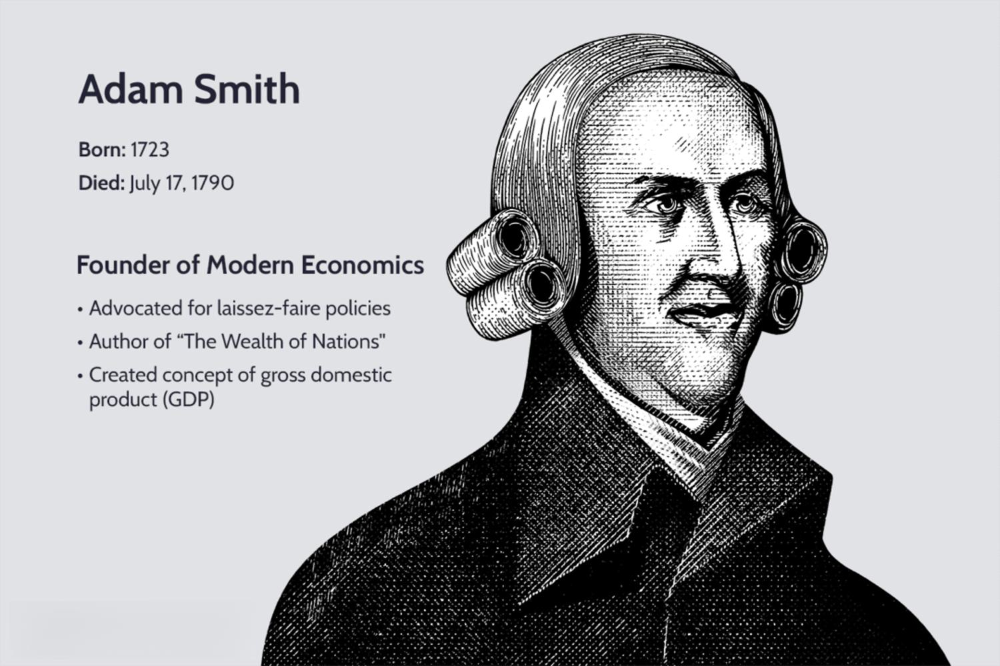

The world of economics is vast and multifaceted, encompassing diverse theories, historical developments, and contemporary advancements. At its core, economics seeks to understand how societies allocate resources and how individuals and institutions respond to incentives. Understanding the development of economic theory offers crucial insights into the functioning of economies by shedding light on fundamental principles such as supply and demand, market dynamics, and fiscal policies. These theories provide the framework for analyzing economic behavior and predicting the outcomes of various economic activities.

The history of economics is a reflection of societal changes and technological advancements, capturing the evolution of human thought regarding wealth, trade, and the distribution of resources. From the early barter systems to digital currencies, each phase in economic history represents a response to contemporary challenges and opportunities. The Industrial Revolution, for example, marked a significant shift towards mechanized production, altering labor markets and reshaping global trade patterns. Similarly, subsequent economic milestones like the Great Depression influenced the development of new economic policies and theories that guide current economic structures.

In recent decades, algorithmic trading has emerged as a contemporary evolution in economic applications, showcasing the intersection of economic theory and technological innovation. Algorithmic trading uses complex algorithms and high-frequency data analysis to automate trading decisions, increasing the speed and efficiency of financial transactions. This application exemplifies the merging of technological advancements with traditional economic concepts, creating new paradigms in how markets operate and how trades are executed.

This article explores the intersections of economic theory, historical evolution, and modern innovations like algorithmic trading. By examining these interconnected aspects, we can better comprehend the ongoing development of economics and its implications for contemporary and future global financial systems.

## Table of Contents

## The Evolution of Economic Theory

Economic theory has undergone substantial transformation from its classical foundations to contemporary approaches, reflecting changes in societal values, technological advancements, and complex global interactions. The evolution of economic thought begins with classical economics, largely shaped by thinkers like Adam Smith, who emphasized the benefits of free markets driven by the 'invisible hand.' Smith argued that individual self-interest, coupled with competition, leads to positive economic outcomes, as each participant in the market strives for their gain, inadvertently contributing to the common good. This perspective laid the groundwork for understanding market dynamics through the lens of supply and demand, facilitating the efficient allocation of resources.

The advent of Keynesian economics marked a pivotal shift in economic theory. Developed during the Great Depression by John Maynard Keynes, this school of thought introduced macroeconomic perspectives, focusing on the role of aggregate demand in influencing economic output and employment levels. Keynesian economics advocates for government intervention to stabilize economic fluctuations through monetary and fiscal policies. It challenged the previously dominant notion of self-regulating markets, suggesting that without active government intervention, markets could fail to achieve full employment, leading to prolonged periods of economic distress.

Neoclassical economics emerged as an extension and refinement of classical ideas, emphasizing market equilibrium and individual consumer behavior. This theoretical framework posits that through the mechanism of supply and demand, markets tend to naturally find a state of equilibrium where the quantity supplied equals the quantity demanded. Neoclassical theory relies heavily on the assumption of rational actors, who make decisions by maximizing utility subject to budget constraints. This school of thought is extensively modeled using mathematical tools to derive optimum consumer choices and firm production functions, with the cornerstone being the analysis of marginal utility and cost.

In recent decades, modern economic thought has expanded to include behavioral economics and other interdisciplinary approaches, reflecting the understanding that human behavior often deviates from the 'rational actor' model proposed by classical and neoclassical theories. Behavioral economics, spearheaded by researchers such as Daniel Kahneman and Amos Tversky, incorporates psychological insights into economic decision-making, recognizing that cognitive biases, emotions, and social influences can impact financial choices and market outcomes. This modern framework challenges traditional assumptions, offering a more nuanced examination of how individuals and institutions behave in economic settings.

The integration of behavioral insights with economic analysis has led to the development of more comprehensive models that account for the complexities of human behavior. Additionally, advancements in technology and the increasing availability of data have empowered economists to adopt interdisciplinary methods, incorporating elements from neuroscience, sociology, and data science to expand their analytical toolkit.

## A Historical Overview of Economics

The history of economics is a narrative rich with pivotal developments that have significantly impacted the global economy we know today. The Industrial Revolution, commencing in the late 18th century, was a period of profound economic transformation. It marked the transition from agrarian economies to industrial powerhouses through the advancement of technology and the efficient manufacturing of goods. This era introduced novel economic concepts and practices, including the division of labor, mass production, and the establishment of factories, which facilitated economies of scale and urbanization. 

The onset of the Great Depression in 1929 exposed the vulnerabilities in economic systems worldwide and instigated a paradigm shift in economic thinking and policymaking. The unprecedented economic collapse led to widespread unemployment, poverty, and political unrest. In response, governments worldwide, influenced by Keynesian economics, began to employ policy tools such as fiscal stimulus and monetary easing to mitigate the crisis's impact and revive economic growth. These measures demonstrated the critical role of government intervention in stabilizing economies during periods of distress.

Following World War II, the global economic landscape underwent further transformation during the post-war era. This period was characterized by the rise of globalization, driven by technological advancements in transportation and communication, which facilitated international trade and investment. Globalization introduced new economic challenges such as trade imbalances, fiscal deficits, and the need for international economic coordination. Additionally, institutions like the International Monetary Fund (IMF) and the World Bank were established to support international economic cooperation and development.

Understanding economic history is crucial for grasping the current economic structures and policies that shape today’s global economy. The insights gained from past economic events inform policymakers and economists as they navigate contemporary challenges, ensuring that lessons learned from history contribute to more resilient and adaptive economic strategies.

## The Rise of Algorithmic Trading

Algorithmic trading employs computers to execute trades based on predefined criteria, enhancing the speed and efficiency of financial markets. This technological advancement has reshaped the financial industry by enabling rapid analysis and execution of trades. The roots of [algorithmic trading](/wiki/algorithmic-trading) can be traced back to the late 20th century when financial markets began adopting electronic trading platforms. The automation of trading strategies allowed for substantial improvements in transaction execution and market [liquidity](/wiki/liquidity-risk-premium).

One of the primary advantages of algorithmic trading is its ability to reduce transaction costs. By automating the trading process, algorithms can identify the most opportune moments to buy or sell assets, minimizing the bid-ask spread and slippage. This precision leads to significant cost savings, especially for large institutional investors who engage in high-frequency trading.

Furthermore, algorithmic trading minimizes human error. Human traders are susceptible to emotional decisions, fatigue, and cognitive biases, all of which can lead to suboptimal trading outcomes. In contrast, algorithms consistently execute trades based on logical conditions and statistical models, ensuring adherence to predefined strategies without deviation.

Despite these advantages, algorithmic trading poses challenges such as increased market [volatility](/wiki/volatility-trading-strategies). The speed and [volume](/wiki/volume-trading-strategy) of trade executions can cause rapid fluctuations in asset prices, leading to flash crashes, where markets experience sudden, severe price declines. Additionally, the complexity of algorithmic systems introduces ethical concerns, such as the potential for market manipulation through predatory algorithms designed to exploit other traders' strategies.

In summary, algorithmic trading significantly enhances the efficiency of financial markets but also necessitates careful consideration of its inherent risks. Regulations and advancements in algorithmic oversight continue to evolve to address these challenges and maintain the integrity of global financial systems.

## Intersection of Economic Theory and Technological Innovation

Technological innovation has become a dominant influence on the evolution of economic theory and its practice. One of the most illustrative examples of this influence is the emergence and development of algorithmic trading, which has transformed financial markets by integrating technology deeply into economic processes.

Algorithmic trading, often referred to as algo trading, involves the use of computer algorithms to execute trades based on predetermined criteria. This technology-driven approach allows for rapid execution of trades, often exploiting market conditions within milliseconds to optimize profitability and efficiency. The impact of algorithmic trading on economic theory is significant as it challenges traditional market concepts and calls for adaptations in economic models to account for the speed and efficiency with which trades are conducted.

Economic theories are evolving to address these new technological realities. Traditional models, which often relied on equilibrium theories and assumptions of rational behavior, face challenges in the fast-paced, data-rich environment created by technological advancements. For instance, behavioral economics, which departs from the assumption of pure rationality, finds new relevance as it considers the implications of technology on decision-making processes.

Big data and [machine learning](/wiki/machine-learning) have become pivotal in the analysis and prediction of economic trends. The ability to process vast amounts of data at unprecedented speeds enables more accurate economic forecasting and analysis. Machine learning algorithms, in particular, are being increasingly utilized to detect patterns and make predictions based on historical and real-time data. This innovation allows for more dynamic and responsive modeling of economic systems, enhancing both microeconomic and macroeconomic analyses.

The synergy between traditional economic theories and technological advancements is likely to shape the future of economics. Economists are now tasked with integrating novel analytical tools and methodologies derived from technological innovations, thereby enriching traditional economic perspectives with data-driven insights. This integration promises a more nuanced understanding of economic phenomena and a more robust framework for addressing contemporary economic challenges.

The trajectory of economics is thus intertwined with technological progress, and future developments will likely continue to harness this synergy. Embracing these changes will facilitate a deeper comprehension of global economic dynamics and enable more effective navigation of the complexities inherent in modern economic systems.

## Conclusion

The development of economics remains a dynamic and evolving field, reflecting the intricate interplay between theory, history, and modern technological advancements. Understanding economic theory and history is imperative for addressing contemporary challenges. Economic theories provide the frameworks necessary for discerning how societies allocate resources, while historical context enriches our appreciation of how these theories have shaped and been shaped by key events and technological transformations. 

Algorithmic trading serves as a prime example of the profound impact technology has on economics. By leveraging advanced computing techniques, algorithmic trading enhances market efficiency and introduces both opportunities and challenges in financial markets. Its rise underscores the necessity for economic thought to incorporate and adapt to emerging technologies, highlighting an ever-growing intersection between economics and technology.

Future economic progress is likely to occur at the confluence of theoretical advancements and technological innovation. As big data and machine learning become integral to economic analysis, traditional theories will continue to evolve, fostering a more comprehensive understanding of economic phenomena. Embracing these concepts is pivotal in grasping the complexities of the global economy, as they offer critical insights into how economic structures function and how they may be influenced by ongoing innovations.

## References & Further Reading

[1]: Smith, A. (1776). "An Inquiry into the Nature and Causes of the Wealth of Nations."

[2]: Keynes, J. M. (1936). "The General Theory of Employment, Interest and Money."

[3]: Kahneman, D., & Tversky, A. (1979). ["Prospect Theory: An Analysis of Decision under Risk."](https://www.jstor.org/stable/1914185) Econometrica, 47(2), 263-291.

[4]: Baddeley, M. (2013). "Behavioural Economics and Finance." Routledge.

[5]: Lo, A. W. (2005). ["Reconciling Efficient Markets with Behavioral Finance: The Adaptive Markets Hypothesis."](https://papers.ssrn.com/sol3/papers.cfm?abstract_id=1702447) Journal of Investment Consulting, 7(2), 21-44.

[6]: Bermúdez, J. L. (2010). "Cognitive Science Examples." In Cognitive Science: An Introduction to the Science of the Mind. Cambridge University Press.

[7]: Treynor, J. (1995). ["The Treynor Capital Asset Pricing Model,"](http://www.finance.martinsewell.com/capm/French2003.pdf) Financial Analysts Journal, 51(6), 66-67.

[8]: Aldridge, I. (2013). "High-Frequency Trading: A Practical Guide to Algorithmic Strategies and Trading Systems." Wiley.

[9]: Kirilenko, A. A., & Lo, A. W. (2013). ["Moore's Law versus Murphy's Law: Algorithmic Trading and its Discontents."](https://www.aeaweb.org/articles?id=10.1257/jep.27.2.51) Journal of Economic Perspectives, 27(2), 51-72.