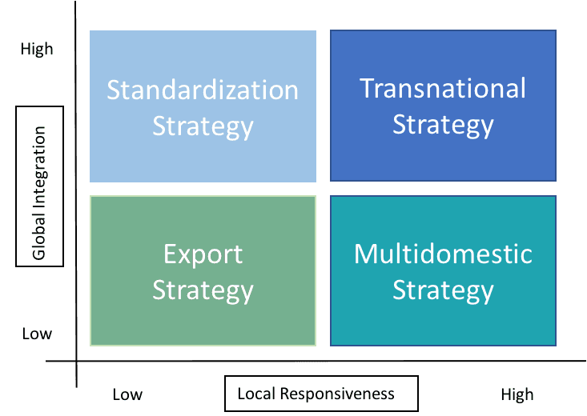

## Table of Contents

## What is export-led growth?

Export-led growth is when a country tries to grow its economy by selling more things to other countries. Instead of just selling things inside their own country, they focus on making products that people in other countries want to buy. This can help the country earn more money from other places, create jobs, and make their businesses bigger and better.

Sometimes, countries use special strategies to make export-led growth work. They might give money or help to companies that sell things abroad, or they might make rules that make it easier for these companies to do business. This can make the country's products cheaper or better than those from other places, so more people want to buy them. When this happens, the country's economy can grow faster than if they only sold things at home.

## When did export-led growth strategies first become popular?

Export-led growth strategies started becoming popular in the 1960s and 1970s. Before that time, many countries focused on growing their economies by selling things only within their own borders. But then, some countries, especially in East Asia like Japan and South Korea, started trying a new way. They decided to make things that people in other countries wanted to buy, and it worked really well for them. Their economies grew fast, and other countries started to notice.

Seeing the success of Japan and South Korea, more countries began to use export-led growth strategies in the 1980s and 1990s. Countries in Southeast Asia, like Singapore and Malaysia, followed this path and also saw their economies grow quickly. By focusing on exports, these countries were able to create jobs, earn more money from other countries, and improve their industries. This approach became a popular model for economic development around the world.

## Which countries were the pioneers in adopting export-led growth strategies?

Japan and South Korea were the pioneers in adopting export-led growth strategies. In the 1960s, Japan started focusing on making things that people in other countries wanted to buy. They made cars, electronics, and other products that were popular around the world. By selling these things abroad, Japan's economy grew very fast. South Korea followed Japan's example a bit later in the 1960s and 1970s. They also made products like electronics and ships that people in other countries wanted. This helped South Korea's economy grow quickly too.

Because Japan and South Korea were successful, other countries started to notice. In the 1980s and 1990s, countries like Singapore and Malaysia in Southeast Asia also started using export-led growth strategies. They made things like electronics and textiles that were sold to other countries. This helped their economies grow fast too. By focusing on exports, these countries were able to create jobs, earn money from other places, and improve their industries.

## How did export-led growth impact the economies of East Asian countries like Japan and South Korea?

Export-led growth had a big impact on the economies of East Asian countries like Japan and South Korea. In the 1960s, Japan started making things like cars and electronics that people in other countries wanted to buy. By selling these products abroad, Japan's economy grew very fast. This helped create lots of jobs and made Japanese companies bigger and better. People in Japan had more money to spend, and the country became richer.

South Korea followed Japan's example in the 1960s and 1970s. They made things like electronics and ships that were sold to other countries. This helped South Korea's economy grow quickly too. Like Japan, South Korea created many jobs and their companies grew. The money earned from exports helped South Korea become a richer country. Both Japan and South Korea showed that focusing on selling things to other countries can really help an economy grow.

## What are the key components of an export-led growth strategy?

An export-led growth strategy focuses on making things that people in other countries want to buy. Countries that use this strategy work hard to make their products better and cheaper than those from other places. They might give money or help to companies that sell things abroad, making it easier for these companies to do business. This can include building factories, improving roads and ports, and making rules that help companies sell more to other countries.

Another important part of an export-led growth strategy is finding new markets where people want to buy the country's products. Countries might send people to other countries to find out what people there need and want. They might also make special deals with other countries to sell more things there. By focusing on selling things to other countries, a country can earn more money, create jobs, and help its businesses grow bigger and better.

## How does export-led growth differ from import substitution industrialization?

Export-led growth and import substitution industrialization are two different ways countries try to grow their economies. Export-led growth is when a country focuses on making things that people in other countries want to buy. They try to make their products better and cheaper than those from other places. This helps the country earn more money from other countries, create jobs, and make their businesses bigger and better. Countries might help companies that sell things abroad by giving them money or making rules that make it easier for them to do business.

Import substitution industrialization is different. Instead of selling things to other countries, a country tries to make things at home that they used to buy from other places. The idea is to keep the money inside the country instead of spending it on imports. A country might put up barriers like taxes on things coming in from other countries, so people buy things made at home instead. This can help create jobs and businesses inside the country, but it might make things more expensive for people living there.

Both strategies have their own goals and ways of working. Export-led growth looks outward, trying to sell more to other countries, while import substitution industrialization looks inward, trying to make more things at home. Each strategy can help a country's economy grow, but they do it in different ways.

## What role did government policies play in supporting export-led growth?

Government policies played a big role in helping countries use export-led growth. They did things like giving money or help to companies that sold things abroad. This made it easier for these companies to do business. Governments also built factories, improved roads and ports, and made rules that helped companies sell more to other countries. By doing these things, governments made it easier for their countries to make products that people in other places wanted to buy.

Governments also helped find new markets where people wanted to buy their country's products. They sent people to other countries to find out what people there needed and wanted. They might also make special deals with other countries to sell more things there. All these actions helped the country earn more money from other countries, create jobs, and make businesses bigger and better. So, government policies were really important in making export-led growth work.

## What are the criticisms and challenges associated with export-led growth strategies?

Export-led growth strategies have some problems and challenges. One big problem is that they can make a country too dependent on other countries. If the world economy changes or if other countries stop buying as much, the country's economy can get hurt a lot. Also, focusing too much on exports can make a country ignore important things at home, like helping small businesses or taking care of the environment. Another challenge is that not all countries can make things that other countries want to buy. If a country tries to sell the same things as other countries, they might end up competing too much and not making enough money.

Another criticism is that export-led growth can make rich countries richer and poor countries poorer. Big, rich countries can sometimes use their power to make rules that help them sell more things to other places. This can make it hard for smaller or poorer countries to compete. Also, making things for export can sometimes hurt workers. Companies might pay workers very little or make them work in bad conditions to keep prices low. This can lead to problems like unfair treatment and unsafe workplaces. So, while export-led growth can help a country's economy grow, it also comes with some big challenges and problems.

## How have global trade agreements influenced the effectiveness of export-led growth?

Global trade agreements have helped make export-led growth work better for many countries. These agreements make it easier for countries to sell things to other places by lowering taxes on things that are sold across borders. They also help make rules that are the same everywhere, so companies know what to expect when they sell things in different countries. This can make it easier for countries to find new places to sell their products and make more money from other countries. For example, agreements like the World Trade Organization (WTO) help countries work together and sell more things to each other.

But global trade agreements can also make things harder for some countries. Sometimes, big and rich countries can use these agreements to make rules that help them more than smaller or poorer countries. This can make it hard for smaller countries to compete and sell their things to other places. Also, if a lot of countries are trying to sell the same things, it can lead to too much competition. This might make prices go down and make it harder for countries to make money from their exports. So, while global trade agreements can help with export-led growth, they can also create challenges for some countries.

## Can export-led growth be sustainable in the long term? Why or why not?

Export-led growth can be sustainable in the long term, but it depends on how a country does it. If a country keeps making new and better things that other countries want to buy, and if they take care of their people and the environment while doing so, it can work well for a long time. For example, countries that focus on making high-tech products like electronics and cars can keep growing their exports as long as they keep improving their products and finding new places to sell them. Also, if a country uses the money from exports to help everyone in the country, not just big businesses, it can make the growth more sustainable.

But there are also reasons why export-led growth might not be sustainable. If a country depends too much on selling things to other countries, it can be risky. If the world economy changes or if other countries stop buying as much, the country's economy can get hurt a lot. Also, focusing too much on exports can make a country ignore important things at home, like helping small businesses or taking care of the environment. If a country does not take care of its workers and the environment, it can lead to problems that make growth hard to keep up in the long run. So, for export-led growth to be sustainable, a country needs to find a good balance between selling things abroad and taking care of things at home.

## What are some modern examples of countries successfully implementing export-led growth strategies?

South Korea is a modern example of a country that has done well with export-led growth. They started focusing on making things like electronics, cars, and ships that people in other countries wanted to buy. Companies like Samsung and Hyundai became big and famous around the world. By selling these products abroad, South Korea created lots of jobs and made their economy grow fast. They also used the money they earned to help their country get better in other ways, like education and technology.

Another example is Vietnam. In recent years, Vietnam has been making more things that other countries want to buy, like clothes, shoes, and electronics. They have been able to do this by making their products cheaper than those from other places. This has helped Vietnam create jobs and make their businesses bigger. Because of this, Vietnam's economy has been growing quickly. Both South Korea and Vietnam show that focusing on selling things to other countries can really help an economy grow if it is done the right way.

## How might emerging technologies and global economic shifts affect future export-led growth strategies?

Emerging technologies like automation, [artificial intelligence](/wiki/ai-artificial-intelligence), and green energy can change how countries do export-led growth. These technologies can help countries make things faster and cheaper. For example, using robots in factories can make products better and cost less to make. Countries that use these technologies can make new things that other countries want to buy, like electric cars or smart devices. But they need to be careful. If they use too much automation, it might take away jobs from people. Also, they need to make sure they are not hurting the environment while making things for export.

Global economic shifts can also affect export-led growth. Things like trade wars, changes in what people want to buy, and new trade deals can make it harder or easier for countries to sell things to other places. For example, if big countries start fighting over trade, it might make it harder for smaller countries to sell their things. But if new trade deals make it easier to sell things across borders, it can help countries grow their exports. Countries need to keep an eye on these changes and be ready to change their strategies. By doing this, they can keep growing their economies by selling things to other countries, even when the world is changing.

## References & Further Reading

[1]: World Bank. (2021). ["China Overview."](https://www.worldbank.org/en/country/china/overview)

[2]: NASSCOM. (2022). ["Indian IT-BPM Industry."](https://nasscom.in/knowledge-center/publications/technology-sector-india-2022-strategic-review)

[3]: Council on Foreign Relations. (2020). ["NAFTA's Economic Impact."](https://www.cfr.org/backgrounder/naftas-economic-impact)

[4]: Lopez de Prado, M. (2018). ["Advances in Financial Machine Learning."](https://www.amazon.com/Advances-Financial-Machine-Learning-Marcos/dp/1119482089)

[5]: Aronson, D. (2007). ["Evidence-Based Technical Analysis: Applying the Scientific Method and Statistical Inference to Trading Signals."](https://onlinelibrary.wiley.com/doi/book/10.1002/9781118268315)

[6]: Jansen, S. (2018). ["Machine Learning for Algorithmic Trading."](https://www.amazon.com/Hands-Machine-Learning-Algorithmic-Trading/dp/178934641X)

[7]: Chan, E. P. (2008). ["Quantitative Trading: How to Build Your Own Algorithmic Trading Business."](https://github.com/ftvision/quant_trading_echan_book)