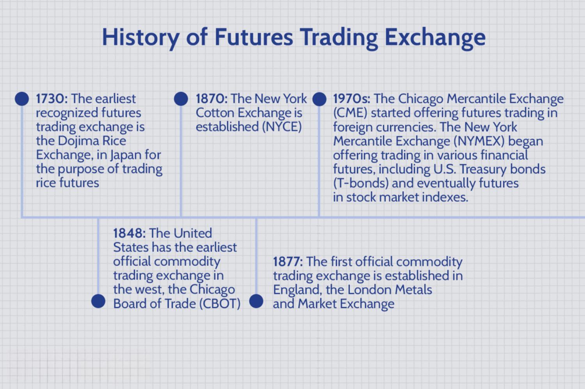

The fast-evolving world of finance has witnessed significant advancements in trading technologies, particularly in the domain of financial contracts such as futures. Futures are standardized agreements to buy or sell an asset at a specified future date and price, providing a mechanism for participants to hedge against price volatility. These financial instruments are integral to risk management and have long been used to stabilize markets by allowing traders and institutions to speculate on price movements of various assets.

Concurrent with the development of futures is the rise of algorithmic trading, commonly referred to as 'algo trading.' This technique employs computer programs to execute trading instructions at speeds and frequencies that are beyond the capability of human traders. The utilization of algorithmic trading has surged across global financial markets, becoming an essential tool for both institutional and individual traders. By leveraging complex algorithms to analyze vast datasets and execute trades, traders can capitalize on short-lived market opportunities and achieve optimal execution efficiency. Such computational power removes the emotional biases that often accompany trading decisions, enhancing the decision-making process.



This article examines the intersection of financial contracts, futures trading, and algorithmic trading and their collective influence on modern financial markets. By understanding and leveraging these technologies, market participants can better manage risk and achieve significant efficiencies, thereby potentially enhancing their market performance and competitiveness.

## Table of Contents

## What are Financial Contracts and Futures?

Financial contracts, particularly futures contracts, serve a pivotal role in today's financial markets. These agreements obligate the buyer to purchase, or the seller to sell, an asset at a future date for a price agreed upon today. Such contracts are standardized in terms of quantity, quality, and time of delivery, thereby promoting liquidity and market efficiency. 

Futures contracts originated as instruments for hedging risks related to price volatility in agricultural commodities but have expanded to cover a wide array of assets. The scope of these contracts now includes not only commodities like oil, gold, and wheat but also financial assets, such as currencies, interest rates, and stock market indexes. This expansion offers market participants opportunities to hedge against adverse price movements across various sectors.

For example, a futures contract on [crude oil](/wiki/crude-oil) allows traders to lock in prices, thus providing protection against the risk of price drops or surges. This is crucial for companies relying heavily on specific commodities or currencies in their operations. Financial futures, such as those on exchange rates, allow multinational corporations to stabilize the costs associated with foreign ventures.

To understand the functionality of futures, consider the standard structure of these contracts. Each futures contract specifies the asset involved, the amount to be traded, the price at which the asset will change hands, and the future date of the transaction. Unlike forward contracts, which are customized between two parties, futures are traded on exchanges, providing greater market stability due to the regulatory framework.

Participating in futures markets demands an understanding of margin requirements. Traders are required to deposit an initial margin before entering into a contract, serving as a performance bond. This ensures that both parties have a financial stake in fulfilling the contract's terms. For instance, any adverse price movement results in a margin call, requiring the trader to deposit additional funds to maintain the position.

Futures markets also employ a system of daily settlement, known as marking to market, where traders' accounts are adjusted daily based on market movements. This mechanism provides continuous risk assessment for both parties and helps prevent large accumulations of debt by traders, thus stabilizing the market.

By utilizing futures contracts, traders can hedge against unfavorable price movements, speculate on future price directions, or exploit [arbitrage](/wiki/arbitrage) opportunities. However, it is crucial for participants to understand the inherent risks, such as market price fluctuation and [liquidity](/wiki/liquidity-risk-premium) risks. Successful navigation of these markets requires both strategic foresight and understanding of fundamental and technical market indicators.

In essence, futures contracts are sophisticated instruments that provide significant benefits to market participants but require a comprehensive understanding of their mechanics and associated risks for effective use.

## The Evolution of Futures Trading

Futures trading can trace its origins back to the Dojima Rice Exchange established in Osaka, Japan, during the 18th century. This was the world's first recorded futures market, where rice brokers and merchants engaged in contracts, known as "rice tickets," to trade rice at a future date and price, thereby providing a mechanism to hedge against price fluctuations. The concept introduced here laid the groundwork for the structured securities markets we witness today.

The evolution of futures trading took a significant leap in the 19th century in the United States. The Chicago Board of Trade (CBOT), founded in 1848, marked a pivotal advancement in formalizing futures contracts. It started by offering standardized agreements for grain trading, taking transactions from informal agreements to regulated financial instruments. These developments made it possible for market participants to transfer risk and uncover the benefits of price discovery and liquidity.

Initially, futures contracts predominantly involved agricultural commodities, facilitating farmers and traders in managing the risks associated with crop prices. However, over time, the scope of these contracts expanded significantly. Modern futures markets now encompass a vast array of products well beyond agricultural commodities, including financial instruments such as stocks, bonds, and treasury notes, as well as energy products like oil and natural gas.

The diversification of futures products has enabled participants to engage in a wider array of speculative or hedging activities. The inclusion of financial instruments lent an added dimension to futures trading, allowing investors and speculators to trade on interest rates, currencies, and indexes. This expansion has not only increased the depth and breadth of futures markets but has also attracted new participants ranging from individual retail traders to large institutional investors.

Modern futures exchanges have embraced electronic trading, which has further revolutionized the industry by allowing faster and more efficient transactions. This technological enhancement has contributed to the globalization of futures markets, offering 24/7 access to various contracts and increasing the [volume](/wiki/volume-trading-strategy) and velocity of trading activity.

In summary, the journey of futures trading from the Dojima Rice Exchange to contemporary markets illustrates a continuous evolution marked by geographic expansion, diversification of tradeable commodities, and technological advancements. These developments have collectively shaped futures contracts into a fundamental component of modern financial markets, providing essential tools for risk management and speculative opportunities.

## The Rise of Algorithmic Trading

Algorithmic trading has revolutionized the trading landscape by utilizing sophisticated computer programs that make trading decisions and execute orders based on pre-defined strategies and rules. These algorithms are designed to analyze vast volumes of market data and identify trading opportunities with remarkable speed and precision, far exceeding human capabilities. The core advantage of [algorithmic trading](/wiki/algorithmic-trading) is its ability to process large datasets and perform multiple tasks simultaneously. This means that algorithms can scan for arbitrage opportunities, track market movements, and analyze historical data nearly instantaneously.

One of the most significant benefits of algorithmic trading is its ability to capitalize on fleeting market opportunities. In financial markets, where prices can change in milliseconds, the speed of execution is crucial. Algorithms can respond to market events and price fluctuations much faster than human traders, enabling them to take advantage of short-lived trends or arbitrage opportunities that human traders might miss. This speed is achieved through the use of colocation services and direct market access, which reduce latency and improve execution times.

Moreover, algorithmic trading plays a critical role in eliminating emotional biases, which can cloud human judgment and lead to suboptimal trading decisions. By following pre-determined strategies, algorithms execute trades based on objective criteria rather than subjective intuition or emotion. This systematic approach helps maintain discipline and consistency in trading strategies, resulting in potentially better outcomes.

The mathematical modeling behind these algorithms often involves statistical and [machine learning](/wiki/machine-learning) methods. For instance, strategies might employ regression analysis to predict future price movements based on historical data or use classification algorithms to determine the likelihood of market conditions changing. Python code is commonly used to implement these strategies due to its extensive libraries and ease of use. A simple example of a moving average crossover strategy in Python could be implemented as follows:

```python
import numpy as np
import pandas as pd

# Load historical price data
data = pd.read_csv('historical_prices.csv')
data['SMA_50'] = data['Close'].rolling(window=50).mean()
data['SMA_200'] = data['Close'].rolling(window=200).mean()

# Crossover logic
data['Signal'] = 0
data.loc[data['SMA_50'] > data['SMA_200'], 'Signal'] = 1
data.loc[data['SMA_50'] < data['SMA_200'], 'Signal'] = -1

# Trigger trades based on crossover signals
data['Position'] = data['Signal'].shift()
```

In this script, the Simple Moving Averages (SMA) of the closing prices over two different window periods (50 and 200 days) are calculated. A trading signal is generated based on the crossover of these averages, which can then be used to make buy or sell decisions. This form of strategy helps to capture upward or downward trends.

The influence of algorithmic trading has been profound, and its integration into modern financial markets continues to grow. Its ability to automate trading and remove human biases makes it an indispensable tool for both institutional and individual traders seeking efficiency and effectiveness in trading operations.

## Integrating Algorithms in Futures Trading

Futures trading algorithms are crafted with the primary objectives of capitalizing on market trends, arbitrage opportunities, and ensuring liquidity through market-making activities. By leveraging these algorithms, traders can enhance their capabilities in reacting to market fluctuations and identifying pricing inefficiencies within futures contracts.

One prevalent strategy, [trend following](/wiki/trend-following), involves identifying and capitalizing on sustained directional movements in market prices. Traders utilizing this strategy employ algorithms that can process historical price data to detect patterns that indicate the continuation of a trend. For instance, algorithms might implement moving averages or [momentum](/wiki/momentum) indicators to determine optimal entry and [exit](/wiki/exit-strategy) points, reducing the delay inherent in manual trading.

Arbitrage is another critical strategy employed by futures trading algorithms. These algorithms are designed to detect price discrepancies between related markets or different trading venues and execute trades that capitalize on these inefficiencies. The rapid execution speed of algorithms allows traders to exploit these opportunities within milliseconds, reducing the inherent risk of price convergence that can erode potential profits.

Market making, a vital function for maintaining liquidity in financial markets, is greatly enhanced by algorithmic trading. Algorithms facilitate continuous quoting and re-quoting of buy and sell prices, narrowing the bid-ask spread and providing traders with more competitive pricing. These algorithms adjust their orders in real-time based on market conditions, ensuring efficient and accurate execution while minimizing the risk of holding inventory in volatile markets.

Overall, the use of algorithms in futures trading significantly enhances the efficiency and accuracy of trade execution. Traders are equipped with robust tools to manage their positions more effectively, as algorithms can analyze and act upon real-time data with speed and precision that surpasses human capabilities. The integration of sophisticated algorithms in futures trading equips market participants with a competitive edge, enabling them to navigate complex market dynamics with greater confidence and control.

## The Benefits and Challenges of Algo Trading

Algorithmic trading, often referred to as algo trading, has revolutionized the financial markets by introducing speed, precision, and efficiency to the trading process. One of the primary benefits of algorithmic trading is the ability to execute trades at high speeds, far beyond the capabilities of human traders. This speed can be a significant advantage in capturing transient market opportunities that may only exist for fractions of a second. The algorithms are capable of scanning multiple markets and exchanges simultaneously, identifying arbitrage opportunities or patterns in real-time, and responding to them instantly.

Another notable benefit of algorithmic trading is the reduction of human error and the elimination of emotions from trading decisions. By relying on predefined rules and criteria, algorithmic systems ensure that trading decisions are consistent and objective. This removes the emotional influences, such as fear and greed, which can lead to poor decision-making. Automated trading systems also allow for the [backtesting](/wiki/backtesting) of strategies, enabling traders to assess their effectiveness based on historical data before deploying them in live markets.

However, algorithmic trading is not without its challenges. One significant issue is over-optimization, where a trading algorithm is excessively tailored to perform well on historical data but fails to adapt to real-world market conditions. This problem, often referred to as "curve fitting," can lead to poor performance when the strategy encounters market scenarios it wasn't specifically designed to handle.

Furthermore, algo trading systems are heavily reliant on technology, including hardware, software, and data feeds. Issues such as hardware failure, software bugs, or connectivity problems can disrupt trading activities. Traders need robust systems with built-in fail-safes and redundancies to mitigate these risks.

Market [volatility](/wiki/volatility-trading-strategies) presents another challenge for algorithmic trading. Sudden and extreme market movements can trigger unintended consequences for algorithms that rely on historical volatility assumptions. In such cases, a lack of human oversight can exacerbate losses, as algorithms may continue to operate without re-evaluating the market context.

In conclusion, while algorithmic trading offers considerable advantages in terms of speed, precision, and emotionless decision-making, traders must be mindful of its challenges. Successful implementation of algo trading requires a careful balance of strategy development, risk management, and technological resilience to fully harness its potential.

## The Future of Trading Algorithms

As technology continues its rapid evolution, AI and machine learning are playing increasingly crucial roles in the refinement of trading algorithms. These advancements enable a deeper and more nuanced analysis of market patterns, thereby boosting the predictive capabilities of trading systems. Machine learning models can assess enormous volumes of historical and real-time data to discern complex patterns and relationships that may not be apparent to human traders. By leveraging these insights, algorithms can make more informed decisions, enhancing both the accuracy and efficiency of trading strategies.

AI-driven algorithms excel at adapting to new market conditions, as they can be designed to learn from each trade, continuously improving as new data becomes available. This adaptability is crucial in financial markets, where conditions can shift rapidly and unpredictably. For instance, [reinforcement learning](/wiki/reinforcement-learning), a type of machine learning, can be employed to optimize trading strategies by simulating various market scenarios and refining the algorithm based on performance outcomes. The algorithm thus learns to maximize returns while minimizing risk.

The integration of AI and machine learning in trading also facilitates the development of fully automated and intelligent trading systems. These systems can perform intricate analyses and execute trades autonomously, reducing the need for human intervention. This level of automation not only speeds up the trading process but also helps eliminate emotional biases, leading to more rational and strategic decision-making. Such systems operate on a 24/7 basis, ensuring that traders do not miss out on opportunities that arise outside traditional trading hours.

As these technologies advance, we can expect more sophisticated applications, such as predictive analytics powered by neural networks. These models, which are inspired by human brain function, can process and analyze data through layers of abstraction, identifying trends and signals that might be missed by traditional models. 

The future trajectory of trading algorithms suggests a shift towards systems that not only automate but also intelligently adapt and learn. These developments are set to foster more robust and resilient trading frameworks, capable of navigating the complexities of modern financial markets with greater precision. To maintain a competitive edge, traders and financial institutions will need to embrace these innovations, continuously upgrading their systems to incorporate the latest technological advancements.

## Conclusion

Futures trading and algorithmic trading are essential in contemporary financial markets, serving as vital tools for risk management and trade execution. These technologies provide traders with unique opportunities to maximize efficiency and enhance market performance. With the integration of algorithmic strategies, traders can exploit market anomalies, automate decision-making processes, and achieve faster execution times, thus gaining a competitive advantage.

The integration of algorithmic trading in futures markets has transformed traditional trading practices. The speed and precision offered by algorithms allow traders to respond swiftly to market signals, optimizing trade execution and minimizing the risk of human error. This technological advancement enables a high level of precision in understanding market movements, improving the accuracy of trade predictions, and optimizing portfolio management.

However, this transformative potential is not free from challenges. The reliance on complex computer systems introduces risks such as technical failures and requires continuous monitoring to ensure systems are functioning as expected. Furthermore, market volatility can lead to unpredictable outcomes if algorithms are not appropriately calibrated.

To succeed in this dynamic environment, traders must stay informed about the latest technological advancements and trading practices. By keeping abreast of innovations in algorithmic trading and understanding their implications, traders can effectively manage risk and adjust strategies to remain competitive. The evolving landscape of futures trading promises to deliver more sophisticated tools, enhancing traders' ability to make informed decisions and capitalize on market opportunities efficiently. 

As technology continues to evolve, the future of trading will likely involve more integrated systems utilizing [artificial intelligence](/wiki/ai-artificial-intelligence) and machine learning. These advancements are anticipated to refine algorithmic capabilities further, allowing for more in-depth analysis and improved predictive accuracy. Consequently, staying aligned with these developments is imperative for traders aiming to maintain a strategic edge in an increasingly complex financial ecosystem.

## References & Further Reading

[1]: Hull, J. C. (2017). ["Options, Futures, and Other Derivatives"](https://www.pearson.com/en-us/subject-catalog/p/options-futures-and-other-derivatives/P200000005938/9780136939917). Pearson Education.

[2]: Lopez de Prado, M. (2018). ["Advances in Financial Machine Learning"](https://www.amazon.com/Advances-Financial-Machine-Learning-Marcos/dp/1119482089). John Wiley & Sons.

[3]: Chan, E. P. (2008). ["Quantitative Trading: How to Build Your Own Algorithmic Trading Business"](https://github.com/ftvision/quant_trading_echan_book). John Wiley & Sons.

[4]: Jansen, S. (2018). ["Machine Learning for Algorithmic Trading"](https://github.com/stefan-jansen/machine-learning-for-trading). Packt Publishing.

[5]: Schonberger, P. (1990). ["The Chicago Board of Trade: Its History and Development"](https://www.jstor.org/stable/pdf/41948374.pdf). University of Chicago Press.