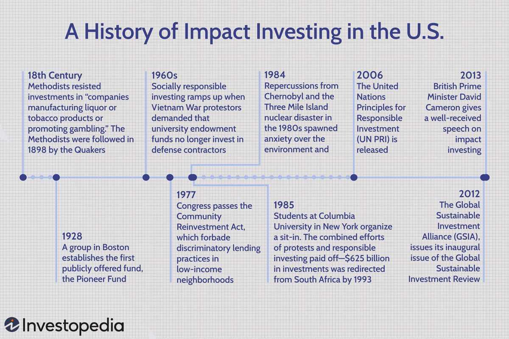

The world of finance is undergoing a significant transformation, driven by a shift towards more socially and environmentally responsible investment strategies. This paradigm shift has given rise to various innovative approaches, prominently including social finance, impact investing, and algorithmic trading. These strategies have begun to redefine traditional investment paradigms, presenting new pathways for generating financial returns while contributing to positive social and environmental impacts.

Social finance and impact investing represent a convergence of ethical investing principles and capital markets. Historically, investment decisions were predominantly driven by financial returns without substantial consideration of social or environmental consequences. However, as societal awareness around issues like climate change, inequality, and corporate responsibility has grown, there has been a noticeable shift in investor behavior. Impact investing, for example, targets investments that produce measurable social or environmental benefits alongside financial returns. This approach aligns investors' monetary objectives with their broader societal and environmental values, fostering a new consciousness in financial decision-making.



Simultaneously, the emergence of algorithmic trading signifies a technological revolution in financial markets. Algorithmic trading uses complex algorithms and high-tech methods to execute trades at unprecedented speeds and volumes. While this has led to improved market efficiency and liquidity, it also necessitates rigorous risk management to mitigate potential systemic risks. 

In combining social finance with algorithmic trading, investors can leverage advanced technology to integrate Environmental, Social, and Governance (ESG) criteria into trading strategies. This blend serves to optimize investment returns while adhering to sustainability goals, showcasing how the financial sector can adapt to evolving ethical standards.

This article will explore these evolving investment strategies' historical context and their transformative effects on the financial landscape. By examining the origins and development of socially responsible investing, the rise of impact investing, and the influence of algorithmic trading, we aim to uncover their future implications within the financial industry. This evolution signals a future where comprehensive sustainability considerations become as integral to investment strategies as financial metrics, paving the way for a more equitable and sustainable financial future.

## Table of Contents

## History of Impact Investing

Impact investing has a deep-rooted history, tracing back to biblical times when ethical investment principles were embedded in religious teachings. These principles emphasized the importance of aligning one's investments with moral and ethical standards, a concept that has persisted throughout centuries.

In the United States, the foundations of socially responsible investing (SRI) started gaining prominence in the 18th century. Religious groups, such as the Methodists and Quakers, advocated for investments that reflected their ethical beliefs. These groups were early adopters of avoiding investments in industries they deemed morally questionable, a practice that laid the groundwork for future socially conscious investment strategies.

The movement gained significant [momentum](/wiki/momentum) during the 1960s and 70s, amidst growing public protests against pressing social and political issues, notably the Vietnam War and the apartheid regime in South Africa. These decades were marked by increased public awareness and activism, which spurred institutions and individuals to reconsider their investment choices, often leading to divestment from entities associated with these contentious issues.

The modern structure of impact investing began to take shape more formally in recent decades. A pivotal moment in this evolution was the convening organized by The Rockefeller Foundation in 2007, where the term "impact investing" was coined. This event marked the transition from loosely defined ethical investment practices to a more structured approach, advocating for investments that deliberately aim to generate measurable social and environmental impact alongside financial returns.

## The Rise of Socially Responsible Investing (SRI) in the US

Socially responsible investing (SRI) in the United States has undergone a dynamic transformation, transitioning from the avoidance of "sin stocks"—shares traditionally associated with industries like alcohol, tobacco, and gambling—to the integration of Environmental, Social, and Governance ([ESG](/wiki/esg-investing)) criteria in investment strategies. This evolution reflects a growing awareness among investors of the impact of their financial decisions on society and the environment.

Historically, early SRI strategies in the US were primarily driven by ethical considerations, where investments were selected based on moral and ethical grounds, often influenced by religious teachings. During the late 20th century, this approach began to expand. The 1960s and 1970s marked a period of heightened activism and public awareness regarding social and environmental issues. These decades witnessed increased public protests against societal issues such as civil rights violations, environmental degradation, and unjust wars, leading investors to align their financial strategies with these emerging values.

The gradual shift towards ESG-focused investment frameworks marked a significant evolution within the SRI domain. ESG criteria provide a more structured and comprehensive approach to assessing the sustainability impact of investments. Environmental criteria examine how a company performs as a steward of nature; Social criteria look at how it manages relationships with employees, suppliers, customers, and the communities where it operates; and Governance deals with a company’s leadership, executive pay, audits, internal controls, and shareholder rights.

An increasing demand for investments that reflect personal values and contribute positively to global issues has led to the proliferation of socially responsible mutual funds and exchange-traded funds (ETFs). These financial products are designed to meet investors' needs for socially and environmentally conscious investment avenues. According to the Forum for Sustainable and Responsible Investment, as of 2024, a substantial growth trajectory is evident with sustainable investment funds valued at trillions of dollars globally. This trend is indicative of a broader shift towards sustainability in finance, propelled by rising investor demand, regulatory changes, and a better understanding of the material risks associated with neglecting ESG factors.

The evolution of SRI reflects a broader transformation in the investment community, where financial returns are pursued with equal emphasis on societal impact and environmental sustainability. This paradigm shift not only broadens the conventional understanding of fiduciary responsibility but also positions SRI as a pivotal component of modern investment strategies, demonstrating its potential to drive both economic and social outcomes.

## Impact Investing: Principles and Types

Impact investing is a proactive investment strategy aimed at generating measurable social and environmental benefits alongside financial returns. Rather than merely avoiding investments in industries considered harmful or unethical—a process known as negative screening—impact investing seeks out opportunities that directly address specific social or environmental challenges.

Key sectors in impact investing include clean energy, healthcare, and education. These areas provide substantial opportunities for achieving beneficial impacts while also aiming for adequate financial returns:

1. **Clean Energy**: Investments in clean energy focus on solutions that reduce carbon emissions and promote environmental sustainability. This includes renewable energy technologies such as solar, wind, and bioenergy, which are vital for mitigating climate change. The scalability and innovation in clean energy have drawn significant investment interest, given the global shift towards reducing fossil fuel dependencies.

2. **Healthcare**: Healthcare investments are directed towards improving access and delivery of medical services, particularly in under-served regions. This can involve funding for innovative healthcare technologies, expansion of healthcare infrastructure, and support for affordable drug manufacturing. The goal is to enhance healthcare outcomes and accessibility while securing a financial return.

3. **Education**: Education sector investments aim to increase the quality and accessibility of educational services. This can involve developing new teaching technologies, expanding educational content, or supporting institutions that provide education to marginalized communities. A well-educated population is recognized for contributing to economic growth, making education a focus for impact investors.

Investors are increasingly attracted to impact investing due to its capacity to align financial objectives with personal and societal values. This alignment is driven by a growing recognition of the interconnectedness between societal wellbeing and economic performance. By choosing investments that have explicit social or environmental goals, investors can contribute positively to society while pursuing competitive financial performance.

In summary, impact investing emphasizes a dual-focus strategy by addressing critical global issues and delivering financial returns. The structured approach it offers makes it a compelling choice for investors who are looking to make a positive difference in society through their investment activities.

## Algorithmic Trading in Modern Finance

Algorithmic trading employs programmable algorithms to execute trades at high speeds and volumes, marking a significant advancement in financial trading methodologies. This approach leverages computer programs that make swift decisions regarding the timing, price, and quantity of trades based on pre-set rules and data inputs. A primary advantage of [algorithmic trading](/wiki/algorithmic-trading) is its ability to enhance market [liquidity](/wiki/liquidity-risk-premium) due to its capacity to process large volumes of trades efficiently. By minimising human intervention, it reduces transaction costs and the potential for trading errors, offering investors a reliable mechanism to navigate the complex financial markets.

Despite its advantages, algorithmic trading requires rigorous risk management protocols to avoid systemic risks that can arise from its inherent velocity and [volume](/wiki/volume-trading-strategy). These risks include market manipulations such as spoofing and flash crashes, where the rapid execution of large order volumes can lead to significant market [volatility](/wiki/volatility-trading-strategies). To mitigate such risks, traders must implement real-time monitoring systems and establish robust contingencies, ensuring market stability and protecting investor interests.

The integration of [machine learning](/wiki/machine-learning) and [artificial intelligence](/wiki/ai-artificial-intelligence) (AI) further broadens the capabilities of algorithmic trading. Machine learning algorithms are capable of identifying complex patterns in large datasets that traditional methods may overlook. AI-driven models can adapt to changing market conditions by continuously learning from new data inputs, thus enhancing the predictive accuracy of trading strategies. For example, [reinforcement learning](/wiki/reinforcement-learning)—where algorithms learn optimal trading strategies through trial and error—enables the development of systems that improve with experience.

Python is a popular programming language for implementing algorithmic trading strategies due to its versatility and the availability of numerous financial libraries. A simple example in Python might involve using a basic moving average crossover strategy:

```python
import pandas as pd
import numpy as np

# Sample data
data = pd.DataFrame({
    'price': [100, 102, 101, 105, 107, 108, 110, 115, 118, 120]
})

# Calculate moving averages
short_window = 3
long_window = 5

data['short_mavg'] = data['price'].rolling(window=short_window, min_periods=1).mean()
data['long_mavg'] = data['price'].rolling(window=long_window, min_periods=1).mean()

# Generate buy/sell signals
data['signal'] = np.where(data['short_mavg'] > data['long_mavg'], 1, 0)
data['position'] = data['signal'].diff()

print(data)
```

This code calculates short and long moving averages and generates signals based on their crossover, indicating potential buy or sell opportunities. By automating such strategies, algorithmic trading streamlines decision-making processes and optimizes performance in dynamic market environments.

In summary, algorithmic trading represents a pivotal evolution in financial markets by combining technology and advanced analytics to execute efficient and effective trades. As the integration with machine learning and AI deepens, algorithmic trading is poised to become even more sophisticated, enabling the development of nuanced, data-driven trading strategies.

## Integrating Sustainable Strategies with Algorithmic Trading

The integration of sustainable finance strategies with algorithmic trading represents a significant advancement in the financial industry. This fusion offers the dual benefits of meeting ethical investment criteria while leveraging the efficiency and precision provided by technology.

Advanced algorithmic systems are capable of assimilating Environmental, Social, and Governance (ESG) data to inform trading strategies. By incorporating ESG metrics into the decision-making processes, these algorithms can optimize asset allocations to achieve both superior financial returns and sustainability objectives. For instance, an algorithm could be programmed to prioritize investments in companies with strong environmental policies or low carbon footprints. The advantage of such an approach is that it enables investors to maintain their financial targets without compromising their ethical considerations.

Moreover, the increasing availability of ESG-centric trading platforms and hedge funds highlights the growing acceptance of sustainable practices within algorithmic trading. These platforms employ specialized algorithms to analyze vast datasets, including ESG ratings, news sentiments, and corporate disclosures, to determine investment directions that align with sustainable outcomes. By doing so, they not only cater to the ethical demands of the modern investor but also contribute to a positive societal impact.

To provide a practical example, consider a basic Python code snippet that uses ESG data to filter investment choices:

```python
import pandas as pd

# Load dataset containing stock information and ESG scores
data = pd.read_csv('stock_data_with_esg.csv')

# Set threshold for ESG score
esg_threshold = 75

# Filter stocks with ESG score above the threshold
sustainable_investments = data[data['esg_score'] > esg_threshold]

# Display the chosen sustainable investments
print(sustainable_investments)
```

This code demonstrates how investors could automate the selection of stocks based on ESG criteria, ensuring their investment choices are both financially sound and socially responsible.

The trend of merging sustainable investing principles with algorithmic trading is an indicator of a broader shift in the investment landscape. By equipping financial strategies with tools to incorporate ESG criteria seamlessly, the industry is paving the way for an investing paradigm that balances profitability with ethical considerations. As the technology continues to evolve, it is anticipated that more sophisticated algorithms will further enhance the ability to achieve sustainable investing goals, thereby fostering an investment climate that acknowledges and rewards sustainable business practices.

## Challenges and Considerations

Navigating the interplay between sustainable finance and algorithmic trading presents several challenges and considerations, primarily revolving around regulatory complexities and data standardization issues. The integration of Environmental, Social, and Governance (ESG) metrics into trading algorithms requires strict adherence to regulations to ensure trading strategies are not only profitable but also ethically sound and transparent.

The European Union's Sustainable Finance Disclosure Regulation (SFDR) is a notable example of regulatory frameworks designed to enhance transparency in sustainable finance. SFDR mandates financial market participants and advisors to disclose the integration of sustainability risks and the impacts of their investments on ESG factors. Compliance with these regulations requires firms to undertake comprehensive ESG assessments and reporting, which can be complex and resource-intensive.

Similarly, the Markets in Financial Instruments Directive II (MiFID II) aims to enhance transparency and safeguard investors in the trading realm, including the management of risks associated with ESG and algorithmic trading. MiFID II imposes stringent requirements on reporting and algorithmic trading practices, including the need for robust systems and controls to prevent market abuse and ensure the reliability of trading algorithms.

A significant challenge in this domain is the variability in the quality and consistency of ESG data. Reliable ESG data is essential for accurately assessing the impact of investments and fine-tuning algorithmic strategies. However, inconsistencies and gaps in ESG reporting often pose obstacles to creating standardized and comparable data sets. This variability stems from the lack of uniformity in ESG metrics and reporting standards across different industries and regions.

To address these challenges, there is a critical need for industry-wide efforts to establish standardized ESG data reporting frameworks. Consistent reporting would not only improve data integrity and comparability but also facilitate the integration of ESG factors into complex trading algorithms. Advancements in data technologies, such as blockchain, offer potential solutions to enhance ESG data transparency and accuracy by providing immutable and verifiable records.

Addressing these regulatory and data challenges is vital for the continued evolution of sustainable finance and algorithmic trading. As these sectors become increasingly interconnected, aligning regulatory compliance with technological precision will be key to achieving not only financial objectives but also broader socio-environmental goals.

## The Future of Sustainable Finance and Trading

The future of sustainable finance and trading is characterized by a profound shift toward incorporating environmental, social, and governance (ESG) criteria into mainstream investment strategies. This transformation is spurred by advancements in technology, regulatory frameworks, and growing investor consciousness about sustainability's intrinsic value. Key to this evolution is blockchain technology, which is set to revolutionize ESG data management and reporting.

Blockchain's decentralized and immutable nature offers a transparent method of verifying ESG claims, thus boosting trust in sustainable investments. By ensuring data integrity, investors can have greater confidence in the authenticity of ESG metrics. For instance, Ethereum-based smart contracts could be employed to automate ESG compliance verification, thereby reducing administrative overhead and increasing transparency. 

The widespread adoption of sustainable investing is also being propelled by regulatory measures. Governments and international bodies are progressively introducing frameworks that mandate standardized ESG reporting and investment practices. Regulations such as the EU's Sustainable Finance Disclosure Regulation (SFDR) enhance transparency, aiding investors in making informed decisions that align with their values.

Investor demand is another pivotal driver. The increasing awareness of the long-term financial benefits and risk mitigation offered by sustainable practices is reshaping investment paradigms. The integration of machine learning and AI into financial models allows for more accurate assessment and prediction of ESG-related risks and opportunities. For example, natural language processing (NLP) could be utilized to analyze and predict market trends related to sustainability.

Furthermore, the financial sector is seeing an emergence of innovative products and platforms designed exclusively for sustainable investing. ESG-centric mutual funds, exchange-traded funds (ETFs), and green bonds are multiplying, offering investors a variety of options to align their portfolios with their ethical and environmental values.

Ultimately, the trajectory of sustainable finance and trading suggests a future where financial performance and sustainability are not mutually exclusive but rather complementary objectives. As technology and regulations evolve, and as awareness of sustainability grows, the investment landscape is likely to witness a profound transformation, prioritizing both competitive returns and meaningful societal contributions.

## Conclusion

In today's financial landscape, sustainability is becoming a primary focus for investors, driving the integration of social finance, impact investing, and algorithmic trading. These strategies collectively aim to align financial objectives with broader environmental and societal goals, an approach that is gaining traction worldwide. By prioritizing sustainability, investors are not only positioning themselves for competitive financial returns but are also actively contributing to meaningful societal change.

The synergy between these innovative strategies offers a multifaceted advantage. Social finance and impact investing prioritize investments in projects that generate positive social and environmental outcomes, while algorithmic trading introduces a level of precision and efficiency that can amplify these impacts. For instance, the inclusion of ESG (Environmental, Social, and Governance) criteria in algorithmic models enables investors to optimize portfolios based on sustainability metrics, ensuring that investment decisions are not just financially sound but also ethically grounded.

Stakeholders, by embracing these complex strategies, have the potential to redefine what constitutes success in finance. Traditional notions of profit maximization are being supplemented, if not replaced, by a broader perspective that values sustainability and equity. As these strategies evolve, stakeholders—from individual investors to large financial institutions—are positioned to reshape the industry landscape, paving the way for a more equitable and sustainable future.

Integrating these approaches requires a nuanced understanding of both the financial mechanisms involved and the ethical considerations at play. As regulatory frameworks evolve and technology advances, the ability to measure and verify sustainability impacts will enhance. This progress supports the growing investor demand for transparency and accountability in sustainable investments.

In conclusion, the continued evolution of social finance, impact investing, and algorithmic trading heralds a transformative era in investment strategies. By embracing this transformation, stakeholders can contribute significantly to the development of a financial system that not only seeks competitive returns but also aligns with the overarching goal of sustaining the planet and society at large.

## References & Further Reading

[1]: Bugg-Levine, A., & Emerson, J. (2011). ["Impact investing: Transforming how we make money while making a difference."](https://direct.mit.edu/itgg/article/6/3/9/9670/Impact-Investing-Transforming-How-We-Make-Money) Wiley.

[2]: Clark, C., Emerson, J., & Thornley, B. (2014). ["The Impact Investor: Lessons in Leadership and Strategy for Collaborative Capitalism."](https://www.semanticscholar.org/paper/The-Impact-Investor%3A-Lessons-in-Leadership-and-for-Clark-Emerson/67607c2c84802e58bae38b59cc27fe47c7749070) Jossey-Bass.

[3]: Fry, E., Maheshwaran, K., & Chatterjee, C. (2016). ["Cambridge Handbook of Institutional Investment and Fiduciary Duty."](https://www.cambridge.org/core/books/cambridge-handbook-of-institutional-investment-and-fiduciary-duty/D02B1ABF6646E6E272BFE50D45170807) Cambridge University Press.

[4]: Johnson, L., & Grebel, T. (2016). ["Adaptive Strategies for Small-Handed Politics in a Large-Handed World."](https://www.researchgate.net/publication/330952938_Cooperative_Learning_The_Foundation_for_Active_Learning) ResearchGate.

[5]: Perez, H. (2013). ["Algorithmic Trading and DMA: An Introduction to Direct Access Trading Strategies."](https://archive.org/details/algorithmictradi0000john) 4Myeloma Press.

[6]: Mansueto, P. (2020). ["Principles of Sustainable Finance"](https://papers.ssrn.com/sol3/papers.cfm?abstract_id=3282699) Cambridge University Press.

[7]: Sushko, V., & Turner, G. (2016). ["The implications of passive investing for securities markets."](https://www.bis.org/publ/qtrpdf/r_qt1803j.htm) Bank for International Settlements Quarterly Review.