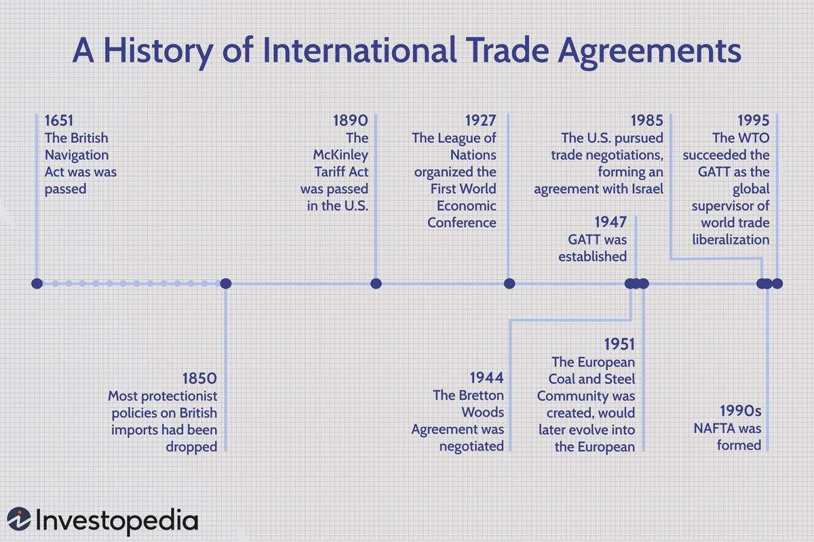

## Table of Contents

## What is an international trade agreement?

An international trade agreement is a deal between two or more countries to help them trade goods and services more easily. These agreements set rules that make it simpler for countries to buy and sell things from each other. They can lower taxes on imports and exports, which are called tariffs, and remove other barriers that make trading difficult.

These agreements are important because they can help countries grow their economies. When countries trade more, businesses can sell their products to more people, and this can create jobs and increase wealth. International trade agreements also help to make sure that countries treat each other fairly when they trade, which can prevent conflicts and promote peace.

## Why are international trade agreements important?

International trade agreements are important because they help countries work together better. When countries make these agreements, they agree to lower taxes on things they buy and sell from each other. This makes it easier for businesses to trade and can help them grow. When businesses grow, they can hire more people and make more money. This is good for the economy of the countries involved.

These agreements also make sure that countries treat each other fairly when they trade. They set rules that everyone has to follow, which can stop countries from fighting over trade. When countries trade fairly, it can lead to better relationships and even peace between them. So, international trade agreements are not just about money; they also help countries get along better.

## What was the first major international trade agreement?

The first major international trade agreement was the General Agreement on Tariffs and Trade (GATT), which was signed in 1947. GATT was created to help countries work together to reduce taxes on goods they traded with each other. This made it easier for businesses in different countries to buy and sell things. Many countries joined GATT, and it helped start a big increase in world trade.

GATT was important because it set up rules that countries had to follow when they traded. These rules helped make sure that countries treated each other fairly. Over time, GATT helped countries lower their taxes on many different products. This made trade easier and helped countries' economies grow. In 1995, GATT was replaced by the World Trade Organization (WTO), which continues to help countries trade with each other fairly.

## How have international trade agreements evolved over time?

International trade agreements have changed a lot over time. They started with the General Agreement on Tariffs and Trade (GATT) in 1947. GATT was all about lowering taxes on goods traded between countries. This helped businesses in different countries to buy and sell things more easily. As more countries joined GATT, it became a big deal for world trade. It set rules for fair trade and helped countries lower taxes on many products. In 1995, GATT turned into the World Trade Organization (WTO), which now helps countries trade fairly with each other.

Over the years, trade agreements have grown to cover more than just goods. They now include services, like banking and transport, and even things like protecting the environment and workers' rights. Agreements like the North American Free Trade Agreement (NAFTA), which started in 1994, and its newer version, the United States-Mexico-Canada Agreement (USMCA), show how trade deals have become more complex. These agreements try to make sure that trade is not just good for business but also good for people and the planet. Today, trade agreements are a big part of how countries work together and help each other grow.

## What are some key historical international trade agreements?

The first big international trade agreement was the General Agreement on Tariffs and Trade (GATT) in 1947. GATT helped countries lower taxes on goods they traded with each other. This made it easier for businesses to sell their products in different countries. Many countries joined GATT, and it helped a lot of trade happen around the world. GATT set rules to make sure countries treated each other fairly. In 1995, GATT turned into the World Trade Organization (WTO), which keeps helping countries trade fairly today.

Another important agreement is the North American Free Trade Agreement (NAFTA), which started in 1994. NAFTA was between the United States, Canada, and Mexico. It helped these countries trade goods and services more easily by lowering taxes and other trade barriers. NAFTA was a big deal because it showed how trade agreements could be more than just about goods; they could also include services and rules about the environment and workers' rights. In 2020, NAFTA was replaced by the United States-Mexico-Canada Agreement (USMCA), which keeps working to make trade better and fairer between these three countries.

## How do international trade agreements affect global economies?

International trade agreements help countries trade with each other more easily. When countries sign these agreements, they often agree to lower taxes on the things they buy and sell from each other. This makes it cheaper for businesses to trade, so they can sell more products in different countries. When businesses sell more, they can grow bigger and hire more people. This can create jobs and make the economy of a country stronger. Trade agreements also help countries work together better, which can lead to more peace and cooperation around the world.

These agreements can also affect how much money people pay for things. When taxes on goods are lower, the price of those goods can go down too. This means people might be able to buy things for less money. But sometimes, trade agreements can also make it hard for some businesses. If a business in one country has to compete with cheaper products from another country, it might struggle to stay open. So, while trade agreements can help the economy grow, they can also make things harder for some businesses and workers. Overall, international trade agreements play a big role in shaping how economies work around the world.

## What role do organizations like the WTO play in international trade agreements?

The World Trade Organization (WTO) is a big group that helps countries trade with each other fairly. It started in 1995 and took over from the General Agreement on Tariffs and Trade (GATT). The WTO makes rules that countries have to follow when they trade. These rules help stop countries from fighting over trade and make sure everyone plays fair. The WTO also helps countries talk to each other about trade problems and find ways to solve them. This makes it easier for countries to work together and trade more.

The WTO also helps make new trade agreements. It brings countries together to talk about what they want in these agreements. The WTO works hard to make sure these agreements are good for everyone. It helps countries lower taxes on things they trade, which can make products cheaper and help businesses grow. The WTO also makes sure that trade agreements cover more than just goods; they can include services, protecting the environment, and workers' rights. By doing all this, the WTO helps make the world economy stronger and helps countries get along better.

## How have regional trade agreements influenced global trade?

Regional trade agreements have changed the way countries trade with each other. These agreements are made between countries that are close to each other, like in the same part of the world. They help these countries trade more easily by lowering taxes and making it easier to move goods across borders. For example, the North American Free Trade Agreement (NAFTA) helped the United States, Canada, and Mexico trade more with each other. When countries in a region trade more, it can help their businesses grow and create jobs. This makes the economy of the whole region stronger.

But regional trade agreements also affect global trade in big ways. When countries in one region trade more with each other, they might trade less with countries outside their region. This can make it harder for businesses in other parts of the world to sell their products. At the same time, regional agreements can show other countries how to make trade easier and fairer. They can set an example for the whole world. So, while regional trade agreements help countries in one area, they can also change how trade happens everywhere.

## What are the differences between bilateral and multilateral trade agreements?

Bilateral trade agreements are deals between two countries. They help these countries trade more easily with each other by lowering taxes and removing other trade barriers. For example, if Country A and Country B have a bilateral agreement, they might agree to not charge each other as much tax on the goods they trade. This can help businesses in both countries sell their products more easily in the other country. Bilateral agreements are simpler to make because they only involve two countries, but they only help those two countries trade better.

Multilateral trade agreements are deals between many countries. These agreements can involve a whole group of countries, like all the members of the World Trade Organization (WTO). Multilateral agreements help many countries trade with each other more easily by setting rules that everyone has to follow. For example, if many countries agree to lower taxes on certain goods, it can make trade easier for all of them. These agreements are more complicated to make because they have to work for many different countries, but they can help more countries trade better with each other.

## How do international trade agreements address issues like tariffs and quotas?

International trade agreements help countries trade more easily by dealing with things like tariffs and quotas. Tariffs are taxes that countries put on goods that come from other countries. When countries make trade agreements, they often agree to lower these tariffs. This makes it cheaper for businesses to trade goods across borders. For example, if two countries agree to lower tariffs on cars, it becomes cheaper to buy and sell cars between those countries. This can help businesses grow and create more jobs.

Quotas are limits on how much of a certain product a country can import. Trade agreements can also help with quotas by setting rules on how much of a product can be traded. Sometimes, countries agree to remove quotas completely, which means they can trade as much of a product as they want. Other times, they might agree to change the quotas to allow more trade. By dealing with tariffs and quotas, trade agreements make it easier for countries to buy and sell things from each other, which can help their economies grow.

## What are the challenges and criticisms faced by international trade agreements?

International trade agreements face many challenges and criticisms. One big challenge is making sure the agreements are fair for all countries involved. Big countries with strong economies might get more benefits than smaller countries. This can make it hard for smaller countries to grow their businesses and economies. Another challenge is making sure the agreements help protect the environment and workers' rights. Sometimes, businesses might move to countries with lower environmental or labor standards, which can hurt the planet and workers.

People also criticize trade agreements for hurting local businesses. When countries lower taxes on goods from other places, it can be hard for local businesses to compete with cheaper imports. This can lead to businesses closing down and people losing jobs. Critics also worry that trade agreements might make countries too dependent on each other. If one country has problems, it can affect the economies of other countries that rely on it for trade. Overall, while trade agreements can help economies grow, they also come with big challenges and criticisms that need to be addressed.

## How might future international trade agreements adapt to global changes like digital trade and sustainability?

Future international trade agreements will need to change to fit new things like digital trade and caring for the planet. Digital trade is about buying and selling things online, like music or software. As more people use the internet to trade, agreements will need to include rules about how to protect people's information and make sure everyone can use the internet fairly. This means countries will have to work together to set standards for digital trade, so businesses can sell their products online easily and safely.

Sustainability is also very important. It means taking care of the planet and making sure future generations can live well. Trade agreements will need to include rules that help protect the environment. For example, they might set limits on how much pollution businesses can make or encourage countries to use clean energy. By doing this, trade agreements can help make sure that trading helps the economy grow without hurting the planet. So, future agreements will need to balance the need for more trade with the need to keep the world healthy and fair for everyone.

## References & Further Reading

[1]: Smith, A. (1776). ["The Wealth of Nations."](https://en.wikipedia.org/wiki/The_Wealth_of_Nations) 

[2]: Ricardo, D. (1817). ["Principles of Political Economy and Taxation."](https://www.econlib.org/library/Ricardo/ricP.html) 

[3]: Irwin, D.A. (2009). ["Free Trade Under Fire."](https://press.princeton.edu/books/paperback/9780691201009/free-trade-under-fire) Princeton University Press.

[4]: ["The History of the European Union."](https://en.wikipedia.org/wiki/History_of_the_European_Union) EU Publications.

[5]: ["Advances in Financial Machine Learning"](https://www.amazon.com/Advances-Financial-Machine-Learning-Marcos/dp/1119482089) by Marcos Lopez de Prado

[6]: ["Machine Learning for Algorithmic Trading"](https://github.com/stefan-jansen/machine-learning-for-trading) by Stefan Jansen

[7]: ["Quantitative Trading: How to Build Your Own Algorithmic Trading Business"](https://github.com/LucindaYa/quant-resources/blob/master/Quantitative%20Trading%20How%20to%20Build%20Your%20Own%20Algorithmic%20Trading%20Business.pdf) by Ernest P. Chan