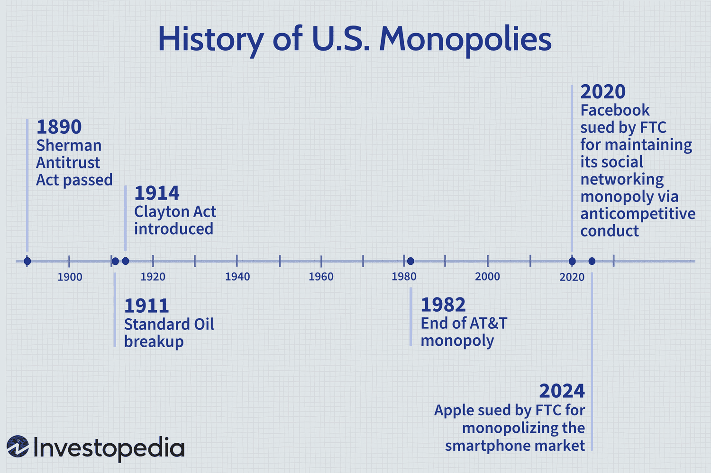

Antitrust laws are a cornerstone of economic policy, designed to prevent large businesses from stifling competition and exploiting their market power. Originating as a response to the monopolistic tendencies observed in the late 19th and early 20th centuries, these laws aim to foster a competitive market environment, which is essential for innovation, consumer choice, and fair pricing. Central to these laws is the prevention of monopolies—market conditions where one firm dominates, potentially leading to higher prices, reduced quality, and hindered innovation.

Monopolies have historically exerted a profound influence on economies. By eliminating competitors, monopolistic entities can control prices and create barriers to entry, adversely affecting the overall market dynamics. The economic repercussions extend beyond pricing; monopolies can skew resource allocation, stifle technological progress, and reduce consumer welfare. Thus, antitrust laws play a vital role in mitigating these effects, ensuring that markets remain dynamic and competitive.

This article examines American business history through the lens of antitrust actions, tracing their evolution from the industrial era's formidable monopolies to contemporary challenges posed by tech behemoths. It highlights key phases and cases that have shaped the antitrust landscape, from the historic dismantling of Standard Oil to current scrutiny of digital giants like Google and Facebook.

In modern times, the rise of algorithmic trading presents new challenges for antitrust policy. Algorithmic trading—where computer algorithms execute transactions at speeds impossible for human traders—has become a significant feature of financial markets. While it offers efficiency and liquidity, it also raises concerns about market manipulation and unfair advantages leveraged by large financial entities. Understanding its implications is crucial as regulators seek to adapt existing antitrust frameworks to address these modern practices effectively.

As we explore the intricate relationship between historical monopolies, antitrust laws, and the novel complexities introduced by algorithmic trading, it becomes evident that a nuanced approach is necessary to balance innovation with fair competition. The evolution of antitrust enforcement must keep pace with technological advancements to sustain a competitive market environment conducive to economic health and consumer welfare.

## Table of Contents

## Historical Overview of Antitrust Legislation in the U.S.

Antitrust legislation in the United States has played a crucial role in maintaining competitive markets and curbing monopolistic practices since the late 19th century. The cornerstone of American antitrust law is the Sherman Antitrust Act of 1890. This landmark legislation was the first federal statute to prohibit anti-competitive agreements and unilateral conduct that monopolizes or attempts to monopolize trade and commerce. Its significance lies in its creation of legal tools for the government to challenge and dismantle monopolies, thus laying the groundwork for economic competition. The Act empowered the government to pursue legal action against entities engaged in anti-competitive behaviors, thereby safeguarding the interests of consumers and smaller businesses.

Following the Sherman Act, the Clayton Antitrust Act of 1914 was enacted to address specific practices that the Sherman Act did not expressly cover. The Clayton Act targeted price discrimination, exclusive dealings, tying arrangements, and mergers and acquisitions that could reduce competition. This legislation provided clearer definitions and aimed to prevent anti-competitive practices in their incipiency, enhancing the effectiveness of antitrust regulation. Notably, it introduced measures to protect labor organizations and agricultural cooperatives, allowing these groups to engage in collective bargaining without being subject to antitrust constraints.

One of the most famous applications of antitrust law was the breakup of Standard Oil in 1911. The U.S. Supreme Court, employing the Sherman Act, ordered the dissolution of Standard Oil's monopoly into 34 independent companies. This case set a critical precedent in American jurisprudence, demonstrating the government's willingness and ability to intervene in monopolistic enterprises that hinder competition and manipulate markets. The judicial decision in this case also marked the beginning of the rule of reason, a doctrine allowing courts to evaluate the context and consequences of business practices to determine their legality under antitrust laws.

Over the years, the interpretation and enforcement of antitrust laws have evolved significantly. Courts have developed doctrines and tests, such as the aforementioned rule of reason, to assess whether a particular business conduct constitutes an unreasonable restraint of trade. This evolution reflects an effort to balance the promotion of competition with the recognition of efficiencies that certain business practices may yield.

The impact of these antitrust laws on American business is profound. They have fostered an environment where competition can thrive, driving innovation, lowering prices, and increasing choice for consumers. By preventing monopolistic practices, antitrust laws have encouraged new entrants to the market, stimulating economic growth and technological advancement. While challenges remain, particularly in adapting these laws to the complexities of the modern digital economy, their historical role in shaping a competitive landscape is undeniable.

## The Rise of Monopolies in American Business History

Monopolies in the United States emerged primarily during the latter part of the 19th century and early 20th century, a period characterized by rapid industrialization and economic transformation. The enabling factors for the formation of monopolies included technological advancements, lack of regulatory frameworks, consolidation strategies, and the expansion of national markets facilitated by improved transportation infrastructure.

Key figures in early American monopolies such as John D. Rockefeller and Andrew Carnegie leveraged these opportunities to establish dominion over their respective industries. Rockefeller, through his company Standard Oil, gained control over nearly all oil refining in the United States. This control was achieved by aggressive business practices, such as horizontal integration, where he absorbed or outcompeted rival companies, and vertical integration, controlling all aspects of production and distribution. Similarly, Andrew Carnegie employed vertical integration in the steel industry, leading to the creation of a monopoly that drastically reduced the cost of steel production and made it the backbone of industrial growth in the U.S.

The economic and social impacts of these monopolies were profound during their peak. Economically, monopolies led to economies of scale, reducing costs and making goods more affordable. However, they also stifled competition, imposed barriers to market entry for new players, and created price-setting powers that could exploit consumers. Socially, the vast accumulation of wealth and power by a few individuals or entities resulted in significant socio-economic inequalities and public unrest.

In response to monopolistic practices, the government and the public demanded regulatory interventions in the early 20th century. Public backlash against perceived abusive practices and the excessive concentration of power led to the enactment of antitrust laws, beginning with the Sherman Antitrust Act of 1890. This was followed by significant legal battles, most notably the landmark breakup of Standard Oil in 1911, which set a precedent for future regulatory action against monopolies.

Transitioning from the era of industrial monopolies, modern-day tech giants have become the new focal point of discussions around monopolistic practices. Companies such as Amazon, Google, and Apple have amassed significant influence in their respective fields by controlling key technologies and platforms. Unlike the tangible products of the industrial era, these tech monopolies leverage data, digital distribution channels, and network effects to sustain their market dominance. Hence, there is an ongoing debate regarding the adequacy of existing antitrust laws and their adaptability to the digital economy, as new strategies are required to ensure that innovation and fair competition are maintained in this modern context.

## Antitrust Actions in the Tech Industry

Antitrust actions have gained prominence in the tech industry in the 21st century as regulators seek to address the monopolistic behaviors of major companies. One of the most notable cases was United States v. Microsoft in the late 1990s and early 2000s. The case centered around Microsoft’s practices that allegedly violated the Sherman Antitrust Act, specifically tying its Internet Explorer web browser to its Windows operating system. The court found Microsoft guilty of maintaining its monopoly by anticompetitive means, leading to a settlement that imposed restrictions on Microsoft’s business conduct. This case set a precedent for handling antitrust concerns in the software industry.

Traditional antitrust laws pose challenges when applied to digital markets. Unlike physical goods, digital services often have near-zero marginal costs and are subject to network effects, where the value of the product increases with more users. This can result in winner-takes-all scenarios, complicating the assessment of market dominance. Moreover, tech companies often participate in numerous markets, making it difficult to pinpoint monopolistic behavior without a comprehensive understanding of digital ecosystems.

Google has faced multiple antitrust investigations and lawsuits from both the U.S. and European Union (EU) authorities. The EU fined Google €4.34 billion in 2018 for abusing its dominance in mobile operating systems with its Android platform. The EU ruled that Google imposed illegal restrictions on Android device manufacturers and mobile network operators to cement its search engine's dominant position. In the U.S., the Department of Justice sued Google in 2020, alleging anticompetitive practices to preserve its search and search advertising monopolies through exclusionary agreements and practices.

Facebook has also been scrutinized for its acquisitions of potential competitors, such as Instagram and WhatsApp, which critics argue were aimed at stifling competition. The Federal Trade Commission (FTC) initiated a lawsuit in 2020, seeking to unwind these acquisitions and arguing that Facebook unlawfully maintained its monopoly by eliminating competition.

The outcomes of these cases have significant implications for the tech industry. They highlight the tension between fostering innovation and maintaining fair competition. Effective antitrust enforcement in digital markets may necessitate a reevaluation of current laws, considering factors unique to the tech industry like data dominance, platform ecosystems, and network effects.

Potential reforms could include updating the criteria for defining a monopoly in the digital age, emphasizing market power based on data control rather than pricing, and considering the role of interoperability and open standards. Additionally, fostering collaboration between international regulatory bodies could be beneficial, given the global reach of tech giants.

Adaptations might involve creating specialized regulations tailored to the dynamics of the tech industry and establishing proactive monitoring mechanisms. Ensuring that the competitive landscape is not adversely impacted by emerging technologies requires vigilance and a willingness to evolve legal frameworks in alignment with technological advancements.

## Algorithmic Trading and Its Role in Modern Monopolistic Practices

Algorithmic trading, a method of executing trades using pre-programmed instructions, has rapidly transformed financial markets. This approach utilizes computer algorithms to make decisions based on market data, aiming to optimize trading processes and achieve the best possible prices at unprecedented speeds. Its rise has been fueled by advancements in technology and data analysis, leading to its significant presence in modern financial markets.

Large firms often gain competitive advantages through [algorithmic trading](/wiki/algorithmic-trading). These advantages stem from their ability to invest in sophisticated technology infrastructure, hire skilled personnel, and access vast amounts of market data. As a result, they can execute trades faster and more efficiently than smaller competitors. High-frequency trading ([HFT](/wiki/high-frequency-trading-strategies)), a subset of algorithmic trading, exemplifies how firms capitalize on latency advantages to perform a large number of trades in fractions of a second. The speed and frequency of these trades can lead to higher profitability, further consolidating the market dominance of large firms.

Regulatory challenges arise in antitrust enforcement concerning algorithmic trading. Traditional antitrust laws are often ill-suited to address the nuances of the digital and fast-paced nature of algorithmic trading. Detecting anti-competitive practices requires sophisticated understanding and analysis of trading algorithms and market data. Moreover, regulators must distinguish between firms gaining legitimate advantages through innovation and those engaging in unfair practices that harm competition.

Algorithmic trading has the potential to lead to monopolistic behaviors and market manipulations. The concentration of market power within a few large firms can lead to practices that distort prices and reduce market [liquidity](/wiki/liquidity-risk-premium). Moreover, events such as the "Flash Crash" of 2010 demonstrate how algorithmic trading can exacerbate market [volatility](/wiki/volatility-trading-strategies), leading to rapid price swings and potential manipulations detrimental to market integrity.

Efforts to regulate algorithmic trading focus on ensuring transparency and fairness. Existing regulations often include requirements for firms to disclose their trading algorithms to regulatory bodies and implement "circuit breakers" to halt trading during extreme volatility. However, such regulations are continually evolving to keep pace with technological advancements. Potential future regulations could involve stricter oversight of trading algorithms, auditing procedures, and collaboration between international regulatory bodies to manage global trading activities.

In conclusion, algorithmic trading's impact on modern monopolistic practices is multi-faceted, offering both opportunities for efficiency and risks of anti-competitive behavior. Ensuring that these technologies are used fairly and ethically is crucial for maintaining competitive markets, necessitating continuous adaptation of regulatory frameworks.

## Future Directions for Antitrust Enforcement

Antitrust enforcement is at a critical juncture as the digital economy rapidly evolves, presenting new challenges that traditional frameworks were not designed to address. The shift from industrial to digital markets has underscored the need for updating antitrust laws to maintain fair competition.

### Updating Antitrust Frameworks

The unique characteristics of digital markets necessitate revisions in antitrust frameworks. Modern digital platforms often benefit from network effects, where the value of their service increases as more users join. This can lead to dominant market positions that are hard to challenge under existing laws originally crafted for more tangible goods and services. Therefore, updates should consider factors specific to digital environments, such as data ownership and the influence of algorithms on consumer choice. For instance, antitrust assessments could incorporate analyses of how algorithmic changes impact market entry barriers.

### International Cooperation

Global tech giants often have operations and influence that cross national borders, requiring international cooperation for effective regulation. The European Union, for example, has taken a proactive stance with its General Data Protection Regulation (GDPR), influencing global practices. Similarly, antitrust enforcement can benefit from cross-border collaboration to establish guidelines that ensure fair competition without stifling innovation. This might involve shared databases on corporate practices or harmonized penalties for antitrust violations.

### Legislative Initiatives

Recent legislative initiatives aim to recalibrate antitrust laws for the digital economy. In the United States, the introduction of bills such as the American Innovation and Choice Online Act indicates a push toward preventing dominant platforms from favoring their own products. Such legislation could potentially enhance competition by leveling the playing field for smaller players. However, lawmakers must be cautious in drafting laws that neither deter innovation nor reduce consumer benefits provided by large platforms.

### Balancing Innovation and Fair Competition

Balancing the promotion of innovation with the maintenance of fair competition is crucial. While updates to antitrust laws seek to curtail monopolistic behaviors, it is important that these measures do not impede technological advancements. Policymakers should consider incentives that encourage competition while supporting innovation. This could involve tax breaks for start-ups or grants for technological research, which fosters an environment where new and established companies can contribute to economic growth.

### Forward-looking Strategies

Several forward-looking strategies could enhance the effectiveness of antitrust enforcement in digital markets:

1. **Algorithm Auditing**: Implementing routine checks on algorithms used by dominant platforms can prevent algorithms from being adjusted to unfairly disadvantage competitors.

2. **Data Portability Mandates**: Ensuring consumers can easily transfer their data between platforms could enhance competition by lowering switching costs.

3. **Market Structure Analysis**: Regular assessments of market structures and the competitiveness landscape can guide policy adjustments and enforcement priorities.

4. **Consumer Empowerment**: Educating consumers about data usage and corporate practices can drive more informed choices, indirectly pressuring companies to maintain fair practices.

In conclusion, adapting antitrust enforcement to the contemporary digital economy requires a multifaceted approach that updates existing frameworks, leverages international cooperation, and balances innovation with fair competition. By integrating these strategies, the U.S. can better manage the complexities of regulating tech giants and sustaining a vibrant competitive landscape.

## Conclusion

In reviewing the historical and contemporary analysis of antitrust issues, it becomes clear that antitrust laws have been vital for promoting a fair and competitive economy. From the inception of the Sherman Antitrust Act in 1890 to today's challenges with tech giants, these regulations prevent businesses from gaining excessive market control, thus ensuring consumer choice, fostering innovation, and maintaining market vitality.

Monopolies have continuously evolved, with industrial giants of the past like Standard Oil transitioning to digital behemoths such as Google and Facebook. The rise of algorithmic trading adds a layer of complexity, offering firms significant market advantages and challenging traditional antitrust frameworks. Such practices require careful oversight as they can unfairly distort competition and manipulate markets.

To address these modern challenges, regulation must be adaptive and forward-thinking. This means updating legal frameworks to account for new technologies and business models, ensuring they are robust enough to maintain fair competition. There is a pressing need for international cooperation to regulate global tech companies and implement regulations that align with the digital economy's pace and scale.

In conclusion, the evolving nature of monopolies and the introduction of practices like algorithmic trading underscore the need for vigilant and dynamic regulations. Stakeholders, including policymakers, businesses, and consumers, must collaborate to support and strengthen antitrust laws. This collective effort is essential for sustaining economic health and ensuring that competition remains fair and beneficial in the rapidly transforming landscape of American business.

## References & Further Reading

[1]: ["The Antitrust Revolution: Economics, Competition, and Policy"](https://www.amazon.com/Antitrust-Revolution-Economics-Competition-Policy/dp/0190668830) by John E. Kwoka Jr. and Lawrence J. White

[2]: ["The Curse of Bigness: Antitrust in the New Gilded Age"](https://www.jstor.org/stable/j.ctv1fx4h9c) by Tim Wu

[3]: ["United States v. Microsoft: Case Brief Summary"](https://en.wikipedia.org/wiki/United_States_v._Microsoft_Corp.) - Oyez, Legal Information Database

[4]: ["Standard Oil Co. of New Jersey v. United States, 221 U.S. 1 (1911)"](https://supreme.justia.com/cases/federal/us/221/1/) - Legal Information Institute, Cornell Law School

[5]: ["The Chicago School of Antitrust Analysis"](https://papers.ssrn.com/sol3/papers.cfm?abstract_id=3481388) by Richard A. Posner, Journal of Law and Economics

[6]: ["Antitrust Analysis of Tying Arrangements"](https://www.law.gmu.edu/assets/files/publications/working_papers/08-37%20Antitrust%20Analysis%20of%20Tying.pdf) by B. Douglas Bernheim, Stanford Law Review

[7]: ["The Sherman Antitrust Act of 1890"](https://www.archives.gov/milestone-documents/sherman-anti-trust-act) - OurDocuments.gov

[8]: ["European Union's Antitrust Fine on Google"](https://www.reuters.com/technology/eu-court-upholds-googles-27-bln-eu-antitrust-fine-2024-09-10/) - Official Journal of the European Union

[9]: ["Antitrust Law: Economic Theory and Common Law Evolution"](https://assets.cambridge.org/97805217/93780/frontmatter/9780521793780_frontmatter.pdf) by Keith N. Hylton

[10]: ["The Clayton Antitrust Act of 1914: A Legislative History"](https://www.britannica.com/money/Clayton-Antitrust-Act) by Richard Franklin Bensel