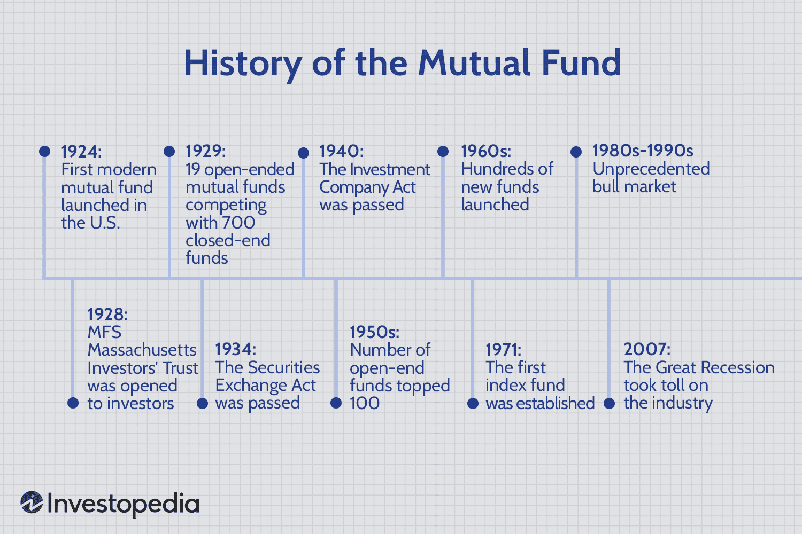

## Table of Contents

## What is a mutual fund?

A mutual fund is a type of investment where many people put their money together to buy a variety of stocks, bonds, or other assets. It's like a big basket where everyone chips in to buy different things. A professional manager decides what to buy and sell, trying to make the basket grow in value over time. This makes it easier for people who don't have a lot of money or time to invest on their own.

When you invest in a mutual fund, you own a small part of the whole basket. This means you share in any profits or losses the fund makes. Mutual funds can be a good way to spread out your risk because they hold many different investments. Instead of putting all your money into one company, you get a piece of many companies. This can help protect your money if one company doesn't do well.

## When were mutual funds first introduced?

Mutual funds were first introduced in the Netherlands in 1774. They were created by a man named King William I, who wanted to help people invest their money together. This was a new idea at the time, and it helped people who didn't have a lot of money to still invest in different things.

In the United States, the first mutual fund was started in 1924. It was called the Massachusetts Investors Trust. This fund allowed Americans to pool their money and invest in a variety of stocks and bonds. Over time, mutual funds became very popular in the U.S. and around the world, helping millions of people to invest and grow their savings.

## Who created the first mutual fund and where?

The first mutual fund was created by King William I in the Netherlands in 1774. He wanted to help people invest their money together. This was a new idea at the time, and it made it easier for people who didn't have a lot of money to still invest in different things.

In the United States, the first mutual fund was started in 1924. It was called the Massachusetts Investors Trust. This fund allowed Americans to pool their money and invest in a variety of stocks and bonds. Over time, mutual funds became very popular in the U.S. and around the world, helping millions of people to invest and grow their savings.

## How did mutual funds evolve in the United States?

Mutual funds in the United States started in 1924 with the Massachusetts Investors Trust. This was the first time Americans could pool their money to buy different stocks and bonds. Before this, investing was hard for people who didn't have a lot of money or time to research companies. The Massachusetts Investors Trust made it easier because it was managed by professionals who decided what to buy and sell.

Over the years, mutual funds grew a lot in the U.S. By the 1950s and 1960s, more and more people started using them. This was because they were a simple way to invest and spread out risk. Instead of putting all their money into one company, people could own a piece of many companies. In the 1970s, new types of mutual funds, like money market funds, were created. These funds focused on safe, short-term investments and became very popular.

In the 1980s and 1990s, mutual funds kept growing and changing. Index funds became popular because they tried to match the performance of a big group of stocks, like the S&P 500, instead of trying to beat it. This made investing even easier and cheaper for people. Today, mutual funds are a big part of how Americans save and invest their money, with thousands of different funds to choose from.

## What were the key regulatory developments affecting mutual funds?

In the United States, one of the first big rules for mutual funds came in 1933 with the Securities Act. This law made companies tell the truth about their stocks and bonds. It helped protect people who wanted to invest in mutual funds. Then, in 1940, the Investment Company Act was passed. This law set up more rules for mutual funds, like how they should be run and what they have to tell investors. It made sure that mutual funds were honest and fair.

Over the years, more rules were added to keep mutual funds safe and fair. In 1970, the Securities and Exchange Commission (SEC) made new rules about how much mutual funds could charge for managing the money. This helped keep costs down for investors. In 2004, the SEC made rules to stop late trading and market timing, which were unfair ways some people were trying to make money from mutual funds. These rules helped make sure everyone played by the same rules.

## How have mutual fund investment strategies changed over time?

When mutual funds first started, they mostly focused on [picking](/wiki/asset-class-picking) stocks that they thought would do well. This is called active management. Fund managers would spend a lot of time researching and trying to find the best stocks to buy. They thought they could beat the market by choosing the right stocks at the right time. This was the main way mutual funds worked for a long time.

But then, in the 1970s and 1980s, a new idea came along called index funds. Instead of trying to beat the market, index funds just tried to match it. They did this by buying all the stocks in a big group, like the S&P 500. This was a lot cheaper and easier than active management. Over time, more and more people started using index funds because they were simple and usually had lower fees. Today, both active and index funds are popular, but index funds have become a big part of how people invest in mutual funds.

In recent years, another big change has been the rise of exchange-traded funds (ETFs). ETFs are like mutual funds, but you can buy and sell them all day like stocks. They often follow an index, just like index funds, but they are more flexible. This has given investors even more choices and ways to invest their money. So, over time, mutual fund strategies have moved from just picking stocks to also including index funds and ETFs, giving people more options and ways to grow their savings.

## What role did mutual funds play during major economic events?

During the Great Depression in the 1930s, mutual funds were still pretty new. They helped some people keep their money safer because they spread it out over many different investments. This made it less risky than putting all your money in one company. But the stock market crash still hurt mutual funds a lot. After the Depression, new rules were made to protect investors and make sure mutual funds were run fairly. These rules helped mutual funds become more trusted and grow over time.

During the 2008 financial crisis, mutual funds played a big role too. Many people lost money because the stock market went down a lot. But some types of mutual funds, like bond funds, helped people keep their money safer. After the crisis, more people started looking at mutual funds as a way to invest their money because they could spread out their risk. This made mutual funds even more popular and important in how people save and invest.

Overall, mutual funds have been important during big economic events. They help people spread out their risk and keep their money safer. But they can still go up and down with the market. Over time, the rules and types of mutual funds have changed to help people invest better and more safely.

## How has the global expansion of mutual funds occurred?

Mutual funds started in the Netherlands in 1774 and slowly spread to other countries. In the United States, they became popular in the 1920s. Over time, more countries saw the benefits of mutual funds and started their own. By the 1980s and 1990s, mutual funds were becoming popular all over the world. Countries like the UK, Canada, and Australia started to have big mutual fund markets. This happened because people everywhere wanted easier ways to invest their money and spread out their risk.

Today, mutual funds are used by millions of people in many countries. They are especially popular in places like Europe, Asia, and Latin America. The global expansion happened because of better technology and communication. This made it easier for people in different countries to invest in mutual funds. Also, many countries made rules to protect investors and make sure mutual funds were run fairly. This helped more people feel safe about investing in mutual funds. Now, mutual funds are a big part of how people around the world save and grow their money.

## What are the differences between early and modern mutual funds?

Early mutual funds, which started in the 1700s, were simple and mostly focused on picking stocks that the fund managers thought would do well. These funds were actively managed, meaning the managers spent a lot of time researching and trying to find the best investments. They were also limited to just a few countries, like the Netherlands and later the United States. The rules and options for investing in these funds were not as developed as they are today, and they were mainly for people who wanted to invest but didn't have the time or knowledge to pick stocks themselves.

Modern mutual funds, on the other hand, have a lot more variety and are available all over the world. They include not just actively managed funds but also index funds, which try to match the performance of a big group of stocks instead of beating it. There are also exchange-traded funds (ETFs), which you can buy and sell like stocks. Today's mutual funds are supported by better technology, which makes it easier for people to invest and manage their money. They are also regulated by strict rules to protect investors and make sure the funds are run fairly. This has made mutual funds a popular way for people everywhere to save and grow their money.

## How have technological advancements impacted the management and accessibility of mutual funds?

Technological advancements have made managing mutual funds a lot easier and better. Before, fund managers had to do a lot of research by hand and keep track of everything on paper. Now, they use computers and special software to quickly look at lots of information about stocks and markets. This helps them make smarter choices about what to buy and sell. Also, technology lets fund managers keep an eye on the funds all the time and make changes quickly if they need to. This makes the funds work better and helps them grow more for the people who invest in them.

Technology has also made mutual funds a lot easier for people to use. Before, you had to call a broker or go to a bank to buy mutual funds. Now, you can do it all online from your computer or phone. Websites and apps let you see all the different funds, read about them, and buy or sell them with just a few clicks. This makes it easier for more people to invest in mutual funds, no matter where they live. Plus, technology helps keep your money safe with strong security systems, so you can feel good about investing online.

## What trends are currently shaping the future of mutual funds?

Right now, one big trend shaping the future of mutual funds is the move towards more sustainable and responsible investing. More and more people want to put their money into companies that are good for the environment and treat their workers well. This has led to the growth of [ESG](/wiki/esg-investing) (Environmental, Social, and Governance) funds. These funds focus on companies that meet certain standards for being green and fair. As more people care about these issues, ESG funds are becoming a bigger part of the mutual fund world.

Another trend is the use of technology, like [artificial intelligence](/wiki/ai-artificial-intelligence) (AI) and big data, to manage mutual funds. Fund managers are using these tools to look at huge amounts of information and make better choices about what to buy and sell. This can help the funds do better and grow more for the people who invest in them. Also, technology is making it easier for people to invest in mutual funds. With apps and online platforms, anyone can buy and sell mutual funds from their phone or computer, making investing more accessible to everyone.

## What are the expert predictions for the evolution of mutual funds in the next decade?

Experts think that over the next ten years, mutual funds will keep changing and getting better. One big change they expect is that more people will use technology to invest in mutual funds. This means using apps and websites to buy and sell funds easily. Also, fund managers will use smart tools like artificial intelligence to make better choices about which stocks to buy. This can help the funds grow more for the people who invest in them. Another big trend will be more focus on green and fair investing. More and more people want to put their money into companies that are good for the environment and treat their workers well. This will make ESG funds, which focus on these kinds of companies, even more popular.

Another prediction is that mutual funds will become more personalized. This means that funds will be made to fit what each person wants and needs. For example, if you care a lot about the environment, there might be a fund just for you. Also, experts think that fees for mutual funds might go down. This is because more people are choosing cheaper options like index funds and ETFs. Lower fees can help people keep more of their money as their investments grow. Overall, the future of mutual funds looks like it will be more about using technology, focusing on what's good for the world, and making sure everyone can find a fund that's right for them.

## References & Further Reading

[1]: Pozen, R. C., & Hamacher, T. L. "The Fund Industry: How Your Money is Managed." John Wiley & Sons, 2011.

[2]: Bogle, J. C. "Common Sense on Mutual Funds: New Imperatives for the Intelligent Investor." John Wiley & Sons, 2010.

[3]: Lopez de Prado, M. "Advances in Financial Machine Learning." John Wiley & Sons, 2018.

[4]: Chan, E. P. "Algorithmic Trading: Winning Strategies and Their Rationale." John Wiley & Sons, 2013.

[5]: Hasbrouck, J. "Empirical Market Microstructure: The Institutions, Economics, and Econometrics of Securities Trading." Oxford University Press, 2007.

[6]: Aldridge, I. "High-Frequency Trading: A Practical Guide to Algorithmic Strategies and Trading Systems." John Wiley & Sons, 2013.

[7]: Jansen, S. "Machine Learning for Algorithmic Trading: Predictive Models to Extract Signals from Market and Alternative Data for Systematic Trading Strategies with Python." Packt Publishing, 2020.

[8]: "History of Mutual Funds: AOI," The Associated Papers. [Online]. Available: [https://www.aoi.com/history-of-mutual-funds](https://www.semanticscholar.org/paper/The-Origins-of-Mutual-Funds-Rouwenhorst/147d494f41da0f68576a1f7195f303c01c2b31f8)