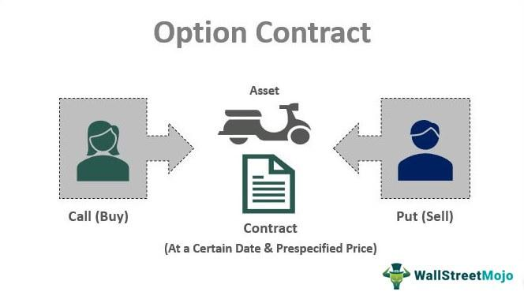

Options contracts are fundamental to the functioning of financial markets, offering investors a valuable tool for hedging, speculation, and income generation. These contracts provide the right, but not the obligation, to buy or sell an asset at a predetermined price before a specified expiration date. This flexibility allows market participants to manage risk and leverage market movements to achieve their financial goals. The importance of options derives from their ability to create strategies that can profit from changes in the underlying asset's price, implied volatility, or time decay, making them a versatile instrument in finance.

The history of options trading traces back to ancient Greece, where narratives of philosopher Thales suggest the use of options on olive presses as a means of securing price advantages in olive oil production. However, formalized options exchanges emerged much later, with the establishment of the Chicago Board Options Exchange (CBOE) in 1973 marking a pivotal moment. This development standardized options contracts and launched a new era in trading, laying the groundwork for a surge in market participation and liquidity.



The turn of the 21st century saw the emergence of algorithmic trading in options markets, fundamentally altering how traders interact with and strategize around these financial instruments. Algorithmic trading involves using computer programs and complex algorithms to execute trades at high speed and volume, enhancing market efficiency and liquidity. The integration of algorithms has allowed for the development of sophisticated trading strategies that can manage risk more effectively and capitalize on short-term market inefficiencies.

Technology and data are now central to modern options strategies. With the advent of powerful computing resources and access to vast amounts of market data, traders can deploy advanced analytical techniques to predict market movements and optimize their strategies. This shift has led to a greater focus on quantitative methods and the automation of trading processes, where machine learning and artificial intelligence play increasingly important roles in developing predictive models for options pricing and market behavior.

This article aims to explore the trajectory of options trading, from its historical roots to its current state shaped by technology and data sophistication. It will delve into the mechanics of options trading, the role of algorithmic trading in enhancing market dynamics, the process of developing algorithmic options strategies, and future trends shaping the landscape of options and algorithmic trading. Through this examination, the article seeks to provide a comprehensive understanding of how options markets have evolved and the technological forces driving their modernization.

## Table of Contents

## Historical Background of Options Contracts

Options contracts have a long and varied history, with origins that can be traced back to the ancient civilizations. The earliest known options trading is often attributed to Thales, a Greek philosopher who lived around 624-546 BC. He used options to secure the right, but not the obligation, to purchase olive presses at a set price later, effectively applying a financial strategy on olive harvest outcomes. This highlighted the fundamental concept of options: leveraging future market conditions for potential gain or risk mitigation.

As trade expanded through the centuries, the need for more structured exchanges became apparent. The establishment of organized commodities exchanges marked a vital development in financial markets. The Amsterdam Stock Exchange, established in 1602, is frequently cited as one of the first organized venues for trading, though it initially focused on stocks and commodities rather than standardized options.

The 19th and 20th centuries saw further sophistication in options trading. The Chicago Board of Trade (CBOT), founded in 1848, emerged as a crucial hub for trading commodities futures and options, providing a framework for pricing mechanisms and contractual obligations. This era witnessed the formalization of trading practices and increasing participant involvement, including farmers, speculators, and investors.

A landmark advancement was made in 1973 with the introduction of standardized options contracts by the Chicago Board Options Exchange (CBOE). This development provided a standardized framework for option terms and maturities, significantly reducing counterparty risk and promoting [liquidity](/wiki/liquidity-risk-premium). The Black-Scholes model, introduced the same year, revolutionized options pricing by offering a mathematical approach for calculating theoretical prices of options. The Black-Scholes formula is given by:

$$

C = S_0N(d_1) - Xe^{-rt}N(d_2) 
$$

Where:
- $C$ is the call option price
- $S_0$ is the current stock price
- $X$ is the strike price
- $t$ is the time to maturity
- $r$ is the risk-free interest rate
- $N(d)$ is the cumulative distribution function of the standard normal distribution
- $d_1$ and $d_2$ are calculated as:

$$
d_1 = \frac{\ln(S_0/X) + (r + \frac{\sigma^2}{2})t}{\sigma\sqrt{t}}
$$

$$
d_2 = d_1 - \sigma\sqrt{t}
$$

The globalization of financial markets during the late 20th and early 21st centuries significantly impacted options markets by expanding investor access and increasing market interconnectivity. The rise of electronic trading platforms facilitated international participation and fostered competitive pricing, contributing to market efficiency. Innovations in technology allowed for greater data dissemination and analysis, laying groundwork for current advancements in [algorithmic trading](/wiki/algorithmic-trading).

Overall, the historical evolution of options trading has been characterized by increasing sophistication and accessibility, leveraging technological advancements and global economic integration to shape modern market dynamics.

## Mechanics of Options Trading

Options trading is a dynamic component of financial markets, providing investors with the ability to hedge, speculate, or manage their portfolios. Understanding the mechanics of options trading involves grasping key concepts and the structure within which these financial instruments operate.

### Basic Concepts: Call and Put Options

Options are contracts that give the holder the right, but not the obligation, to buy or sell an underlying asset at a predetermined price before or on a specified date. The two primary types of options are:

- **Call Options:** These give the holder the right to purchase an underlying asset at a specified strike price. Investors buy call options when they anticipate that the price of the asset will rise.

- **Put Options:** These provide the holder the right to sell an underlying asset at a set strike price. Investors purchase put options when they expect the asset's price to decrease.

### Understanding Key Components: Strike Price, Expiry, and Premium

Three critical components define an options contract:

- **Strike Price (Exercise Price):** This is the price at which the holder can buy (call) or sell (put) the underlying asset. The strike price determines the intrinsic value of the option.

- **Expiry Date:** This is the last date on which the option can be exercised. Options can vary in the length of time till expiration, with short-term options expiring in days or months and long-term options expiring in years.

- **Premium:** This is the price paid by the buyer to the seller to acquire the option. The premium is influenced by factors such as time until expiration, volatility of the underlying asset, and current market price of the asset.

### Different Styles of Options: American vs. European

Options trading utilizes different styles, primarily American and European, which dictate when the options can be exercised:

- **American Options:** These options can be exercised at any time up to and including the expiration date. This flexibility generally results in a higher premium compared to European options.

- **European Options:** These options can only be exercised on the expiration date. While they offer less flexibility, they can be easier to price and hedge against.

### Role of Options Exchanges and Clearinghouses

Options are typically traded on organized exchanges, such as the Chicago Board Options Exchange (CBOE), which provide a platform for options contracts to be standardized in terms of expiration dates and strike prices. These exchanges ensure transparency and liquidity.

Clearinghouses, such as the Options Clearing Corporation (OCC) in the United States, play a crucial role in options trading by acting as intermediaries between buyers and sellers, thus ensuring the performance and integrity of the market. They serve as the counterparty to both sides of an options transaction, mitigating credit risk.

### Regulatory Framework Governing Options Trading

Options trading is regulated to protect investors and maintain market integrity. In the United States, the Securities and Exchange Commission (SEC) and the Commodity Futures Trading Commission (CFTC) oversee options markets. These regulations require clear disclosure of risks and strict adherence to trading rules, designed to prevent fraud and market manipulation.

The regulatory environment continually evolves to address challenges posed by new financial products and trading technologies, ensuring that options markets remain fair and efficient for all participants.

## Algorithmic Trading in Options

Algorithmic trading represents a significant advancement in the field of financial markets, including options trading. It involves the use of computer algorithms to execute trades based on pre-defined criteria, enabling faster and more efficient transactions compared to traditional manual methods. These algorithms can process a vast amount of data in real-time, execute trades at optimal prices, and are capable of handling complex trading strategies that human traders might find challenging.

There are several types of algorithms employed in options markets, each designed with specific trading objectives. Some common types include market-making algorithms, [arbitrage](/wiki/arbitrage) algorithms, and trend-following algorithms. Market-making algorithms aim to provide liquidity by continuously quoting buy and sell prices, thus facilitating smoother market operations. Arbitrage algorithms exploit price discrepancies across different markets or instruments to achieve risk-free profits. Trend-following algorithms analyze historical price data to identify patterns and forecast future price movements, guiding entry and [exit](/wiki/exit-strategy) points for trades.

Algorithmic trading enhances liquidity and efficiency in options markets by reducing bid-ask spreads and increasing the speed of transactions. This improvement in market liquidity helps in maintaining fair prices and reduces market impact costs, benefiting all market participants. The efficiency gained through algorithmic trading also means trades can be executed with minimal human intervention, significantly lowering operational risks and costs.

Despite these advantages, algorithmic trading comes with its own set of challenges and risks. One notable risk is the potential for algorithmic malfunctions or "flash crashes," where erroneous trades executed at high speed can lead to significant market disruptions. Moreover, algorithmic trading can contribute to increased market [volatility](/wiki/volatility-trading-strategies), particularly in times of financial uncertainty, as automated systems react to market events more quickly than humans.

Furthermore, the complexity of the algorithms and the speed at which they operate make it difficult for regulators to monitor and manage potential abuses in the market. This has led to concerns about fairness and transparency in financial markets, prompting regulatory bodies to implement stricter guidelines and monitoring systems.

Overall, algorithmic trading plays a crucial role in contemporary options markets by enhancing liquidity and efficiency, though it is not without challenges. Its impact on market volatility, combined with technological and regulatory considerations, continues to shape its evolution and implementation in financial markets.

## Developing an Algorithmic Options Strategy

Developing an algorithmic options strategy involves several critical components, each aimed at optimizing trading performance while managing risks effectively. This process starts with identifying market opportunities through comprehensive data analysis. 

### Identifying Market Opportunities through Data Analysis

Data analysis plays a pivotal role in recognizing trends and patterns within the options markets. Traders use advanced statistical methods and computational tools to analyze historical options data and current market conditions. Various sources, such as stock price movements, economic indicators, and market sentiment, are evaluated to forecast future market behaviors. The goal is to spot inefficiencies or potential arbitrage opportunities that can be exploited by an algorithmic trading system.

### Building Predictive Models for Options Pricing

Predictive modeling is central to algorithmic options trading, where [machine learning](/wiki/machine-learning) algorithms are frequently employed to predict the price movements of options. Typical models include regression analysis, decision trees, and more sophisticated techniques like neural networks. The famous Black-Scholes model is often a starting point for understanding pricing dynamics:

$$
C = S_0N(d_1) - Xe^{-rT}N(d_2)
$$

Where:
- $C$ is the call option price.
- $S_0$ is the current stock price.
- $X$ is the strike price.
- $r$ is the risk-free interest rate.
- $T$ is the time to expiration.
- $N$ is the cumulative distribution function of the standard normal distribution.
- $d_1$ and $d_2$ are calculated as:

$$
d_1 = \frac{\ln(S_0/X) + (r + \sigma^2/2)T}{\sigma\sqrt{T}}
$$

$$
d_2 = d_1 - \sigma\sqrt{T}
$$

Such models allow traders to simulate different scenarios and optimize their strategies accordingly.

### Risk Management and Hedging Using Algos

Effective risk management is a cornerstone of sustaining long-term success in options trading. Algorithms can be designed to provide dynamic hedging solutions, reducing exposure to adverse market movements. Techniques like delta hedging, gamma [scalping](/wiki/gamma-scalping), and volatility targeting are commonly used. These strategies involve adjusting the portfolio to keep delta, which measures sensitivity to price changes in the underlying asset, near zero. This requires constant recalibration using algorithmic systems, allowing for rapid response to market shifts.

### Testing and Optimization of Algorithmic Strategies

Before deploying any strategy, rigorous testing and optimization are essential. Strategies are initially tested through simulations and stress tests that mimic various market conditions. Parameters within the algorithm are fine-tuned to maximize performance across different scenarios. Python, widely used for this type of analysis, allows for efficient [backtesting](/wiki/backtesting) and optimization:

```python
import numpy as np
import pandas as pd

# Example: Simple moving average crossover strategy
def backtest_strategy(data, short_window, long_window):
    signals = pd.DataFrame(index=data.index)
    signals['price'] = data
    signals['short_mavg'] = data.rolling(window=short_window, min_periods=1).mean()
    signals['long_mavg'] = data.rolling(window=long_window, min_periods=1).mean()

    # Generate signals
    signals['signal'] = 0.0  
    signals['signal'][short_window:] = np.where(signals['short_mavg'][short_window:] 
                                                 > signals['long_mavg'][short_window:], 1.0, 0.0)   

    # Create positions
    signals['positions'] = signals['signal'].diff()
    return signals

# Backtest
data = pd.Series(np.random.randn(100))  # Example price data
signals = backtest_strategy(data, short_window=40, long_window=100)
```

### Backtesting with Historical Data and Its Importance

Backtesting involves running an algorithm through historical market data to analyze how it would have performed. This practice provides insights into the strengths and weaknesses of a strategy without the financial risk of real-world trading. It is essential for validating assumptions and ensuring that the strategy is robust and capable of generating consistent returns. Historical data serves as a benchmark, helping refine parameters and improve predictive accuracy before a real-world application.

Through a structured approach, combining these elements allows for the development of sophisticated algorithmic strategies, positioning traders to leverage technology for potential market advantages.

## Future Trends in Options and Algorithmic Trading

The landscape of options and algorithmic trading is undergoing significant transformation, largely driven by advancements in technology and data analytics. One prominent trend is the integration of machine learning (ML) and [artificial intelligence](/wiki/ai-artificial-intelligence) (AI) into trading algorithms. These technologies enable traders to develop sophisticated models that can analyze vast quantities of data to predict market trends and price movements with greater accuracy. By leveraging techniques such as supervised learning, [reinforcement learning](/wiki/reinforcement-learning), and [deep learning](/wiki/deep-learning), traders can improve their decision-making processes and optimize strategies for better risk-reward outcomes.

The growth of high-frequency trading ([HFT](/wiki/high-frequency-trading-strategies)) is another pivotal trend reshaping options markets. HFT involves executing a large number of orders at extremely high speeds, often within microseconds. This approach is facilitated by advanced algorithms and state-of-the-art computing infrastructure. In options trading, HFT can enhance market liquidity and price efficiency by narrowing bid-ask spreads and increasing the speed of market responses. However, it also introduces challenges, such as increased market volatility and potential systemic risks.

Real-time data analytics is transforming the way traders approach options strategies. With access to live data feeds and high-performance computing, traders can perform continuous analysis of market conditions and execute trades instantly in response to new information. This capability allows for dynamic strategies that adjust to rapidly changing markets, potentially leading to improved performance and a competitive edge.

Potential regulatory changes could also impact the future of options and algorithmic trading. As the market becomes more complex and automated, regulators may introduce new rules to ensure fair and transparent trading practices. These could include measures to mitigate systemic risks associated with HFT and to protect against market manipulation. Traders must stay informed of regulatory developments, as changes could influence trading behaviors and algorithm design.

Sustainability and ethical considerations are increasingly important in algorithmic trading. There is a growing emphasis on developing trading practices that are not only profitable but also responsible and sustainable. This involves addressing issues such as algorithmic fairness, transparency, and the environmental footprint of high-frequency trading systems. Additionally, ethical trading necessitates adherence to best practices to prevent abuses such as front-running or spoofing in automated environments.

The future of options and algorithmic trading is poised to be shaped by the synergistic effect of technological innovation, regulatory adaptation, and ethical concerns. Traders and institutions that strategically integrate these elements into their operations are likely to lead the next phase of evolution in financial markets.

## Conclusion

Options markets have undergone a profound transformation with the advent of technology, fundamentally altering how these markets operate and develop. Central to this evolution is the digitization of trading processes and the integration of advanced computational techniques, which have collectively enhanced the accessibility and efficiency of options trading.

Technology has ushered in an era where algorithmic trading plays a pivotal role in shaping the dynamics of the options market. Algorithms now facilitate the rapid execution of trades, enabling participants to respond swiftly to market changes and exploit fleeting opportunities. These advancements have led to improved liquidity and tighter bid-ask spreads, making options markets more efficient than ever before. However, this evolution comes with challenges, including increased market volatility and the potential for systemic risks originating from algorithmic errors or malicious activity.

The future of options trading is poised for further evolution as machine learning and artificial intelligence (AI) continue to make inroads into trading strategies. These technologies promise to enhance predictive capabilities and optimize decision-making processes, paving the way for more sophisticated and adaptive trading models. Additionally, high-frequency trading (HFT) is expected to grow, leveraging real-time data analytics to execute trades at unprecedented speed.

While technological advancements offer numerous benefits, they also raise questions about sustainability and ethics within financial markets. The opacity of some algorithmic processes and the possibility of creating unfair advantages necessitate ongoing scrutiny and potential regulatory adjustments. Stakeholders and regulators must collaborate to ensure that technological progress aligns with market integrity and fairness.

Encouragement for further study and exploration is essential for understanding the complexities of modern options markets and algorithmic trading. Emerging practitioners and researchers are urged to explore areas such as the development of ethical AI frameworks, the impact of technology on market microstructure, and the balance between innovation and regulation. Investigating these areas will contribute to a more robust understanding of options markets and prepare stakeholders for the challenges and opportunities that lie ahead.

For those interested in delving deeper, suggested readings include seminal works on options pricing models, algorithmic trading strategies, and comprehensive studies on the regulatory implications of technological advancements in financial markets. Notable resources include published research by the Options Clearing Corporation and the latest insights from financial technology think tanks.

### References and Further Reading Suggestions

1. Hull, J. C. (2018). "Options, Futures, and Other Derivatives." Pearson.
2. Black, F., & Scholes, M. (1973). "The Pricing of Options and Corporate Liabilities." The Journal of Political Economy, 81(3), 637-654.
3. Haugh, M. B., & Lo, A. W. (2001). "Quantitative risk management." Working Paper, Massachusetts Institute of Technology.
4. The Options Clearing Corporation – Annual Reports and Research Publications.
5. European Securities and Markets Authority – "High-Frequency Trading and its Impact on Market Quality."

## References & Further Reading

[1]: Black, F., & Scholes, M. (1973). ["The Pricing of Options and Corporate Liabilities."](https://www.cs.princeton.edu/courses/archive/fall09/cos323/papers/black_scholes73.pdf) The Journal of Political Economy, 81(3), 637-654.

[2]: Hull, J. C. (2018). ["Options, Futures, and Other Derivatives."](https://www.semanticscholar.org/paper/Options%2C-Futures%2C-and-Other-Derivatives-Hull/89bdee500c8623864fc9eb7a471546aa713acc44) Pearson.

[3]: Haugh, M. B., & Lo, A. W. (2001). ["Quantitative Risk Management."](https://martin-haugh.github.io/teaching/qrm/) Working Paper, Massachusetts Institute of Technology.

[4]: The Options Clearing Corporation. ["Annual Reports and Research Publications."](https://www.theocc.com/Company-Information/Documents-and-Archives/Annual-Reports)

[5]: European Securities and Markets Authority. ["High-Frequency Trading and its Impact on Market Quality."](https://www.esma.europa.eu/sites/default/files/library/2015/11/esma20141_-_hft_activity_in_eu_equity_markets.pdf)