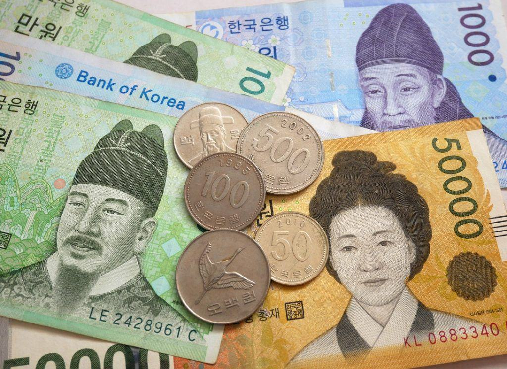

## Table of Contents

## What is the South Korean Won?

The South Korean Won is the official money used in South Korea. It is used to buy things like food, clothes, and other stuff people need every day. The symbol for the Won is ₩, and one Won is made up of 100 smaller units called jeon, though jeon are not used anymore.

The Won has been around since 1962 when it replaced the old Hwan. The Bank of Korea, which is like the country's money manager, makes sure the Won works well. They print the money and keep track of how much is being used. People in South Korea use the Won every day, and it's important for buying and selling things in the country.

## When was the South Korean Won first introduced?

The South Korean Won was first introduced on June 10, 1962. Before that, South Korea used a different kind of money called the Hwan. The government decided to change to the Won to help make the country's money stronger and easier to use.

When the Won was introduced, it replaced the Hwan at a rate of 10 Won for every 1 Hwan. This change was part of a bigger plan to fix the country's money problems and help the economy grow. Since then, the Won has become an important part of everyday life in South Korea.

## What was the currency used in Korea before the Won?

Before the Won, Korea used a currency called the Hwan. The Hwan was used from February 15, 1953, until it was replaced by the Won in 1962. The Hwan was introduced to help fix money problems after the Korean War. It replaced the old Korean Won at a rate of 1 Hwan for every 100 old Won.

The Hwan didn't work out as well as people hoped. It had a lot of problems, like high inflation, which means prices went up a lot and the money became worth less. That's why the government decided to change to the new Won. When they switched, they used a rate of 10 new Won for every 1 Hwan. This change helped make the money system better and helped the economy grow.

## How has the design of the Won changed over time?

When the South Korean Won was first introduced in 1962, the design of the banknotes was simple. The first Won notes showed pictures of famous Korean people and important places. For example, the 10 Won note had a picture of a farmer working in a field. The colors were mostly dark, like browns and greens, and the notes were made of paper. Over the years, the designs changed to include more modern pictures and better security features to stop people from making fake money.

Starting in the 1980s, the Bank of Korea began to update the Won's design. They added new colors like blue and pink, and the pictures became more detailed. For example, the 10,000 Won note now shows a picture of King Sejong, who created the Korean alphabet. The notes also started to use special inks and holograms to make them harder to copy. In 2006, the Bank of Korea started using plastic for some notes, which makes them last longer and be even harder to fake. These changes show how the Won has grown and improved over time.

## What significant economic events influenced the value of the Won?

The value of the South Korean Won has been influenced by many big economic events. One important event was the Asian Financial Crisis in 1997. This crisis started in Thailand but quickly spread to other countries in Asia, including South Korea. The Won lost a lot of its value very quickly. South Korea had to ask for help from the International Monetary Fund (IMF) to fix its money problems. This event made people in South Korea think a lot about how to make their economy stronger and more stable.

Another event that affected the Won was the global financial crisis in 2008. This crisis started in the United States but affected the whole world. Many countries, including South Korea, saw their money lose value. The Won dropped a lot against the US dollar. The South Korean government had to work hard to help the economy recover. They made new rules and helped businesses to keep the economy strong. These events show how the value of the Won can change because of big things happening around the world.

## How did the Korean War affect the Won?

The Korean War, which lasted from 1950 to 1953, had a big impact on the Won. Before the war, Korea used the old Won, but the war made the country's money system very unstable. The fighting destroyed a lot of things, including factories and farms, which made it hard for people to make and sell things. This caused prices to go up a lot, which is called inflation. To try to fix this, South Korea introduced a new currency called the Hwan in 1953, right after the war ended. The Hwan was meant to help make the money system better, but it didn't work out well because the country was still trying to recover from the war.

Even after the war, the effects on the Won continued. The Hwan had a lot of problems, like high inflation, which made it hard for people to buy things they needed. This showed that the war had not just destroyed buildings and farms but also made it hard for the country to have a stable money system. In 1962, South Korea decided to introduce the new Won to replace the Hwan. This was part of a bigger plan to fix the country's money problems and help the economy grow. The Korean War showed how a big event can change a country's money and economy for a long time.

## What are the major redenominations of the Won and when did they occur?

The South Korean Won has gone through two major redenominations. The first one happened right after the Korean War, in 1953. At that time, South Korea changed from the old Won to a new currency called the Hwan. They did this because the war had made the old Won very unstable. The Hwan was supposed to help fix the money problems, but it didn't work out well. The country was still trying to recover from the war, and the Hwan had a lot of problems like high inflation.

The second redenomination happened in 1962 when South Korea changed from the Hwan to the new Won. They did this because the Hwan was not working well, and they wanted to make the money system stronger. When they switched, they used a rate of 10 new Won for every 1 Hwan. This change was part of a bigger plan to help the economy grow and become more stable. Since then, the new Won has been the main money used in South Korea.

## How has the exchange rate of the Won fluctuated against major world currencies?

The exchange rate of the South Korean Won has gone up and down a lot over the years against major world currencies like the US dollar, the Euro, and the Japanese Yen. One big event that made the Won's value drop a lot was the Asian Financial Crisis in 1997. During this time, the Won lost a lot of its value very quickly against the US dollar. People were worried about South Korea's economy, and this made the Won weaker. After the crisis, the government worked hard to make the economy stronger, and the Won slowly started to get better.

Another time the Won's value changed a lot was during the global financial crisis in 2008. This crisis started in the United States but affected the whole world. The Won dropped a lot against the US dollar again because people were worried about the economy. But South Korea's government took steps to help the economy recover, and the Won started to get stronger again. Over time, the Won's value has gone up and down, but it has become more stable as South Korea's economy has grown and become stronger.

## What role did the Won play in South Korea's economic development?

The South Korean Won has been really important for South Korea's economic growth. When the Won was first introduced in 1962, it helped to make the country's money system stronger. Before that, the country used the Hwan, which had a lot of problems like high prices. By changing to the Won, the government could make new rules and plans to help the economy grow. This change was part of a bigger plan to fix the country's money problems and make things better for people. Over time, as the economy got stronger, the Won became a big part of everyday life in South Korea.

The Won has also helped South Korea become a big player in the world economy. As the country's businesses grew, they started selling more things to other countries. This made the Won more important because people in other countries needed to use it to buy South Korean products. The government worked hard to keep the Won stable, even during tough times like the Asian Financial Crisis in 1997 and the global financial crisis in 2008. By doing this, they helped the economy keep growing and made life better for people in South Korea. The Won's role shows how important a strong money system is for a country's growth.

## How have government policies impacted the stability of the Won?

The South Korean government has used many policies to help keep the Won stable. One big thing they did was to make rules to control how much money comes in and out of the country. This helps stop the Won from going up and down too much. They also worked with the Bank of Korea to set interest rates, which is like the cost of borrowing money. When the government changes these rates, it can help make the Won stronger or weaker depending on what the economy needs. These policies have been important for keeping the Won steady, even during tough times like the Asian Financial Crisis and the global financial crisis.

Another way the government has helped the Won is by making sure the economy stays strong. They did this by helping businesses grow and by making it easier for people to find jobs. When the economy is doing well, people trust the Won more, and it stays stable. The government also made sure that the country had enough money saved up to use during emergencies. This helped them handle big problems without making the Won lose too much value. By using these policies, the government has been able to keep the Won strong and stable, which is good for everyone in South Korea.

## What are the current denominations of the Won and their security features?

The South Korean Won comes in different amounts, like 1,000 Won, 5,000 Won, 10,000 Won, and 50,000 Won for paper money. There are also coins like 10 Won, 50 Won, 100 Won, and 500 Won. Each of these has special things to stop people from making fake money. For example, the paper money has hidden pictures that you can see under special lights, and the coins have special shapes and edges that are hard to copy.

The 1,000 Won note has a picture of a scholar and uses special ink that changes color. The 5,000 Won note shows a famous Korean woman and has a clear part that you can see through. The 10,000 Won note has King Sejong on it and uses a hologram to make it hard to fake. The newest 50,000 Won note, which came out in 2009, shows a famous scientist and uses plastic to make it last longer and be harder to copy. The coins also have special marks and edges that make them unique and hard to copy.

## How does the Bank of Korea manage the monetary policy related to the Won?

The Bank of Korea works hard to keep the Won strong and stable. They do this by making rules about how much money is in the country. One big thing they do is change the [interest rate](/wiki/interest-rate-trading-strategies), which is like the cost of borrowing money. When they make the interest rate higher, it can help the Won get stronger because people want to save more money. When they make it lower, it can help the economy grow because people want to borrow and spend more money. The Bank of Korea also keeps an eye on how much money is coming in and out of the country to stop the Won from going up and down too much.

Another way the Bank of Korea helps the Won is by making sure there's enough money for everyone to use. They print new money and take old money out of use to keep things balanced. They also save up money for emergencies, so if something bad happens to the economy, they can help fix it without making the Won lose too much value. By doing all these things, the Bank of Korea helps keep the Won stable and strong, which is good for everyone in South Korea.

## References & Further Reading

[1]: Bergstra, J., Bardenet, R., Bengio, Y., & Kégl, B. (2011). ["Algorithms for Hyper-Parameter Optimization."](https://papers.nips.cc/paper/4443-algorithms-for-hyper-parameter-optimization) Advances in Neural Information Processing Systems 24.

[2]: ["Advances in Financial Machine Learning"](https://www.amazon.com/Advances-Financial-Machine-Learning-Marcos/dp/1119482089) by Marcos Lopez de Prado

[3]: ["Evidence-Based Technical Analysis: Applying the Scientific Method and Statistical Inference to Trading Signals"](https://www.amazon.com/Evidence-Based-Technical-Analysis-Scientific-Statistical/dp/0470008741) by David Aronson

[4]: ["Machine Learning for Algorithmic Trading"](https://github.com/stefan-jansen/machine-learning-for-trading) by Stefan Jansen

[5]: ["Quantitative Trading: How to Build Your Own Algorithmic Trading Business"](https://www.amazon.com/Quantitative-Trading-Build-Algorithmic-Business/dp/1119800064) by Ernest P. Chan