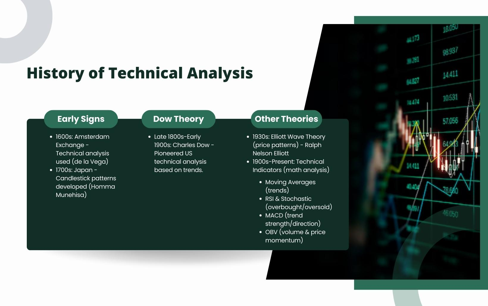

## Table of Contents

## What is technical analysis and how does it differ from fundamental analysis?

Technical analysis is a way to study the stock market by looking at charts and patterns. People who use technical analysis believe that they can predict future price movements by studying past price movements and trading volumes. They use tools like moving averages, trend lines, and various indicators to help them make decisions about when to buy or sell stocks. The main idea is that all the information you need is already reflected in the price of the stock, so you don't need to look at the company's financials or news.

On the other hand, fundamental analysis is a different approach that focuses on a company's financial health and overall business. People who use fundamental analysis look at things like earnings, revenue, assets, liabilities, and other financial statements to decide if a stock is a good investment. They also consider the company's management, industry conditions, and economic factors. The goal is to find stocks that are undervalued and have good long-term growth potential based on the company's fundamentals.

The main difference between the two is that technical analysis is more about the market's behavior and price movements, while fundamental analysis is about the company's actual performance and value. Both methods can be useful, and some investors use a combination of both to make their investment decisions.

## When did technical analysis first emerge and who were its pioneers?

Technical analysis started a long time ago, back in the late 1800s. One of the first people to use it was Charles Dow. He created the Dow Theory, which is one of the earliest forms of technical analysis. Charles Dow looked at stock prices and tried to find patterns to predict what would happen next in the market. His ideas were published in the Wall Street Journal, which he helped start.

Later on, other people built on Charles Dow's ideas. In the early 1900s, William Peter Hamilton and Robert Rhea made the Dow Theory more detailed. They wrote about it and helped more people understand it. Another important person was Richard W. Schabacker, who wrote [books](/wiki/algo-trading-books) in the 1930s about using charts to analyze the stock market. His work helped make technical analysis more popular and led to the development of many of the tools and indicators that people use today.

## How did early technical analysts use charts and patterns to predict market movements?

Early technical analysts like Charles Dow used charts to look at the ups and downs of stock prices over time. They believed that by studying these charts, they could spot patterns that would help them guess what the market might do next. For example, they looked for trends, which are long periods where prices either go up or down. If they saw a trend going up, they thought the prices might keep going up for a while. They also watched for things like "support" and "resistance" levels, which are prices where the stock tends to stop falling or rising and start moving the other way.

Another thing early technical analysts did was to look for specific patterns in the charts, like the "head and shoulders" pattern. This pattern looks like a head with shoulders on either side and can signal that a trend might be about to change direction. They also used simple tools like moving averages, which smooth out price data to show the general direction of the trend more clearly. By combining these patterns and tools, early technical analysts tried to make better guesses about when to buy or sell stocks, hoping to make money from the market's movements.

## What were some of the earliest technical analysis tools and indicators developed?

Some of the earliest technical analysis tools and indicators were developed by pioneers like Charles Dow and his followers. One of the first and most important tools was the moving average. A moving average is a line on a chart that shows the average price of a stock over a certain period of time, like 50 days or 200 days. Early analysts used moving averages to smooth out the ups and downs of daily price movements and see the overall trend more clearly. If the price of a stock was above its moving average, it was seen as a good sign, and if it was below, it was seen as a bad sign.

Another early tool was trend lines. Trend lines are straight lines drawn on a chart to connect the highs or lows of a stock's price over time. Analysts used these lines to see if a stock was in an uptrend, where prices were generally going up, or a downtrend, where prices were generally going down. They believed that if a stock's price broke through a trend line, it might signal a change in the trend. Besides these, early technical analysts also looked for specific chart patterns like the "head and shoulders" pattern, which can signal that a trend might be about to reverse. These simple tools and patterns formed the basis of technical analysis and are still used today.

## How did the use of technical analysis evolve through the 20th century?

Throughout the 20th century, technical analysis grew and changed a lot. At the start, people like Charles Dow and his followers used simple tools like moving averages and trend lines to look at stock charts. They tried to find patterns that could help them guess what the market would do next. As time went on, more people started using technical analysis, and they came up with new tools and indicators. In the 1930s, Richard W. Schabacker wrote books about using charts to analyze the stock market, which helped make technical analysis more popular. He introduced ideas like support and resistance levels, which are prices where the stock tends to stop and change direction.

By the middle of the century, technical analysis had become more complex. People started using computers to help them analyze the market. This made it easier to look at a lot of data quickly and find patterns that were hard to see before. In the 1970s and 1980s, new indicators like the Relative Strength Index (RSI) and the Moving Average Convergence Divergence (MACD) were created. These tools helped traders see if a stock was overbought or oversold, which could signal when to buy or sell. By the end of the 20th century, technical analysis had become a big part of how many people traded in the stock market, and it was used by both individual investors and big financial institutions.

## What role did computers and technology play in advancing technical analysis?

Computers and technology have played a huge role in making technical analysis better and easier to use. Before computers, people had to look at charts and do calculations by hand, which took a lot of time and could be hard to do right. But when computers came along, they could do these calculations really fast and accurately. This meant that traders could look at a lot more data and find patterns that were hard to see before. Computers also made it possible to use more complex tools and indicators, like the Relative Strength Index (RSI) and Moving Average Convergence Divergence (MACD), which help traders see if a stock is overbought or oversold.

Technology also made it easier for people to get information about the stock market. With the internet, traders can now see real-time data and charts from anywhere in the world. This has made technical analysis more accessible to everyone, not just people who work in big financial companies. Trading platforms and software have also been developed that let people use technical analysis tools easily. These tools can even do things like automatically find patterns and send alerts when certain conditions are met. Overall, computers and technology have made technical analysis faster, more accurate, and available to more people.

## Who were some influential figures in the development of modern technical analysis?

In the world of modern technical analysis, one of the big names is J. Welles Wilder Jr. He came up with the Relative Strength Index (RSI) in the 1970s. The RSI helps traders see if a stock is overbought or oversold. It's a really useful tool that a lot of people use today. Wilder also created other indicators like the Average True Range (ATR) and the Parabolic SAR, which help traders understand how much a stock's price might move and when to enter or [exit](/wiki/exit-strategy) trades.

Another important person is Gerald Appel, who invented the Moving Average Convergence Divergence (MACD) in the late 1970s. The MACD is another popular tool that helps traders see trends and [momentum](/wiki/momentum) in the market. It's used by a lot of people to decide when to buy or sell stocks. Appel's work made technical analysis even more useful and helped more people understand how to use it.

John Bollinger is also a key figure. He developed Bollinger Bands in the early 1980s. Bollinger Bands are lines drawn above and below a moving average that help traders see if a stock's price is high or low compared to its recent history. They're a great way to spot when a stock might be about to change direction. Bollinger's work has made technical analysis more advanced and helped traders make better decisions.

## How have different markets (stocks, forex, commodities) influenced the development of technical analysis?

Different markets like stocks, [forex](/wiki/forex-system), and commodities have shaped how technical analysis grew over time. In the stock market, early analysts like Charles Dow used charts to find patterns and predict where prices might go next. This helped make technical analysis a big deal in the stock market. As more people started trading stocks, they came up with new tools and indicators to better understand the market. The stock market's influence made technical analysis more detailed and popular.

The forex and commodities markets also played a big role in how technical analysis developed. In the forex market, where people trade different currencies, traders needed ways to quickly see trends and make decisions because the market moves fast. This led to the creation of tools like the Relative Strength Index (RSI) and Moving Average Convergence Divergence (MACD), which help traders see if a currency is overbought or oversold. In the commodities market, where people trade things like oil and gold, technical analysis helped traders predict price changes based on supply and demand patterns. These different markets pushed for new ways to use technical analysis, making it more useful and adaptable for all kinds of trading.

## What are some key historical events that significantly impacted the practice of technical analysis?

A big event that changed technical analysis was the stock market crash of 1929. This crash made people think more about how to predict what the market would do next. After the crash, more people started using charts and patterns to try to see what might happen in the future. This led to more books and ideas about technical analysis, like the work of Richard W. Schabacker in the 1930s. He wrote about using charts to understand the market, which helped make technical analysis more popular.

Another important event was the rise of computers in the late 20th century. Before computers, people had to do all their calculations by hand, which was slow and hard. But when computers came along, they could do these calculations really fast and accurately. This made it easier for traders to look at a lot of data and find patterns that were hard to see before. The internet also helped because it let people get real-time data and charts from anywhere. This made technical analysis faster, more accurate, and available to more people.

## How has academic research influenced the perception and use of technical analysis?

Academic research has had a big impact on how people see and use technical analysis. Some researchers have studied if technical analysis really works, and their findings have been mixed. Some studies say that technical analysis can help predict market movements, while others say it's no better than guessing. This has made some people doubt if it's a good way to invest. But other research has shown that technical analysis can be useful, especially for short-term trading. This has helped keep technical analysis popular, especially among traders who look at charts and patterns to make quick decisions.

Over time, academic research has also helped make technical analysis better. Researchers have come up with new tools and ways to use it, like new indicators and ways to test if a strategy works. This has made technical analysis more scientific and given traders more options to choose from. Even though some academics are still not sure about it, their work has helped technical analysis grow and become more respected in the world of investing.

## What are the major schools of thought in technical analysis and how have they evolved?

There are two main schools of thought in technical analysis: the traditional or classical school and the modern or quantitative school. The traditional school started with people like Charles Dow and his followers. They looked at charts and tried to find patterns like trends, support and resistance levels, and specific shapes like the head and shoulders pattern. They believed that by studying these patterns, they could predict what the market would do next. Over time, this school grew as more people added their own ideas and tools, like moving averages and trend lines, to help them understand the market better.

The modern or quantitative school came later, especially with the rise of computers and technology. This school uses math and [statistics](/wiki/bayesian-statistics) to create new tools and indicators, like the Relative Strength Index (RSI) and Moving Average Convergence Divergence (MACD). These tools help traders see if a stock is overbought or oversold and make decisions based on numbers. The modern school has made technical analysis more scientific and detailed. It has also made it easier for more people to use technical analysis because computers can do the hard calculations quickly. Both schools are still used today, and many traders mix ideas from both to make their own strategies.

## What current trends and future directions can we anticipate in the field of technical analysis?

Technical analysis is changing a lot these days because of new technology and ideas. One big trend is using computers and [artificial intelligence](/wiki/ai-artificial-intelligence) (AI) to help with technical analysis. AI can look at a lot of data really fast and find patterns that people might miss. This means traders can make better guesses about where the market might go next. Another trend is using more data from different places, like social media and news, to help with technical analysis. This can give traders more information to use when they make decisions. As technology keeps getting better, we can expect technical analysis to become even more detailed and useful.

In the future, we might see technical analysis become even more popular and easier to use. More people might start using it because of apps and software that make it simple to understand. We might also see new tools and indicators being created that use even more advanced math and technology. This could make technical analysis more accurate and helpful for all kinds of trading. As more research is done, we might learn new things about how well technical analysis works and find even better ways to use it.

## References & Further Reading

[1]: Murphy, J. J. (1999). ["Technical Analysis of the Financial Markets."](https://archive.org/details/technicalanalysi0000murp) New York Institute of Finance.

[2]: Hamilton, W. P. (1922). ["The Stock Market Barometer: A Study of Its Forecast Value Based on Charles H. Dow's Theory of the Price Movement."](https://archive.org/details/stockmarketbarom00hamirich) Harper & Brothers.

[3]: Rhea, R. (1932). ["The Dow Theory: An Explanation of Its Development and an Attempt to Define Its Usefulness as an Aid in Speculation."](https://openlibrary.org/books/OL6279382M/The_Dow_theory) Barron's.

[4]: Edwards, R. D., & Magee, J. (1948). ["Technical Analysis of Stock Trends."](https://www.taylorfrancis.com/books/mono/10.4324/9781315115719/technical-analysis-stock-trends-bassetti-robert-edwards-john-magee) John Magee, Inc.

[5]: "Algorithmic Trading and DMA: An Introduction to Direct Access Trading Strategies" by Barry Johnson.