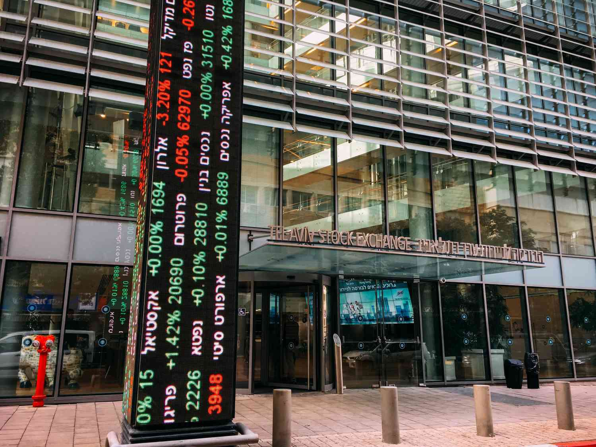

The Tel Aviv Stock Exchange (TASE) is a pivotal institution in Israel's financial ecosystem, serving as the country's sole public market for securities including stocks, bonds, derivatives, and more. As a central component of Israel's capital markets, TASE not only facilitates the trading and valuation of securities, but it also serves a critical role in providing liquidity and capital to Israeli businesses and the government. This functionality positions TASE as a crucial infrastructure for economic growth and financial stability within the nation.

This article aims to offer an expansive view of TASE, tracing its rich historical background from its humble origins during the British mandate period in the 1930s to its transformation into a sophisticated, electronically driven marketplace. While exploring its structural and operational complexities, special attention is given to the exchange's dynamic approach towards algorithmic trading, which represents a significant evolution in recent decades. Algorithmic trading has revolutionized the financial landscape of TASE, impacting liquidity, volatility, and price discovery, and is a key focal point for understanding the exchange's operational strategies.

Moreover, TASE's influence extends beyond national borders, making it a significant player in the global financial markets, particularly in regard to Middle Eastern and emerging markets. Its listings often feature technology and innovation-driven firms, a testament to Israel's status as a hub for technological advancement. For investors looking to capitalize on these opportunities, an understanding of TASE and its mechanisms is essential.

We'll also explore TASE's historical transformations that have defined its journey and look ahead to its future prospects in an ever-evolving financial landscape. The exchange is continuously adapting its strategies to maintain a competitive edge, focusing on international expansion, digital innovation, and the integration of blockchain technology and digital assets. These forward-looking strategies underline TASE's commitment to growth and adaptation in a changing global economy.

In summary, understanding TASE is vital for investors interested in the Middle Eastern and emerging markets. Its rich history, current operations, and future initiatives make it a cornerstone of Israel's economic framework and a vital player in global finance.

## Table of Contents

## What is the Tel Aviv Stock Exchange (TASE)?

The Tel Aviv Stock Exchange (TASE) serves as Israel's only securities market, strategically positioned in the bustling city of Tel Aviv. It plays an essential role in the country's financial framework, providing a centralized platform for the trading of a wide range of financial instruments. These include stocks, which represent ownership stakes in companies; bonds, which are interest-bearing debt instruments; derivatives, a category that encompasses contracts like options and futures whose value is derived from other financial entities; and additional financial vehicles. 

The exchange is integral to both the private sector and the government by offering a mechanism for [liquidity](/wiki/liquidity-risk-premium) and capital acquisition. Liquidity refers to the ease with which an asset can be converted into cash without affecting its market price, an essential [factor](/wiki/factor-investing) for investors seeking to enter or [exit](/wiki/exit-strategy) positions. Moreover, the TASE stands as a significant engine for capital, serving as a conduit through which Israeli businesses can raise the funds needed for expansion and innovation, while also providing the government with an avenue to finance various public initiatives.

Participation in the TASE includes a diverse array of members. Notably, this includes major banks which act as financial intermediaries, and investment firms which manage assets on behalf of clients. These entities are both domestic, ingrained in the Israeli economy, and international, bringing in global perspectives and fostering cross-border investments.

The TASE operates with a trading week that extends from Sunday to Thursday, accommodating the unique demands of local and international stakeholders. This schedule is strategically aligned with global markets, thereby optimizing the efficiency of cross-market trading and enhancing the synchronization of investment flows. This scheduling aligns well with markets in Europe and other regions with Sunday through Thursday as business days, facilitating smoother international investment operations.

## Historical Background of TASE

The Tel Aviv Stock Exchange (TASE) has a rich historical background, with its origins tracing back to the 1930s during the period of the British Mandate in Palestine. During this time, informal trading activities commenced with a small group of brokers who laid the groundwork for more structured financial exchanges. Following the establishment of the State of Israel in 1948, there was a burgeoning need for a formalized financial trading institution. This led to the inception of the Tel Aviv Stock Exchange in 1953, marking its evolution from small-scale trading to a recognized stock exchange.

Over the decades, TASE has witnessed numerous significant developments and transformations. A notable milestone was the introduction of electronic trading systems in 1999, which modernized the exchange and increased trading efficiency and accessibility. This transition was crucial as it provided a more robust infrastructure capable of handling higher trading volumes and more complex financial instruments.

Throughout its history, TASE has endured various market booms and downturns, reflecting both local and global economic changes. It has adapted to numerous regulatory frameworks aimed at improving market integrity and investor confidence. Such regulatory evolution has been vital in enabling TASE to maintain its position as a key financial institution within Israel.

In 2014, TASE made a strategic move by relocating to new premises, which was a part of its ongoing modernization efforts. This move was pivotal in supporting its continued growth and enhancing its operational capabilities. Another significant milestone occurred in 2019 when TASE went public, a landmark event that increased its transparency and accountability, while also attracting more investor interest.

Through these developments, TASE has demonstrated resilience and adaptability, securing its role in both the Israeli financial landscape and the broader global market context.

## Structure and Operations of TASE

The Tel Aviv Stock Exchange (TASE) operates through a structured network of subsidiaries dedicated to the seamless clearing and settlement of securities transactions. These subsidiaries ensure that trades are finalized promptly and accurately, minimizing risk and enhancing market confidence.

TASE employs advanced automated trading systems to facilitate transactions, with the Tel Aviv Continuous Trading (TACT) system at the forefront. TACT enables continuous trading and ensures that trades are executed efficiently and transparently, reducing transaction times and enhancing liquidity in the market. 

Investment instruments available on TASE are diverse and cater to a wide range of investor preferences. These instruments include equities, exchange-traded funds (ETFs), futures, and derivatives, providing multiple avenues for investment and risk management. This variety supports both speculative and hedging strategies, making the exchange attractive to a broad spectrum of participants.

Regulation by the Israel Securities Authority (ISA) is crucial for maintaining the integrity of the market. The ISA oversees the operations of TASE, ensuring compliance with laws and regulations designed to protect investors and promote fair trading practices. This regulatory framework is fundamental in safeguarding the interests of both retail and institutional investors.

In recent years, TASE has adopted more international trading practices, aligning itself with global financial markets. This integration involves embracing technological advancements and regulatory standards seen in leading stock exchanges worldwide. Such efforts have been instrumental in enhancing TASE's competitiveness and appeal to foreign investors, bolstering its position as a key player in the region's financial landscape.

## Algorithmic Trading on TASE

Algorithmic trading has emerged as a key element of the Tel Aviv Stock Exchange (TASE) since the 2000s, playing a crucial role in transforming how trades are conducted. This approach employs complex algorithms to execute trading commands based on predetermined criteria, significantly enhancing the speed and efficiency of transactions. High-frequency trading ([HFT](/wiki/high-frequency-trading-strategies)) is one prominent form of [algorithmic trading](/wiki/algorithmic-trading) on TASE, where algorithms rapidly analyze market data to execute trades within milliseconds, taking advantage of minute price discrepancies.

Traders on TASE utilize algorithms not only for HFT but also for trend analysis, which involves examining historical data to predict future movement patterns. This method helps in making informed trading decisions by modeling expected price behavior dynamically. Additionally, algorithmic trading facilitates [market making](/wiki/market-making), where algorithms automatically place buy and sell orders to provide liquidity to the market. By doing so, they help narrow the bid-ask spread and increase trading [volume](/wiki/volume-trading-strategy), thereby enhancing market efficiency.

TASE continuously upgrades its technological infrastructure to support the growing demand for algorithmic trading. The exchange's implementation of advanced automated trading systems, such as its TACT system, ensures robust and efficient trading operations. These systems are designed to handle the large volumes and high speeds associated with algorithmic trading, while also providing the necessary tools for risk management and compliance monitoring.

Algorithmic trading impacts several fundamental aspects of the stock market, including liquidity, [volatility](/wiki/volatility-trading-strategies), and price discovery. Algorithms improve liquidity by maintaining an active flow of buy and sell orders, ensuring that trades can be executed quickly without significantly affecting the asset’s price. However, the speed and automation inherent in algorithmic trading can introduce volatility, as rapid executions may lead to abrupt price movements. Despite this, algorithmic strategies contribute to the process of price discovery by aligning prices more closely with the supply and demand dynamics.

Investors engaging in algorithmic trading on TASE must be aware of both the opportunities and risks it presents. While algorithms can enhance trading efficiency and offer substantial profits through quick, data-driven decisions, they also [carry](/wiki/carry-trading) the risk of potential losses if poorly designed or managed. Market conditions can change rapidly, and algorithms must be adaptable to new data patterns and regulatory considerations. Understanding these risks, investors must continuously refine their strategies to maximize benefits and mitigate potential downsides in TASE's algorithmic trading landscape.

## Impact and Importance of TASE in Israel's Economy

The Tel Aviv Stock Exchange (TASE) is integral to Israel's economic structure, serving as a mainstay for facilitating [capital raising](/wiki/hedge-fund-capital-raising) that fuels economic growth. By enabling Israeli companies to raise funds efficiently through the issuance of various securities such as stocks and bonds, TASE plays a crucial role in augmenting financial resources available for innovation and expansion. This capability is vital for a nation with a burgeoning tech sector and for startups seeking seed capital to transition from concept to commercialization. 

Furthermore, TASE functions as a vital hub for the country's financial services sector. Through its operations, it integrates and connects various segments of the economy, offering a platform for banks, investment firms, and insurance companies to engage in seamless financial transactions. This interconnectedness promotes an efficient financial ecosystem, thereby enhancing economic stability and growth.

As a support mechanism for the innovation economy, TASE attracts and lists a significant number of technology-oriented firms. Israel's high-tech sector, often referred to as "Startup Nation," finds TASE an advantageous venue for showcasing growth and attracting investment. Through the public listing, tech companies gain visibility, access to a broad investor base, and the capital necessary to support R&D and scale operations. 

In addition, TASE serves as a magnet for international investment, providing a bridge between Israeli companies and global financial markets. By fostering an arena where foreign investors can engage with the local market, TASE promotes the inflow of international capital, underscores Israel's economic potential, and enhances the market's liquidity.

Furthermore, TASE contributes to the stabilization of Israel's financial system through its stringent regulatory framework. The oversight provided by the Israel Securities Authority ensures adherence to high standards of transparency, fairness, and accountability. This regulatory environment not only protects investors but also fosters confidence in the market, which is crucial for its sustained operation and growth. 

In summary, TASE's role as a catalyst in Israel's economy cannot be understated. Through facilitating capital formation, connecting diverse financial sectors, supporting the innovative tech ecosystem, and attracting international investments, it remains pivotal in propelling economic development and maintaining financial stability.

## Future Prospects for TASE

The Tel Aviv Stock Exchange (TASE) is actively positioning itself for future growth by exploring new markets and digital innovations. A key component of this strategy is the boost in international investor participation. To enhance its appeal to global investors, TASE is aligning with international trading practices and expanding its partnerships with foreign financial institutions. These initiatives are designed to increase the volume of foreign direct investment and integrate TASE more fully into the global financial system.

In its effort to become a leading financial hub in the Middle East, TASE is focusing on promoting itself as a platform not just for traditional securities but also for innovative financial instruments. The exchange's strategic location in a regional innovation powerhouse positions it advantageously to attract listings from technologically advanced firms. Furthermore, TASE's branding emphasizes its robust regulatory framework and technological infrastructure, which are essential in instilling investor confidence.

A significant area of innovation at TASE involves the integration of blockchain technology and digital assets. The exchange is exploring how distributed ledger technology can enhance the transparency, efficiency, and security of its operations. This initiative not only reflects a modern adaptation of financial services but also opens opportunities for new types of digital asset listings, appealing to a broader and tech-savvy investor base.

Despite these prospects, TASE faces substantial challenges. Navigating global economic shifts requires agility and foresight, as the exchange must continuously adapt to ever-evolving market conditions. Maintaining a competitive edge in an increasingly interconnected global market necessitates ongoing investments in technology and human capital. Moreover, TASE must address concerns related to cyber-security and ensure its digital transformations safeguard against emerging threats.

In conclusion, the future prospects for TASE are promising, underscored by its strategic initiatives to embrace digital innovation and increase international investor engagement. To achieve sustained growth and relevance, TASE must work diligently to overcome the challenges posed by global economic dynamics and technological disruptions.

## Conclusion

The Tel Aviv Stock Exchange (TASE) remains a cornerstone of Israel's economic framework, serving as the nation's sole securities market and a pivotal component in facilitating capital flow within the economy. Its rich history, dating back to its informal beginnings during the 1930s, has seen significant milestones, such as the introduction of electronic trading and its public listing in 2019, which have cemented its status as a vital player in global finance.

TASE's ongoing innovations, including the integration of algorithmic trading and the exploration of blockchain technologies, underscore its commitment to maintaining a cutting-edge trading environment. These efforts not only enhance trading efficiencies but also attract a diverse range of listings, particularly from tech-oriented firms, contributing to Israel's reputation as a hub of innovation.

The robust regulatory environment overseen by the Israel Securities Authority adds a layer of stability and reliability, fostering investor confidence. This regulatory framework, coupled with a diverse array of financial instruments available for trading on the exchange, continues to draw interest from both domestic and international investors.

As TASE evolves, it is well-positioned to expand its influence, aiming to become a leading financial hub in the Middle East. This expansion can benefit a wide range of stakeholders, promoting deeper integration into global financial markets and enhancing capital availability for Israeli companies.

Understanding the dynamics of TASE is essential for investors seeking to navigate and capitalize on opportunities within the Middle Eastern and emerging markets. As the exchange moves forward, its sustained growth and adaptability will likely offer considerable advantages to those engaged in its ecosystem, reinforcing its pivotal role in both Israel’s economy and the broader financial landscape.

## References & Further Reading

[1]: Avrahami, A., Schreiber, E., & Lauterbach, B. (2019). ["The Effects of TASE going public on the financial market in Israel."](https://www.semanticscholar.org/paper/The-dynamics-of-choice-in-a-changing-world%3A-Effects-Avrahami-Kareev/1ded114b231e935882b10f2bcd3ec906f965a946) European Journal of Finance.

[2]: Arbel, A. (2020). ["The Tel Aviv Stock Exchange: Its History and Influence on the Economy of Israel."](https://www.timesofisrael.com/despite-war-uncertainty-israeli-stocks-and-the-shekel-attract-investors/) Palgrave Studies in Banking and Financial Institutions.

[3]: Fabozzi, F. J., Focardi, S. M., & Kolm, P. N. (2010). ["Quantitative Equity Investing: Techniques and Strategies."](https://www.semanticscholar.org/paper/Quantitative-Equity-Investing%3A-Techniques-and-Fabozzi-Focardi/1c49a2a53919f7e65cb96f16691b8ff726fd3cd7) Wiley Finance.

[4]: Hendershott, T., & Riordan, R. (2013). ["Algorithmic Trading and the Market for Liquidity."](https://www.jstor.org/stable/43303831) Review of Financial Studies.

[5]: Israel Securities Authority. ["Regulation and Oversight of the Tel Aviv Stock Exchange."](https://www.gov.il/en/departments/israel_securities_authority/govil-landing-page) Official Website of the Israel Securities Authority.