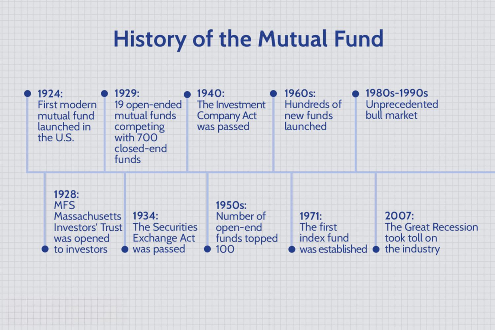

Mutual funds have gained prominence as a fundamental component of modern investment portfolios, providing a streamlined avenue for individual and institutional investors to achieve diversification across various asset classes. These financial instruments allow investors to pool their resources, granting access to a professionally managed, diversified portfolio of stocks, bonds, or other securities that might otherwise be difficult to assemble individually. This diversification mitigates risks and aims to enhance potential returns, embodying a balanced investment strategy.

A comprehensive understanding of mutual funds necessitates a historical perspective, as their evolution mirrors broader economic, technological, and regulatory trends. The origins of mutual funds can be traced back to the 18th century and have undergone significant transformation, adapting to shifts in market dynamics and investor preferences. This article examines these origins alongside significant milestones, from the development of early funds to the regulatory frameworks established in response to financial crises.



Modern advancements, such as algorithmic trading and the proliferation of exchange-traded funds (ETFs), continue to shape the landscape of mutual funds. As these funds integrate innovative strategies and cutting-edge technologies, they remain pivotal in the world of finance, reflecting the broader evolution of investment vehicles. This journey through the history of mutual funds offers a lens into their current structure and highlights their role in adapting to the ever-changing needs of global investors.

## Table of Contents

## The Origins of Mutual Funds

The concept of pooling resources for investment purposes emerged prominently in the 18th century within the Netherlands, which is widely regarded as the birthplace of the modern mutual fund. In 1774, a Dutch merchant named Adriaan Van Ketwich is credited with creating the first mutual fund, known as Eendragt Maakt Magt, or "Unity Creates Strength." This innovative financial vehicle allowed investors to purchase shares in a diverse portfolio of bonds, thus minimizing individual risk through collective investment. The rationale behind this structure was to provide small investors access to a diversified investment portfolio, which they could not achieve individually due to limited capital.

Ketwich's fund capitalized on the economic climate of the time, marked by European political uncertainty and turbulent financial markets. By pooling investments, the fund mitigated individual exposure to risk while tapping into broader market opportunities. Diversification, a key principle of modern finance, was essential to the fund's strategy, spreading investments across various bonds to decrease vulnerability to any single issuer's default.

The notion of pooled investments gained traction across Europe following the establishment of Ketwich's fund, laying the groundwork for the modern mutual fund industry. This model addressed the needs of investors seeking to balance risk and return, thereby setting a precedent for subsequent financial instruments that would follow similar principles. This early example of a pooled investment strategy illustrates the timeless appeal of shared risk and diversified holdings, which continues to underpin the mutual fund sector today.

## Advent of Mutual Funds in the United States

The concept of mutual funds arrived in the United States towards the end of the 19th century, reflecting the growing appeal of pooled investments. The Boston Personal Property Trust, established in 1893, is acknowledged as the first closed-end mutual fund in the United States. Closed-end funds differ from open-end funds primarily in that they issue a fixed number of shares, which are not redeemable from the fund. Instead, these shares are traded on secondary markets, often at prices above or below their net asset value (NAV).

The evolution of mutual funds in America took a significant turn with the founding of the Massachusetts Investors' Trust in 1924. This was the country’s first open-end mutual fund, allowing investors to purchase shares directly from the fund and redeem them at their current NAV. This innovation marked the inception of the modern mutual fund industry in the U.S., providing greater [liquidity](/wiki/liquidity-risk-premium) and accessibility to investors.

Mutual funds rapidly gained popularity during the 1920s, a period characterized by economic optimism and significant market expansion. The benefits of diversification were increasingly recognized, and managers began to include a mix of stocks and bonds in their funds, providing a balance of risk and reward. This period of innovation laid the groundwork for the widespread acceptance and growth of mutual funds as a favored investment vehicle for individual and institutional investors alike.

## Regulatory Developments and Growth

The stock market crash of 1929, followed by the Great Depression, marked a pivotal moment in financial regulation, leading to the creation of several legislative measures aimed at restoring investor confidence and market stability. One of the most significant outcomes was the establishment of the U.S. Securities and Exchange Commission (SEC) in 1934. The SEC was created to enforce federal securities laws, regulate the securities industry, and protect investors from fraudulent practices.

A landmark legislation that emerged in this era was the Investment Company Act of 1940. This Act specifically targeted mutual funds and aimed to provide a comprehensive regulatory framework to ensure transparency, accountability, and investor protection. Key provisions included the requirement for mutual funds to register with the SEC, maintain a certain level of oversight, and adhere to specific standards concerning the structure and operation of investment companies. The Act prohibited conflicts of interest, imposed restrictions on changing investment policies without shareholder approval, and mandated regular reporting to the SEC and shareholders.

Following World War II, the mutual fund industry experienced substantial growth, driven by a combination of economic expansion, increased public interest in financial markets, and improved regulatory trust due to these legislative measures. By the 1950s, mutual funds had become an integral part of both personal and institutional investment strategies, aided by their promise of diversification and professional management.

The post-war economic boom saw a burgeoning middle class with disposable income, which catalyzed the growth of mutual funds as an attractive investment option. Institutional investors, such as pension funds and insurance companies, also began to allocate substantial portions of their portfolios to mutual funds, recognizing their value in diversified asset management. As mutual funds grew in popularity, fund managers developed innovative products and strategies to attract investors, further propelling the industry's expansion.

This period also witnessed enhancements in the regulatory landscape, ensuring that as mutual funds expanded, they remained transparent and investor-focused. Mutual fund regulations have since evolved, reflecting changes in the financial markets, technological advancements, and investor needs, but the foundational principles established by the Investment Company Act of 1940 continue to underpin modern mutual fund operations.

The rapid post-war growth laid the groundwork for mutual funds to establish a robust presence in the global financial system, setting the stage for future innovations and adaptations in response to changing market dynamics.

## Technological Advancements and Algorithmic Trading

The technological advancements of the late 20th century have significantly transformed the landscape of mutual fund management. One pivotal development was the rise of electronic trading platforms, which revolutionized how mutual funds execute their investment strategies. These platforms facilitate faster and more efficient trading by allowing transactions to be conducted electronically rather than manually. The increased speed and accuracy of trade execution have enhanced the overall efficiency of fund management, reducing the potential for errors and slippage, and allowing fund managers to swiftly respond to market dynamics.

In addition to streamlining trade execution, technological advancements have also propelled the integration of [algorithmic trading](/wiki/algorithmic-trading) into mutual fund management. Algorithmic trading involves using complex mathematical models and algorithms to automate and optimize the execution of trades in financial markets. These algorithms analyze vast amounts of data at high speeds to identify trading opportunities and execute orders with minimal human intervention. The adoption of algorithmic trading allows mutual funds to handle large volumes of transactions, optimize trading costs, and improve the precision of order placement.

Algorithmic trading strategies can range from simple rules-based approaches, such as [market making](/wiki/market-making) and [arbitrage](/wiki/arbitrage), to more sophisticated techniques like high-frequency trading and [machine learning](/wiki/machine-learning) models. For example, a basic trading algorithm might seek price discrepancies between different markets or financial instruments, executing trades to exploit these inefficiencies. More advanced algorithms might use machine learning methods to adjust trading strategies based on historical data and evolving market conditions.

The application of algorithmic trading in mutual funds aids in optimizing portfolio transactions by reducing costs and minimizing market impact. By automatically executing trades at optimal prices and times, fund managers can enhance returns and improve liquidity management. Furthermore, the transparency and auditability of algorithmic trades provide a robust framework for regulatory compliance and risk management.

Technological innovation continues to shape the future of mutual fund management. Emerging technologies such as [artificial intelligence](/wiki/ai-artificial-intelligence) and big data analytics offer new opportunities to refine algorithmic models and develop more sophisticated trading strategies. As the financial industry evolves, the incorporation of these tools is increasingly becoming a critical component of successful mutual fund management. By leveraging technology, mutual funds are better equipped to navigate complex markets, achieving both operational efficiency and strategic gains.

## The Role of Index Funds and ETFs

Index funds, which emerged in the 1970s, revolutionized investment approaches by introducing a passive strategy aimed at replicating the performance of specific market indices. Created to offer broad market exposure with minimal management costs, these funds work by holding the securities of an index in the same proportion as the index itself. For example, an investor in an S&P 500 index fund would own shares that mirror the performance of the S&P 500. Burton Malkiel's book, "A Random Walk Down Wall Street," played a key role in popularizing the efficiency and low-cost advantage of such funds.

Exchange-Traded Funds (ETFs) emerged in the 1990s as a further innovation in mutual fund investment vehicles. While similar to index funds in providing diversification across a range of securities, ETFs offered the added advantage of trading on stock exchanges like individual stocks. This introduced a level of liquidity and flexibility that traditional mutual funds lacked, allowing investors to buy and sell their holdings throughout the trading day at market prices. 

The adoption of ETFs and index funds has significantly democratized investing. These products offer reduced expense ratios compared to actively managed funds, primarily because they do not require the same level of active oversight and decision-making. This cost efficiency, coupled with their accessibility via major stock exchanges, has made them attractive options for both retail and institutional investors seeking broad market exposure without incurring higher fees.

Both index funds and ETFs serve as critical tools in the asset allocation strategies of diversified portfolios. For instance, a Python script to calculate the weighted return of a portfolio containing ETFs might look like this:

```python
def weighted_return(prices, allocations):
    """
    Calculate the expected weighted return of a portfolio.

    :param prices: A list of historical returns for each ETF.
    :param allocations: A list of portfolio allocation percentages for each ETF.
    :return: The weighted return of the portfolio.
    """
    return sum(p * a for p, a in zip(prices, allocations))

# Example usage:
etf_returns = [0.05, 0.07, 0.03]  # Hypothetical returns for three ETFs
allocations = [0.4, 0.4, 0.2]    # Portfolio allocations for each ETF
expected_return = weighted_return(etf_returns, allocations)
print(f"Expected Portfolio Return: {expected_return:.2%}")
```

In this example, the script calculates the expected return by taking a weighted average of individual [ETF](/wiki/etf-trading-strategies) returns, scaled by their respective allocations within the portfolio. This reflects how investors can harness the collective stability of multiple assets to mitigate risks associated with individual market fluctuations.

In summary, index funds and ETFs have fundamentally shifted the landscape of investment, making diversified asset management accessible, affordable, and flexible. They continue to provide investors with essential building blocks for constructing resilient, efficient portfolios crafted toward long-term financial objectives.

## Sustainable and ESG Investing

In recent years, there has been increasing attention toward sustainable and [ESG](/wiki/esg-investing) (Environmental, Social, and Governance) investing within mutual funds. This shift reflects a broader trend in investment strategies where investors are not only seeking financial returns but also looking to align their investments with personal and societal values. ESG investing involves evaluating companies based on how they handle environmental responsibilities, manage social relationships, and govern themselves effectively. 

Investors have become more conscious of the impact their investments have on the world, leading to a rising demand for sustainable investment products. This demand has prompted mutual funds to integrate ESG criteria into their investment decision-making processes. Mutual funds now offer a range of products that cater to this new investment paradigm, ensuring that they meet the criteria set forth by those concerned with sustainability and corporate ethics.

Mutual funds engage with companies on ESG issues, pushing for transparency and accountability. This engagement often involves exercising shareholder voting rights to influence corporate strategies. For example, funds may support climate resolutions during shareholder meetings or advocate for better labor practices. This increasing integration of ESG factors requires robust data analytics to evaluate the sustainability and ethical dimensions of potential investments effectively.

Furthermore, financial performance remains a critical concern for investors. Studies suggest that incorporating ESG factors can potentially enhance financial returns while reducing risks. Sustainable funds are structured to achieve a balance between ethical considerations and competitive financial performance, making them attractive for long-term investors.

In summary, the trend towards sustainable and ESG investing is transforming mutual fund offerings. Funds are adapting to provide socially conscious options without compromising on financial objectives, attracting a growing base of investors interested in both profit and principles.

## Challenges and Future Directions

Mutual funds have continuously adapted to changing financial landscapes, but they are not without challenges. Market [volatility](/wiki/volatility-trading-strategies) remains a significant concern for fund managers and investors alike. This volatility can arise from global economic changes, geopolitical tensions, or unexpected financial crises, affecting fund valuations and investor returns. The liquidity crisis of 2020, triggered by the COVID-19 pandemic, underscored the critical importance of maintaining robust risk management practices and adhering to stringent regulatory standards to ensure market stability and investor protection.

Regulatory pressures also present ongoing challenges. The evolving regulatory landscape demands that mutual funds comply with rigorous oversight protocols, often requiring adjustments to investment strategies and operational frameworks. These regulations aim to protect investors yet necessitate continuous adaptation by fund managers to align with new compliance requirements.

Looking towards the future, mutual funds are poised to harness technological advancements to enhance fund management and investor engagement. Integration of digital tools and data analytics is anticipated to revolutionize how funds are managed. Advanced algorithms can analyze market trends and investor behaviors, offering predictive insights that guide investment decisions. This aligns with the increasing demand for personalized investment solutions tailored to individual risk profiles and financial goals.

Technological innovation also extends to customer interaction. Enhanced digital platforms promise to improve investor experiences through seamless access to account information, performance metrics, and educational resources about mutual fund investing. This focus on digital engagement is likely to attract a broader demographic, including tech-savvy younger investors seeking user-friendly investment options.

In summary, while mutual funds confront challenges like market volatility and regulatory demands, their future lies in embracing technology and analytics to refine investment strategies and foster deeper investor connections. These advancements position mutual funds to continue evolving in response to a dynamic financial environment.

## Conclusion

From their origins as simple pooled investments established in the late 18th century, mutual funds have transformed into sophisticated financial instruments, catering to a wide array of investor needs. This evolution reflects their enduring relevance and adaptability in an ever-changing financial landscape. Initially designed to offer diversified investment opportunities to individual investors of limited means, mutual funds have grown into a key component of both personal and institutional investment strategies worldwide.

Throughout this transformation, mutual funds have continually adapted to significant technological advancements and changing investor preferences. The inclusion of electronic trading platforms and the rise of algorithmic trading have enhanced the efficiency with which these funds operate, allowing managers to optimize portfolio transactions with unparalleled speed and precision. This technological integration has positioned mutual funds as leaders in the adoption of digital tools to meet investor demands.

Moreover, the introduction and widespread adoption of index funds and ETFs underscore the mutual funds' ability to innovate. These products have revolutionized investing by offering cost-effective and flexible options, making diversified investment accessible to a broader audience. By tracking market indices, such funds provide investors with an efficient way to gain exposure to a wide range of markets without the need for active management.

The increasing focus on sustainable and Environmental, Social, and Governance (ESG) criteria further exemplifies the mutual fund industry's adaptive nature. Investors' growing interest in aligning their investments with personal values has driven mutual funds to incorporate ESG factors into their strategies, offering products that promise both ethical alignment and sustainable financial returns.

Despite facing challenges such as market volatility, regulatory pressures, and the liquidity crisis of 2020, mutual funds have demonstrated resilience. By integrating advanced risk management strategies and pursuing continued regulatory compliance, they maintain their pivotal role in the global investment ecosystem.

As mutual funds continue to navigate these challenges and embrace future opportunities, their ability to innovate and adapt ensures their role at the forefront of investment strategies. Thus, the history and evolution of mutual funds stand as a testament to the dynamic nature of financial markets and the continuous pursuit of investment innovation.

## References & Further Reading

[1]: Rouwenhorst, K. G. (2004). ["The Origins of Mutual Funds."](https://www.semanticscholar.org/paper/The-Origins-of-Mutual-Funds-Rouwenhorst/147d494f41da0f68576a1f7195f303c01c2b31f8) Yale ICF Working Paper No. 04-48.

[2]: Securities and Exchange Commission. (2009). ["Investment Company Act of 1940."](https://www.sec.gov/files/rules/ic/2009/ic-29093.pdf)

[3]: Malkiel, B. G. (2015). ["A Random Walk Down Wall Street: The Time-Tested Strategy for Successful Investing."](https://www.amazon.com/Random-Walk-down-Wall-Street/dp/0393352242) W. W. Norton & Company.

[4]: Bogle, J. C. (2017). ["The Little Book of Common Sense Investing: The Only Way to Guarantee Your Fair Share of Stock Market Returns."](https://www.amazon.com/Little-Book-Common-Sense-Investing/dp/1119404509) Wiley.

[5]: Pojarliev, M., & Levich, R. M. (2011). ["A New Look at Algorithmic Trading."](https://papers.ssrn.com/sol3/papers.cfm?abstract_id=2571391) Journal of Corporate Finance 18(3), 570-575.