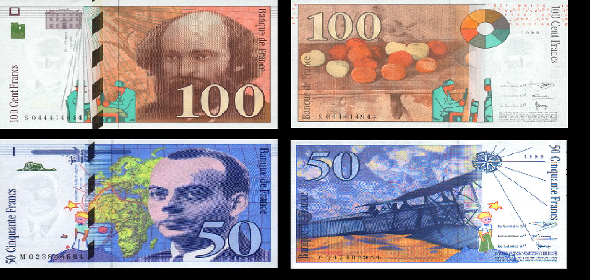

## Table of Contents

## What was the French Franc?

The French Franc was the currency used in France before the Euro. It started in 1360 and was used for many years until 1999. People in France used the Franc to buy things like food, clothes, and other items they needed.

In 1999, France joined the European Union and switched to the Euro. This meant that the French Franc was no longer used. Now, people in France use the Euro to buy things. The Franc is remembered as an important part of France's history.

## When was the French Franc first introduced?

The French Franc was first introduced in 1360. This happened during the Hundred Years' War, a long conflict between France and England. King John II of France needed money to pay for his ransom after being captured by the English. So, he created the Franc as a new coin to help raise the funds.

The first Franc was made of gold and was called the "Franc à cheval" because it showed the king on a horse. It was a big coin and had a lot of value. Over time, the Franc became the main currency in France and was used for many centuries until it was replaced by the Euro in 1999.

## How did the French Franc evolve over time?

The French Franc started as a gold coin in 1360, called the "Franc à cheval." It was made during the Hundred Years' War to help King John II pay his ransom after being captured by the English. This coin was big and valuable, showing the king on a horse. Over time, the Franc became the main currency in France. It was used for buying things like food, clothes, and other important items.

As time went on, the Franc changed a lot. It went through many different versions, like the silver Écu and the paper banknotes. There were times when the Franc became less valuable because of wars and economic problems. France had to change the value of the Franc several times to make it work better. By the 20th century, the Franc was used in everyday life, but it still had ups and downs. Finally, in 1999, France decided to switch to the Euro, which is now used instead of the Franc.

The French Franc's journey shows how money can change over time. It started as a coin to help a king and became a symbol of France's economy. Even though it is no longer used, the Franc is remembered as an important part of France's history. People in France now use the Euro, but they still remember the Franc and what it meant to their country.

## What were the major redenominations of the French Franc?

The French Franc went through several major changes in value over time. One big change happened in 1958, when the "Nouveau Franc" or New Franc was introduced. This was because the old Franc had lost a lot of its value due to inflation after World War II. The new Franc was worth 100 old Francs, which made it easier to use and understand. This change helped make the Franc more stable and useful for everyday buying and selling.

Another important change happened in 1960, when the French government decided to make the Franc even simpler. They removed two zeros from the Franc, so 1 New Franc became 1 Franc again. This made the currency easier to handle and use in daily life. These changes show how the French Franc was adjusted over time to keep up with the economy and make it easier for people to use.

## What impact did World War I and II have on the French Franc?

World War I had a big impact on the French Franc. The war cost a lot of money, and France had to borrow a lot to pay for it. This made the Franc lose value because there was too much money being printed. After the war, France faced a lot of economic problems. Prices went up a lot, and the Franc became even weaker. This time was hard for people in France because their money could not buy as much as before.

World War II also affected the French Franc a lot. During the war, France was occupied by Germany, and the economy was in chaos. The government had to print more money to pay for the war, which made the Franc lose even more value. After the war, France tried to rebuild its economy. They made new plans and changed the value of the Franc to make it stronger. It took time, but eventually, the Franc became more stable. These wars showed how big events can change a country's money and make life harder for people.

## How did the French Franc influence the economy of France?

The French Franc played a big role in France's economy for many years. It was the main money people used to buy things like food, clothes, and other things they needed. The Franc helped France grow and trade with other countries. When the Franc was strong, it made life easier for people because their money could buy more. But when the Franc was weak, like during wars and economic problems, it made life harder. People had to spend more money to buy the same things, and this could make the economy struggle.

Wars like World War I and World War II had a big impact on the French Franc. These wars cost a lot of money, and the government had to print more Francs to pay for them. This made the Franc lose value, and prices went up. After the wars, France had to work hard to make the Franc strong again. They changed the value of the Franc and made new plans to help the economy grow. Even though the Franc went through tough times, it was an important part of France's history and helped shape the country's economy until it was replaced by the Euro.

## What were the different denominations and designs of the French Franc?

The French Franc had many different denominations and designs over the years. It started as a gold coin called the "Franc à cheval" in 1360, showing King John II on a horse. Over time, the Franc changed a lot. It had different coins like the silver Écu and paper banknotes. The coins and banknotes showed different pictures, like famous people, buildings, and symbols of France. The value of the Franc also changed, with different denominations like 1 Franc, 2 Francs, 5 Francs, and more.

In the 20th century, the French Franc went through big changes. After World War II, the "Nouveau Franc" or New Franc was introduced in 1958. This new Franc was worth 100 old Francs, and it had new designs. The coins and banknotes showed different images, like Marianne, a symbol of France, and other important figures and landmarks. In 1960, the French government removed two zeros from the Franc, making it simpler to use. The designs kept changing to reflect France's history and culture until the Franc was replaced by the Euro in 1999.

## How was the French Franc affected by inflation?

Inflation had a big impact on the French Franc. Inflation means that prices go up and money loses value. During times like World War I and World War II, France had to print a lot of money to pay for the wars. This made the Franc lose value because there was too much money around. After the wars, prices kept going up, and the Franc became even weaker. This made life harder for people in France because their money could not buy as much as before.

To fix the problem, the French government made big changes to the Franc. In 1958, they introduced the "Nouveau Franc" or New Franc, which was worth 100 old Francs. This helped make the Franc more stable and easier to use. In 1960, they made another change by removing two zeros from the Franc, making it simpler. These changes helped the Franc become stronger and more useful for everyday buying and selling. Even though inflation caused a lot of problems, the French government worked hard to make the Franc better and keep up with the economy.

## What was the role of the French Franc in international trade?

The French Franc played an important role in international trade for many years. It was the main currency used by France to buy and sell things with other countries. When the Franc was strong, it helped France trade more easily because other countries were happy to use it. France could buy things like food, oil, and other important items from other countries, and sell its own products like wine, cheese, and cars. This helped France's economy grow and become stronger.

But when the Franc was weak, like during and after big wars, it made international trade harder. Other countries were less likely to use the Franc because it was losing value. This meant France had to be careful about how it traded with other countries. It had to find ways to make the Franc stronger so it could keep trading and help its economy. Even though the Franc went through tough times, it was a key part of France's international trade until it was replaced by the Euro.

## When and why was the French Franc replaced by the Euro?

The French Franc was replaced by the Euro in 1999. This happened because France joined the European Union and wanted to use the same money as other countries in the EU. The Euro was made to make it easier for countries to trade with each other and to make their economies stronger. By using the Euro, France could buy and sell things more easily with other countries in the EU, like Germany, Italy, and Spain.

The change from the Franc to the Euro was a big step for France. It meant that the Franc, which had been used for many centuries, was no longer the main money in the country. People had to get used to using the new Euro coins and banknotes. Even though the Franc is no longer used, it is still remembered as an important part of France's history. The Euro helped France and other countries work together more easily and made their economies stronger.

## How did the transition from the French Franc to the Euro affect the French economy?

The transition from the French Franc to the Euro had a big impact on the French economy. At first, it was a big change for people in France because they had to get used to using new money. The Euro helped France trade more easily with other countries in the European Union. This was good for the economy because it made it easier to buy and sell things. France could work together with other countries to make their economies stronger. Overall, the Euro helped France's economy grow and become more stable.

But the change was not easy for everyone. Some people worried about losing the French Franc, which had been a big part of their country's history. Prices also changed when the Euro started being used, and some people thought things got more expensive. It took time for everyone to get used to the new money. But in the end, the Euro helped France be part of a bigger group of countries working together. This made the French economy stronger and helped it grow over time.

## What are some notable historical events linked to changes in the French Franc?

The French Franc went through many changes because of big events in history. One big event was World War I. The war cost a lot of money, so France had to print more Francs to pay for it. This made the Franc lose value, and prices went up. After the war, France had a lot of economic problems. They had to change the Franc to make it stronger and help the economy.

Another big event was World War II. During the war, France was occupied by Germany, and the economy was in chaos. The government had to print even more money, which made the Franc even weaker. After the war, France made big changes to the Franc. In 1958, they introduced the "Nouveau Franc," which was worth 100 old Francs. This helped make the Franc more stable. In 1960, they made it simpler by removing two zeros. These changes helped France rebuild its economy after the war.

## References & Further Reading

[1]: ["The French Franc: A History of Franco-European Monetary and Political Relations"](https://en.wikipedia.org/wiki/French_franc) - The Economist

[2]: Bordo, M. D., & Jonung, L. (2000). ["Lessons for EMU from the History of Monetary Unions."](https://archive.org/details/lessonsforemufro0000bord) National Bureau of Economic Research.

[3]: Kindleberger, C. P. (1993). ["A Financial History of Western Europe."](https://www.taylorfrancis.com/books/mono/10.4324/9780203828052/financial-history-western-europe-charles-kindleberger) Oxford University Press.

[4]: Eichengreen, B. (1996). ["Globalizing Capital: A History of the International Monetary System."](https://www.jstor.org/stable/j.ctt7pfmc) Princeton University Press.

[5]: ["The Trade Lifecycle: Behind the Scenes of the Trading Process"](https://onlinelibrary.wiley.com/doi/epdf/10.1002/9781119014393.index) by Robert P. Baker

[6]: ["Maastricht Treaty - A Major Turning Point in European History"](https://en.wikipedia.org/wiki/Maastricht_Treaty) - CVCE.eu

[7]: Galati, G., & Melick, W. (2002). ["Central Bank Intervention and Market Expectations."](https://www.semanticscholar.org/paper/Central-bank-intervention-and-market-expectations-Galati-Melick/4dafb32cc4c7896ac79df233ac6ea6273e9a0fe4) BIS Working Papers, No. 123.

[8]: Perez, C. (2002). ["Technological Revolutions and Financial Capital: The Dynamics of Bubbles and Golden Ages."](https://www.cambridge.org/core/journals/journal-of-economic-history/article/abs/technological-revolutions-and-financial-capital-the-dynamics-of-bubbles-and-golden-ages-by-carlota-perez-cheltenham-uk-and-northampton-ma-edward-elgar-2002-pp-xix-198-6500-cloth-3000-paper/C97EC3EA6C77E62FD8C40B9C7A5CFECF) Edward Elgar Publishing.