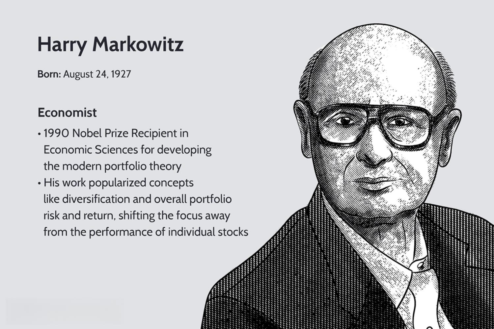

## Table of Contents

## What is a modern portfolio?

A modern portfolio is a collection of investments that are carefully chosen to balance risk and reward. It's based on the idea that by spreading your money across different types of investments, like stocks, bonds, and real estate, you can reduce the chance of losing money. This approach was developed by a man named Harry Markowitz in the 1950s, and it's still used today. The goal is to get the best possible return for the level of risk you're willing to take.

To build a modern portfolio, you first need to figure out how much risk you're comfortable with. Then, you choose investments that fit that risk level. The key is to mix different types of investments so that if one type goes down in value, another might go up, helping to balance things out. This is called diversification. By doing this, you can create a portfolio that's more stable and likely to grow over time, even when the market goes up and down.

## When did the concept of the modern portfolio originate?

The concept of the modern portfolio started in the 1950s. A man named Harry Markowitz came up with the idea. He thought that by spreading money across different investments, people could reduce the risk of losing money. This was a new way of thinking about investing at the time.

Markowitz called his idea Modern Portfolio Theory. It's all about balancing risk and reward. The main point is to mix different types of investments, like stocks and bonds, to make a portfolio that's more stable. Even today, people use this theory to help them invest their money wisely.

## Who is considered the father of modern portfolio theory?

Harry Markowitz is considered the father of modern portfolio theory. He came up with the idea in the 1950s. Before Markowitz, people thought about investments one at a time. But he showed that looking at how different investments work together is important.

Markowitz's big idea was that by spreading money across different types of investments, like stocks and bonds, you can lower the risk of losing money. This is called diversification. His theory changed how people think about investing. Today, many people use his ideas to build their investment portfolios.

## What are the key principles of modern portfolio theory?

Modern portfolio theory is all about balancing risk and reward. The main idea is that you can lower the risk of losing money by spreading your investments across different types of assets, like stocks, bonds, and real estate. This is called diversification. When you diversify, if one type of investment goes down, another might go up, helping to balance things out. This way, your overall portfolio is more stable and less likely to lose a lot of value all at once.

Another important principle is that the risk of a portfolio isn't just the sum of the risks of its individual parts. It's about how the different investments move together. If you pick investments that don't all go up and down at the same time, you can reduce the overall risk. This is called correlation. By choosing investments with low correlation, you can create a portfolio that's smoother and more likely to grow over time, even when the market goes up and down.

The final key principle is that for any given level of risk, there's a best possible return you can get. This is called the efficient frontier. By figuring out where your portfolio sits on this frontier, you can make sure you're getting the best return for the amount of risk you're willing to take. This helps you make smart choices about where to put your money, so you can reach your financial goals without taking on too much risk.

## How has the application of modern portfolio theory evolved over time?

Since Harry Markowitz came up with modern portfolio theory in the 1950s, the way people use it has changed a lot. At first, it was all about using math to figure out the best way to spread money across different investments to lower risk. But over time, people started to think about more than just numbers. They began to look at things like how much it costs to buy and sell investments, and how taxes can affect returns. They also started to pay more attention to different types of risks, like the risk of a whole market going down, not just the risk of individual investments.

As computers got better, people could use them to do more complicated math and look at more data. This made it easier to find the best mix of investments for a portfolio. Now, people use computer programs and special math to build portfolios that fit their goals and how much risk they're willing to take. They also use modern portfolio theory to look at new types of investments, like those in other countries or in things like real estate and commodities. This has made modern portfolio theory more useful and helped more people use it to make smart choices about their money.

## What are the main criticisms of modern portfolio theory?

Some people say modern portfolio theory has problems. One big criticism is that it relies too much on past data to predict how investments will do in the future. But the future can be different from the past, so this can lead to wrong guesses about risk and reward. Another criticism is that the theory doesn't always think about big events that can shake up the whole market, like financial crises or big changes in the economy. These events can make all investments go down at the same time, no matter how well you've spread them out.

Another problem people point out is that modern portfolio theory can be hard to use in real life. It uses a lot of math and needs a lot of data, which can be hard for regular people to understand and use. Also, the costs of buying and selling investments, like fees and taxes, can eat into the returns, and the theory doesn't always take these costs into account. Some critics also say that modern portfolio theory focuses too much on numbers and not enough on other important things, like how much people care about losing money compared to making money, or how they feel about different kinds of investments.

## How have technological advancements influenced modern portfolio management?

Technological advancements have changed modern portfolio management a lot. Computers and the internet have made it easier for people to get information about different investments. This means they can make better choices about where to put their money. Also, there are now special computer programs that can do the math needed for modern portfolio theory quickly. These programs can look at a lot of data to find the best mix of investments for someone's portfolio. This makes it easier for people to use modern portfolio theory to manage their money without needing to be experts in math.

Another big change is that technology has made it possible to use new types of investments in portfolios. For example, people can now invest in things like cryptocurrencies or use trading strategies that were hard to do before. Technology also helps people keep track of their investments and make changes to their portfolios more easily. This means they can adjust their investments to fit their goals and how much risk they want to take, even as the market changes. Overall, technology has made modern portfolio management more accessible and effective for everyone.

## Can you explain the impact of global economic changes on modern portfolios?

Global economic changes can really shake up modern portfolios. When the economy in one country changes, it can affect the value of investments all over the world. For example, if a big economy like the United States goes into a recession, it can cause stock markets everywhere to go down. This means that even if you have a well-diversified portfolio, global economic changes can still hit you hard. People who manage portfolios need to keep an eye on what's happening around the world so they can make smart choices about where to put their money.

Another way global economic changes can impact modern portfolios is through changes in interest rates and currency values. If interest rates go up in one country, it can make borrowing more expensive and slow down that country's economy. This can affect the value of bonds and other investments in that country. Also, if the value of one currency changes compared to another, it can change how much money you make or lose from investments in different countries. People who manage portfolios need to think about these things and adjust their investments to try to protect their money and make the best returns possible.

## What role do alternative investments play in modern portfolios?

Alternative investments are a special kind of investment that can help make modern portfolios stronger. These can include things like real estate, commodities, hedge funds, and even art or wine. The main reason people add alternative investments to their portfolios is to spread out their money even more. By doing this, they can lower the risk of losing money because alternative investments often don't move up and down in the same way as stocks and bonds. For example, when the stock market goes down, real estate might still be doing well, helping to balance out the losses.

Adding alternative investments can also help people make more money. These investments can sometimes give higher returns than traditional ones, but they can also be riskier. Because of this, it's important to be careful and understand what you're getting into. People who manage portfolios often use alternative investments to try to get the best possible return for the amount of risk they're willing to take. By mixing different types of investments, including alternatives, they can create a portfolio that's more likely to grow over time, even when the market goes up and down.

## How do modern portfolio strategies adapt to different market conditions?

Modern portfolio strategies are always changing to fit different market conditions. When the market is doing well, portfolio managers might put more money into stocks to try to make more money. But if the market starts to go down, they might move some of that money into safer investments like bonds or cash. This way, they can protect the money they've already made and not lose as much if the market keeps going down. They also look at what's happening in the economy and around the world to decide when to make these changes.

Another way modern portfolio strategies adapt is by using different types of investments. If one part of the market, like technology stocks, is doing really well, managers might put more money into that area. But if they think that part of the market might not do as well in the future, they might move money into other areas, like healthcare or energy. By keeping the portfolio balanced and adjusting it based on what's happening in the market, managers can try to get the best returns without taking on too much risk.

## What are some advanced techniques used in modern portfolio optimization?

One advanced technique in modern portfolio optimization is using something called "[factor](/wiki/factor-investing)-based investing." This means looking at different things, or factors, that can affect how investments do. For example, factors could be the size of a company, how much it's growing, or how much risk it's taking. By understanding these factors, people can pick investments that are likely to do well in the future. This helps them make their portfolios stronger and more likely to grow, even when the market changes.

Another technique is using "[machine learning](/wiki/machine-learning)" to help make better choices about investments. Machine learning is a kind of computer program that can learn from data and make predictions. By using a lot of data about how investments have done in the past, these programs can find patterns and help people decide where to put their money. This can make portfolios more stable and help people get better returns. It's like having a smart computer friend that helps you make smarter choices about your money.

A third technique is called "risk parity." This means spreading out the risk in a portfolio so that each type of investment has the same amount of risk. Instead of putting most of the money into stocks, which can be risky, people might put more money into bonds or other safer investments. By doing this, they can make sure that the portfolio is more balanced and less likely to lose a lot of money all at once. This can help people feel more comfortable with their investments and make their portfolios more stable over time.

## How does behavioral finance intersect with modern portfolio theory?

Behavioral finance looks at how people's feelings and ways of thinking can affect their choices about money. It says that people don't always make smart choices because they can be influenced by things like fear or excitement. Modern portfolio theory, on the other hand, is all about using math and data to make the best choices about investments. But even though modern portfolio theory tries to be very logical, it has to deal with the fact that people don't always follow the numbers. Behavioral finance helps explain why people might not stick to the plan that modern portfolio theory suggests.

For example, when the stock market goes down, people might feel scared and want to sell their investments, even if modern portfolio theory says they should keep them. This is called "loss aversion," where people feel the pain of losing money more than the joy of making money. Understanding this can help people who manage portfolios think about how to help their clients stick to the plan. By knowing about behavioral finance, they can make better choices about how to talk to people and help them stay calm during tough times. This way, they can use modern portfolio theory more effectively to reach their financial goals.

## What is the Role of Technology in Portfolio Management?

Technology has fundamentally transformed portfolio management by facilitating real-time data analysis and the implementation of sophisticated trading algorithms. These technological advancements allow investors to make more informed decisions and adapt quickly to changing market conditions. A critical development in this space is the use of [artificial intelligence](/wiki/ai-artificial-intelligence) (AI) and machine learning, which can analyze vast amounts of data to uncover hidden market patterns and anomalies. This capability enhances the ability to predict market trends and optimize investment strategies.

AI and machine learning algorithms process historical data to identify patterns that might not be apparent to human analysts. These algorithms employ techniques such as regression analysis, classification, clustering, and neural networks to recognize trends and make predictions. For instance, machine learning models can predict stock prices by analyzing historical price movements, trading volumes, and other relevant factors. This predictive power can be expressed in a simple model, such as a linear regression:

$$
\text{Price}_{\text{t+1}} = \beta_0 + \beta_1 \cdot \text{Price}_{\text{t}} + \beta_2 \cdot \text{Volume}_{\text{t}} + \epsilon
$$

In this model, $\beta_0$, $\beta_1$, and $\beta_2$ are coefficients determined by the algorithm, while $\epsilon$ represents the error term.

Moreover, the rise of robo-advisors exemplifies the automation of investment strategies. These digital platforms offer personalized investment advice and portfolio management services at a fraction of the cost of traditional financial advisors. Robo-advisors use algorithms to assess an individual’s risk tolerance, financial goals, and investment timeline to suggest optimal asset allocations. They continuously monitor market conditions and adjust portfolios as needed, often without human intervention. This automation improves efficiency and accessibility, making investment management services available to a broader audience.

The integration of these technologies into portfolio management systems ensures that investors can easily access real-time financial data and make data-driven decisions. Finance professionals now rely on advanced software solutions to track market movements, analyze investment opportunities, and execute trades automatically. This technological infrastructure supports high-frequency trading, where transactions are completed in microseconds, taking advantage of minor price discrepancies and market inefficiencies.

In conclusion, the role of technology in portfolio management has grown substantially, enabling more precise, data-driven investment strategies. The ongoing advancements in AI and machine learning will likely continue to shape the future of investment management, making it crucial for investors to embrace these tools to maintain a competitive edge in the market.

## How can traditional and modern investment strategies be combined?

Combining traditional and modern investment strategies involves leveraging the strengths of both approaches to optimize investment outcomes. Traditional investment strategies, rooted in time-tested principles such as value investing and growth investing, focus on the intrinsic value of assets and the potential for capital appreciation. These strategies are often guided by qualitative analysis, fundamental research, and macroeconomic trends. On the other hand, modern investment strategies are increasingly driven by technological advancements, including data analytics, [algorithmic trading](/wiki/algorithmic-trading), and machine learning.

One of the key benefits of integrating these strategies is the ability to adapt to dynamic market conditions. Traditional investment wisdom provides a stable foundation through techniques like diversification, which aims to reduce risk by spreading investments across various asset classes. The formula for diversification is often expressed through the calculation of the expected portfolio variance, which can be represented as:

$$
\sigma_p^2 = \sum_{i=1}^{n} \sum_{j=1}^{n} w_i w_j \sigma_{ij}
$$

where $\sigma_p^2$ is the portfolio variance, $w_i$ and $w_j$ are the weights of assets $i$ and $j$ in the portfolio, and $\sigma_{ij}$ is the covariance between the returns of assets $i$ and $j$.

Modern investment technology enhances this diversification by enabling real-time data processing and implementing sophisticated trading algorithms. Algorithmic trading, for instance, allows for rapid execution and management of trades based on complex mathematical models, improving efficiency and reducing human error.

Furthermore, artificial intelligence and machine learning provide investors with tools to uncover hidden patterns in market data, offering insights that may not be evident through traditional analysis. These technologies can enhance decision-making processes by predicting market movements or identifying profitable investment opportunities, thereby contributing additional layers of strategy to the investment process.

The combination of these approaches allows for a hybrid investment strategy that benefits from the predictability and understanding of traditional methods while capitalizing on the speed and analytical power of modern tools. This dual approach not only maximizes potential returns but also ensures an investor's ability to maintain stability amid fluctuating market environments.

Ultimately, the integration of traditional and modern investment strategies exemplifies the adaptive nature required of investors to navigate the complexities of today's financial markets efficiently. By balancing longstanding investment principles with cutting-edge technology, investors are better positioned to achieve their financial objectives in an ever-evolving landscape.

## References & Further Reading

[1]: Markowitz, H. (1952). ["Portfolio Selection."](https://onlinelibrary.wiley.com/doi/abs/10.1111/j.1540-6261.1952.tb01525.x) The Journal of Finance, 7(1), 77-91.

[2]: Sharpe, W. F. (1964). ["Capital Asset Prices: A Theory of Market Equilibrium under Conditions of Risk."](https://onlinelibrary.wiley.com/doi/full/10.1111/j.1540-6261.1964.tb02865.x) The Journal of Finance, 19(3), 425-442.

[3]: Lopez de Prado, M. (2018). ["Advances in Financial Machine Learning."](https://www.amazon.com/Advances-Financial-Machine-Learning-Marcos/dp/1119482089) Wiley.

[4]: Chan, E. P. (2009). ["Quantitative Trading: How to Build Your Own Algorithmic Trading Business."](https://github.com/ftvision/quant_trading_echan_book) Wiley.

[5]: Jansen, S. (2020). ["Machine Learning for Algorithmic Trading."](https://github.com/stefan-jansen/machine-learning-for-trading) Packt Publishing.

[6]: Aronson, D. R. (2006). ["Evidence-Based Technical Analysis: Applying the Scientific Method and Statistical Inference to Trading Signals."](https://www.amazon.com/Evidence-Based-Technical-Analysis-Scientific-Statistical/dp/0470008741) Wiley.