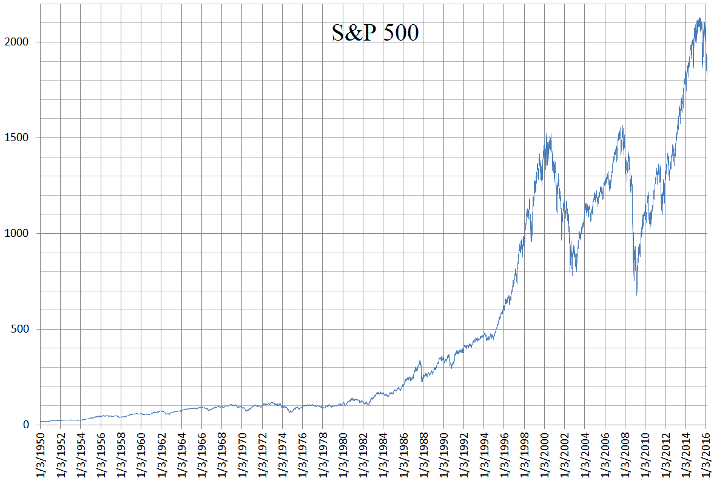

The Standard & Poor's 500 Index (S&P 500) stands as a critical benchmark in the evaluation of large U.S. equities, embodying an essential fragment of the financial landscape. Since its launch in 1957, the index has evolved into a quintessential barometer for investors seeking to assess the health of the U.S. economy through a diversified representation of 500 leading companies. These companies, spanning various sectors, collectively capture the essence of American corporate performance, making the S&P 500 a mirror for economic conditions.

This article outlines the historical progression of the S&P 500, examining its significance in diverse investment strategies while also addressing the profound impact of algorithmic trading on its dynamics. By tracing key historical events that have shaped the index, readers gain insight into the resilience and adaptability that have characterized its journey through fluctuating economic periods. Furthermore, the discussion extends to consider how the 21st-century evolution of algorithmic trading technologies is influencing investor approaches and market outcomes within the context of the S&P 500.



Understanding the interplay between the S&P 500's storied past and the cutting-edge technologies transforming modern trading provides a comprehensive view of its dual role as an economic indicator and a sophisticated investment vehicle. As we explore these dimensions, the narrative reveals the S&P 500's enduring relevance and the continuous innovation that reshapes its role in global financial markets.

## Table of Contents

## The History of the S&P 500

Launched in 1957, the S&P 500 Index has become a key indicator of the U.S. economy's health, reflecting its complex economic climates over the decades. The index comprises 500 leading publicly traded companies in the United States, offering a broad snapshot of market performance.

In the 1970s, the U.S. faced a period of stagflation characterized by stagnant economic growth and high inflation. This challenging economic environment affected the S&P 500, leading to volatility and modest returns. The high inflation rates, exacerbated by oil crises in 1973 and 1979, pushed input costs higher for many companies, impacting corporate profits and, by extension, stock prices within the index.

The 1980s and 1990s brought a significant reversal of fortune, marked by strong economic growth and technological advancements. The advent of personal computing and the internet fueled a technology boom, resulting in rapid gains for the stock market. This era saw substantial price movements in the S&P 500, with technology companies becoming increasingly dominant within the index. The tech boom culminated in the dot-com bubble of the late 1990s, where speculative investments inflated stock prices beyond their intrinsic values. The bubble burst in the early 2000s, leading to a sharp decline in the index as technology stocks collapsed.

Amid these historical highs and lows, the S&P 500 experienced one of its most severe downturns during the 2007-2008 financial crisis. Triggered by a collapse in the housing market and the ensuing credit crunch, the crisis led to widespread financial instability and severe market downturns globally. The S&P 500 lost approximately 57% of its value from its October 2007 peak to its trough in March 2009. However, the index demonstrated remarkable resilience, rebounding strongly in the years that followed, spurred by recovery policies and monetary stimulus measures implemented by the U.S. government and the Federal Reserve.

The history of the S&P 500 exemplifies its ability to adapt and recover amid economic challenges, reinforcing its relevance as a barometer of the U.S. economy's performance. As such, the index remains a vital tool for investors, policymakers, and economists assessing the ever-evolving dynamics of financial markets.

## Significant Milestones in S&P 500 History

The initial debut of the S&P 500 in 1957 marked a transformative shift in financial market standards, providing a comprehensive reflection of the broader market compared to previous indices. This index introduced a new paradigm for investment, allowing investors and economists to analyze large-cap U.S. equities through a single, cohesive lens. Over the decades, several significant milestones have underscored its importance.

The 1970s oil crises were a pivotal test for the S&P 500, highlighting its sensitivity to global geopolitical events. The oil embargoes triggered by the Organization of Arab Petroleum Exporting Countries (OAPEC) in 1973 and again around 1979 led to skyrocketing oil prices, rampant inflation, and economic stagnation, a phenomenon known as stagflation. The S&P 500, reflective of the broader economic turmoil, saw considerable swings during this period as industries grappled with rising operational costs and changing consumer demands.

Technological advancements in the 1990s ushered in a new era for the S&P 500, characterized by rapid growth and increased market optimism. This decade saw the explosive emergence of technology companies, contributing to the tech boom and culminating in the dot-com bubble of the late 1990s and early 2000s. The advent of the internet and computing technology not only reshaped several sectors but also reinvigorated the financial markets, pushing the S&P 500 to unprecedented highs before the subsequent bust.

The COVID-19 pandemic presented another significant milestone. In late 2019 and early 2020, the pandemic sparked global economic shutdowns, leading to dramatic [volatility](/wiki/volatility-trading-strategies) within the S&P 500. Initial reactions saw steep declines as uncertainty gripped markets, reflecting fears of prolonged economic stagnation. However, the index swiftly demonstrated its adaptability and resilience. Through expansive fiscal and monetary policies—including [interest rate](/wiki/interest-rate-trading-strategies) cuts and quantitative easing—alongside the rapid development and deployment of vaccines, the S&P 500 not only rebounded but reached new record highs. This period demonstrated the index's capability to recover and adapt amidst unprecedented global economic disruption.

These milestones illustrate the dynamic nature of the S&P 500, highlighting its role as both a barometer for economic conditions and a benchmark for technological and industrial evolution. From geopolitical crises to advancements in technology and health crises, the index remains an essential measure of economic performance and investor sentiment.

## Algorithmic Trading and the S&P 500

Algorithmic trading, a method of executing orders using automated pre-programmed trading instructions, has transformed the landscape of financial markets, particularly the S&P 500. By leveraging complex algorithms that analyze a multitude of market variables such as price, timing, and [volume](/wiki/volume-trading-strategy), trades are executed at speeds and volumes unattainable by human traders. This shift towards automated trading has contributed to enhanced [liquidity](/wiki/liquidity-risk-premium) and altered market dynamics substantially.

One of the primary benefits of [algorithmic trading](/wiki/algorithmic-trading) on the S&P 500 is the significant boost in market liquidity. By enabling the swift execution of a high volume of trades, market participants can enter and [exit](/wiki/exit-strategy) positions more efficiently, thus narrowing bid-ask spreads and reducing transaction costs. This improvement in market liquidity not only benefits high-frequency traders but also enhances the overall efficiency of the market, making it more attractive to both institutional and retail investors.

Moreover, algorithmic trading has introduced new dynamics to market behavior, such as the prevalence of high-frequency trading ([HFT](/wiki/high-frequency-trading-strategies)). HFT firms, utilizing algorithms capable of executing trades within microseconds, create a highly competitive environment. While this competition can lead to tighter spreads and better prices for investors, it may also contribute to increased volatility under certain conditions, as rapid buying and selling can exacerbate price swings.

Recent advancements in [artificial intelligence](/wiki/ai-artificial-intelligence) (AI) and [machine learning](/wiki/machine-learning) have further evolved algorithmic trading strategies, particularly in how they interact with the S&P 500. These technologies allow algorithms to analyze large datasets, recognize patterns, and adapt to new market conditions more effectively than traditional statistical models. Machine learning techniques, for instance, enable algorithms to learn from historical data and optimize trading decisions without explicit programming.

The integration of AI and machine learning into algorithmic trading has resulted in the development of more sophisticated strategies that can anticipate market movements and respond to them dynamically. This capability is critical in the context of the S&P 500, where market conditions can change rapidly due to economic news, geopolitical events, or shifts in investor sentiment. Algorithmic systems equipped with predictive models can adjust to these changes quickly, maintaining the flexibility and responsiveness necessary for effective trading.

In summary, algorithmic trading has significantly influenced the S&P 500 by enhancing liquidity and reshaping market dynamics. As AI and machine learning technologies continue to advance, they are likely to play an increasingly pivotal role in the optimization of trading strategies, further impacting how investors engage with this key stock index.

## Investment Strategies for the S&P 500

Traditionally, the S&P 500 has served as a fundamental measure for investors seeking to gain exposure to U.S. economic growth. This stock market index accurately represents the performance of 500 leading publicly traded companies in the United States, making it a reliable gauge for the country’s economic health.

### Index Funds and ETFs

Index funds and exchange-traded funds (ETFs) based on the S&P 500 provide an accessible and efficient way for investors to replicate the index's performance. The SPDR S&P 500 [ETF](/wiki/etf-trading-strategies), one of the most popular ETFs, directly tracks the S&P 500. By investing in these funds, individuals achieve diversification comparable to the index itself, thus mitigating specific risks associated with individual stocks. Since these funds aim to closely match the performance of the S&P 500, they inherently benefit from long-term market trends driven by the U.S. economy's general upswing.

### Algorithmic Trading

Algorithmic trading has added sophistication to the investment strategies related to the S&P 500. Algorithms can manage large portfolios by executing trades rapidly based on pre-defined rules and patterns identified within historical data. A significant aspect of algorithmic trading involves high-frequency trading (HFT), which allows investors to benefit from transient market inefficiencies through rapid buy and sell orders. These algorithms can process large volumes of market data to make split-second decisions, which humans would not achieve.

In recent years, advances in artificial intelligence (AI) and machine learning have further refined algorithmic trading. Algorithms now can adapt and learn from real-time data, optimizing trading strategies. For example, using Python, algorithm developers can leverage libraries such as NumPy, Pandas, and Scikit-learn to backtest and refine trading strategies before deploying them in live trading environments. 

```python
import numpy as np
import pandas as pd
from sklearn.model_selection import train_test_split
from sklearn.ensemble import RandomForestClassifier

# Simulated data for the example
data = pd.DataFrame({
    'feature1': np.random.rand(1000),
    'feature2': np.random.rand(1000),
    'target': np.random.choice([0, 1], size=(1000,))
})

X = data[['feature1', 'feature2']]
y = data['target']

# Split data into training and testing sets
X_train, X_test, y_train, y_test = train_test_split(X, y, test_size=0.2, random_state=42)

# Initialize a Random Forest model
model = RandomForestClassifier(n_estimators=100, random_state=42)
model.fit(X_train, y_train)
predictions = model.predict(X_test)
```

This script underscores how sophisticated tools allow traders to implement technology-driven strategies, creating an interplay of traditional financial theories and modern technologies.

Both traditional index fund strategies and algorithmic trading provide investors with diverse methods to leverage the S&P 500. Whether opting for the passive approach of ETFs or engaging in the high-frequency techniques of algorithm-based strategies, investors can effectively position themselves to capitalize on the index's performance. As technology continues to evolve, these strategies will further adapt, providing both challenges and opportunities within financial markets.

## The Future of S&P 500 and Algorithmic Trading

Technology's rapid evolution is significantly shaping the future of the S&P 500 and the use of algorithmic trading. These advancements are poised to amplify the influence of algorithmic trading on market structures. By capitalizing on vast data reserves and the proliferation of high-speed computing, algorithms will likely enhance their trading efficiencies, reshape liquidity scenarios, and impact market volatility across the stock index.

Sustainability and ethical considerations are increasingly important in shaping investment strategies concerning the S&P 500. Investors are progressively inclined toward companies that adhere to Environmental, Social, and Governance ([ESG](/wiki/esg-investing)) criteria, thus pressuring the constituents of the S&P 500 to adopt sustainable practices. This trend not only influences investment flows but also encourages companies to align their operations with broader societal expectations. As ESG factors gain traction, algorithmic trading strategies are adjusting to incorporate these metrics, reflecting a shift in investor priorities towards more ethical and sustainable business models.

Continuous innovation within the field of artificial intelligence and machine learning is driving improvements in algorithmic trading methodologies. Algorithms are becoming more sophisticated, capable of analyzing and predicting market movements with increasing precision. These technologies allow for the deployment of strategies that account for a range of variables and potential outcomes, enabling more adaptive and responsive trading practices. For instance, [reinforcement learning](/wiki/reinforcement-learning)—where algorithms learn optimal trading strategies through trial and error—increasingly finds application in portfolio management.

The regulatory landscape continues to evolve, posing both challenges and opportunities for the integration of algorithmic trading within the S&P 500. Regulators are focused on ensuring market stability and protecting against potential systemic risks presented by algorithmic trading. This includes implementing measures to manage the pace of trading and to prevent flash crashes. Compliance with these regulations necessitates continual adaptation of algorithms, which could present significant overhead for trading firms but ultimately fosters a safer and more transparent market environment.

In Python, algorithms can be developed and refined using libraries like NumPy for numerical computations or TensorFlow for machine learning, aiding the development of models that predict market trends based on historical data. An example of a simple stochastic algorithm follows:

```python
import numpy as np

def simple_moving_average(data, window_size):
    return np.convolve(data, np.ones(window_size)/window_size, 'valid')

# Simulated stock prices
prices = np.random.rand(100) * 100

# Calculate the moving average
moving_average = simple_moving_average(prices, window_size=5)
```

Overall, the future of the S&P 500 linked with algorithmic trading will be molded by technological advancements, a shift towards sustainable investing practices, and a tightening regulatory framework. These dynamics are set to redefine traditional investment paradigms, making the S&P 500 and algorithmic trading vital components of the evolving financial ecosystem.

## Conclusion

The S&P 500 remains a cornerstone of U.S. economic indicators, representing the pulse of corporate America. Its composition of 500 large-cap companies offers a comprehensive view of the economic health and business conditions across various sectors. The historical resilience of the S&P 500 is evident from its ability to withstand economic downturns and recover from market disruptions, making it a reliable metric for investors. This resilience has solidified its status as an attractive option for diverse investment strategies, ranging from long-term holdings in index funds to more dynamic approaches such as sector rotation.

Algorithmic trading technologies are reshaping these traditional investment paradigms. By leveraging advanced data analytics, machine learning, and high-frequency trading techniques, algorithmic trading introduces new efficiencies and opportunities in S&P 500 investments. These technologies enable rapid analysis and execution of trades, offering advantages in speed and precision that outperform human capabilities. The integration of algorithmic strategies with stock index investments like the S&P 500 stands to redefine how portfolios are managed and optimized, accommodating a landscape increasingly driven by data and computational power.

As we look to the future, the adoption of algorithmic trading is anticipated to expand, potentially enhancing liquidity, narrowing spreads, and encouraging greater market participation. Moreover, the rise of sustainable and ethically driven investment strategies may influence the composition and valuation of the index, as investors increasingly consider environmental, social, and governance (ESG) factors. Through continuous innovation and adaptability, the S&P 500 is poised to navigate the evolving financial landscape, maintaining its central role in investment and economic measurement.

## References & Further Reading

[1]: ["History of the S&P 500 Index"](https://www.macrotrends.net/2324/sp-500-historical-chart-data) - S&P Dow Jones Indices

[2]: Goolsbee, A., & Syverson, C. (2021). ["Fear, Lockdown, and Diversion: Comparing Drivers of Pandemic Economic Decline 2020"](https://www.sciencedirect.com/science/article/pii/S0047272720301754). National Bureau of Economic Research.

[3]: O'Hara, M. (2015). ["High Frequency Market Microstructure."](https://www.sciencedirect.com/science/article/pii/S0304405X15000045) Journal of Financial Economics, 116(2), 257-270.

[4]: Cartea, Á., Jaimungal, S., & Penalva, J. (2015). ["Algorithmic and High-Frequency Trading."](https://assets.cambridge.org/97811070/91146/frontmatter/9781107091146_frontmatter.pdf) Cambridge University Press.

[5]: Chan, E. P. (2009). ["Quantitative Trading: How to Build Your Own Algorithmic Trading Business."](https://github.com/ftvision/quant_trading_echan_book) Wiley.

[6]: Lopez de Prado, M. (2018). ["Advances in Financial Machine Learning."](https://www.amazon.com/Advances-Financial-Machine-Learning-Marcos/dp/1119482089) Wiley.

[7]: Jansen, S. (2020). ["Machine Learning for Algorithmic Trading."](https://github.com/stefan-jansen/machine-learning-for-trading) Packt Publishing. 

[8]: ["SPDR S&P 500 ETF Trust (SPY)"](https://www.ssga.com/us/en/intermediary/etfs/spdr-sp-500-etf-trust-spy) - State Street Global Advisors.