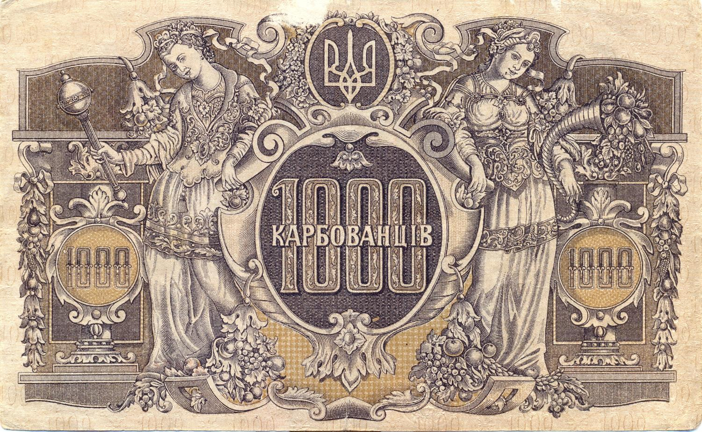

The Ukrainian Hryvnia (UAH) is the national currency of Ukraine, first introduced in 1996 following Ukraine's independence from the Soviet Union. It replaced the karbovanets and became an essential symbol of Ukrainian sovereignty and economic stability. The UAH is not only a medium for daily transactions but also plays a significant role in the broader Ukrainian economy. It serves as a tool for executing monetary policy and a benchmark for setting interest rates through the actions of the National Bank of Ukraine (NBU). Since its inception, the currency has undergone various changes, reflecting the economic landscape and political environment of the country.

The UAH's development has been marked by several challenges, notably economic turbulence and geopolitical tensions. Hyperinflation in the early years, political instability, and periodic recessions have influenced the currency's valuation and stability. Despite these challenges, the currency has remained a central feature of the nation's financial system.



The advent of algorithmic trading represents a crucial development in the foreign exchange markets, leveraging technology to automate trading strategies and optimize returns. Algorithmic trading employs complex algorithms to execute orders based on pre-defined criteria, often with high speed and frequency, which human traders cannot replicate. This method enhances the precision and consistency of trades, significantly impacting currency trading by increasing market efficiency, reducing transaction costs, and enhancing liquidity. By analyzing large datasets and reacting to market movements in real-time, algorithmic trading systems can capitalize on arbitrage opportunities and manage risk more effectively than traditional trading methods.

This article aims to explore the history of the Ukrainian Hryvnia and consider its role and implications within the context of algorithmic trading. By examining the currency's historical backdrop, current trends, and integration of algorithmic trading in forex markets, we seek to understand the evolving dynamics impacting the UAH and its significance in modern economic systems.

## Table of Contents

## The History of the Ukrainian Hryvnia (UAH)

The Ukrainian Hryvnia (UAH) was introduced as the national currency of Ukraine in September 1996, marking a significant milestone in the nation's monetary history. This change followed the dissolution of the Soviet Union in 1991, which had left Ukraine utilizing the Soviet ruble. The transition to a national currency was seen as a crucial step towards economic sovereignty.

Before the hryvnia, the currency used in Ukraine was the karbovanets, which had gone through several iterations. Initially, the karbovanets was a temporary solution that emerged with Ukraine's independence efforts, serving as a transitional coinage. However, the karbovanets was plagued by hyperinflation during the early 1990s, which severely diminished its value and highlighted the need for a stable currency.

The introduction of the hryvnia was part of an effort to stabilize Ukraine’s economy. The exchange rate at the time established 1 hryvnia as equivalent to 100,000 karbovanets, effectively resetting the economic environment. This transition was not without its challenges, as the early years of the hryvnia were marked by significant devaluation. Global economic pressures, internal economic instability, and hyperinflation continued to exert downward pressure on its value.

Several key events have historically influenced the stability of the hryvnia. For instance, the 1998 Russian financial crisis had a ripple effect on Ukraine, leading to severe devaluation. Over the years, Ukraine's ongoing economic reforms, geopolitical tensions, especially those involving Russia, and internal policy decisions have consistently impacted the hryvnia's value. These challenges necessitated monetary policy interventions by the National Bank of Ukraine aimed at stabilizing and strengthening the currency.

In its initial years, the hryvnia faced severe devaluation issues. A prime [factor](/wiki/factor-investing) contributing to this devaluation was the struggle to manage hyperinflation, which was rampant in the post-Soviet economic landscape of the 1990s. In response, the Ukrainian government and the National Bank of Ukraine took measures such as tightening monetary policies and seeking international assistance to stabilize the economy and build trust in the national currency.

The history of the Ukrainian hryvnia showcases a trajectory of resilience and adaptation amidst numerous adversities. It has played a central role in the nation's pursuit of economic independence and stability following its emergence in the aftermath of the Soviet Union's collapse. Despite the initial hurdles, the hryvnia continues to serve as a symbol of national identity and economic autonomy for Ukraine.

## Characteristics of the Ukrainian Hryvnia

The Ukrainian Hryvnia (UAH) plays a crucial role in the country's economy, facilitated by the National Bank of Ukraine (NBU). The NBU is responsible for issuing and maintaining the stability of the hryvnia. As the central bank, the NBU employs various monetary policies to ensure economic stability and manage inflation rates, which directly impacts the currency's value.

The current hryvnia banknotes and coins come in various denominations, designed to facilitate daily transactions. Banknotes are available in denominations of 1, 2, 5, 10, 20, 50, 100, 200, 500, and 1,000 hryvnias. Each banknote features significant Ukrainian historical figures and landmarks, reflecting the nation’s cultural heritage. The coins primarily exist in denominations of 1, 2, 5, 10, 25, 50 kopiyok, and 1 and 2 hryvnias.

The NBU has implemented several special monetary policies to maintain the hryvnia's stability. These include setting interest rates that influence inflation and [liquidity](/wiki/liquidity-risk-premium) in the economy, foreign exchange market interventions to stabilize the currency, and regulatory measures to ensure transparency and confidence in the financial system.

The use of UAH varies across different regions of Ukraine, with major cities like Kyiv and Lviv utilizing larger denominations for substantial commercial transactions, while smaller denominations are commonly used for everyday purchases throughout the country. Regional economic activities also influence the demand for certain denominations, with rural areas tending to rely more on cash transactions than urban centers.

Overall, the National Bank of Ukraine's careful management of the hryvnia, through issuing currency and implementing monetary policies, is essential to supporting the nation’s economy and ensuring the sustainable use of the UAH across various regions.

## Current State of the UAH in the Global Market

The Ukrainian Hryvnia (UAH) plays a key role in the global currency market, with its performance influenced by various economic factors. The exchange rate between the UAH and significant global currencies, like the US Dollar (USD), has witnessed several trends over recent years. Understanding these trends and the economic factors influencing the UAH is essential for currency traders and economic analysts.

### Relationship Between UAH and Other Global Currencies

The UAH's valuation is significantly affected by its relationship with stronger currencies, particularly the USD and the Euro (EUR). Historically, the UAH/USD exchange rate has experienced fluctuations driven by both domestic and international economic conditions. The National Bank of Ukraine (NBU) often intervenes in the foreign exchange market to stabilize the hryvnia, especially against major currencies like the USD.

### Recent Trends in the UAH/USD Exchange Rate

In recent years, the UAH/USD exchange rate has been subject to [volatility](/wiki/volatility-trading-strategies) due to various geopolitical and economic challenges. For example, the ongoing conflict in Eastern Ukraine and broader geopolitical tensions have exerted downward pressure on the UAH. In 2022, the UAH faced significant devaluation amid heightened geopolitical risks. However, following macroeconomic stabilization efforts, including fiscal consolidation and strategic interventions by the NBU, the hryvnia has seen periods of relative stability.

Python code to visualize hypothetical trends can be useful:

```python
import matplotlib.pyplot as plt
import numpy as np
import pandas as pd

# Sample data: hypothetical UAH/USD exchange rate trends
dates = pd.date_range(start='2020-01-01', end='2023-01-01', freq='M')
uah_usd_rate = np.random.normal(loc=27, scale=2, size=len(dates))  # Hypothetical rate

plt.figure(figsize=(10, 6))
plt.plot(dates, uah_usd_rate, label='UAH/USD Exchange Rate')
plt.xlabel('Date')
plt.ylabel('Exchange Rate')
plt.title('Trends in UAH/USD Exchange Rate')
plt.legend()
plt.grid(True)
plt.show()
```

### Economic Factors Influencing UAH Performance

Several key economic factors impact the performance of the UAH in global markets:

1. **Monetary Policy**: The NBU's policies, including interest rate decisions, directly affect the UAH's value. Higher interest rates tend to attract foreign capital, supporting the hryvnia, while lower rates may result in depreciation due to reduced investment incentives.

2. **Trade Balance**: Ukraine's trade balance—its exports versus imports—affects currency demand. A trade surplus generally strengthens the UAH, whereas a deficit can weaken it.

3. **Geopolitical Risks**: Political instability and regional conflicts, notably the tensions between Ukraine and Russia, can cause foreign investors to sell UAH, leading to depreciation.

4. **Foreign Direct Investment**: Higher levels of foreign investment into Ukraine can bolster the hryvnia by increasing foreign currency inflows.

5. **Global Economic Conditions**: Broader global economic trends, such as commodity prices and economic performance of trading partners, also influence the UAH. For instance, fluctuations in the price of key Ukrainian exports like grain and metals can impact the currency's valuation.

Overall, the current state of the UAH in the global market is shaped by a complex interplay of domestic monetary strategies, geopolitical contexts, and external economic conditions. As Ukraine continues to navigate these challenges, the future trajectory of the hryvnia will remain a focal point for both local policymakers and international investors.

## Algorithmic Trading in Currency Markets

Algorithmic trading refers to the use of computer algorithms to automate decision-making and trade execution in financial markets. In the context of foreign exchange ([forex](/wiki/forex-system)) markets, [algorithmic trading](/wiki/algorithmic-trading) enables traders to execute orders at speeds and frequencies impossible for human traders. This method uses mathematical models and complex algorithms to make trade decisions based on preset criteria, such as timing, price, or quantity. 

Algorithmic trading in forex markets offers several critical advantages. Firstly, it enhances trading efficiency by allowing for quicker trade execution with minimal human intervention. Algorithms can process vast amounts of data and implement trades that can exploit fleeting opportunities in the market. This speed is crucial in forex markets, where exchange rates can change rapidly.

Moreover, algorithmic trading reduces manual errors associated with human trading and helps in executing large trade volumes with reduced market impact. The use of algorithms can also facilitate high-frequency trading ([HFT](/wiki/high-frequency-trading-strategies)), where a large number of orders are executed within microseconds, aiming to profit from small price fluctuations.

However, algorithmic trading also presents challenges. The complexity of algorithms requires significant technological expertise and robust risk management strategies. Market anomalies or unexpected events can lead to unintended consequences, such as flash crashes, where prices experience a rapid decline followed by a swift recovery. Furthermore, the reliance on technology can make markets more susceptible to systemic risks associated with software failures or cyber-attacks.

On the opportunity side, algorithmic trading allows for the development of sophisticated trading strategies that incorporate real-time data analysis and [machine learning](/wiki/machine-learning). Traders can backtest their strategies against historical data to evaluate their potential effectiveness before deploying them in live markets. This has opened new avenues for innovation in trading and has broadened access to trading strategies that may previously have been the domain of large financial institutions. 

In conclusion, algorithmic trading plays a critical role in modern forex markets, significantly enhancing trading efficiency while posing both challenges and opportunities. As technology continues to advance, the influence of algorithmic trading in these markets is expected to grow, offering new capabilities and requiring continuous adaptation from traders.

## Implications of Algorithmic Trading for the UAH

Algorithmic trading, which employs complex mathematical models and algorithms to make swift trading decisions, significantly impacts the volatility and liquidity of the Ukrainian Hryvnia (UAH). The automation of trading processes enhances market efficiency by ensuring quicker responses to market events. This can lead to increased market liquidity, making it easier to execute large transactions without affecting the asset's price significantly. However, this high-speed trading can also contribute to increased volatility, especially if the algorithms are designed to capitalize on short-term price fluctuations.

The adoption of algorithmic trading has introduced both opportunities and challenges to the UAH market. On one hand, improved liquidity can help stabilize the UAH by reducing the bid-ask spreads, making the currency more attractive to both local and foreign investors. On the other hand, the potential for rapid and significant price changes may present risks, particularly if market participants lack access to the necessary technology to manage these dynamic trading environments.

In practice, algorithmic trading strategies involving the UAH often include market-making, [arbitrage](/wiki/arbitrage), and trend-following strategies. Market-making algorithms provide liquidity by continuously quoting buy and sell prices and profiting from the bid-ask spread. Arbitrage strategies exploit price discrepancies across different markets or between related currency pairs, such as between the UAH and neighboring Eastern European currencies. Trend-following strategies focus on identifying and exploiting longer-term price patterns or trends, which can be particularly useful in volatile markets.

For instance, historical data analysis using algorithmic trading might reveal certain patterns in the UAH-USD exchange rate, leading traders to design algorithms that either capitalize on or hedge against these trends. A Python script implementing a simple moving average crossover strategy, a common algorithmic trading approach, might look like this:

```python
import pandas as pd

# Load UAH-USD historical exchange rate data
data = pd.read_csv('uah_usd_exchange_rate.csv')

# Calculate short-term and long-term moving averages
data['short_ma'] = data['close'].rolling(window=10).mean()
data['long_ma'] = data['close'].rolling(window=50).mean()

# Generate buy/sell signals
data['signal'] = 0
data.loc[data['short_ma'] > data['long_ma'], 'signal'] = 1
data.loc[data['short_ma'] < data['long_ma'], 'signal'] = -1

# View signals
print(data[['close', 'short_ma', 'long_ma', 'signal']])
```

Such strategies, when combined with high-frequency trading capabilities, can improve the efficiency of the UAH market. However, their success heavily depends on accurate data modeling and execution speeds, balancing the act of exploiting trading opportunities without exacerbating volatility.

Looking ahead, the future of the UAH in algorithmic trading will likely be influenced by technological advancements and regulatory policies. As computing power and algorithm sophistication increase, traders will be able to develop more refined strategies that might mitigate some of the existing challenges. Moreover, regulatory frameworks will play a critical role in ensuring that the growth of algorithmic trading aligns with broader financial stability and market fairness objectives, striking a balance between technological innovation and the unique characteristics of the UAH market.

In conclusion, algorithmic trading's interplay with the UAH presents a complex but promising landscape, where technology's role in shaping financial markets is both profound and transformative. Understanding these dynamics will be crucial for stakeholders aiming to harness these developments while safeguarding the currency's stability.

## Conclusion

The Ukrainian Hryvnia (UAH) has undergone a remarkable evolution since its introduction in 1996, navigating through various economic challenges to establish itself in the global currency markets. As the national currency, the UAH has been pivotal in shaping Ukraine's economic landscape, undergoing significant fluctuations due to historical events and market dynamics. Despite these challenges, recent efforts by the National Bank of Ukraine and governmental policies have aimed at stabilizing the currency and integrating it more deeply into the global economy.

Algorithmic trading has emerged as a transformative force in the world of currency trading, offering new opportunities for efficiency and precision in foreign exchange markets. The incorporation of algorithmic strategies in trading UAH has the potential to enhance market liquidity and reduce transaction costs. However, it also introduces complexities such as increased volatility, which warrants careful consideration by market participants and regulators alike.

The future potential of the UAH in global markets may hinge on several factors, including political stability, economic reforms, and technological innovations in trading. As Ukraine continues to modernize its financial infrastructure and adopt supportive economic policies, the UAH could gain greater prominence and stability in international markets. This interplay between Ukrainian economic policies and advances in algorithmic trading technology is poised to shape the trajectory of the UAH, potentially leading to a more robust and resilient currency in the future. 

In summary, while the UAH has faced significant historical challenges, its continued development within algorithmic trading frameworks may offer promising prospects. This intersection of national economic strategy and technological advancement underscores the importance of cohesive policy implementation in realizing the potential benefits of such a dynamic financial environment.

## References & Further Reading

[1]: Fisher, S. (1998). ["The Russian Financial Crisis and Its Impact on Ukraine."](https://openknowledge.worldbank.org/bitstream/handle/10986/3797/WPS5312.pdf?sequence=1) International Affairs, 74(3), 509-530.

[2]: Zhang, M. Y., Hu, Y.-H. & Liu, B. (2020). ["Introduction to Algorithmic Trading Strategies and Practice: With Case Studies Using Python."](https://pubmed.ncbi.nlm.nih.gov/32152561/) Springer Publishing.

[3]: Lopez de Prado, M. (2018). ["Advances in Financial Machine Learning."](https://www.amazon.com/Advances-Financial-Machine-Learning-Marcos/dp/1119482089) Wiley.

[4]: Aronson, D. R. (2006). ["Evidence-Based Technical Analysis: Applying the Scientific Method and Statistical Inference to Trading Signals."](https://www.amazon.com/Evidence-Based-Technical-Analysis-Scientific-Statistical/dp/0470008741) Wiley.

[5]: Jansen, S. (2020). ["Machine Learning for Algorithmic Trading: Predictive Models to Extract Signals from Market and Alternative Data for Systematic Trading Strategies with Python."](https://www.amazon.com/Machine-Learning-Algorithmic-Trading-alternative/dp/1839217715) Packt Publishing.

[6]: Chan, E. P. (2008). ["Quantitative Trading: How to Build Your Own Algorithmic Trading Business."](https://github.com/ftvision/quant_trading_echan_book) Wiley.