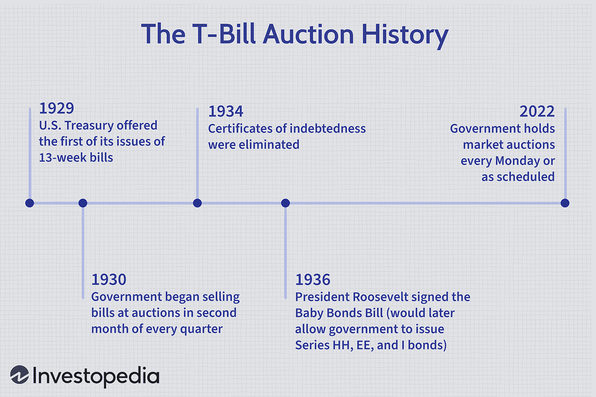

## Table of Contents

## What is a Treasury bill?

A Treasury bill, often called a T-bill, is a short-term debt instrument issued by the U.S. government. It's a way for the government to borrow money from investors for a short period, usually from a few days up to one year. When you buy a T-bill, you're lending money to the government, and in return, the government promises to pay you back the full amount when the T-bill matures, plus a bit of interest.

T-bills are considered very safe investments because they are backed by the full faith and credit of the U.S. government. This means there's very little risk that the government won't pay you back. They are also popular because they are easy to buy and sell. Investors often use T-bills to park their money temporarily or to diversify their investment portfolios.

## How did Treasury bill auctions originate?

Treasury bill auctions started a long time ago, back in the late 1920s. The U.S. government needed a way to borrow money to help with its expenses, especially during tough economic times. So, they came up with the idea of selling short-term securities, which they called Treasury bills. The first auction happened in 1929, and it was a way for the government to get money quickly from investors who were willing to lend it to them.

Over time, the way these auctions work has changed a bit, but the main idea has stayed the same. The government still uses these auctions to sell T-bills to investors. People bid on how much they are willing to pay for the T-bills, and the government picks the highest bids until they've sold all the T-bills they want to sell. This system helps the government manage its money and gives investors a safe place to put their money for a short time.

## What is the purpose of a Treasury bill auction?

The main purpose of a Treasury bill auction is to help the U.S. government borrow money. When the government needs cash to pay for things like building roads or helping people, it can sell Treasury bills to investors. These investors lend money to the government by buying the T-bills, and the government promises to pay them back with a little bit of interest when the T-bills mature.

Auctions are a fair way to decide who gets to buy the T-bills. Investors tell the government how much they are willing to pay, and the government picks the highest bids until all the T-bills are sold. This system makes sure that the government gets the money it needs, and investors have a safe place to put their money for a short time.

## How have Treasury bill auction processes evolved over time?

Treasury bill auction processes have changed a lot since they started in 1929. At first, auctions were simple and not many people knew about them. The government would announce they were selling T-bills, and investors would send in their bids by mail or in person. It was all done by hand, which took a lot of time and effort. But as more people learned about T-bills and wanted to invest, the government needed to make the process faster and easier.

Over the years, technology has made a big difference. Now, auctions are done online, which means investors can bid from anywhere in the world. The government uses computers to handle all the bids quickly and fairly. They also changed how they decide who wins the bids. Instead of just [picking](/wiki/asset-class-picking) the highest bids, they use a mix of bids to make sure everyone gets a fair chance. This helps keep the process smooth and lets more people invest in T-bills.

## What are the different types of Treasury bill auctions?

There are two main types of Treasury bill auctions: competitive and non-competitive. In a competitive auction, big investors like banks and investment firms bid on how much they are willing to pay for T-bills. They tell the government the [interest rate](/wiki/interest-rate-trading-strategies) they want, and the government picks the bids with the lowest interest rates until all the T-bills are sold. This way, the government can borrow money at the lowest cost possible.

In a non-competitive auction, regular people and smaller investors can buy T-bills without bidding. They just tell the government how much they want to invest, and they get the T-bills at the average interest rate from the competitive auction. This makes it easy for anyone to invest in T-bills, no matter how much money they have. Both types of auctions help the government raise money and give investors a safe place to put their cash.

## How does the bidding process work in a Treasury bill auction?

In a Treasury bill auction, there are two ways people can bid: competitively and non-competitively. In a competitive bid, big investors like banks and investment firms tell the government how much they are willing to pay for the T-bills. They do this by saying what interest rate they want. The government then looks at all the bids and picks the ones with the lowest interest rates first, until all the T-bills are sold. This way, the government can borrow money at the cheapest rate possible.

In a non-competitive bid, regular people and smaller investors can buy T-bills without bidding on the interest rate. They just tell the government how much money they want to invest, and they get the T-bills at the average interest rate from the competitive bids. This makes it easy for anyone to invest in T-bills, no matter how much money they have. Both types of bidding help the government raise money and give investors a safe place to put their cash.

## What are the key historical milestones in the development of Treasury bill auctions?

Treasury bill auctions started in 1929 when the U.S. government needed a way to borrow money quickly. Back then, the process was simple and manual. Investors would send their bids by mail or in person, and the government would sort through them to decide who got the T-bills. This worked okay at first, but as more people wanted to invest, the government had to find a better way to handle all the bids.

Over time, technology helped make Treasury bill auctions easier and faster. By the late 20th century, auctions moved online, allowing investors from all over the world to bid. The government also changed how they picked winning bids. Instead of just choosing the highest bids, they started using a mix of bids to make the process fair for everyone. These changes have made Treasury bill auctions a smooth and efficient way for the government to borrow money and for investors to safely invest their cash.

## How have changes in Treasury bill auction methods impacted the economy?

Changes in Treasury bill auction methods have made a big difference to the economy. When the government first started selling T-bills in 1929, it was a slow process done by hand. This meant it was hard for the government to borrow money quickly, and not many people could invest. But as the auction methods got better with technology, the government could borrow money faster and more people could join in. This helped the government manage its money better and made it easier for them to pay for important things like roads and schools.

The move to online auctions and the use of competitive and non-competitive bidding also helped the economy. Now, big investors and regular people can both buy T-bills easily. This means more money can flow into the economy because more people are investing. Also, the government can borrow at lower interest rates because of the competitive bidding, which saves them money. All these changes have made the economy stronger and more stable.

## What role do Treasury bill auctions play in government debt management?

Treasury bill auctions are a big part of how the government manages its debt. When the government needs money, it can sell T-bills to people and companies who want to invest. This is like borrowing money, but it's quick and easy because of the auctions. The government can get the money it needs without having to wait, which helps them pay for things like building schools or fixing roads. By selling T-bills, the government can also keep its debt under control because they know exactly how much money they will get and when they have to pay it back.

The auctions also help the government borrow at the best possible rates. In a competitive auction, big investors bid on how much they're willing to pay for the T-bills. The government picks the bids with the lowest interest rates, which means they don't have to pay as much to borrow the money. This saves the government money and helps them manage their debt better. Plus, with non-competitive auctions, regular people can also invest, which means more money can come into the government's hands to help with their spending needs.

## How do Treasury bill auctions affect interest rates and monetary policy?

Treasury bill auctions can change interest rates because they show what investors think about the economy. When lots of people want to buy T-bills, they might be willing to accept lower interest rates. This means the government can borrow money cheaper. But if fewer people want to buy T-bills, the government might have to offer higher interest rates to get people to lend them money. These changes in interest rates can affect other parts of the economy, like how much it costs for people to borrow money for things like houses or cars.

The Federal Reserve, which controls monetary policy, watches Treasury bill auctions closely. If they see that interest rates on T-bills are going up, they might decide to do things to bring those rates down, like buying more T-bills themselves or changing other interest rates they control. On the other hand, if T-bill rates are too low, the Fed might want to raise them to keep the economy from growing too fast. By keeping an eye on T-bill auctions, the Fed can help keep the economy stable and make sure people can borrow and lend money at fair rates.

## What are some notable case studies or examples of significant Treasury bill auctions?

One important Treasury bill auction happened in May 1987. This auction was special because it showed how worried people were about the economy. Back then, the U.S. was dealing with a lot of debt, and investors were not sure if they wanted to lend more money to the government. So, during the auction, the interest rates on the T-bills went up a lot. This made the government have to pay more to borrow money. It was a big deal because it showed that people's trust in the economy could change how much it costs the government to borrow.

Another big moment was in 2008, during the financial crisis. The government needed to borrow a lot of money to help fix the economy. One of the biggest T-bill auctions happened in November 2008, where the government sold a huge amount of T-bills. But, because everyone was so worried about the economy, the interest rates on these T-bills were very low. People were happy to lend money to the government because they thought it was one of the safest places to put their money during such a scary time. This auction showed how T-bills can help calm down the economy when things get tough.

## What are the current trends and future predictions for Treasury bill auctions?

Right now, Treasury bill auctions are very popular because people and companies want safe places to put their money. With all the ups and downs in the economy, T-bills are seen as a good choice because they are backed by the U.S. government. This means there's almost no chance the government won't pay back the money. Also, with interest rates going up and down, investors watch T-bill auctions closely to see what's happening with the economy. The government keeps using these auctions to borrow money to pay for important things like roads and schools.

In the future, Treasury bill auctions might get even more important. As the government needs more money to pay for things, they might sell more T-bills. This could mean more auctions happening more often. Technology will probably keep making these auctions easier and faster, so even more people from around the world can join in. The Federal Reserve will keep an eye on these auctions to help make sure the economy stays stable. If the economy keeps changing a lot, T-bill auctions will be a big part of how the government and investors deal with those changes.

## What is the future of T-Bill auctions and algorithmic trading?

Advancements in technology are poised to significantly shape the future of Treasury Bill (T-Bill) auctions and [algorithmic trading](/wiki/algorithmic-trading). As technology evolves, it is anticipated that T-Bill auctions will become more efficient, transparent, and accessible, benefiting both investors and government entities.

The integration of [artificial intelligence](/wiki/ai-artificial-intelligence) (AI) and [machine learning](/wiki/machine-learning) into algorithmic trading presents substantial potential impacts on T-Bill markets. These technologies enable sophisticated data analysis and predictive modeling, which can enhance decision-making processes. Machine learning algorithms can be used to identify patterns in historical auction data, optimize bidding strategies, and manage risk more effectively. For example, regression algorithms and neural networks could predict auction outcomes or forecast yield changes based on macroeconomic indicators. The formula for a basic linear regression model, which could be applied in this context, is as follows:

$$
Y = \beta_0 + \beta_1 X_1 + \beta_2 X_2 + \cdots + \beta_n X_n + \epsilon
$$

where $Y$ represents the dependent variable (e.g., yield), $X$ are the independent variables (features), $\beta$ are the coefficients, and $\epsilon$ is the error term.

While these technological advancements offer considerable benefits, they also bring regulatory challenges. Regulators may need to update existing policies or introduce new frameworks to manage the complexities and risks associated with automated trading systems. This includes ensuring market fairness, transparency, and stability, as well as preventing market manipulation or systemic risks that could arise from high-frequency trading practices.

For investors, a more automated T-Bill trading environment presents several opportunities. Automation can lower transaction costs, improve market access, and allow for real-time analysis and execution of trades. Moreover, investors can diversify their portfolios and hedge against risks more efficiently using algorithms optimized for T-Bill markets.

To prepare for these changes, investors should focus on enhancing their literacy in financial technologies and understanding the implications of AI and machine learning on their investment strategies. Engaging with financial advisors who are knowledgeable about these technologies or utilizing advanced trading platforms that incorporate AI tools could be beneficial. Investors might consider adopting a proactive approach by participating in educational workshops or courses on algorithmic trading and related technologies.

Overall, the future of T-Bill auctions and algorithmic trading is promising, driven by technological advancements that offer improved efficiency and opportunities across the financial market. Staying informed and adaptable will be crucial for investors looking to capitalize on these developments.

## References & Further Reading

[1]: Duffie, D. (1996). ["Auction Theory for Treasury Securities"](https://www.semanticscholar.org/paper/A-YIELD-FACTOR-MODEL-OF-INTEREST-RATES-Duffie-Kan/728dbc73cf3e29f55fb9f19594ce75755b14eb37). Journal of Economic Perspectives.

[2]: Fleming, M. J. (2007). ["Who Buys Treasury Securities at Auction?"](https://www.newyorkfed.org/research/current_issues/ci13-1.html). Current Issues in Economics and Finance.

[3]: Hendershott, T., & Riordan, R. (2013). ["Algorithmic Trading and Information"](https://faculty.haas.berkeley.edu/hender/ATInformation.pdf). Journal of Finance.

[4]: ["The Central Bank Balance Sheet as an Instrument of Monetary Policy"](https://www.nber.org/papers/w16208) by Michael Woodford.

[5]: Jagadeesh, N., & Titman, S. (1993). ["Returns to Buying Winners and Selling Losers: Implications for Stock Market Efficiency"](https://www.bauer.uh.edu/rsusmel/phd/jegadeesh-titman93.pdf). Journal of Finance.

[6]: Thaler, R., & Sunstein, C. (2009). ["Nudge: Improving Decisions about Health, Wealth, and Happiness"](https://www.researchgate.net/publication/257178709_Nudge_Improving_Decisions_About_Health_Wealth_and_Happiness_RH_Thaler_CR_Sunstein_Yale_University_Press_New_Haven_2008_293_pp). Penguin Books.