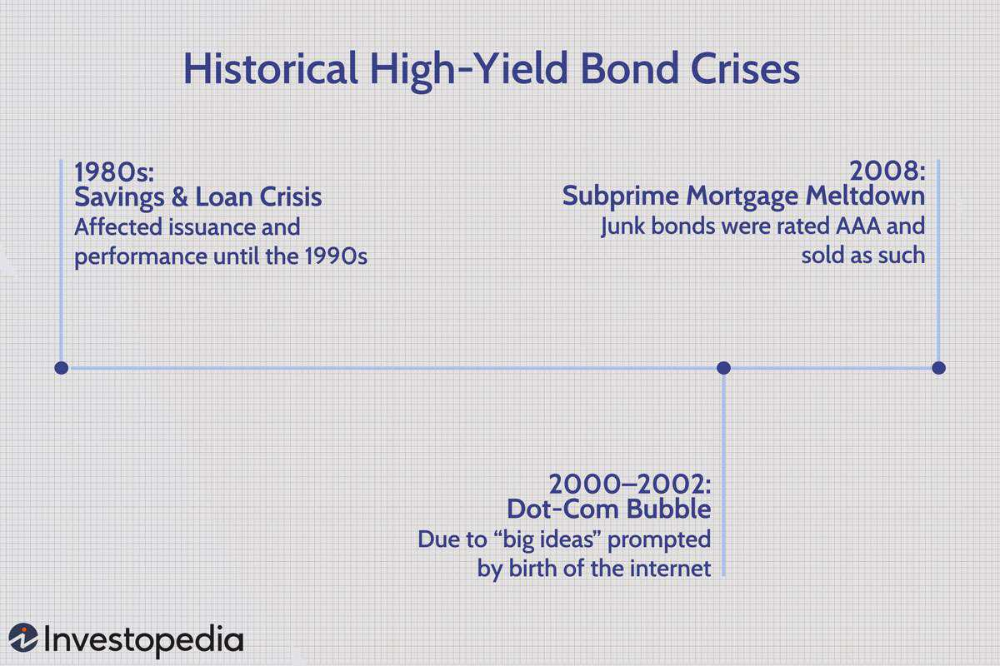

High-yield bonds, commonly referred to as junk bonds, are a pivotal component of the U.S. bond market, predominantly characterized by their offering of higher returns in exchange for taking on increased risks. These bonds are essentially issued by companies that possess lower credit ratings, posing a greater risk of default. However, that increased risk can translate into substantial returns for investors willing to embrace it.

The trajectory and historical development of high-yield bonds within the United States provide essential insights into their present status and potential future trends. During the late 20th century, particularly in the 1970s and 1980s, these bonds began to gain prominence. Initially associated with "fallen-angel" companies—those whose credit ratings had been downgraded—high-yield bonds soon became critical financing tools for leveraged buyouts and other high-stakes corporate ventures. Their journey through various economic conditions, including recessions and financial crises, has underscored their volatility but also signaled their longevity and importance in corporate finance (Altman, E. I., & Hotchkiss, E., 2006. *"Corporate Financial Distress and Bankruptcy"*).

In recent years, algorithmic trading has started to make a significant impact on the bond markets, altering traditional trading and investment methodologies. This form of trading employs computer algorithms to automate decision-making processes, enabling rapid transaction execution and sophisticated trading strategies. Although originally dominating the equity markets, these computerized trading strategies are increasingly permeating the bond landscape, including the high-yield sector.

This article endeavors to explore the historical evolution of high-yield bonds in the U.S., assess the transformative influence of algorithmic trading on these financial instruments, and evaluate their longstanding significance in contemporary markets. Through understanding these dynamics, investors can better navigate the evolving landscape of high-yield bonds and leverage algorithmic tools for optimized trading strategies.

## Table of Contents

## Historical Context of High-Yield Bonds

High-yield bonds, commonly known as junk bonds, became prominent financial instruments starting in the 1970s and 1980s. Initially, these bonds were associated with "fallen-angel" companies, firms that once had investment-grade status but had since experienced downgrades. The period also saw a rise in leveraged buyouts (LBOs), where high-yield bonds were often used to finance corporate takeovers. This era marked a significant change in the U.S. financial landscape as companies that would have otherwise struggled to secure traditional forms of financing found opportunities through this burgeoning market.

The initial growth of the high-yield bond market was largely fueled by shifting credit standards and an increased acceptance of riskier investments among investors. With the relaxation of the Glass-Steagall Act and the evolving risk appetite of financial institutions, investors began to pursue higher returns, acknowledging—but also accepting—the elevated risk associated with these bonds. This period saw banking deregulation, and riskier lending practices were widely adopted.

Various financial upheavals underscored the [volatility](/wiki/volatility-trading-strategies) and inherent risks of high-yield bonds over subsequent decades. The Savings & Loan Crisis of the late 1980s exemplified the dangers of lax regulatory frameworks and risky financial products, including high-yield bonds. The collapse of technology stocks in the Dot-Com Bubble during the late 1990s and early 2000s further highlighted their risk-laden nature. Similarly, the Subprime Mortgage Meltdown in 2007-2008 exposed vulnerabilities across financial markets, including those involving high-yield bonds, as asset-backed securities and other risky investments led to significant financial losses.

Despite these setbacks, high-yield bonds continue to represent a substantial portion of the U.S. corporate bond market. They provide a crucial avenue for companies with lower credit ratings to access capital markets, contributing to business growth and job creation. As of recent years, high-yield bonds remain attractive to investors seeking greater returns in exchange for assuming increased credit risk. Such dynamics underline the enduring significance of high-yield bonds within the U.S. financial system, resilient in the face of past crises and poised to attract investor interest well into the future.

## The Role of Algorithmic Trading in the Bond Market

Algorithmic trading, traditionally associated with equity markets, is increasingly permeating the bond market, a trend that now encompasses high-yield bonds. This shift is facilitated by innovations in trading technology and growing demand for efficiency and precision in executing transactions. As [algorithmic trading](/wiki/algorithmic-trading) becomes more prevalent in bonds, several factors and challenges distinct to these markets emerge, necessitating adaptation and strategic development.

One salient challenge algorithmic trading encounters in bond markets is the distinguishing characteristics of bonds compared to stocks. Bonds, especially high-yield ones, exhibit significant idiosyncrasies due to their diverse maturities, coupon structures, and credit ratings, which complicate the development of standardized trading algorithms. Unlike stocks, which are typically more uniform and liquid, bonds often suffer from [liquidity](/wiki/liquidity-risk-premium) issues. Many bonds trade infrequently, which can impede the application of traditional stock-trading algorithms that rely on consistent price data and market depth.

However, the advent of Exchange-Traded Funds (ETFs) has substantially improved bond market liquidity. Bond ETFs aggregate various bonds into a single traded instrument, enhancing liquidity by enabling more straightforward buying and selling processes. This improvement makes the bond market more conducive to algorithmic strategies, as the aggregation facilitates greater market depth and narrower bid-ask spreads, providing algorithms with better execution opportunities.

Moreover, the rise of algorithmic trading in bonds is marked by the automation of responses to Requests for Quotes (RFQs). In traditional bond trading, RFQs are a mechanism where a buyer solicits price quotes from multiple dealers to obtain the best price. Automation of this process through algorithms reduces latency, increases execution speed, and enhances transaction efficiency. This automation can lead to more dynamic pricing and a more competitive market environment, benefiting both dealers and investors.

Overall, algorithmic trading's integration into the bond market reflects ongoing technological advancements that promise to reshape the landscape. As these tools become more sophisticated, they will continue to increase efficiency, improve price discovery, and facilitate greater market participation. The bond market stands on the cusp of significant transformation, driven by a convergence of algorithmic trading capabilities and evolving market structures.

## Advantages and Challenges of Algo Trading in Bonds

Algorithmic trading in the bond market offers several advantages, primarily centered around increased speed and efficiency. These systems can execute trades much faster than human traders, significantly reducing the time latency associated with manual processes. The use of algorithms also allows for more precise pricing strategies, leveraging real-time data analysis to optimize trade execution and reduce the risk of human error. 

Despite these advantages, liquidity poses a significant challenge for algorithmic trading in bonds. Unlike stocks, bonds often exhibit lower liquidity due to their diverse and fragmented nature. Each bond issuance can have different characteristics, making them less interchangeable compared to equities. This variability leads to challenges in price discovery and trade completion, particularly for less frequently traded bonds.

Another significant benefit of algorithmic trading in bonds is the capacity for automation within trading workflows. Automation can streamline processes such as data modeling, portfolio allocation, and risk management. By automating these tasks, firms can reduce operational costs and improve accuracy in managing bond portfolios. This technological integration allows for more dynamic adjustments in investment strategies based on real-time market information.

The launch of platforms like ICE Bonds exemplifies the digital transformation occurring in bond trading. Such platforms facilitate electronic trading, offering tools that enhance transparency and efficiency in the bond market. These developments represent a shift towards a more integrated trading environment where technology plays a crucial role in driving market advancements.

In summary, while algorithmic trading brings notable advantages to bond trading, it also faces challenges, particularly related to liquidity and the complexity of the bond market. Balancing these factors is essential for leveraging the full potential of algorithmic systems in enhancing bond market operations.

## The Future of High-Yield Bonds and Algorithmic Trading

High-yield bonds, commonly known as junk bonds, will likely maintain their appeal among investors who are drawn to their potential for higher returns within a diversified investment portfolio. These bonds represent a more attractive option for those willing to embrace a higher risk to achieve significant gains. The higher yields offered by these bonds serve as compensation for the increased risk of default compared to investment-grade bonds. 

The advancement of algorithmic trading stands to further transform the high-yield bond market. Algorithms have the potential to democratize access to this segment of the bond market, providing broader participation opportunities for various types of investors. By automating trading processes, algorithmic platforms can also enhance transparency, offering investors more immediate and comprehensive insights into pricing and market movements.

Technological progress continues to reshape the methods by which bonds are traded, monitored, and valued. With developments in data analytics, [machine learning](/wiki/machine-learning), and blockchain technology, the bond market is undergoing significant change. Data synthesis, processing, and real-time analysis allow for more informed decision-making and improved liquidity, particularly beneficial for high-yield bonds characterized by their volatility.

As the influence of automation and data-driven decision-making grows, investors and financial institutions must adapt to the evolving landscape of the high-yield bond market. This adaptation will require embracing cutting-edge technologies, such as [artificial intelligence](/wiki/ai-artificial-intelligence), to optimize trading strategies and risk management practices. Companies that integrate these innovations into financial services can maintain a competitive edge and harness the benefits of increased efficiency and agility.

The integration of traditional trading practices and modern technological innovations will likely define the future landscape of the high-yield bond market. Investors who strategically leverage technology while remaining mindful of inherent risks will be better equipped to navigate potential challenges and capitalize on emerging opportunities. Understanding these dynamics is crucial for staying ahead in an increasingly complex and fast-paced financial environment.

## Conclusion

High-yield bonds remain an integral part of the U.S. bond market, shaped by both historical developments and modern innovations. These bonds, often categorized as riskier due to their lower credit ratings, continue to attract investors seeking higher yields in exchange for increased risk. Their evolution over the decades reflects a series of economic shifts and financial crises, highlighting their pivotal role within the corporate finance landscape. The high-yield bond market has demonstrated resilience, adapting to regulatory changes and market dynamics, and continues to provide liquidity and capital to companies with diverse credit profiles.

Algorithmic trading is increasingly influencing the contemporary bond market environment, offering both opportunities and challenges to market participants. On the one hand, it enhances speed and efficiency, providing precise execution that minimizes human error and enables high-frequency trading. Algorithmic trading systems leverage sophisticated algorithms to analyze vast datasets, optimize trade execution, and offer pricing insights, thereby acting as catalysts for market efficiency. However, the transition to algorithmic methods necessitates an adaptation to cutting-edge technologies and sophisticated analytical tools. Mastery over AI-driven analytics and machine learning models becomes crucial for participants aiming to gain a competitive edge.

Understanding the dynamics of high-yield bonds and the implications of algorithmic trading is indispensable for investors charting the evolving bond market landscape. Insights into factors such as default risk, [interest rate](/wiki/interest-rate-trading-strategies) changes, and macroeconomic trends allow investors to manage portfolios effectively and anticipate market shifts. Moreover, decoding the interplay between traditional methods and algorithmic systems provides advantages in strategic decision-making under varying market conditions.

As technology advances, the fusion of traditional trading techniques with contemporary, data-driven methods may define the future landscape of high-yield bonds. Innovations such as blockchain for transaction transparency or AI-driven predictive models for credit assessment may further integrate into bond trading practices. The expertise to adapt to these advancements, combined with a robust understanding of historical market trends, will empower investors and institutions to leverage the full potential of high-yield bonds in their investment strategies.

## References & Further Reading

[1]: Altman, E. I., & Hotchkiss, E. (2006). ["Corporate Financial Distress and Bankruptcy"](https://onlinelibrary.wiley.com/doi/book/10.1002/9781118267806). Wiley.

[2]: Lowenstein, R. (2000). ["When Genius Failed: The Rise and Fall of Long-Term Capital Management"](https://en.wikipedia.org/wiki/When_Genius_Failed). Random House.

[3]: ["Junk Bonds: A Guide to Aggressive, High-Yield Investing"](https://www.amazon.com/Junk-Bonds-Aggressive-High-Yield-Investing/dp/0070217661) by Glenn Yago

[4]: López de Prado, M. (2018). ["Advances in Financial Machine Learning"](https://www.amazon.com/Advances-Financial-Machine-Learning-Marcos/dp/1119482089). Wiley.

[5]: Fabozzi, F. J. (2012). ["Bond Markets, Analysis, and Strategies"](https://books.google.com/books/about/Bond_Markets_Analysis_and_Strategies_ten.html?id=bQpNEAAAQBAJ). Pearson.

[6]: ["The Handbook of Mortgage-Backed Securities"](https://academic.oup.com/book/7943) by Frank J. Fabozzi

[7]: O'Hara, M. (1995). ["Market Microstructure Theory"](https://www.wiley.com/en-us/Market+Microstructure+Theory-p-9780631207610). Wiley.