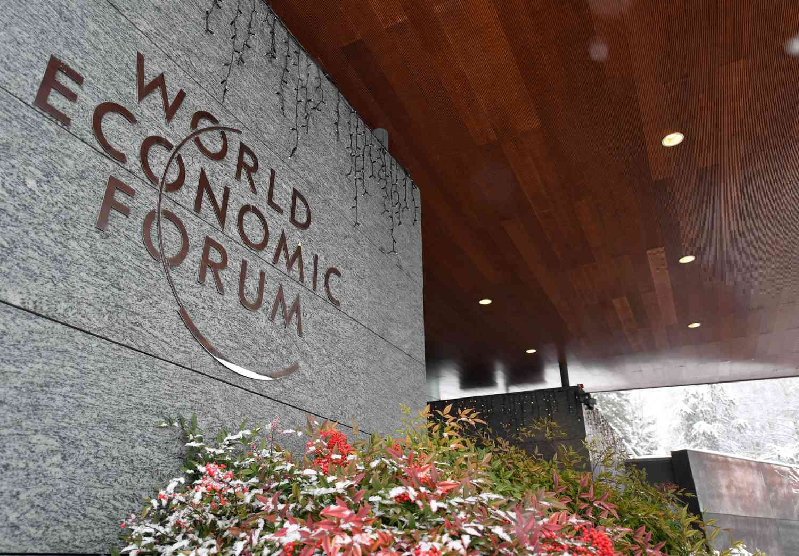

The World Economic Forum (WEF) stands out as a preeminent platform for the discourse of global economic and social issues. Established in 1971, the WEF is synonymous with its renowned annual meeting held in Davos, Switzerland. These gatherings serve as a nexus for influential leaders and decision-makers globally, driving them to converge for pivotal discussions on worldwide matters.

Founded with the purpose of fostering a more cooperative global environment, the WEF's mission extends beyond economic considerations to include urgent global challenges. Through its events, the organization seeks to influence positive change by promoting dialogue and collaboration among diverse stakeholders. It addresses not only economic growth but also a wide range of issues, including environmental sustainability and social equity.



The exploration of modern technological advancements, particularly algorithmic trading, adds another layer to the WEF’s discussions. This aspect highlights the organization's commitment to addressing contemporary challenges by understanding the implications of technology on the global economy. The annual meetings at Davos reflect these broader concerns, providing a critical platform for examining how such innovations can be harnessed to benefit society as a whole.

By bringing together leaders from various sectors, the WEF plays a crucial role in shaping the narrative on how to tackle global issues. It attempts to integrate perspectives across industries, ensuring that solutions are sustainable and encompass a broad range of interests. As a result, the WEF's ongoing dialogue aims to forge pathways toward a more interconnected and mutually beneficial global community.

## Table of Contents

## The Origins and Mission of the World Economic Forum

The World Economic Forum (WEF) was established in 1971 by Klaus Schwab, a German economist and engineer. Initially conceived as the European Management Forum, the organization was founded to bring together European business leaders to discuss best practices in management. The philosophy behind the foundation of the WEF was rooted in the concept of stakeholder capitalism, which Schwab introduced as a means for companies to address the interests of all their stakeholders, including employees, customers, and the broader community, rather than focusing solely on shareholders.

In 1987, the European Management Forum was renamed the World Economic Forum to better reflect its expanding influence and participation beyond Europe. As a location, Geneva, Switzerland, serves as the headquarters for the WEF due to its reputation as a hub for international organizations and diplomacy. The strategic positioning enables the WEF to unite global leaders under a neutral roof, facilitating dialogue and the sharing of ideas among industry, government, and civil society.

The mission of the WEF is succinctly captured in its slogan: "Committed to improving the state of the world." This mission underscores an ambitious scope, as the organization aims to address not only economic concerns but also social issues, environmental sustainability, and cultural understanding. By engaging leaders across various sectors, the WEF seeks to shape global, regional, and industry agendas through collaborative partnerships.

Operating as a non-profit foundation, the WEF is primarily funded by its member organizations, which are typically global enterprises with a leading role in shaping their respective industries. This funding structure enables the WEF to function as an impartial platform for dialogue and collaboration. While it does not possess direct decision-making authority, the organization serves as a space for influential conversations that can guide policy and business strategies globally. The WEF's approach ensures a comprehensive discussion on numerous facets of pressing global challenges, bolstering cooperation and shared understanding among a diverse array of stakeholders.

## Key Milestones in WEF History

The World Economic Forum (WEF) has been instrumental in influencing a variety of pivotal historical events and discussions, primarily in areas of peace, economic development, and sustainability. A landmark moment in the history of the WEF occurred in 1992 when Nelson Mandela and F.W. de Klerk met at the forum. This meeting was a crucial step towards the dismantling of apartheid in South Africa, exemplifying the forum's capacity to foster dialogues that lead to significant political and social change.

In another instance of the WEF's historic influence, West German Foreign Minister Hans-Dietrich Genscher made a notable appeal in 1987 at the forum, advocating for increased engagement with the Soviet Union. His call for dialogue and collaboration came at a critical juncture in the Cold War, reflecting the forum's role in promoting peaceful international relations and supporting the construction of geopolitical bridges.

In recent years, the WEF has also been at the forefront of discussions on urgent global challenges such as climate change. Influential figures like Greta Thunberg have used the WEF platform to voice the pressing need for improved climate policies and actions. The presence of such voices at Davos illustrates the forum's ongoing commitment to addressing environmental crises.

Over its decades-long history, the WEF has persistently adapted its agenda to address new global challenges. Emerging issues such as digital transformation and public-private sector collaboration have become central themes at these discussions, demonstrating the forum's agility in responding to the evolving needs of the global community. The WEF's role in catalyzing dialogue on these matters underscores its influence on both policy-making and the acceleration of technological and economic initiatives.

In sum, the WEF has consistently acted as a catalyst for significant discussions, impacting a wide array of crucial and historical events.

## Impact of WEF Annual Meetings

The World Economic Forum (WEF) annual meetings, held in Davos, Switzerland, have significant impacts on global economic policies. These gatherings provide a unique platform where influential global leaders, experts, and decision-makers convene to discuss and address the world's most urgent issues, promoting international cooperation and partnerships.

The topics frequently addressed at the Davos meetings span a wide range, including economic growth, climate change, globalization, and the future of technology. These themes are pivotal as they touch on the core challenges and opportunities faced by the global community. Discussions on economic growth often revolve around ensuring sustainable and inclusive prosperity, while climate change debates emphasize the urgent need for actions to mitigate environmental impacts.

Globalization is another key topic, often discussed in terms of its effects on economies, societies, and the distribution of wealth. The future of technology discussions usually cover advancements such as [artificial intelligence](/wiki/ai-artificial-intelligence), automation, and digital transformation, exploring their implications for the workforce, privacy, and global cybersecurity.

Moreover, the WEF has been instrumental in launching and supporting significant global initiatives. For example, the Global Alliance for Vaccines and Immunization (GAVI) was established to improve access to vaccines for children living in the world's poorest countries. Similarly, the Global Fund to Fight AIDS, Tuberculosis, and Malaria is a crucial international financing organization combating these deadly diseases. Such initiatives underscore the WEF's role in prompting actionable solutions to global health challenges.

While the WEF faces criticism for being elitist and primarily serving the interests of the global elite, its meetings have undeniably influenced socio-economic discourse and policy-making on a substantial scale. The forum acts as a catalyst for change by bringing together diverse perspectives and fostering dialogue on critical global issues. It's a space where theoretical discussions can transition into practical, collaborative efforts aimed at resolving some of the world's most pressing challenges.

## Algorithmic Trading in Context of WEF Discussions

Algorithmic trading represents a significant intersection of technology and economic strategy, a topic of increasing relevance at the World Economic Forum (WEF) discussions. The surge in [algorithmic trading](/wiki/algorithmic-trading) is emblematic of the rapid technological advancements that often feature prominently in these meetings. As financial markets evolve, algorithmic trading has become a sophisticated tool that utilizes complex algorithms to execute trades at speeds and volumes beyond human capability. This technological trend is a clear reflection of the WEF's exploration of the Fourth Industrial Revolution, highlighting the profound impact of artificial intelligence (AI) and [machine learning](/wiki/machine-learning) on financial markets.

The integration of AI in algorithmic trading allows for more efficient data analysis and decision-making processes. Trading algorithms analyze vast datasets to identify patterns and execute trades based on pre-set criteria. For example, machine learning techniques enable systems to improve trading strategies based on historical data, offering unprecedented precision in market operations. A simple moving average crossover strategy might be used in algorithmic trading, where an algorithm is programmed to buy or sell based on the crossover points of moving averages:

```python
# Example of a simple moving average crossover strategy using Python

def moving_average_strategy(prices, short_window, long_window):
    signals = []
    short_ma = prices.rolling(window=short_window, min_periods=1).mean()
    long_ma = prices.rolling(window=long_window, min_periods=1).mean()

    for i in range(len(prices)):
        if short_ma[i] > long_ma[i]:
            signals.append("buy")
        elif short_ma[i] < long_ma[i]:
            signals.append("sell")
        else:
            signals.append("hold")

    return signals
```

The WEF meetings often consider the ethical use and potential regulation of such advanced technologies. The potential for misuse, market manipulation, and undue [volatility](/wiki/volatility-trading-strategies) necessitates a framework for ethical considerations and regulatory oversight. The dialogue at Davos includes discussions on creating such frameworks to ensure the responsible deployment of algorithmic trading technologies in global markets. These discussions emphasize the need for balance between innovation and regulation to harness the benefits of algorithmic trading while mitigating its risks.

Algorithmic trading is just one of many technological trends discussed at the WEF that highlight the significance of these discussions for the global economy. The forum not only underscores the transformative potential of technology in economic strategies but also serves as a platform to introduce regulatory concepts that aim to protect market integrity and promote sustainability. As the financial landscape continues to evolve, the insights and collaborations fostered by the WEF play a crucial role in shaping policies that align with technological advancements.

## Conclusion

The World Economic Forum (WEF) has consistently positioned itself as an indispensable forum for addressing the array of global challenges faced by society today. Dedicated to influencing policy and promoting international collaboration, the WEF provides an essential platform for diverse issues ranging from economic growth to social equity and technological innovations. Since its founding, the WEF has evolved to encompass a broad spectrum of subjects, ensuring that its mission remains relevant to the shifting socio-economic landscape.

Technological advancements, such as algorithmic trading, highlight the modern complexities in global economic systems and have become integral to WEF discussions. The inclusion of these topics reinforces the Forum's comprehensive approach to global issues. As the world confronts new challenges, particularly those arising from technological innovation and digital transformation, the WEF's role becomes increasingly pivotal. It not only assesses the ethical implications but also aids in developing frameworks for responsible implementation.

Looking ahead, the annual meetings at Davos are anticipated to retain their status as a central forum for essential global dialogues. They serve not merely as a congregation of influential leaders but as a proactive space where actionable solutions for global challenges are formulated. Such gatherings will undoubtedly continue to be a linchpin in shaping a collaborative and sustainable future.

## References & Further Reading

[1]: Schwab, K. (2017). ["The Fourth Industrial Revolution."](https://books.google.com/books/about/The_Fourth_Industrial_Revolution.html?id=ST_FDAAAQBAJ) Crown Business.

[2]: Gillies, J. & Cailliau, R. (2000). ["How the Web was Born: The Story of the World Wide Web,"](https://academic.oup.com/book/53205) Oxford University Press.

[3]: ["The World Economic Forum: A multi-stakeholder approach to global governance"](https://www.taylorfrancis.com/books/mono/10.4324/9780203962756/world-economic-forum-geoffrey-allen-pigman) by Geoffrey Allen Pigman in International Relations.

[4]: Aronson, D. R. (2007). ["Evidence-Based Technical Analysis: Applying the Scientific Method and Statistical Inference to Trading Signals."](https://www.amazon.com/Evidence-Based-Technical-Analysis-Scientific-Statistical/dp/0470008741) Wiley.

[5]: Jansen, S. (2018). ["Machine Learning for Algorithmic Trading."](https://searchworks.stanford.edu/view/13246850) Packt Publishing.