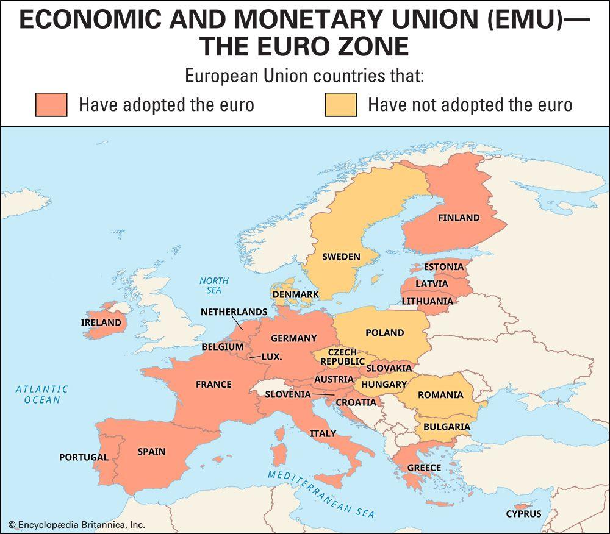

The European Union's Economic and Monetary Union (EMU) represents a critical framework within Europe, facilitating economic integration and monetary cohesion among member states. Established by the Maastricht Treaty on February 7, 1992, the EMU aims to eliminate exchange rate variability and increase economic stability by adopting a single currency—the euro—for participating countries. This ambition promotes seamless trade, investment, and financial interactions across borders, significantly contributing to the economic growth and stability of the region. The EMU's significance lies not merely in currency unification but also in harmonizing monetary policies, which are governed by the European Central Bank (ECB), thus impacting fiscal strategies, price stability, and inflation control throughout the eurozone. 

Algorithmic trading (ALGO) is an automated trading strategy that uses computer algorithms to execute trades based on predetermined conditions. ALGO trading has become increasingly relevant in the European Union, transforming how financial markets operate. By leveraging technology, algorithmic trading delivers advantages such as enhanced efficiency, reduced transaction costs, and faster trade execution. Its prominence is growing in the EU economy as financial entities seek improved competitiveness and deeper liquidity in trading activities. Consequently, ALGO trading influences market dynamics, requiring adaptation in regulatory measures and monetary policy to mitigate potential risks like market manipulation and systemic failures.

The purpose of this article is to examine the intersection between the EU's monetary policies, as orchestrated by the EMU, and the burgeoning field of algorithmic trading. By exploring these intertwined domains, the article seeks to clarify how the stability and strategic directives of the eurozone influence algorithmic trading practices while assessing the regulatory frameworks shaping the future landscape of finance in the EU. The dynamic interplay between these factors highlights ongoing challenges and potential opportunities for innovation in ensuring a balanced and robust economic ecosystem.

## Table of Contents

## Understanding the European Economic and Monetary Union (EMU)

The European Economic and Monetary Union (EMU) is a cornerstone of economic integration within the European Union (EU), involving the adoption of a single currency, the euro, which is central to its structure. The EMU comprises several core components, including a unified monetary policy governed by the European Central Bank (ECB), economic policy coordination among member states, and strict criteria for fiscal discipline, collectively aimed at ensuring price stability, balanced economic growth, and high employment levels across the Eurozone.

The historical foundation of the EMU was laid with the Maastricht Treaty, signed on February 7, 1992, which set the stage for economic convergence and monetary integration among EU member states. This treaty outlined a three-stage process toward full economic and monetary union, culminating in the introduction of the euro as a common currency in 1999, and its subsequent transition to physical currency in 2002. The creation of the EMU was a pivotal development in the EU's pursuit of closer economic ties, as it marked a significant step towards the elimination of exchange rate fluctuations, thereby facilitating trade and investment among member countries.

The EMU holds several functions and benefits within the European context. By providing a stable currency, it eliminates the exchange rate risks that were previously a barrier to cross-border economic activities within the EU. This stability encourages trade both within and outside the EU, attracting investment and fostering economic growth. Moreover, the EMU enhances policy coordination and enforces fiscal discipline among member states, which helps in maintaining stability within the entire Eurozone.

However, the EMU is not without its challenges and criticisms. One of the primary issues arises from the reduction in national sovereignty, as member states cede control over their monetary policies to the ECB. This centralization can limit the ability of individual countries to respond effectively to local economic conditions with appropriate fiscal and monetary measures. Additionally, the reliance on a single monetary policy across diverse economies can create tensions, especially during economic downturns when one-size-fits-all solutions may not suit the specific needs of every member state. Moreover, the strict fiscal criteria and convergence requirements have occasionally been a source of criticism, as they can constrain domestic economic policies and lead to tensions regarding budgetary austerity and social welfare policies.

Overall, the EMU represents a complex balance between unification and sovereignty, providing significant benefits in terms of economic stability and integration, while also posing unique challenges in terms of policy autonomy and economic flexibility for member states.

## The Rise of Algorithmic Trading in the EU

Algorithmic trading, often referred to as ALGO trading, represents a significant evolution in the landscape of modern finance, characterized by the use of computer algorithms to execute and manage trading orders. These algorithms make decisions to buy or sell financial instruments such as stocks, bonds, and derivatives at extraordinary speeds and frequencies that are beyond human capability. In the EU, the rise of [algorithmic trading](/wiki/algorithmic-trading) has been increasingly prominent since the early 2000s, coinciding with advancements in technology and changes in financial market structures.

### Emergence and Development

Algorithmic trading began gaining traction in the financial markets in the early 2000s, largely due to technological advancements, increased access to market data, and developments in high-frequency trading ([HFT](/wiki/high-frequency-trading-strategies)). The integration of electronic exchanges facilitated a shift from human-mediated trading to automated systems. In the EU, this transformation was accelerated by regulatory changes such as the implementation of the Markets in Financial Instruments Directive (MiFID) in 2007, which enhanced market transparency and competition among trading venues.

### Benefits of Algorithmic Trading

Algorithmic trading offers various benefits that have contributed to its wide adoption across the EU. These include:

1. **Efficiency**: Algorithms can process vast amounts of market data and execute trades in milliseconds, enhancing the operational efficiency of trading activities.

2. **Cost Reduction**: By automating processes, algorithmic trading significantly reduces transaction costs associated with human trading, such as commission fees and slippage—where orders are filled at suboptimal prices due to market movement.

3. **Speed**: The execution speed achieved through algorithmic trading is unmatched. This speed allows traders to capitalize on transient market conditions and arbitrage opportunities, often in fractions of a second.

4. **Market Liquidity**: Automated trading contributes to higher trading volumes, thereby improving market liquidity, which is essential for the smooth functioning of financial markets.

### Risks Associated with Algorithmic Trading

Despite these benefits, algorithmic trading introduces several risks that need to be managed carefully:

1. **System Failures**: Given their reliance on computers and software, algorithmic systems are vulnerable to technical failures. A glitch in the underlying algorithms or network outages can result in significant financial losses and market disruptions.

2. **Market Manipulation**: Algorithms can be exploited for manipulative practices such as spoofing, where false orders are used to create a misleading appearance of market demand or supply. This necessitates stringent regulatory oversight to mitigate such activities.

3. **Increased Volatility**: High-frequency trading, a subset of algorithmic trading, can exacerbate market volatility. Rapid execution and cancellation of numerous trades can lead to abrupt price swings, posing systemic risks.

4. **Regulatory Challenges**: As algorithmic trading evolves, regulatory frameworks struggle to keep pace. Ensuring fair and transparent markets requires constant adaptation to technological advancements and emerging trading strategies.

In conclusion, while algorithmic trading has transformed the financial markets by enhancing efficiency and [liquidity](/wiki/liquidity-risk-premium), it also presents inherent risks that need to be addressed through robust regulatory measures. As the EU continues to navigate these challenges, the future role of algorithmic trading will depend heavily on the balance between innovation and market integrity.

## Impact of the EMU on Algorithmic Trading

The Economic and Monetary Union (EMU) of the European Union (EU) has a profound impact on algorithmic trading (ALGO) within member states. The interplay between the EMU's monetary policies and algorithmic trading practices is intricate, given the central role of the euro and regulatory frameworks in shaping trading operations.

### Influence of EMU Monetary Policies on ALGO Trading

The EMU's monetary policies, administered by the European Central Bank (ECB), directly affect the conditions under which algorithmic trading occurs. The ECB’s control over interest rates and monetary supply can lead to varying liquidity levels and market [volatility](/wiki/volatility-trading-strategies), which ALGO trading systems need to adapt to rapidly. For instance, changes in interest rates can trigger immediate algorithmic responses to execute trades based on anticipated economic impacts. Moreover, the ECB’s communications, such as press releases and policy announcements, are crucial data inputs for high-frequency trading algorithms that capitalize on short-term information asymmetry.

### Stability of the Euro and Algorithmic Trading Strategies

The euro's stability is a pivotal [factor](/wiki/factor-investing) influencing algorithmic trading strategies. A stable euro reduces foreign exchange risk, thereby facilitating cross-border trading strategies, which are a significant aspect of algorithmic trading in Europe. Conversely, periods of euro volatility, often resulting from geopolitical tensions or divergent economic performances among member states, can lead to substantial adjustments in trading algorithms. Algorithms may need to recalibrate risk parameters and leverage derivative instruments to hedge against potential currency fluctuations.

### Regulatory Impacts of EMU Frameworks on ALGO Trading

EMU regulatory frameworks, including the Markets in Financial Instruments Directive II (MiFID II), impose specific requirements on algorithmic trading. These regulations mandate robust risk controls, algorithm testing, and transparency obligations, aimed at maintaining market integrity and preventing systemic risks associated with high-frequency trading. For example, MiFID II requires trading venues to implement circuit breakers and for firms to ensure algorithms are tested to prevent erratic behavior during unexpected market conditions.

Furthermore, regulatory compliance necessitates continuous monitoring and adjustments in algorithmic trading systems. Algorithms must be designed to comply with trading thresholds and reporting standards, leading to increased operational complexity and costs for trading firms.

### Case Studies: EMU Policies Affecting Algorithmic Trading

One notable instance where EMU policies directly impacted algorithmic trading was during the European sovereign debt crisis. The ECB's unconventional monetary policies, such as quantitative easing and negative interest rates, altered the financial landscape significantly. Algorithmic traders had to adapt to these non-standard monetary tools, which influenced bond yields and liquidity conditions across the eurozone. This period required algorithms to incorporate new datasets and risk assessments while adjusting strategies in real-time to cope with rapidly changing market conditions.

In summary, the EMU's monetary policies and regulatory frameworks have a pronounced impact on algorithmic trading operations. The stability of the euro, alongside stringent regulatory mandates, requires continuous adaptation and innovation in algorithmic strategies, ensuring these systems can operate effectively within the EMU's dynamic economic environment. The intersection between EMU policies and algorithmic trading practices highlights the ongoing need for balance between financial stability and market efficiency.

## Regulatory Framework Governing ALGO Trading in the EU

The regulatory framework governing algorithmic trading within the European Union (EU) is primarily structured around the Markets in Financial Instruments Directive II (MiFID II), which came into effect on January 3, 2018. This directive is crucial for ensuring the integrity, transparency, and efficiency of financial markets, particularly with the growing prevalence of algorithmic trading (ALGO).

MiFID II introduces comprehensive provisions that aim to mitigate inherent risks associated with ALGO trading. Key provisions include requirements for firms to implement robust systems and risk controls, ensuring that algorithms function as intended without contributing to market disorder. To achieve this, trading algorithms must undergo extensive testing and receive regulatory approval before deployment. Firms are also required to maintain a detailed audit trail of algorithmic decisions, allowing for post-trade analysis and investigation in case of irregularities.

The European Securities and Markets Authority (ESMA) plays a crucial role in overseeing ALGO trading practices across the EU. ESMA is responsible for developing technical standards and guidelines which provide clarity on implementing MiFID II provisions. Through its supervisory role, ESMA ensures that trading activities are conducted in a manner that aligns with the overarching goals of market stability and investor protection. ESMA's regulatory oversight extends to monitoring high-frequency trading (HFT), which is a subset of ALGO trading characterized by high turnover rates and rapid order execution.

Challenges and opportunities in fortifying the regulatory framework for ALGO trading exist. One of the significant challenges lies in keeping up with technological advancements and the increasing complexity of algorithms used in financial markets. There is a continuous need for regulators to adapt and refine regulations to address emerging risks without stifling innovation. Opportunities include leveraging advancements in technology, such as [machine learning](/wiki/machine-learning) and [artificial intelligence](/wiki/ai-artificial-intelligence), to enhance regulatory oversight mechanisms. For instance, implementing predictive analytics could improve the detection of market anomalies potentially arising from algorithmic activities.

Moreover, the EU regulatory framework offers a foundation for fostering cross-border regulatory cooperation. The concerted effort to harmonize rules ensures that ALGO trading operates under consistent standards throughout member states, thereby promoting market stability and investor confidence. As financial markets evolve, policymakers must remain vigilant and proactive in refining the framework to balance the benefits of ALGO trading with the imperative of maintaining financial market integrity.

## Challenges and Future Prospects

The interplay between the Economic and Monetary Union (EMU) policies and algorithmic trading (ALGO) presents unique challenges and prospects. A significant challenge is the harmonization of monetary policies with the technologically driven financial sector. While the EMU aims to maintain economic stability across member states with a unified currency and monetary system, ALGO trading introduces high-frequency trading strategies that can lead to market volatility.

One ongoing challenge is ensuring that EMU's monetary policies, designed for macroeconomic stability, do not inadvertently hinder the benefits of ALGO trading, such as liquidity enhancement. The need for speed and data-driven decision-making in ALGO trading can sometimes clash with the slow-moving nature of policy adjustments, potentially causing friction in financial markets.

Future trends in algorithmic trading within the EU are likely to emphasize artificial intelligence and machine learning technologies. These advancements can lead to more sophisticated trading strategies that adapt rapidly to market changes. The interplay between these technologies and EMU policies may require dynamic policy frameworks to accommodate rapid technological evolution without sacrificing market stability.

Technological advancements are predicted to influence ALGO trading by enhancing predictive analytics and real-time data processing capacities, thereby transforming trading strategies into more adaptive and intelligent systems. This evolution necessitates EMU policies that are sufficiently flexible to integrate such innovations while ensuring systematic risk management and protecting market integrity.

Potential reforms in the regulatory framework could involve updating legacy systems to accommodate technological changes. Innovations such as blockchain for transparent transaction tracking and fintech regulations for integrating non-traditional financial entities into the established financial system are expected. These reforms aim to balance growth opportunities brought by technology with the overarching goal of stable economic governance within the EU.

In conclusion, the future of ALGO trading in the context of the EMU will hinge on agile, forward-looking policies that can absorb technological advancements without compromising the objectives of economic and financial stability. Proactive engagement from policymakers and stakeholders will be crucial in crafting these adaptive frameworks, ensuring a harmonious relationship between innovative trading practices and traditional economic oversight.

## Conclusion

The exploration of the intersection between the European Union's Economic and Monetary Union (EMU) and algorithmic trading (ALGO) has highlighted several key points. The EMU's establishment has provided a unified economic framework and currency, the euro, which has significantly influenced financial activities across member states. Algorithmic trading, emerging as a dominant force in modern financial markets, benefits from efficiency and speed but brings inherent risks such as system failures and market manipulation.

The relationship between EMU monetary policies and ALGO trading practices is pivotal. The euro's stability, underpinned by these policies, plays a crucial role in shaping algorithmic strategies. Regulatory frameworks within the EU, including MiFID II, aim to mitigate risks associated with ALGO trading while fostering market integrity. The role of the European Securities and Markets Authority (ESMA) is central in maintaining oversight and ensuring compliance.

Balancing innovation and financial stability is crucial for future compatibility within the EU's financial landscape. Policymakers are called upon to refine regulatory frameworks, accommodating technological advancements in ALGO trading, ensuring robust infrastructures, and safeguarding economic stability. Traders and stakeholders must engage collaboratively, promoting a dialog that encourages growth and innovation while protecting the systemic resilience of the EU economy. By addressing these challenges and opportunities, the EU can sustain a prosperous financial future, embracing both innovation and stability.

## References & Further Reading

[1]: Begg, David, et al. ["EMU: Prospects and Challenges of European Monetary Union."](https://books.google.com/books/about/EBOOK_Economics.html?id=6sovEAAAQBAJ) European Commission Economic Essays, 1995.

[2]: De Grauwe, Paul. ["Economics of Monetary Union."](https://books.google.com/books/about/Economics_of_Monetary_Union.html?id=gY_UDwAAQBAJ) Oxford University Press, 12th edition, 2018.

[3]: Mackenzie, Donald. ["An Engine, Not a Camera: How Financial Models Shape Markets."](https://academic.oup.com/mit-press-scholarship-online/book/20588) MIT Press, 2008.

[4]: Lopez de Prado, Marcos. ["Advances in Financial Machine Learning."](https://www.amazon.com/Advances-Financial-Machine-Learning-Marcos/dp/1119482089) Wiley, 2018.

[5]: Gomber, Peter, et al. ["Algorithmic Trading: Impact on the Market."](https://link.springer.com/article/10.1007/s11573-017-0852-x) Journal of Financial Markets, Volume 13, Issue 2, 2014.

[6]: European Central Bank. ["The Implementation of Monetary Policy in the Euro Area."](https://www.ecb.europa.eu/pub/pdf/other/gendoc201109en.pdf) ECB Publications, 2020.

[7]: Chlistalla, Michael. ["Algorithmic Trading in Practice: Insights on how to Control the Risks of High-Frequency Trading."](https://c.mql5.com/forextsd/forum/168/high-frequency_trading_-_better_than_its_reputation.pdf) Journal of Economic and Social Research, 2011.

[8]: Aldridge, Irene. ["High-Frequency Trading: A Practical Guide to Algorithmic Strategies and Trading Systems."](https://www.amazon.com/High-Frequency-Trading-Practical-Algorithmic-Strategies/dp/1118343506) Wiley, 3rd Edition, 2013.