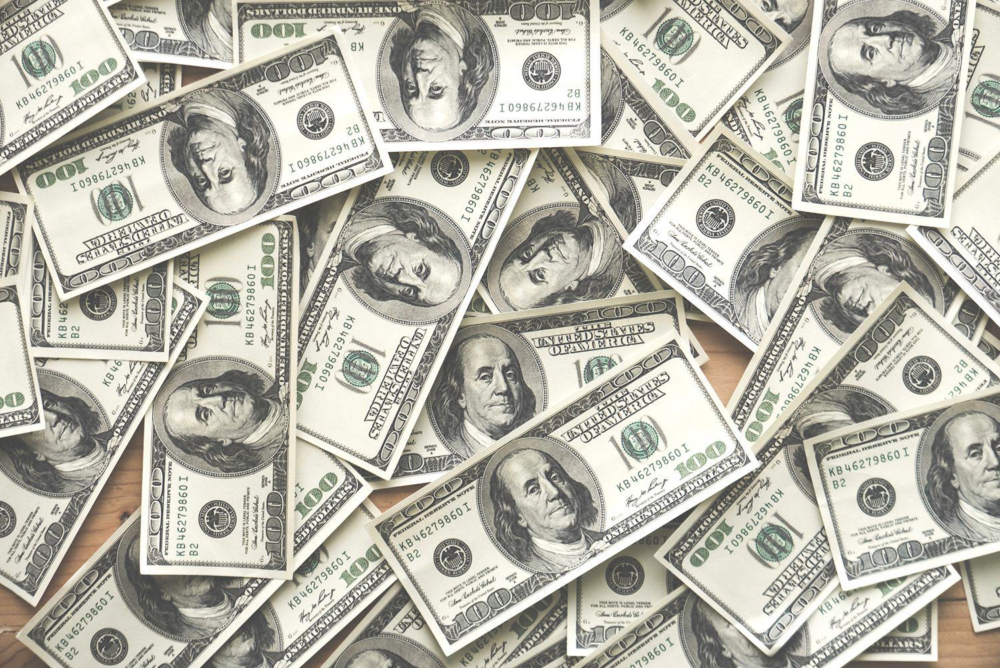

## Table of Contents

## What was used as currency before paper money in the United States?

Before paper money, people in the United States used coins made of different metals like gold, silver, and copper. These coins were used for buying things because they were valuable and easy to carry around. The first coins used in the United States were the Spanish dollar, which was made of silver. Later, the U.S. government started making its own coins, like the half dime and the dollar, in the late 1700s.

Besides coins, people also used other things as money before paper money became common. For example, they used tobacco, beads, and even animal skins to trade for goods. These items were called commodity money because they had value on their own. It was not until the Civil War in the 1860s that paper money, called "greenbacks," started being used widely in the United States.

## When and where was the first paper money issued in the United States?

The first paper money in the United States was issued during the American Revolution. It was called "Continental Currency" and was first used in 1775. The Continental Congress, which was the government at the time, needed money to pay for the war against Britain. They decided to print paper money because they did not have enough gold and silver coins.

The Continental Currency was printed in different places, but a lot of it was made in Philadelphia. People used this paper money to buy things they needed, like food and supplies. However, because there was so much of it printed, it lost its value quickly. This led to the saying "not worth a Continental," meaning something was worthless.

## What were the colonial currencies and how did they function?

Before the United States became a country, the colonies used different kinds of money. Each colony had its own currency, and they were often made of paper or coins. The paper money was called "bills of credit." These bills were used to pay for things when there were not enough gold and silver coins. The colonies would print these bills and use them to pay soldiers or buy supplies. People would then use these bills to buy things they needed, like food or tools.

The colonial currencies worked a bit like modern money but had some problems. Sometimes, the colonies printed too many bills of credit, which made them lose value. This meant that people did not want to use them because they were not worth much. Also, the value of the currency could be different from one colony to another. This made trading between colonies hard because people had to figure out how much their money was worth in another colony's money. Despite these issues, colonial currencies helped the colonies function and grow until the United States started using its own national currency.

## How did the Continental Congress use paper money during the American Revolution?

During the American Revolution, the Continental Congress needed money to pay for the war against Britain. They did not have enough gold and silver coins, so they decided to print paper money. This paper money was called "Continental Currency," and it was first used in 1775. The Congress used this money to pay soldiers and buy supplies they needed for the war. People in the colonies used the Continental Currency to buy things they needed, like food and clothes.

However, the Continental Congress printed too much of this paper money. Because there was so much of it, it started to lose its value quickly. People did not want to use it because it was not worth much. This led to the saying "not worth a Continental," which meant something was worthless. Even though the Continental Currency helped the Congress pay for the war at first, it caused problems because it lost its value so fast.

## What led to the creation of the first U.S. banknotes by the federal government?

The first U.S. banknotes were created by the federal government because the country needed money during the Civil War. In the 1860s, the government had to pay for the war, but there were not enough gold and silver coins. So, they decided to print paper money. This paper money was called "greenbacks" because it had green ink on the back. The government used these greenbacks to pay soldiers and buy things they needed for the war. People in the country used these greenbacks to buy things they needed, like food and clothes.

The creation of greenbacks was important because it helped the government pay for the Civil War. But it also caused some problems. At first, people did not trust the new paper money because they were used to using gold and silver coins. Over time, though, people started to use the greenbacks more. The government kept printing more greenbacks, which made them lose some value. But they still helped the country get through the war and showed that paper money could be used as currency in the United States.

## How did the Civil War influence the development of paper money in the U.S.?

The Civil War played a big role in the development of paper money in the United States. Before the war, the country mainly used gold and silver coins for money. But during the war, the government needed a lot more money to pay for soldiers and supplies. They did not have enough gold and silver, so they decided to print paper money. This new paper money was called "greenbacks" because it had green ink on the back. The government used these greenbacks to pay for things they needed during the war.

At first, people were not sure about using greenbacks because they were used to using coins. But as the war went on, more people started using the greenbacks to buy things they needed. The government kept printing more greenbacks, which made them lose some value. But they still helped the country get through the war. The use of greenbacks during the Civil War showed that paper money could work in the United States. After the war, paper money became more common and helped shape the country's financial system.

## What is the significance of the National Banking Acts in the history of U.S. paper money?

The National Banking Acts were very important for the history of U.S. paper money. These laws were passed during the Civil War, in 1863 and 1864. They helped create a national banking system and made it easier for the government to control the money supply. Before these acts, different banks could print their own money, which made things confusing. The National Banking Acts set up rules so that only certain banks could print money, and all the money had to look the same. This made it easier for people to trust and use the money.

The National Banking Acts also helped make the country's money more stable. They did this by making sure that the money printed by banks was backed by U.S. government bonds. This meant that the money was more reliable because it was tied to something valuable. The acts also helped stop the use of state banknotes, which were often not worth much. By creating a more uniform and trustworthy currency, the National Banking Acts laid the groundwork for the modern U.S. financial system and the use of paper money across the country.

## How did the Federal Reserve System change the landscape of paper money in the early 20th century?

The Federal Reserve System, created in 1913, changed the way paper money worked in the United States. Before the Federal Reserve, different banks could print their own money, which made things confusing. The Federal Reserve took over and started printing money for the whole country. This made the money more uniform and easier to trust. People could use the same money everywhere, which made buying and selling things simpler.

The Federal Reserve also helped make the money more stable. They could control how much money was in the country by deciding how much to print. This helped stop big changes in the value of money, which made the economy more steady. By managing the money supply, the Federal Reserve helped the country grow and made it easier for people to plan their lives and businesses.

## What are the key security features introduced in U.S. paper money over time?

Over time, the U.S. has added many security features to its paper money to stop people from making fake money. One of the first big changes was adding a special thread to the bills. This thread is inside the paper and glows under a special light. It makes it hard for people to copy the money because it's hard to put the thread in fake bills. Another early feature was using special ink that changes color when you tilt the bill. This ink makes it easy to check if the money is real by just looking at it from different angles.

More recently, the U.S. has added even more ways to keep the money safe. One important feature is the watermark, which you can see when you hold the bill up to the light. The watermark is a picture that is part of the paper and shows the same person who is on the front of the bill. Another feature is microprinting, which are tiny letters and numbers that are hard to see without a magnifying glass. These tiny details are very hard to copy, so they help make sure the money is real. All these features together make U.S. paper money much harder to fake and help keep it safe.

## How have changes in design and material of U.S. banknotes reflected cultural and technological shifts?

Changes in the design and material of U.S. banknotes have shown how the country's culture and technology have changed over time. Early banknotes were simple and did not have many colors or pictures. They were made of cotton and linen, which were strong materials that lasted a long time. As the country grew, the designs on the money started to show important people and places, like presidents and landmarks. This showed that the country was proud of its history and wanted to share it with everyone who used the money. The designs also got more colorful and detailed, which made the money harder to copy and more interesting to look at.

Technology has also played a big role in how U.S. banknotes have changed. New machines and printing techniques have made it possible to add special features to the money, like watermarks and color-changing ink. These features help stop people from making fake money. The materials used to make the money have also changed. Now, some banknotes have special threads and other things inside the paper to make them even harder to copy. All these changes show how the U.S. has used new technology to keep its money safe and to reflect what is important to the country at different times.

## What role did the U.S. play in the global standardization of paper currency?

The U.S. played a big role in helping make paper money the same all over the world. They did this by setting up rules and working with other countries. The U.S. helped create groups like the International Organization for Standardization (ISO), which makes rules for many things, including money. These rules help make sure that money from different countries looks and feels the same, so people can trust it no matter where they are.

The U.S. also shared its ideas about how to keep money safe. They showed other countries how to use special inks, watermarks, and other tricks to stop people from making fake money. By doing this, the U.S. helped make paper money safer everywhere. This made it easier for people to use money from different countries and helped the world's economy grow.

## How have digital currencies and electronic payments impacted the use of paper money in the U.S.?

Digital currencies and electronic payments have changed how people use paper money in the U.S. More and more people are using their phones or computers to pay for things instead of using cash. This is because it's easy and fast to pay with a card or an app. Stores and businesses also like it because it's easier for them to keep track of their money. Because of this, people are using less paper money every day. They use cards, apps, and even cryptocurrencies like Bitcoin to buy things they need.

Even though digital payments are growing, paper money is still important. Some people still like to use cash because it feels more private and they can see and touch it. Also, not everyone has a bank account or a phone to use for digital payments. So, paper money is still used a lot, especially by people who don't have access to digital options. But as more people get used to digital payments, the use of paper money might keep going down in the future.

## References & Further Reading

[1]: Mihm, Stephen. ["A Nation of Counterfeiters: Capitalists, Con Men, and the Making of the United States."](https://www.hup.harvard.edu/books/9780674032446) Harvard University Press, 2014.

[2]: ["Currency Wars: The Making of the Next Global Crisis"](https://archive.org/details/currencywarsmaki0000rick) by James Rickards

[3]: ["The Ascent of Money: A Financial History of the World"](https://en.wikipedia.org/wiki/The_Ascent_of_Money) by Niall Ferguson

[4]: ["Lords of Finance: The Bankers Who Broke the World"](https://www.amazon.com/Lords-Finance-Bankers-Broke-World/dp/0143116800) by Liaquat Ahamed

[5]: [Meltzer, Allan H. "A History of the Federal Reserve, Volume 1: 1913-1951."](https://www.amazon.com/History-Federal-Reserve-1913-1951/dp/0226520005) University of Chicago Press, 2003.