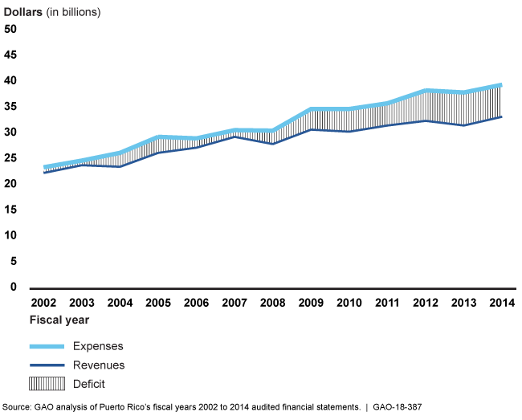

## Table of Contents

## What is the Puerto Rican debt crisis?

The Puerto Rican debt crisis is a big money problem that started in Puerto Rico, a U.S. territory. It began because the government of Puerto Rico borrowed a lot of money and couldn't pay it back. By 2015, Puerto Rico had a debt of about $70 billion. This made it hard for the government to provide services like schools and hospitals because so much money was going to pay back the debt.

In 2016, the U.S. government stepped in to help. They created a special board called the Financial Oversight and Management Board to manage Puerto Rico's money and help fix the debt problem. This board made some tough decisions, like cutting budgets and changing laws, to try to get Puerto Rico's finances back on track. Even with these efforts, the debt crisis has been a big challenge for Puerto Rico and its people.

## When did the Puerto Rican debt crisis begin?

The Puerto Rican debt crisis started around 2006. That's when the government began to have trouble paying back the money it had borrowed. Before that, Puerto Rico had been borrowing a lot to help pay for things like schools, hospitals, and other services. But then, the economy started to slow down, and the government couldn't keep up with its debt payments.

By 2015, the debt had grown to about $70 billion. This huge amount of money made it very hard for the government to provide basic services to the people of Puerto Rico. The situation got so bad that in 2016, the U.S. government had to step in to help manage the crisis and try to find a way to fix it.

## What are the main causes of the Puerto Rican debt crisis?

The Puerto Rican debt crisis started because the government borrowed a lot of money to pay for things like schools, hospitals, and other services. For a while, this seemed to work, but then the economy started to slow down. When the economy slowed, the government couldn't collect as much money in taxes. At the same time, more people were leaving Puerto Rico to find jobs in the mainland U.S., which meant even less money coming in. This made it hard for the government to pay back the money it had borrowed.

Another big reason for the debt crisis was that Puerto Rico's economy depended a lot on special tax breaks for businesses. These tax breaks made it attractive for companies to do business in Puerto Rico, but when the U.S. government changed the tax laws in 1996, many companies left. Without these businesses, the economy got even weaker, and the government had an even harder time paying its debts. Over time, the debt grew so big that by 2015, it reached about $70 billion, leading to the crisis.

## How has the debt crisis affected the economy of Puerto Rico?

The debt crisis has made life very hard for people in Puerto Rico. Because the government had to pay back so much money, it couldn't spend as much on important services like schools and hospitals. This meant that many people didn't get the help they needed. Also, because the economy was struggling, many businesses closed down, and it was hard for people to find jobs. Lots of people had to leave Puerto Rico to find work in the mainland U.S., which made things even worse.

The debt crisis also scared away investors. When people and companies saw that Puerto Rico had so much debt, they didn't want to put their money into the island's economy. This made it even harder for the economy to grow. The government tried to fix things by cutting budgets and changing laws, but it was still a big challenge. Even though the U.S. government stepped in to help, the debt crisis continues to affect the lives of many people in Puerto Rico.

## What role did the government of Puerto Rico play in the debt crisis?

The government of Puerto Rico played a big role in the debt crisis because it borrowed a lot of money to pay for things like schools and hospitals. For a while, this seemed like a good idea, but then the economy started to slow down. The government couldn't collect as much money in taxes, and more people were leaving Puerto Rico to find jobs in the mainland U.S. This made it harder for the government to pay back the money it had borrowed.

As the debt grew bigger, the government had to make tough choices. It had to cut budgets and change laws to try to manage the debt. But these decisions made it even harder for the government to provide important services to the people of Puerto Rico. The debt crisis became so bad that the U.S. government had to step in to help manage the situation and try to fix it.

## How have federal policies from the United States impacted the debt crisis?

Federal policies from the United States have had a big impact on the Puerto Rican debt crisis. One big policy change was in 1996 when the U.S. government changed the tax laws. Before that, companies got special tax breaks for doing business in Puerto Rico. But when these tax breaks went away, many companies left the island. This made Puerto Rico's economy weaker and made it harder for the government to pay back its debts.

Another way federal policies have impacted the crisis is through the creation of the Financial Oversight and Management Board in 2016. This board was set up by the U.S. government to help manage Puerto Rico's money and fix the debt problem. The board has made some tough decisions, like cutting budgets and changing laws, to try to get Puerto Rico's finances back on track. But these decisions have also made it harder for the government to provide important services to the people of Puerto Rico.

## What measures has Puerto Rico taken to address the debt crisis?

Puerto Rico has taken several steps to try to fix its big money problem. One big thing they did was to work with a special board that the U.S. government set up. This board, called the Financial Oversight and Management Board, helps to manage Puerto Rico's money and make tough decisions. They have cut budgets and changed some laws to try to pay back the debt. This has been hard because it means less money for important things like schools and hospitals.

Another thing Puerto Rico has done is to try to bring in more money. They have looked for ways to make their economy grow again. This includes trying to attract new businesses and tourists to the island. They also worked on making it easier for people to start their own businesses. But it's been a challenge because the debt is so big, and the economy is still struggling.

Despite these efforts, the debt crisis is still a big problem for Puerto Rico. The government continues to work hard to find new ways to pay back the money and help the people of Puerto Rico. It's a slow process, but they are trying to make things better little by little.

## What is the role of the Financial Oversight and Management Board for Puerto Rico?

The Financial Oversight and Management Board for Puerto Rico was set up by the U.S. government to help fix Puerto Rico's big money problem. The board's job is to manage Puerto Rico's money and make sure the government can pay back its huge debt. They do this by making tough decisions like cutting budgets and changing laws. These decisions are hard because they mean less money for important things like schools and hospitals.

Even though the board is trying to help, their decisions can make life harder for people in Puerto Rico. For example, when they cut budgets, it means the government has less money to spend on services that people need. But the board is important because without them, Puerto Rico might not be able to fix its debt problem. They are working to find a balance between paying back the debt and helping the people of Puerto Rico.

## How have austerity measures affected the population of Puerto Rico?

Austerity measures have made life harder for people in Puerto Rico. These measures mean the government has to cut spending on important things like schools, hospitals, and other services. When the government has less money to spend, it can't help people as much as before. This has made it tough for many families who rely on these services. For example, schools might not have enough teachers or supplies, and hospitals might not have enough medicine or doctors.

Because of these cuts, many people in Puerto Rico are struggling more than before. It's harder to find good jobs, and the economy is not doing well. This has led to more people leaving Puerto Rico to find work in the mainland U.S. The ones who stay behind have to deal with fewer services and a tougher life. The austerity measures were meant to help fix the debt problem, but they have also made life more difficult for the people living on the island.

## What are the legal and political challenges faced in resolving the debt crisis?

Resolving the Puerto Rican debt crisis has been hard because of legal and political challenges. One big problem is that Puerto Rico cannot declare bankruptcy like a state can. This means they can't just stop paying their debts and start over. Instead, they have to work with the Financial Oversight and Management Board set up by the U.S. government. This board has the power to make decisions that affect Puerto Rico's laws and budget, which has caused a lot of tension and disagreement.

Another challenge is that there are many different groups with different ideas about how to fix the debt problem. Some people in Puerto Rico want more control over their own money and don't like the board telling them what to do. Others think the board is necessary to help fix the debt. There are also disagreements between the U.S. government and Puerto Rico about how to move forward. All these different opinions make it hard to come up with a plan that everyone agrees on.

## What are the potential long-term solutions being discussed for the Puerto Rican debt crisis?

One potential long-term solution for the Puerto Rican debt crisis is to restructure the debt. This means changing the terms of the loans so that Puerto Rico can pay back the money more easily. It could mean paying less money each month or having more time to pay back the debt. This would give the government more money to spend on important things like schools and hospitals. But, it's hard to get everyone who lent money to Puerto Rico to agree to change the terms of their loans.

Another solution being talked about is to help Puerto Rico's economy grow. If the economy gets stronger, the government can collect more money in taxes and use that to pay back the debt. This could mean attracting new businesses to the island, making it easier for people to start their own businesses, and bringing in more tourists. But growing the economy takes time, and it's not easy when the debt is so big. Both of these solutions need a lot of work and cooperation from different groups, but they could help Puerto Rico get out of its debt crisis over time.

## How has the debt crisis influenced Puerto Rico's relationship with the United States?

The debt crisis has made the relationship between Puerto Rico and the United States more complicated. Puerto Rico is a U.S. territory, which means it is part of the U.S. but not a state. When Puerto Rico couldn't pay back its big debt, the U.S. government stepped in to help. They created a special board called the Financial Oversight and Management Board to manage Puerto Rico's money. This board has a lot of power and can make decisions that affect Puerto Rico's laws and budget. Some people in Puerto Rico feel like this board takes away their control over their own money and decisions.

Even though the U.S. government is trying to help, the debt crisis has caused tension. Some people in Puerto Rico want more control over their own affairs and don't like the U.S. telling them what to do. Others think the U.S. help is necessary to fix the debt problem. There are also disagreements about how to move forward. All these different opinions make it hard for Puerto Rico and the U.S. to work together smoothly. The debt crisis has shown that the relationship between Puerto Rico and the United States is important but also challenging.

## What is the impact of social spending and demographic changes?

High social spending in Puerto Rico has been a persistent issue, primarily driven by poverty and an aging demographic. These factors have placed considerable strain on the island's financial resources, leading to significant budgetary pressures. Puerto Rico's socio-economic challenges are exacerbated by its reliance on federal programs such as Medicare and Medicaid. Over 60% of the population in Puerto Rico depends on these healthcare services, yet the island receives disproportionately low federal funding compared to U.S. states. This discrepancy in funding creates a substantial financial burden on local government resources, making financial sustainability difficult to achieve.

The demographic landscape of Puerto Rico is marked by both a declining and aging population. This trend negatively impacts the economic structure as a decreasing population leads to a reduced tax base. Consequently, this decline affects government revenue, while the aging population simultaneously increases the demand for social welfare expenditures, particularly healthcare and pensions. The equation describing this relationship can be portrayed as:

$$
\Delta R = T \times \Delta P
$$

Where $\Delta R$ is the change in revenue, $T$ is the tax rate, and $\Delta P$ is the change in population size. As $\Delta P$ remains negative, $\Delta R$ will likewise trend negatively, assuming the tax rate stays constant.

Another critical issue compounding Puerto Rico's economic woes is the outmigration of residents, spurred by unfavorable economic conditions. This has resulted in a significant brain drain, as the island's skilled workforce seeks opportunities abroad. The loss of human capital further limits Puerto Rico's capacity for economic recovery and innovation, leading to a less dynamic economic environment. 

The demographic shifts and social spending pressures contribute to the challenges surrounding the sustainability of government debt. The growing fiscal deficit requires strategic measures to ensure economic stability and growth potential. Policymakers face the daunting task of balancing social welfare needs with the demands of a sustainable financial model, and demographic trends must be considered in any long-term economic planning.

Addressing these intertwined issues is crucial for Puerto Rico’s economic future. Enhanced federal support, strategic investment in economic diversification, and policies aimed at reversing demographic decline could play key roles in stabilizing the island’s financial health.

## References & Further Reading

[1]: Biancarelli, A. M., Lecompte, C., & Signoretto, C. (2018). ["The Puerto Rico Debt Crisis: Historical Overview, Contributing Factors, and Recovery Prospects."](https://publications.iadb.org/publications/english/document/The-Puerto-Rican-Debt-Crisis-Historical-Overview-Contributing-Factors-and-Prospects-for-Recovery.pdf) Inter-American Development Bank.

[2]: Krueger, A., Teja, R., & Wolfe, A. (2019). ["Puerto Rico - A Way Forward: Task Force on the Commonwealth’s Economic and Fiscal Situation Final Report."](https://link.springer.com/article/10.1007/s11227-024-06678-6) Brookings Institution.

[3]: Cabán, P. A. (2018). ["Promesa and the Puerto Rican Debt Crisis: Law, Policy, and Cash Management."](https://typeset.io/papers/promesa-puerto-rico-and-the-american-empire-14j5j3wnka) *Du Bois Review: Social Science Research on Race*, 61(1), 3-22.

[4]: Bai, J., De Marcellis-Warin, N., & Langelier, J. (2020). ["Algorithmic Trading & Market Quality: Usage, Scope & Impact."](https://scholar.google.com/citations?user=O0LwOLUAAAAJ) Social Science Research Network (SSRN).

[5]: Harris, L. (2003). ["Trading and Exchanges: Market Microstructure for Practitioners."](https://www.amazon.com/Trading-Exchanges-Market-Microstructure-Practitioners/dp/0195144708) Oxford University Press.

[6]: Coll-Hurtado, A., & Mercatante W. (2021). ["Addressing Inequality in Puerto Rico: The Role of Federal Policies & Political Status."](https://ajph.aphapublications.org/doi/10.2105/AJPH.2024.307585) *Critical Sociology*.

